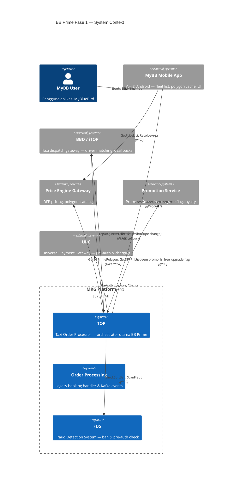
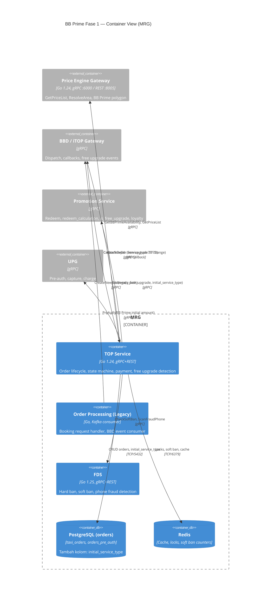
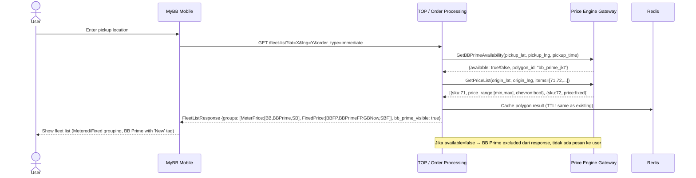
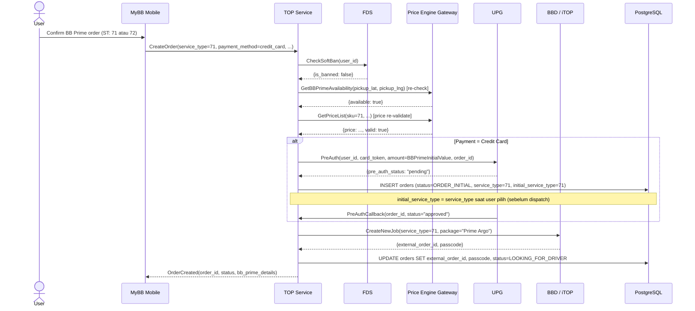
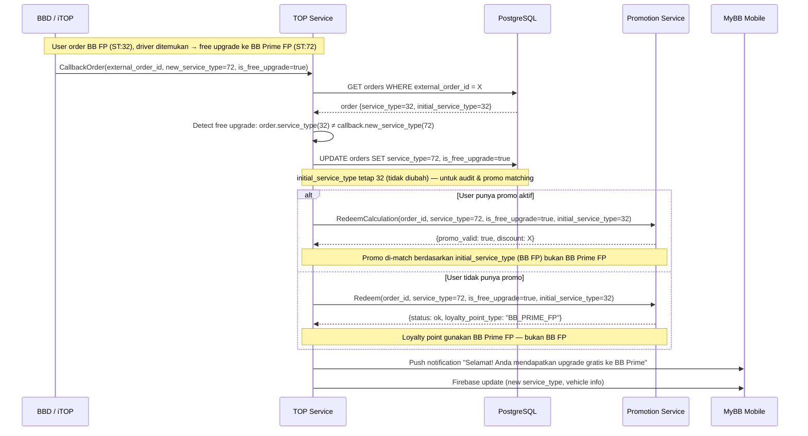
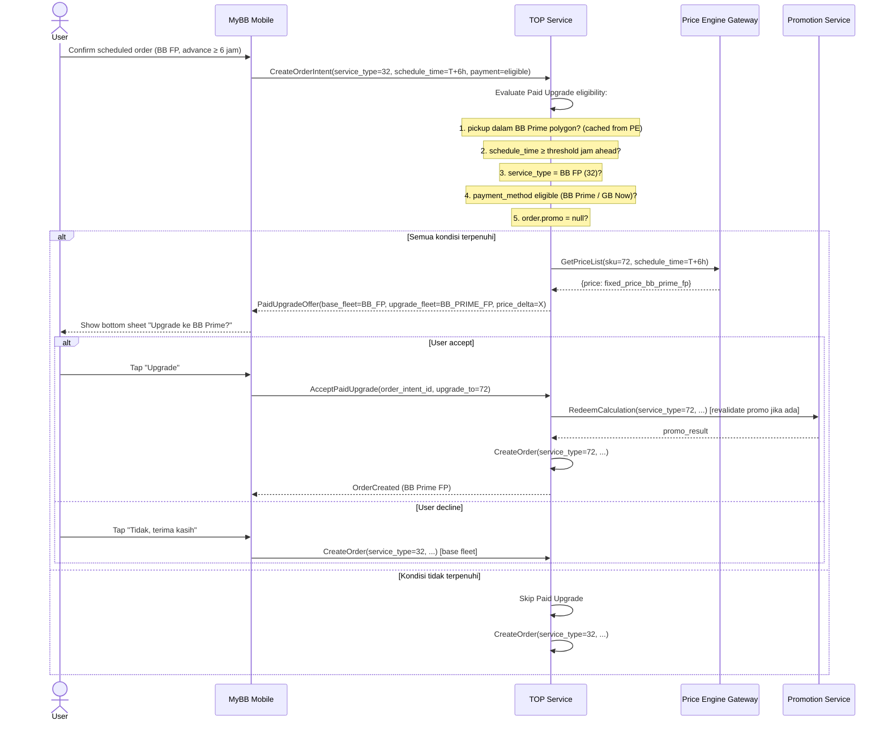
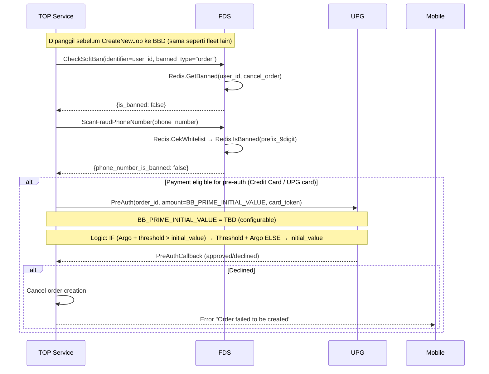

#Integration Document — BB Prime Fase 1 (MyBB 6.26)

---

## Document Metadata

| Field | Value |
|---|---|
| **Document Title** | BB Prime Fase 1 — Integration Document |
| **Version** | 1.0 |
| **Date** | 2026-04-27 |
| **Author / Generated by** | adi.kurniawan@bluebirdgroup.com via ArchFlow `/sa:integration-doc` |
| **Status** | Draft — Pending Engineering Review |
| **Release Target** | MyBB 6.26 |

---

## 1. Overview

BB Prime Fase 1 memperkenalkan layanan premium baru (BB Prime Meter & Fixed Price) ke aplikasi MyBlueBird (MyBB). Fitur ini memerlukan integrasi lintas sistem antara **MRG/MyBB** sebagai orchestrator utama dengan empat sistem eksternal: **BBD** (dispatch), **Price Engine** (pricing & polygon), **Promotion Service** (promo & loyalty), dan **FDS** (fraud detection).

### Sistem yang Terlibat

| Sistem                                          | Team          | Role dalam BB Prime                                      |
| ----------------------------------------------- | ------------- | -------------------------------------------------------- |
| **TOP** (mybb-taxi-order-processor)             | MRG           | Core order processor — orchestrates semua integrasi      |
| **Order Processing** (mybb-order-processing-go) | MRG           | Legacy order handler — booking request & Kafka events    |
| **BBD / iTOP**                                  | BBD           | Taxi dispatch gateway — dispatch & free upgrade callback |
| **Price Engine Gateway**                        | Price Engine  | DFP pricing, polygon availability, fleet catalog         |
| **Promotion Service**                           | Marketing/MRG | Promo redeem, free upgrade flag, loyalty point           |
| **FDS** (fraud-detection-system)                | MRG           | Pre-auth order fraud check                               |
| **UPG** (Universal Payment Gateway)             | Payment       | Pre-authorization & charging                             |
| **MyBB Mobile**                                 | Mobile        | Fleet list display, polygon caching, fleet grouping      |

### New Service Type Mapping (BB Prime)

| Service Type ID | Name | Category |
|---|---|---|
| 71 | Prime Argo | Metered Price |
| 72 | Prime FP | Fixed Price |
| 73 | Test Prime Argo | Metered Price (test) |
| 74 | Test Prime FP | Fixed Price (test) |

---

## 2. Scope

### 2.1 In Scope — Fase 1 (MyBB 6.26)

- **FLOW-01** — MRG ↔ Price Engine: BB Prime DFP pricing & polygon availability check
- **FLOW-02** — MRG ↔ Price Engine: Fleet list grouping (Metered/Fixed) dengan BB Prime flag
- **FLOW-03** — MRG ↔ BBD: Service type mapping BB Prime pada dispatch & callback
- **FLOW-04** — MRG ↔ BBD + MRG internal: Free upgrade detection & service type change (BB FP → BB Prime FP)
- **FLOW-05** — MRG ↔ Promotion: Free upgrade flag (`is_free_upgrade`) pada redeem & redeem calculation
- **FLOW-06** — MRG internal: Paid Upgrade / Upsell eligibility check untuk scheduled order
- **FLOW-07** — MRG ↔ FDS: Pre-auth order check untuk BB Prime orders
- **FLOW-08** — MRG ↔ UPG: Pre-authorization BB Prime (initial amount TBD)
- **DB Migration**: Kolom baru `initial_service_type` pada tabel `taxi_orders`
- **Service type mapping**: Tambah mapping 71/72/73/74 di TOP

### 2.2 Out of Scope — Fase 1

- Dynamic fleet list (fleet logic ke backend) — Fase 2
- Greyed-out states untuk out-of-polygon — Fase 2
- Multi-select fleet functionality — Fase 2
- Payment-first validation architecture — Fase 2
- Free upgrade pop-up UI — Fase 2
- Integrasi GB AT ke price engine — Fase 2
- gRPC & tracking mapping BB Prime (nearby driver, live tracking ODRD/Non-ODRD) — TBC assessment BBD
- ETA gRPC mapping BB Prime — high priority, TBC BBD

---

## 3. Use Cases

| UC-ID | Use Case | Actor | Sistem Terlibat |
|---|---|---|---|
| UC-01 | User melihat BB Prime di fleet list (in-polygon) | MyBB User | Mobile, MRG TOP, Price Engine |
| UC-02 | BB Prime disembunyikan (out-of-polygon) | MyBB User | Mobile, MRG TOP, Price Engine |
| UC-03 | User memilih BB Prime & konfirmasi order | MyBB User | Mobile, MRG TOP, BBD, UPG, FDS |
| UC-04 | Scheduled order — user ditawarkan Paid Upgrade ke BB Prime | MyBB User (Scheduled) | Mobile, MRG TOP, Price Engine |
| UC-05 | User accept Paid Upgrade — fleet switch ke BB Prime | MyBB User (Scheduled) | Mobile, MRG TOP, Promotion |
| UC-06 | Driver ditemukan → Free upgrade BB FP ke BB Prime FP | System (BBD callback) | BBD, MRG TOP, Promotion |
| UC-07 | Free upgrade dengan promo aktif — promo tetap included | System (BBD callback) | BBD, MRG TOP, Promotion |
| UC-08 | BB Prime order — pre-auth fraud check | System | MRG TOP, FDS, UPG |
| UC-09 | DFP price berubah saat user di fleet list | MyBB User | Mobile, Price Engine |
| UC-10 | EZPay dari streethail atau cash → mapped ke BB Prime | MyBB User | Mobile, MRG, BBD |

---

## 4. Integration Diagram

### 4.1 C4 Context Diagram



### 4.2 C4 Container Diagram



### 4.3 Sequence Diagrams

#### SEQ-01: BB Prime Fleet List + Polygon Check (Immediate Order)



#### SEQ-02: BB Prime Order Creation + FDS + Pre-Auth



#### SEQ-03: Free Upgrade — BB FP → BB Prime FP



#### SEQ-04: Paid Upgrade / Upsell (Scheduled Order)



#### SEQ-05: FDS Pre-Auth Check for BB Prime



---

## 5. Data Exchange & Field Mapping

### 5.1 Data Flow Summary

| Flow ID | Producer | Consumer | Protocol | Trigger | Kritikalitas |
|---|---|---|---|---|---|
| FLOW-01 | Price Engine | MRG TOP | REST/gRPC | Fleet list request | CRITICAL |
| FLOW-02 | MRG TOP | BBD/iTOP | gRPC | Order creation (BB Prime ST) | CRITICAL |
| FLOW-03 | BBD/iTOP | MRG TOP | gRPC callback | Driver ditemukan (free upgrade) | CRITICAL |
| FLOW-04 | MRG TOP | Promotion | gRPC | Free upgrade detected / promo revalidation | HIGH |
| FLOW-05 | MRG TOP | UPG | gRPC | Order creation (credit card) | CRITICAL |
| FLOW-06 | MRG TOP | FDS | gRPC | Order creation (semua BB Prime order) | HIGH |
| FLOW-07 | MRG internal | MRG DB | SQL | Order creation & free upgrade | CRITICAL |

### 5.2 Detail per Flow

---

#### FLOW-01: MRG ↔ Price Engine — BB Prime Availability & DFP

**Endpoint**: `POST /v1/prices` (price-engine-gateway REST :8005) atau gRPC `GetPriceList`
**Endpoint Baru (dibutuhkan)**: `GetBBPrimeAvailability(pickup_lat, pickup_lng, pickup_time)` — **Pending Price Engine team**
**Auth**: Internal service-to-service (mTLS / API key — sesuai pattern existing)
**Timeout**: ≤ 2000ms P95
**Retry**: 1x retry, jika gagal → hide BB Prime

**Request — GetBBPrimeAvailability (NEW endpoint):**

| Field | Type | Required | Description |
|---|---|---|---|
| `pickup_lat` | float64 | Yes | GPS latitude pickup |
| `pickup_lng` | float64 | Yes | GPS longitude pickup |
| `pickup_time` | timestamp | Yes | Untuk scheduled: jam pickup aktual. Immediate: now() |

**Response — GetBBPrimeAvailability:**

| Field | Type | Description |
|---|---|---|
| `available` | bool | true = dalam polygon BB Prime |
| `polygon_id` | string | Identifier polygon yang match |
| `cache_ttl_seconds` | int | Durasi cache yang disarankan |

**Request — GetPriceList (existing, extend untuk ST 71/72):**

| Field                       | Type      | Required | Description                             |
| --------------------------- | --------- | -------- | --------------------------------------- |
| `origin_location.latitude`  | float64   | Yes      | Pickup lat                              |
| `origin_location.longitude` | float64   | Yes      | Pickup lng                              |
| `destination_location`      | object    | No       | Drop-off (untuk fixed price)            |
| `items`                     | []int     | Yes      | Tambah: [71, 72, 73, 74] untuk BB Prime |
| `pickup_time`               | timestamp | No       | Untuk scheduled DFP                     |
|                             |           |          |                                         |

**Response — GetPriceList (per item BB Prime):**

| Field | Type | Description |
|---|---|---|
| `sku_id` | int | 71/72/73/74 |
| `price_min` | int64 | Untuk metered (Argo): lower bound |
| `price_max` | int64 | Untuk metered (Argo): upper bound |
| `price_fixed` | int64 | Untuk FP: harga tetap |
| `price_type` | string | "metered" atau "fixed" |
| `discount_pct` | float | Persentase diskon (untuk chevron) |
| `show_chevron` | bool | true jika discount ≥ 24% |
| `is_new` | bool | true untuk BB Prime (New tag) — dikontrol BE |

**Error Handling FLOW-01:**

| Kondisi | Aksi |
|---|---|
| Price Engine timeout | BB Prime hidden dari fleet list; other fleets unaffected |
| available = false | BB Prime hidden; tidak ada pesan ke user (Fase 1) |
| DFP returns price ≤ 0 | BB Prime hidden; log error |
| Price change > threshold saat konfirmasi | Tampilkan bottom sheet "harga berubah" ke user |

---

#### FLOW-02: MRG ↔ BBD — Dispatch BB Prime Order (Service Type Mapping)

**Protocol**: gRPC (iTOP gateway, same as existing)
**Changes**: Tambah service type mapping baru di TOP + BBD setup

**Request — CreateNewJob (extend existing):**

| Field | Type | Required | Nilai BB Prime |
|---|---|---|---|
| `service_type` | string | Yes | Map dari ID numeric: 71→"Prime Argo", 72→"Prime FP" |
| `package_id` | int | Yes | Sesuai mapping BBD: TBC BBD |
| `car_type` | int | Yes | BB Prime: TBC BBD assessment |
| `pickup_lat` | float64 | Yes | - |
| `pickup_lng` | float64 | Yes | - |
| `dropoff_lat` | float64 | No | - |
| `pickup_time` | timestamp | Yes | Immediate/scheduled |

**Service Type Mapping Table (TOP side — NEW):**

| MyBB Service Type ID | BBD Package (iTOP) | BBD Car Type | Status |
|---|---|---|---|
| 71 | Prime Argo | TBC BBD | Perlu setup BBD |
| 72 | Prime FP | TBC BBD | Perlu setup BBD |
| 73 | Test Prime Argo | TBC BBD | Perlu setup BBD |
| 74 | Test Prime FP | TBC BBD | Perlu setup BBD |

> **Open Item**: BBD perlu konfirmasi nilai `package_id` dan `car_type` untuk BB Prime. TBC dari BBD team.

---

#### FLOW-03: BBD → MRG — Free Upgrade Callback

**Protocol**: gRPC callback (BBD → TOP, same channel as existing CallbackOrder)
**Trigger**: BBD menemukan driver BB Prime untuk order yang awalnya BB FP

**Callback Payload (extend existing CallbackOrder):**

| Field | Type | Required | Description |
|---|---|---|---|
| `external_order_id` | string | Yes | BBD order ID |
| `new_service_type` | int | Yes | 72 (Prime FP) jika free upgrade dari 32 (BB FP) |
| `is_free_upgrade` | bool | Yes | **NEW** flag dari BBD |
| `driver_id` | string | Yes | Driver yang di-assign |
| `vehicle_number` | string | Yes | Plat nomor BB Prime |
| `vehicle_type` | string | Yes | "Innova Zenix" atau "E6" |

**Free Upgrade Detection Logic (MRG TOP — NEW):**

```
IF callback.new_service_type ≠ order.service_type THEN
    mark as free upgrade
    UPDATE orders SET service_type = callback.new_service_type
    UPDATE orders SET is_free_upgrade = true
    // JANGAN update initial_service_type — tetap service type awal user pilih
    trigger FLOW-04 (Promotion)
    send push notification
END
```

---

#### FLOW-04: MRG ↔ Promotion — Free Upgrade Flag + Promo Revalidation

**Protocol**: gRPC (same PromoGW interface existing di TOP)
**Changes**: Tambah field `is_free_upgrade` dan `initial_service_type` di endpoint redeem & redeem_calculation

**Request — Redeem (extend existing):**

| Field | Type | Required | Description |
|---|---|---|---|
| `order_id` | int64 | Yes | - |
| `service_type` | int | Yes | Service type SETELAH upgrade (72) |
| `is_free_upgrade` | bool | **NEW** | true jika free upgrade |
| `initial_service_type` | int | **NEW** | Service type SEBELUM upgrade (32 = BB FP) |
| `promo_code` | string | No | Promo yang digunakan user |

**Request — RedeemCalculation (extend existing):**

Sama seperti Redeem — tambah `is_free_upgrade` dan `initial_service_type`.

**Promotion Service Behavior:**

| Kondisi | Behavior |
|---|---|
| `is_free_upgrade=true`, user punya promo | Promo di-match ke `initial_service_type` (misal BB FP promo tetap valid) |
| `is_free_upgrade=true`, tidak ada promo | Loyalty point gunakan BB Prime FP schema (bukan BB FP) |
| `is_free_upgrade=false` (paid upgrade) | Promo di-revalidate ke service_type baru; mungkin invalidated |
| Race condition: promo taken out | Marketing noted: kemungkinan race condition, promo bisa di-takeout |

---

#### FLOW-05: MRG ↔ UPG — Pre-Auth BB Prime

**Protocol**: gRPC (PaymentProcessor interface existing di TOP)
**Changes**: BB Prime initial amount (configurable, nilai TBD)

**Pre-Auth Amount Logic:**

```
// EZPay
IF (Argo_estimate + threshold) > initial_value:
    pre_auth_amount = threshold + Argo_estimate
ELSE:
    pre_auth_amount = initial_value

// Constants (configurable):
// threshold = IDR 100,000
// initial_value (BB Prime) = TBD (IDR XX — pending dari PM/Engineering)

// Ride with Destination: max estimation
// Ride without Destination: initial_value (configurable)
// Fixed Price: fix price amount
```

**Request — PreAuth (existing interface, extend config):**

| Field | Type | Required | Description |
|---|---|---|---|
| `user_id` | string | Yes | - |
| `payment_identifier` | string | Yes | Card token |
| `amount` | int64 | Yes | BB Prime initial value (TBD) |
| `order_id` | int64 | Yes | - |

---

#### FLOW-06: MRG ↔ FDS — Pre-Auth Order Check BB Prime

**Protocol**: gRPC (existing FDS interface)
**Changes**: Tidak ada perubahan kontrak — BB Prime menggunakan flow FDS yang sama dengan fleet lain

**CheckSoftBan Request:**

| Field | Type | Required |
|---|---|---|
| `identifier` | string | Yes (user_id) |
| `banned_type` | string | Yes ("cancel_order" / "order") |
| `properties.city` | string | No |

**ScanFraudPhoneNumber (gRPC only):**

| Field | Type |
|---|---|
| `phone_number` | string |

**FDS Response yang block order:**

| Kondisi | HTTP/gRPC Error | Pesan ke User |
|---|---|---|
| Hard banned | PERMISSION_DENIED | "Order review needed" |
| Soft banned | PERMISSION_DENIED | "Order review needed" |
| Phone fraud | PERMISSION_DENIED | "Order review needed" |
| Pre-auth failed | (dari UPG) | "Order failed to be created" |

---

#### FLOW-07: DB Migration — taxi_orders (MRG Internal)

**Service**: TOP (`git.bluebird.id/mybb-ms/top`)
**PIC**: Kamal Firdaus (SP: 2)

**Migration: Tambah kolom `initial_service_type`**

```sql
-- Migration: add initial_service_type to taxi_orders
ALTER TABLE taxi_orders
    ADD COLUMN initial_service_type INT NULL,
    ADD COLUMN is_free_upgrade BOOLEAN NOT NULL DEFAULT FALSE;

-- Index untuk query audit
CREATE INDEX idx_taxi_orders_free_upgrade
    ON taxi_orders (is_free_upgrade)
    WHERE is_free_upgrade = TRUE;
```

**Field Definitions:**

| Kolom | Type | Nullable | Default | Description |
|---|---|---|---|---|
| `initial_service_type` | INT | NULL | NULL | Service type yang dipilih user sebelum dispatch. Di-set saat CreateOrder, tidak pernah diubah. |
| `is_free_upgrade` | BOOLEAN | NO | FALSE | Di-set TRUE saat CallbackOrder mendeteksi service type berbeda dari initial. |

**Kapan di-set:**

| Event | `initial_service_type` | `is_free_upgrade` |
|---|---|---|
| CreateOrder | = `service_type` request | FALSE |
| Free upgrade callback | TIDAK DIUBAH | TRUE |
| Paid upgrade (user accept) | = service_type baru (user intent) | FALSE |

---

## 6. System Constraints & Expectations

### Performance

| Constraint | Target | Enforcement |
|---|---|---|
| Fleet list load time (total) | ≤ P95 baseline + 200ms | Monitor P95 sebelum 6.26 |
| BB Prime DFP response (Price Engine) | ≤ 2000ms P95 | NFR-001.2 |
| Polygon check (BE side) | ≤ 100ms | NFR-001.3 |
| Polygon cache freshness | ≤ 24 jam | Sync tiap app launch |
| Pre-auth UPG response | ≤ 3000ms | Timeout → order gagal dibuat |

### Compatibility

| Constraint | Rule |
|---|---|
| MyBB 6.25 dan di bawah | Upsell target = GB Now (bukan BB Prime) |
| MyBB 6.26 ke atas | Upsell target = BB Prime |
| Rollback | Disable feature flag → BB Prime hidden; tidak perlu data cleanup |
| Partial rollback | Disable `bb_prime_paid_upgrade` sub-flag secara independen |

### Kapasitas

| Sistem | Estimasi Load Tambahan |
|---|---|
| Price Engine | +N req/s untuk sku 71/72 per polygon check (TBC baseline) |
| FDS | Tidak ada perubahan — flow sama |
| UPG | Pre-auth BB Prime: volume proporsional dengan adoption rate |
| BBD/iTOP | Setup baru: service type mapping; tidak ada breaking change |

---

## 7. Operability & Error Handling

### Error Codes BB Prime Specific

| Code | Sistem | Kondisi | Aksi |
|---|---|---|---|
| `BB_PRIME_POLYGON_UNAVAILABLE` | Price Engine | Availability = false | Hide BB Prime; tidak ada pesan user |
| `BB_PRIME_DFP_FAILED` | Price Engine | DFP timeout / price ≤ 0 | Hide BB Prime; log error |
| `BB_PRIME_PREAUTH_DECLINED` | UPG | Pre-auth declined | Cancel order; tampilkan error |
| `BB_PRIME_POLYGON_DRIFTED` | TOP | Lokasi geser ke luar polygon saat konfirmasi | Reject order; user kembali ke fleet list |
| `BB_PRIME_PAID_UPGRADE_TIMEOUT` | TOP | Fetch upgrade timeout (>3s) | Lanjut tanpa prompt; log timeout |
| `TOP-4008` (existing) | TOP/UPG | CC payment declined | Cancel order |
| `TOP-5001` (existing) | TOP/UPG | UPG gateway error | Log; alert ops |

### Retry & Circuit Breaker Policy

| Integrasi | Retry | Timeout | Fallback |
|---|---|---|---|
| Price Engine (polygon) | 1x retry | 2000ms | Hide BB Prime |
| Price Engine (DFP) | 1x retry | 2000ms | Hide BB Prime |
| UPG Pre-auth | Tidak retry (user-initiated) | 3000ms | Cancel order creation |
| FDS | 1x retry | 1000ms | Proceed (log untuk manual review) |
| BBD CreateNewJob | Sesuai existing | Sesuai existing | Sesuai existing |
| Promotion Redeem | Sesuai existing | Sesuai existing | Sesuai existing |

### Graceful Degradation Rules

```
BB Prime DFP service down:
  → BB Prime hidden dari fleet list
  → Other fleets (BB, SB, GB) unaffected
  → No crash

BB Prime polygon service down:
  → BB Prime hidden (safe default = unavailable)
  → Other fleets unaffected

FDS timeout:
  → Order proceeds
  → Event logged untuk manual review post-ride

Free upgrade callback diterima, Promotion call gagal:
  → Upgrade tetap diproses (service type sudah berubah)
  → Promo ditandai untuk manual reconciliation
  → Push notification tetap dikirim (tanpa promo detail)
```

### Alerting

| Alert | Kondisi | Severity |
|---|---|---|
| `BBPrimeDFPHighFailureRate` | DFP error rate > 5% dalam 5 menit | WARNING |
| `BBPrimeFreeUpgradePromotionFailure` | Promotion call fail rate > 1% | WARNING |
| `BBPrimePreAuthHighDeclineRate` | Pre-auth decline > 10% | CRITICAL |
| `BBPrimeOrderCreationFailure` | Order creation BB Prime > 2% error | CRITICAL |

### Runbook — Free Upgrade tidak terdeteksi

```
1. Cek log TOP: search "free_upgrade detected" OR "service_type mismatch"
2. Cek taxi_orders: WHERE is_free_upgrade=true AND DATE > X
3. Cek BBD callback: apakah is_free_upgrade flag terkirim?
4. Jika BBD tidak kirim flag: eskalasi ke BBD team
5. Jika TOP tidak proses: cek state machine transition di state_1_en_route.go
```

---

## 8. Appendix

### Glossary

| Term | Definisi |
|---|---|
| **BB Prime** | Layanan premium baru MyBlueBird dengan kendaraan Innova Zenix dan E6 |
| **DFP** | Dynamic Fare Pricing — harga dinamis berdasarkan demand |
| **Metered Price** | Harga berdasarkan argometer (Argo) — range estimasi |
| **Fixed Price** | Harga tetap (FP) — satu harga pasti |
| **Polygon** | Area geografis layanan BB Prime — ditentukan STO |
| **Free Upgrade** | Upgrade gratis: user pesan BB FP (32), dapat driver BB Prime FP (72) |
| **Paid Upgrade** | Upsell berbayar: user scheduled order, ditawarkan upgrade ke BB Prime |
| **Chevron** | Indikator harga turun — ditampilkan jika diskon ≥ 24% |
| **initial_service_type** | Service type yang dipilih user saat order dibuat (sebelum dispatch/upgrade) |
| **is_free_upgrade** | Flag boolean yang menandai order mengalami free upgrade dari BBD |
| **TOP** | Taxi Order Processor — core service MRG untuk order lifecycle |
| **FDS** | Fraud Detection System — ban management & fraud check |
| **UPG** | Universal Payment Gateway |
| **iTOP** | Internal name untuk BBD gateway (taxi partner system) |

### API References

| System | Endpoint / Method | Docs |
|---|---|---|
| Price Engine Gateway | `POST /v1/prices` (REST :8005) | service/bbone/price-engine/price-gateway/flows.md |
| Price Engine Gateway | `POST /v1/areas/resolve` | service/bbone/price-engine/price-gateway/flows.md |
| TOP Service | gRPC `CreateOrder` | services/MRG/top/02-api-reference.md |
| TOP Service | gRPC `CallbackOrder` | services/MRG/top/01-overview.md |
| FDS | gRPC `CheckSoftBan` | services/MRG/fds/meta-spec/api-reference.md |
| FDS | gRPC `ScanFraudPhoneNumber` | services/MRG/fds/meta-spec/flows.md |
| UPG | gRPC `PreAuth`, `Capture` | services/MRG/top/04-payment-flows.md |

### Related Documents

| Dokumen | Link |
|---|---|
| PRD BB Prime Fase 1 | ClickUp PRD (internal) |
| MoM Free Upgrade 23 Apr 2026 | Terlampir di PRD |
| Price Engine PRD (DFP) | https://bluebirdgroup.clickup.com/docs/9018711461/d/h/8crx7d5-369018/186f8cdf92ca6df |
| Pre-Auth FDS Improvement PRD | Internal |

---

## 9. Referensi & Dasar Pembuatan

### 9.1 Requestor / Penginisiasi

| Field | Value |
|---|---|
| Requestor | adi.kurniawan@bluebirdgroup.com |
| Team | MRG (Meta Reservation Gateway) |
| Feature | BB Prime Fase 1 — MyBB 6.26 |

### 9.2 Dasar Permintaan

| # | Jenis | Referensi |
|---|---|---|
| 1 | PRD | PRD BB Prime (incl. upsell & free upgrade mechanism) — VERSION 1.0, April 16-20, 2026 |
| 2 | MoM | MoM Free Upgrade & Service type BB Prime — 23 Apr 2026 |
| 3 | KB Bluelink | `services/MRG/top/01-overview.md` — TOP Service Architecture |
| 4 | KB Bluelink | `services/MRG/top/04-payment-flows.md` — Payment Flows |
| 5 | KB Bluelink | `services/MRG/fds/meta-spec/flows.md` — FDS Business Flows |
| 6 | KB Bluelink | `services/MRG/mybb-order-processing-go/meta-spec/order-flows.md` — Order Flows |
| 7 | KB Bluelink | `service/bbone/price-engine/price-gateway/flows.md` — Price Engine Flows |

### 9.3 Tanggal & Versi

| Field | Value |
|---|---|
| Tanggal Pembuatan | 2026-04-27 |
| Versi Dokumen | 1.0 |
| Generated by | Claude Code (`/sa:integration-doc`) + Bluelink knowledge base |

---

## 10. Open Items & Action Items

### Open Items (Perlu Resolusi Sebelum Development)

| # | Item | Owner | Target |
|---|---|---|---|
| OI-01 | BB Prime polygon definition dari STO | STO / Aby Dharmala | Before Alpha |
| OI-02 | BBD package_id dan car_type mapping untuk ST 71/72/73/74 | BBD Team | Before development |
| OI-03 | UPG initial amount untuk BB Prime pre-auth | PM / Engineering | Before Alpha |
| OI-04 | Price Engine: konfirmasi endpoint baru `GetBBPrimeAvailability` atau extend `ResolveArea` | Price Engine Team | Before development |
| OI-05 | ETA gRPC mapping BB Prime di BBD | BBD Team | Before Beta (high prio) |
| OI-06 | gRPC tracking mapping BB Prime (nearby driver, live tracking) | BBD Team | TBC assessment |
| OI-07 | Car type icon BB Prime (Innova Zenix, E6) — URL vs gambar | Mobile Team | Before Alpha |
| OI-08 | Durasi advance order threshold (≥X jam) untuk Paid Upgrade | PM | Before development |

### Action Items (Development)

| # | Task | PIC | SP |
|---|---|---|---|
| AI-01 | TOP: Tambah service type mapping 71/72/73/74 (CreateNewJob + response handling) | TL BE / Alfian Maulana Malik | TBD |
| AI-02 | TOP: DB migration — tambah kolom `initial_service_type` & `is_free_upgrade` di taxi_orders | Kamal Firdaus | 2 |
| AI-03 | TOP: Free upgrade detection di CallbackOrder (compare service_type vs initial_service_type) | Kamal Firdaus | 2 |
| AI-04 | TOP: Kirim `is_free_upgrade` & `initial_service_type` ke Promotion di endpoint redeem & redeem_calculation | Kamal Firdaus | 2 |
| AI-05 | TOP: Paid Upgrade eligibility check untuk scheduled order (polygon + time + fleet + payment + promo) | TL BE | TBD |
| AI-06 | TOP: BB Prime pre-auth amount logic (initial value configurable) | TL BE | TBD |
| AI-07 | Mobile: Setup service type mapping 71/72/73/74 + icon placeholder | TL Mobile / Angga Fachri | TBD |
| AI-08 | Mobile: Fleet list grouping (Metered/Fixed Price) — remove product-type grouping | TL Mobile | TBD |
| AI-09 | Mobile: Polygon check caching dari BE response | TL Mobile | TBD |
| AI-10 | Mobile: Tambah mapping car type BB Prime pada endpoint query taxi location (EZPay) | TL Mobile | TBD |
| AI-11 | Price Engine: BB Prime DFP model (own event config, own PF categorization) | Price Engine Team | TBD |
| AI-12 | Price Engine: Endpoint availability BB Prime area (dependency BBD polygon) | Price Engine Team | TBD |
| AI-13 | BBD: Setup service type (package) mapping 71-74 + car type | BBD Team | TBD |
| AI-14 | BBD: Free upgrade implementation — service type change ST 32→72 dengan flag | BBD Team | TBD |
| AI-15 | Marketing/Promotion: Define BB Prime fleets di promo portal | Marketing | TBD |
| AI-16 | Marketing/Promotion: Handle `is_free_upgrade` flag di endpoint redeem & loyalty | Marketing | TBD |
