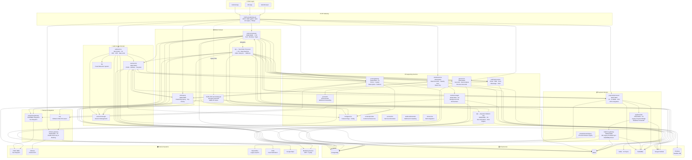

```mermaid
  flowchart TB
      %% ─── CLIENT LAYER ───
      subgraph Clients["📱 Client Layer"]
          AND[Android App]
          IOS[iOS App]
          WEB[Web Browser]
      end

      %% ─── API GATEWAY ───
      subgraph GatewayLayer["🌐 API Gateway"]
          AGW["mybb-api-gateway-go\nREST :3000 | gRPC :3443\n⚠️ Legacy · Beego"]
      end

      %% ─── AUTH & USER ───
      subgraph AuthDomain["👤 Auth & User Domain"]
          AUTH["authservice\n:6017/:8017 · P1\nJWT · OTP · Rate Limit"]
          USER["userservice\n:6015/:8015\nProfile · Address · Payment"]
          SESSION["sessionmanager\nSession Management"]
          FDS["fds\nFraud Detection System"]
      end

      %% ─── ORDER DOMAIN ───
      subgraph OrderDomain["📦 Order Domain"]
          OO["orderorchestrator\n:6000/:8000 · 🔴 P0\nCart · Booking · Saga"]
          TOP["top — Taxi Order Processor\n🔴 P0 · State Machine\nOrder Lifecycle · ~1000 rps"]
          ODQR["orderquery\n:6005/:8005\nRead-Only Query · Trip History"]
          LEGACY["mybb-order-processing-go\n⚠️ Legacy Monolith\nKafka 91 Topics"]
      end

      %% ─── TRANSPORT INTEGRATION ───
      subgraph Transport["🚕 Transport Integration"]
          TPG["taxipartnergateway\niTOP/BBD Integration\nTaxi Dispatch"]
          CTG["cititrans-gateway\n:6040/:8040 · P0\nShuttle Discovery & Booking"]
          COP["cop\nCititrans Order Processor"]
      end

      %% ─── PAYMENT DOMAIN ───
      subgraph PaymentDomain["💳 Payment Domain"]
          PP["paymentprocessor\n:6007/:8007\nCC · E-Wallet · ECV\nUPG Integration"]
          UPGF["upgforwarder\n:6014/:8014 · P0\nLegacy Payment Bridge\nStateless Forwarder"]
          HOG["mybb-ho-gateway\n:50052/:8082\nHO Legacy E-Wallet Sync\nRabbitMQ-Driven"]
          PREAL["preauthstreamlegacy\nPre-Auth Stream Legacy"]
      end

      %% ─── SUPPORTING SERVICES ───
      subgraph Support["⚙️ Supporting Services"]
          GEO["geoservice\n:6024/:8024\nGeocode · Autocomplete\nReverse Geocode"]
          NOTIF["notificationcenter\nEmail · SMS · Push\nWhatsApp · FCM"]
          PROMO["promogateway\n:6010/:8010 · P1\nPromo · Loyalty\nSubscription · Referral"]
          DPF["dpf — Dynamic Platform Fee\n:6000/:8000 · P0\nFee Calculation · Rule Engine"]
          CONFIG["configservice\nFeature Flags · Config"]
          TRACKER["trackerservice\n:6013/:8013\nReal-time GPS · Nearby Cars\nShare Trip"]
          CONTENT["contentprovider\nContent & Resources"]
          SVCINFO["serviceinfo\nService Information"]
          ROUTINE["routinemanager\n:6042/:8042 · P0\nBackground Job Orchestrator"]
          GORSTR["gorooster\nEvent Router\nWebhook Forwarding"]
          WEBHOOK["webhookforwarder\nWebhook Forwarding"]
          N2C["n2cservice\nN2C Integration"]
      end

      %% ─── INFRASTRUCTURE ───
      subgraph Infra["🗄️ Infrastructure"]
          PGDB[(PostgreSQL)]
          REDIS[(Redis)]
          KAFKA[Kafka · 91 Topics]
          RABBITMQ[RabbitMQ]
          PUBSUB[Google PubSub]
          FIREBASE[(Firebase\nRealtime DB)]
      end

      %% ─── EXTERNAL SYSTEMS ───
      subgraph External["🌍 External Systems"]
          ITOP[iTOP / BBD\nTaxi Dispatch]
          CITITRANS_API[Cititrans\nExternal API]
          HO_LEGACY[Head Office\nLegacy System]
          FCM_EXT[FCM\nPush Notification]
          GMAPS[Google Maps]
          MKT[Marketing Service\nMKT / Loyalty]
      end

      %% ── Flow: Client → Gateway ──
      AND & IOS & WEB --> AGW

      %% ── Flow: Gateway → Services ──
      AGW --> AUTH
      AGW --> OO
      AGW --> ODQR
      AGW --> TRACKER
      AGW --> GEO
      AGW --> PP
      AGW --> PROMO
      AGW --> CTG
      AGW -.->|legacy flow| LEGACY

      %% ── Auth Domain ──
      AUTH --> USER & FDS & NOTIF & SESSION
      USER --> PP & PROMO & CONFIG & ODQR

      %% ── Order Orchestrator ──
      OO --> SESSION & CONFIG & GEO & PROMO
      OO --> PP & TPG & USER & NOTIF & DPF
      OO -.->|delegates| TOP

      %% ── TOP (Taxi Order Processor) ──
      TOP --> TPG & PP & USER & GEO
      TOP --> TRACKER & PROMO & SESSION & CONFIG & NOTIF

      %% ── Order Query ──
      ODQR --> USER & CONFIG & SESSION & PROMO & COP

      %% ── Transport ──
      TPG --> ITOP
      CTG --> CITITRANS_API
      COP --> CTG
      ROUTINE --> COP

      %% ── Payment ──
      PP --> UPGF --> HOG --> HO_LEGACY
      PP --> RABBITMQ
      HOG --> RABBITMQ

      %% ── Tracker ──
      TRACKER --> TPG & FIREBASE & GORSTR & ROUTINE

      %% ── Supporting ──
      NOTIF --> FCM_EXT & PUBSUB
      GEO --> GMAPS
      PROMO --> MKT & USER & ODQR & CONFIG
      DPF --> OO & MKT

      %% ── Legacy ──
      LEGACY --> KAFKA & ITOP

      %% ── Infrastructure ──
      AUTH & USER & OO & TOP --> PGDB & REDIS
      PP & GEO & CTG & ODQR --> PGDB
      OO & PP & LEGACY --> RABBITMQ
      AUTH & PROMO & UPGF --> PUBSUB
      TRACKER --> REDIS
      HOG & ROUTINE & DPF --> PGDB & REDIS
```

