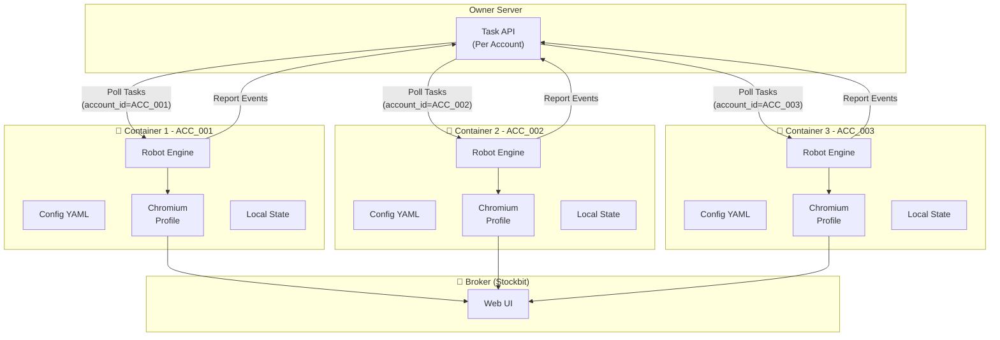

# Trading Robot – Overview

**Owner:** Personal  
**Market:** Indonesia Stocks  
**Mode:** Always-On, UI-based automation  
**Architecture:** Single-Account per Container

---

## 🎯 Design Philosophy

**One Robot = One Account = One Container**

Setiap robot instance handle **satu account** saja, berjalan di container terpisah dengan config YAML sendiri. Multiple accounts di-handle dengan menjalankan multiple containers.

### Why Single-Account Design?

✅ **Simple & Focused:** Robot hanya perlu manage 1 session, 1 browser, 1 account  
✅ **Isolated:** Crash/error di 1 robot tidak affect robot lain  
✅ **Easy Scale:** Tambah account = tambah container  
✅ **Clear Ownership:** 1 config file = 1 account = 1 responsibility  
✅ **Resource Control:** Resource limit per container, easy monitoring

---

## 🏗️ Architecture Overview



---

## 📦 Container Structure

```
trading-robot/
├── config.yaml              # Account-specific config
├── robot-engine             # Main executable
├── chromium-profile/        # Browser profile data
└── state/                   # Local state store
    ├── session.json
    └── orders.json
```

---

## ⚙️ Configuration

**config.yaml** (per container):

```yaml
# Account Configuration
account:
  broker: "stockbit"
  account_id: "ACC_001"      # Unique identifier
  username: "user001"
  password: "${ACCOUNT_PASSWORD}"  # From env/secret
  pin: "${ACCOUNT_PIN}"

# Owner Server
server:
  url: "https://owner.server.com"
  poll_interval: 5s
  timeout: 30s

# Trading Settings
trading:
  market_hours:
    start: "09:00"
    end: "15:45"
    timezone: "Asia/Jakarta"
  
  order_check_interval: 10s
  max_retry: 3
  retry_backoff: 5s

# Monitoring
monitoring:
  heartbeat_interval: 30s
  health_check_port: 8080
```

---

## 🚀 Deployment

### Docker Compose (Multiple Accounts)

```yaml
version: '3.8'

services:
  robot-acc001:
    image: trading-robot:latest
    container_name: robot-acc001
    volumes:
      - ./config-acc001.yaml:/app/config.yaml
      - robot-acc001-data:/app/data
    environment:
      - ACCOUNT_PASSWORD=${ACC001_PASSWORD}
      - ACCOUNT_PIN=${ACC001_PIN}
    restart: unless-stopped

  robot-acc002:
    image: trading-robot:latest
    container_name: robot-acc002
    volumes:
      - ./config-acc002.yaml:/app/config.yaml
      - robot-acc002-data:/app/data
    environment:
      - ACCOUNT_PASSWORD=${ACC002_PASSWORD}
      - ACCOUNT_PIN=${ACC002_PIN}
    restart: unless-stopped

  robot-acc003:
    image: trading-robot:latest
    container_name: robot-acc003
    volumes:
      - ./config-acc003.yaml:/app/config.yaml
      - robot-acc003-data:/app/data
    environment:
      - ACCOUNT_PASSWORD=${ACC003_PASSWORD}
      - ACCOUNT_PIN=${ACC003_PIN}
    restart: unless-stopped

volumes:
  robot-acc001-data:
  robot-acc002-data:
  robot-acc003-data:
```

### Environment Variables

```bash
# .env
ACC001_PASSWORD=secret1
ACC001_PIN=123456

ACC002_PASSWORD=secret2
ACC002_PIN=654321

ACC003_PASSWORD=secret3
ACC003_PIN=111222
```

---

## 🔄 Robot Workflow

**Per Container/Account:**

1. **Startup:**
   - Load config.yaml
   - Initialize browser profile
   - Validate credentials

2. **Session Management:**
   - Login to broker
   - Validate PIN session
   - Keep session alive

3. **Task Polling:**
   - Poll owner server for tasks (filtered by `account_id`)
   - Execute tasks (buy/sell dengan SL/TP)
   - Report execution result

4. **Order Monitoring:**
   - Monitor order status (open/pending/match)
   - Detect TP/SL hits
   - Report events to owner server

5. **Health Check:**
   - Periodic heartbeat ke owner server
   - Expose health endpoint (`:8080/health`)

---

## 📚 Documentation Structure

### Core Design
- [[00-README|Overview]] ← You are here
- [[01-Architecture|Architecture Detail]]
- [[02-Security-Model|Security Model]]

### Task & State
- [[03-Task-Format|Task JSON Format]]
- [[04-State-Machine|State Machine Design]]
- [[05-Timeout-Retry|Timeout & Retry]]
- [[06-Partial-Fill-TPCL|Partial Fill & TP/CL]]

### Operations
- [[07-Heartbeat-Monitoring|Heartbeat & Monitoring]]
- [[08-Concurrency-Model|Concurrency Model]]
- [[09-Logging-Audit|Logging & Audit]]
- [[10-Alerting|Alerting Mechanism]]
- [[11-Market-Hours|Market Hours & Special Cases]]
- [[12-UI-Detection|UI Element Detection]]
- [[13-Session-Management|Session Management]]

### Broker Specific
- [[19-Stockbit-Broker-Flow|Stockbit Broker Flow]]

### Development
- [[15-Agent-Team-Structure|Agent Team Structure]]
- [[16-Dashboard-Requirements|Dashboard Requirements]]
- [[17-API-Contract|API Contract]]
- [[18-Testing-Strategy|Testing Strategy]]

### Risk Management
- [[14-Known-Risks|Known Risks & Mitigations]]

---

## 🎯 Key Benefits

| Aspect | Benefit |
|--------|---------|
| **Isolation** | Error di 1 account tidak affect yang lain |
| **Scaling** | Horizontal scaling dengan tambah container |
| **Debugging** | Easy trace issue per account |
| **Resource** | Control CPU/memory per container |
| **Deployment** | Independent deploy per account |
| **Config** | Simple YAML, no complex multi-account logic |

---

**Status:** Design Complete - Ready for Development  
**Last Updated:** 2026-02-11
