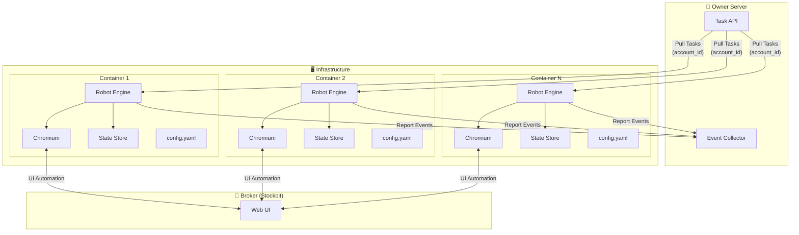
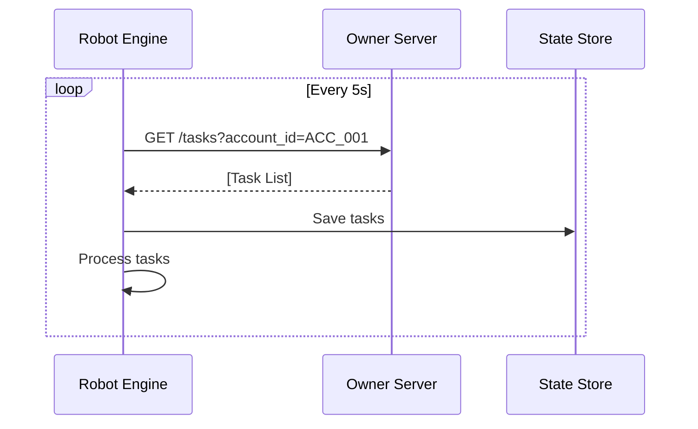
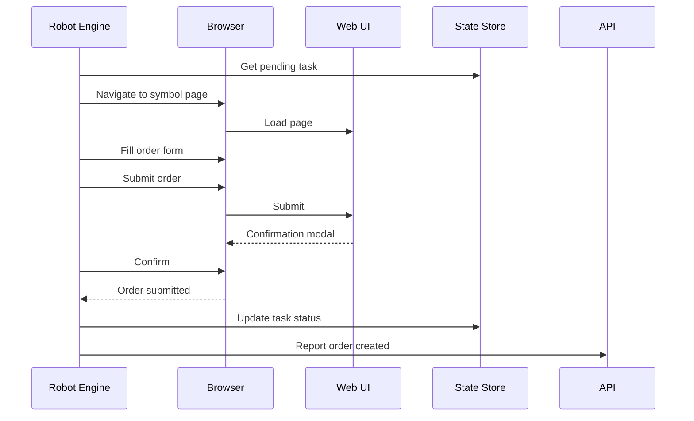
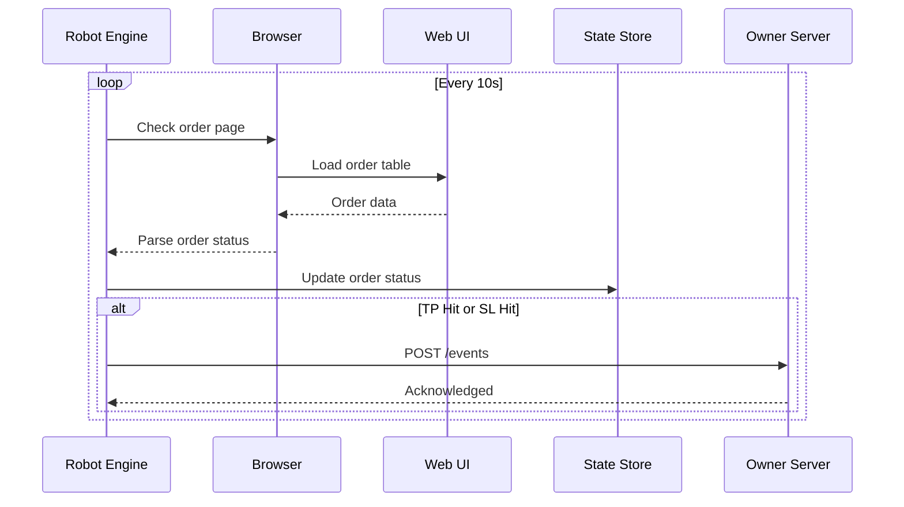

# Architecture Overview

**Design:** Single-Account per Container  
**Deployment:** Docker/Podman Container  
**Scale:** Horizontal (N containers = N accounts)

---

## System Architecture


```mermaid
flowchart TB
    subgraph OWNER["📡 Owner Server"]
        API["Task API"]
        EVENTS["Event Collector"]
    end
    
    subgraph INFRA["🖥️ Infrastructure"]
        subgraph C1["Container 1"]
            R1["Robot Engine"]
            B1["Chromium"]
            S1["State Store"]
            CFG1["config.yaml"]
        end
        
        subgraph C2["Container 2"]
            R2["Robot Engine"]
            B2["Chromium"]
            S2["State Store"]
            CFG2["config.yaml"]
        end
        
        subgraph CN["Container N"]
            RN["Robot Engine"]
            BN["Chromium"]
            SN["State Store"]
            CFGN["config.yaml"]
        end
    end
    
    subgraph BROKER["🏦 Broker (Stockbit)"]
        WEB["Web UI"]
    end
    
    API -->|"Pull Tasks<br/>(account_id)"| R1 & R2 & RN
    R1 & R2 & RN -->|"Report Events"| EVENTS
    
    B1 & B2 & BN <-->|"UI Automation"| WEB
    
    R1 --> B1 & S1
    R2 --> B2 & S2
    RN --> BN & SN
```

---

## Core Principles

### 1. Single Responsibility
- **1 Robot = 1 Account = 1 Container**
- Robot hanya manage 1 browser session
- Tidak ada account switching logic
- Tidak ada concurrency antar account

### 2. Isolation
- Container terpisah per account
- Dedicated browser profile per container
- Independent state store
- Crash di 1 container tidak affect yang lain

### 3. Horizontal Scaling
- Tambah account = run new container
- No code change untuk scale
- Load distribution via container orchestration

### 4. Configuration as Code
- YAML config per container
- Environment variables untuk secrets
- No hardcoded credentials

---

## Component Details

### Robot Engine

**Responsibilities:**
- Session management (login, PIN validation)
- Task polling dari owner server
- Order execution (buy/sell dengan SL/TP)
- Order monitoring (status tracking)
- Event reporting (TP hit, SL hit, order match)
- Health check & heartbeat

**Technology Stack:**
- Language: Go
- Browser Automation: Playwright/Chromedp
- HTTP Client: net/http
- State Store: SQLite/BoltDB

---

### Chromium Browser

**Configuration:**
- Headless mode (production)
- Persistent profile per container
- Session cookies stored in profile
- No auto-login, session-based only

**Profile Structure:**
```
/app/chromium-profile/
├── cookies.db           # Session cookies
├── preferences.json     # Browser preferences
└── cache/              # Cache files
```

---

### State Store

**Purpose:**
- Persist task execution state
- Track order status
- Store session metadata
- Audit trail

**Schema (SQLite):**
```sql
-- Tasks
CREATE TABLE tasks (
    id TEXT PRIMARY KEY,
    emiten TEXT NOT NULL,
    action TEXT NOT NULL,
    price REAL NOT NULL,
    lot INTEGER NOT NULL,
    status TEXT NOT NULL,
    created_at DATETIME,
    updated_at DATETIME
);

-- Orders
CREATE TABLE orders (
    id TEXT PRIMARY KEY,
    task_id TEXT,
    order_id TEXT,
    status TEXT,
    filled_lot INTEGER,
    avg_price REAL,
    created_at DATETIME,
    updated_at DATETIME,
    FOREIGN KEY (task_id) REFERENCES tasks(id)
);

-- Events
CREATE TABLE events (
    id INTEGER PRIMARY KEY AUTOINCREMENT,
    order_id TEXT,
    event_type TEXT,
    payload TEXT,
    created_at DATETIME,
    reported BOOLEAN DEFAULT 0
);

-- Session
CREATE TABLE session (
    key TEXT PRIMARY KEY,
    value TEXT,
    updated_at DATETIME
);
```

---

### Configuration File

**config.yaml:**
```yaml
# Account Identity
account:
  broker: "stockbit"
  account_id: "ACC_001"
  username: "user001"
  password: "${ACCOUNT_PASSWORD}"
  pin: "${ACCOUNT_PIN}"

# Owner Server
server:
  url: "https://owner.server.com"
  api_key: "${API_KEY}"
  poll_interval: 5s
  timeout: 30s
  retry_max: 3
  retry_backoff: 5s

# Trading Parameters
trading:
  market_hours:
    start: "09:00"
    end: "15:45"
    pre_market_start: "08:45"
    post_market_end: "16:00"
    timezone: "Asia/Jakarta"
  
  order_check_interval: 10s
  max_pending_tasks: 5

# Browser Settings
browser:
  headless: true
  timeout: 30s
  user_agent: "Mozilla/5.0..."
  window_size: "1920x1080"

# Monitoring
monitoring:
  heartbeat_interval: 30s
  health_check_port: 8080
  log_level: "info"

# State Store
state:
  type: "sqlite"
  path: "/app/data/state.db"
  backup_interval: "1h"
```

---

## Data Flow

### 1. Task Polling Flow


```mermaid
sequenceDiagram
    participant R as Robot Engine
    participant API as Owner Server
    participant S as State Store
    
    loop Every 5s
        R->>API: GET /tasks?account_id=ACC_001
        API-->>R: [Task List]
        R->>S: Save tasks
        R->>R: Process tasks
    end
```

### 2. Order Execution Flow


```mermaid
sequenceDiagram
    participant R as Robot Engine
    participant B as Browser
    participant W as Web UI
    participant S as State Store
    
    R->>S: Get pending task
    R->>B: Navigate to symbol page
    B->>W: Load page
    R->>B: Fill order form
    R->>B: Submit order
    B->>W: Submit
    W-->>B: Confirmation modal
    R->>B: Confirm
    B-->>R: Order submitted
    R->>S: Update task status
    R->>API: Report order created
```

### 3. Order Monitoring Flow


```mermaid
sequenceDiagram
    participant R as Robot Engine
    participant B as Browser
    participant W as Web UI
    participant S as State Store
    participant API as Owner Server
    
    loop Every 10s
        R->>B: Check order page
        B->>W: Load order table
        W-->>B: Order data
        B-->>R: Parse order status
        R->>S: Update order status
        
        alt TP Hit or SL Hit
            R->>API: POST /events
            API-->>R: Acknowledged
        end
    end
```

---

## Container Deployment

### Resource Requirements (per container)

| Resource | Minimum | Recommended |
|----------|---------|-------------|
| CPU | 0.5 core | 1 core |
| Memory | 512 MB | 1 GB |
| Disk | 1 GB | 2 GB |
| Network | 1 Mbps | 5 Mbps |

### Docker Run

```bash
docker run -d \
  --name robot-acc001 \
  --cpus="1.0" \
  --memory="1g" \
  -v ./config-acc001.yaml:/app/config.yaml \
  -v robot-acc001-data:/app/data \
  -e ACCOUNT_PASSWORD="secret1" \
  -e ACCOUNT_PIN="123456" \
  -e API_KEY="key123" \
  -p 8081:8080 \
  --restart unless-stopped \
  trading-robot:latest
```

### Health Check

```bash
# Check container health
curl http://localhost:8081/health

# Response
{
  "status": "healthy",
  "account_id": "ACC_001",
  "session_valid": true,
  "last_heartbeat": "2026-02-11T10:30:00Z",
  "active_orders": 3,
  "pending_tasks": 1
}
```

---

## Scalability

### Adding New Account

**Step 1:** Create config file
```bash
cp config-template.yaml config-acc004.yaml
# Edit account_id, username, dll
```

**Step 2:** Add to docker-compose.yaml
```yaml
robot-acc004:
  image: trading-robot:latest
  container_name: robot-acc004
  volumes:
    - ./config-acc004.yaml:/app/config.yaml
    - robot-acc004-data:/app/data
  environment:
    - ACCOUNT_PASSWORD=${ACC004_PASSWORD}
    - ACCOUNT_PIN=${ACC004_PIN}
  ports:
    - "8084:8080"
```

**Step 3:** Start container
```bash
docker-compose up -d robot-acc004
```

### Removing Account

```bash
docker-compose stop robot-acc003
docker-compose rm robot-acc003
docker volume rm robot-acc003-data
```

---

## Security Architecture

### Container Isolation
- Each container runs in isolated network namespace
- No shared volumes between containers
- Secrets via environment variables only

### Credential Management
- Passwords & PINs never in config file
- Use Docker secrets atau env vars
- No credentials in logs

### Network Security
- Outbound only (ke broker & owner server)
- No exposed ports except health check
- TLS untuk communication dengan owner server

---

## Monitoring & Observability

### Metrics (per container)

- **System:**
  - CPU usage
  - Memory usage
  - Disk I/O

- **Application:**
  - Task execution rate
  - Order success/failure rate
  - Session validity
  - API response time

- **Business:**
  - Active orders count
  - Daily trades count
  - TP/SL hit rate

### Logging

Container logs di-stream ke centralized logging:
```bash
docker logs -f robot-acc001 | tee -a /logs/acc001.log
```

### Alerting

- Container down → Restart policy
- Session invalid → Alert + auto-relogin
- Order execution failed → Retry + alert
- API unreachable → Exponential backoff + alert

---

## Related Documents

- [[00-README|Overview]]
- [[02-Security-Model|Security Model]]
- [[13-Session-Management|Session Management]]
- [[07-Heartbeat-Monitoring|Heartbeat & Monitoring]]

---

**Last Updated:** 2026-02-11
