---
tags:
  - trading
  - architecture
created: '2026-01-20'
---
# Architecture Overview

## System Design

- Robot runs on personal PC
- >10 broker accounts
- One Chromium profile per account
- No auto-login, session-based only

---

## Components

```mermaid
flowchart TB
    subgraph ROBOT["🤖 ROBOT ENGINE"]
        C1["Chrome 1<br/>(ACC_01)"]
        C2["Chrome 2<br/>(ACC_02)"]
        CN["Chrome N<br/>(ACC_N)"]
        STATE[("State Store<br/>(Local DB)")]
    end
    
    C1 --> STATE
    C2 --> STATE
    CN --> STATE
    
    subgraph BROKER["🏦 BROKER WEB UI"]
        B1["Broker 1"]
        B2["Broker 2"]
        BN["Broker N"]
    end
    
    C1 <-->|"UI Automation"| B1
    C2 <-->|"UI Automation"| B2
    CN <-->|"UI Automation"| BN
    
    SERVER["📡 OWNER SERVER<br/>(Task + Event)"]
    
    STATE <-->|"HTTP/JSON"| SERVER
```

---

## Component Description

| Component | Responsibility |
|-----------|----------------|
| Robot Engine | Core orchestrator, manages all accounts |
| Chromium Profiles | Isolated browser per account |
| Broker Web UI | Target for automation |
| State Store | Persist order/task states locally |
| Owner Server | Distribute tasks, receive events |
