---
tags:
  - trading
  - security
created: '2026-01-20'
---
# Security Model

## Core Rules

| Rule | Description |
|------|-------------|
| No password storage | Robot never stores credentials |
| No auto-login | Manual login required per session |
| Session-based | Relies on persistent browser sessions |
| No bypass | Robot never bypasses captcha or OTP |

---

## Authentication Flow

```mermaid
sequenceDiagram
    participant O as 👤 Owner
    participant R as 🤖 Robot
    participant B as 🏦 Broker
    
    O->>R: Manual Login Request
    R->>B: Open Login Page
    B-->>R: Show Login Form
    R-->>O: Display Login Form
    O->>R: Enter Credentials
    R->>B: Submit Credentials
    B-->>R: Request OTP/Captcha
    R-->>O: Display OTP/Captcha
    O->>R: Enter OTP/Captcha
    R->>B: Submit OTP/Captcha
    B-->>R: Session Cookie ✅
    
    Note over R,B: SESSION ACTIVE<br/>Robot can now trade
```

---

## Session Management

- Browser profiles persist across restarts
- Session cookies maintained in Chromium profile
- Manual re-login only if session expires

---

## What Robot CANNOT Do

```mermaid
flowchart LR
    subgraph FORBIDDEN["❌ FORBIDDEN"]
        A["Store Passwords"]
        B["Auto-login"]
        C["Bypass Captcha"]
        D["Bypass OTP"]
        E["Access Credentials"]
    end
    
    style FORBIDDEN fill:#ffcccc
```

