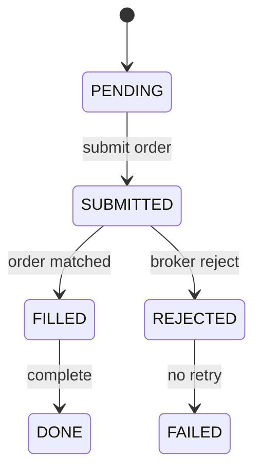
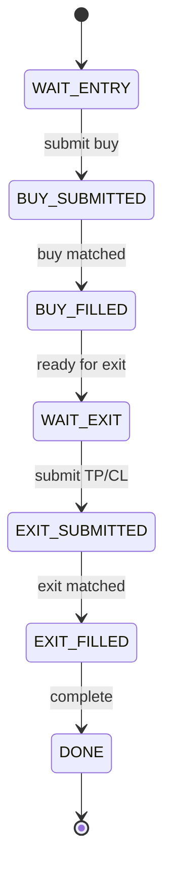
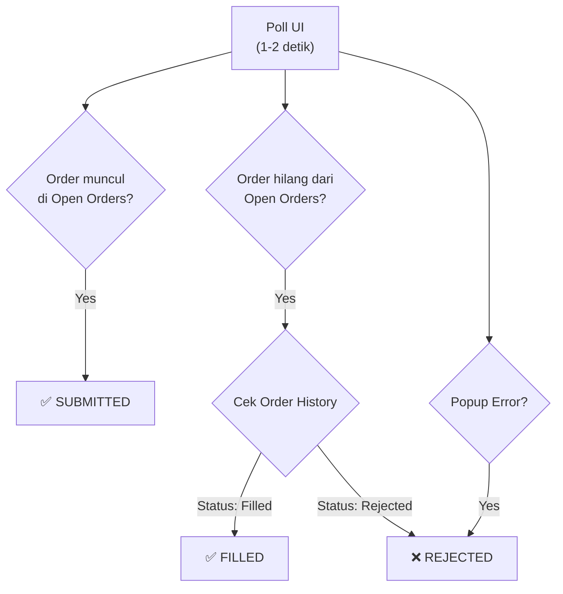
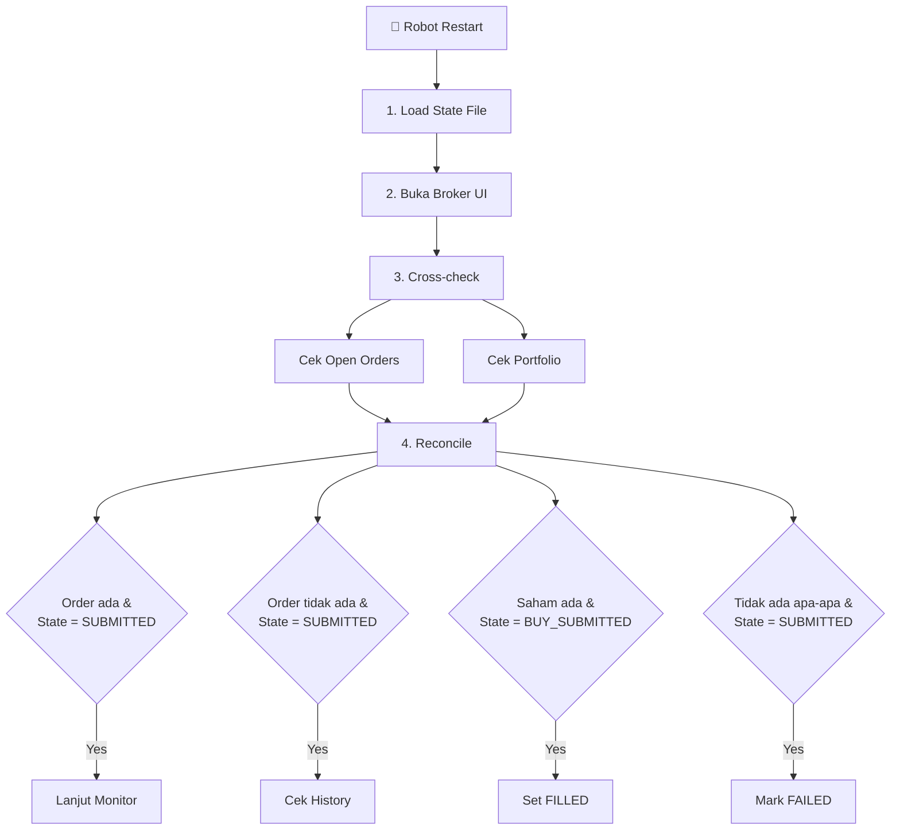

---
tags:
  - trading
  - state-machine
  - design
created: '2026-01-20'
---
# State Machine Design

## 1️⃣ PRINSIP DASAR (WAJIB)

1. Setiap order punya state
2. State hanya boleh maju, tidak mundur
3. State disimpan (persisted) → survive restart
4. UI broker = source of truth terakhir

---

## 2️⃣ ORDER STATE MACHINE



### Definisi State

| State | Makna |
|-------|-------|
| `PENDING` | Order belum dikirim (nunggu jam / harga) |
| `SUBMITTED` | Order sudah diklik & dikirim ke broker |
| `FILLED` | Order match (full / partial*) |
| `REJECTED` | Ditolak broker (harga, lot, dll) |
| `DONE` | Order selesai & valid |
| `FAILED` | Order gagal & tidak akan diulang |

📌 Partial fill diperlakukan sebagai `FILLED` + flag

---

## 3️⃣ TASK STATE MACHINE (LEVEL STRATEGY)

Satu task bisa punya 3 order:
- BUY
- SELL (TP)
- SELL (CL)

### Task State Flow



Mapping:
- BUY order → ORDER STATE
- EXIT order → ORDER STATE
- TASK state = agregasi

---

## 4️⃣ STRUKTUR STATE (DATA MODEL)

Contoh state yang disimpan lokal (file / DB kecil):

```json
{
  "account": "ACC_003",
  "emiten": "BBCA",
  "task_id": "TASK_20260120_01",
  "state": "WAIT_EXIT",
  "buy_order": {
    "price": 2700,
    "lot": 20,
    "state": "FILLED",
    "order_id": "SB123456"
  },
  "exit_order": {
    "type": "TP",
    "price": 3000,
    "state": "PENDING"
  }
}
```

📌 Ini single source of truth robot

---

## 5️⃣ TRANSISI STATE (RULE KERAS)

### ❌ Robot TIDAK BOLEH:
- Submit BUY jika state ≠ `WAIT_ENTRY`
- Submit EXIT jika BUY belum `FILLED`
- Submit ulang order yang sudah `SUBMITTED`

### ✅ Robot HANYA BOLEH:
- Advance state jika UI broker mengonfirmasi

---

## 6️⃣ DETEKSI STATE DARI UI



📌 Robot poll UI (interval pendek, mis. 1–2 detik)

---

## 7️⃣ RESTART & CRASH RECOVERY

Saat robot restart:



📌 Tidak ada blind submit ulang

---

## 8️⃣ EVENT REPORTING

Setiap state change → kirim event ke server:

```json
{
  "event": "ORDER_STATE_CHANGED",
  "from": "SUBMITTED",
  "to": "FILLED",
  "account": "ACC_003",
  "emiten": "BBCA"
}
```

Server tidak menentukan state, hanya menerima.

---

## 9️⃣ EDGE CASES YANG SUDAH DI-COVER

- ✅ Partial fill
- ✅ Broker lag
- ✅ UI freeze
- ✅ Robot restart
- ✅ Server mati
- ✅ Internet drop sesaat

---

## 🔟 RANGKUMAN

- Order selalu punya state
- Task = kumpulan order
- State hanya maju
- UI broker = validator terakhir
- Persist state = aman dari double order

---

## ✅ STATUS DESAIN

| Area | Status |
|------|--------|
| Order State Machine | ✅ Final |
| Task State Machine | ✅ Final |
| Recovery Logic | ✅ Final |
| Safe from double order | ✅ Yes |
