---
tags:
  - trading
  - timeout
  - retry
created: '2026-01-20'
---
# Timeout & Retry Design

## 1. Dynamic Timeout by Market Session

| Market Session | Timeout Duration |
|----------------|------------------|
| Opening (09:00-09:15) | 10 menit |
| Normal (09:15-15:45) | 5 menit |
| Pre-closing (15:45-16:00) | 2 menit |

---

## 2. Retry Policy

| Parameter | Value |
|-----------|-------|
| Max retry | 3x |
| Delay antar retry | 30-60 detik |
| Price strategy | Sama dengan plan original |
| Threshold event | Kirim ke reporting endpoint saat retry ke-3 gagal |

---

## 3. Updated Order State Machine (with Timeout)


---

## 4. Cancel Flow

```mermaid
flowchart TD
    START["⏰ Timeout Detected"] --> CLICK["1. Klik 'Cancel'<br/>di Open Orders"]
    CLICK --> POLL["2. Poll UI<br/>(1-2 detik)"]
    POLL --> CHECK{"Status berubah<br/>ke 'Cancelled'?"}
    CHECK -->|Yes| SUCCESS["✅ CANCELLED"]
    CHECK -->|No| POLL
    
    SUCCESS --> RETRY{"retry_count < 3?"}
    RETRY -->|Yes| BACK["Kembali ke PENDING<br/>(retry)"]
    RETRY -->|No| FAIL["❌ FAILED<br/>+ Send Event"]
```



### Edge Cases (BIARKAN - No Special Handling):
- Cancel diklik tapi order FILLED → terima sebagai FILLED ✅
- Broker reject cancel → tetap di SUBMITTED, tunggu natural resolution ✅

---

## 5. Network Failure Safety (CRITICAL)

### Problem
Jika internet putus setelah klik submit tapi sebelum dapat konfirmasi:
- Robot tidak tahu apakah order masuk atau tidak
- Bisa double order jika langsung retry

### Solution: Check Before Retry

```mermaid
flowchart TD
    SUBMIT["Submit Order"] --> WAIT["Wait for confirmation"]
    WAIT --> TIMEOUT{"Timeout /<br/>Network Error?"}
    
    TIMEOUT -->|"No"| SUCCESS["✅ Confirmed"]
    TIMEOUT -->|"Yes"| CHECK["⚠️ Check Open Orders"]
    
    CHECK --> FOUND{"Order found<br/>in Open Orders?"}
    FOUND -->|"Yes"| ALREADY["Order sudah masuk<br/>→ Mark SUBMITTED"]
    FOUND -->|"No"| SAFE["Safe to retry<br/>→ Back to PENDING"]
```



📌 **WAJIB**: Sebelum retry, SELALU cek Open Orders dulu untuk verify apakah order sudah masuk.

### Implementation

```go
func (w *Worker) handleSubmitTimeout(task *Task) error {
    // JANGAN langsung retry! Cek dulu apakah order sudah masuk
    
    orders, err := w.GetOpenOrders()
    if err != nil {
        return fmt.Errorf("cannot verify order status: %w", err)
    }
    
    // Cari apakah order untuk emiten ini sudah ada
    for _, order := range orders {
        if order.Emiten == task.Emiten {
            // Order sudah masuk! Jangan retry
            task.OrderID = order.ID
            task.State = StateSubmitted
            w.logger.Info("WORKER", "Order found after timeout, marking as SUBMITTED", map[string]interface{}{
                "task_id":  task.ID,
                "order_id": order.ID,
            })
            return nil
        }
    }
    
    // Order tidak ditemukan, safe to retry
    task.RetryCount++
    task.State = StatePending
    w.logger.Warn("WORKER", "Order not found after timeout, will retry", map[string]interface{}{
        "task_id": task.ID,
        "retry":   task.RetryCount,
    })
    return nil
}
```

---

## 6. Threshold Event Reporting

Saat retry ke-3 gagal, kirim event:

```json
{
  "event": "ORDER_MAX_RETRY_REACHED",
  "account": "ACC_003",
  "emiten": "BBCA",
  "task_id": "TASK_20260120_01",
  "retry_count": 3,
  "last_state": "CANCELLED",
  "reason": "timeout_after_cancel",
  "timestamp": "2026-01-20T09:25:00+07:00"
}
```

---

## 7. Data Model (Order with Retry)

```json
{
  "price": 2700,
  "lot": 20,
  "state": "SUBMITTED",
  "order_id": "SB123456",
  "retry_count": 0,
  "submitted_at": "2026-01-20T09:00:05+07:00",
  "timeout_at": "2026-01-20T09:05:05+07:00"
}
```

### Field Descriptions:

| Field | Type | Description |
|-------|------|-------------|
| `retry_count` | int | Jumlah retry yang sudah dilakukan (0-3) |
| `submitted_at` | datetime | Waktu order di-submit |
| `timeout_at` | datetime | Waktu kapan order dianggap timeout |

---

## 8. Timeout Calculation Logic


```go
func calculateTimeout(submittedAt time.Time) time.Time {
    hour := submittedAt.Hour()
    minute := submittedAt.Minute()
    
    if hour == 9 && minute < 15 {
        return submittedAt.Add(10 * time.Minute)  // Opening session
    } else if hour == 15 && minute >= 45 {
        return submittedAt.Add(2 * time.Minute)   // Pre-closing
    } else {
        return submittedAt.Add(5 * time.Minute)   // Normal hours
    }
}
```

---

## ✅ Status

| Item | Status |
|------|--------|
| Timeout duration | ✅ Final |
| Retry policy | ✅ Final |
| Cancel flow | ✅ Final |
| Edge cases | ✅ Final |
| Network failure safety | ✅ Final |
| Event reporting | ✅ Final |
