---
tags:
  - trading
  - partial-fill
  - tp
  - cl
created: '2026-01-20'
---
# Partial Fill & TP/CL Detection

## 1. Order Submission (Single Form)

Robot submit 1 form dengan 3 kondisi sekaligus:

```mermaid
flowchart LR
    subgraph FORM["📝 BUY ORDER FORM"]
        direction TB
        E["Emiten: BBCA"]
        P["Price: 2700"]
        L["Lot: 100"]
        TP["Take Profit: 3000"]
        CL["Cut Loss: 2300"]
    end
    
    FORM -->|"Submit"| BROKER["🏦 Broker"]
    
    BROKER --> AUTO["Broker Handle Otomatis"]
    AUTO --> A1["BUY matched → TP & CL auto-active"]
    AUTO --> A2["Harga naik ke TP → auto SELL"]
    AUTO --> A3["Harga turun ke CL → auto SELL"]
```



---

## 2. Partial Fill Handling

### Approach: Let It Expire

Robot TIDAK action apa-apa untuk partial fill. Biarkan order sampai:
- Full filled, atau
- Expired (end of day)

TP/CL otomatis apply ke lot yang sudah filled (broker handle).

```mermaid
flowchart TD
    BUY["BUY 100 lot @ 2700"] --> SUBMIT["SUBMITTED"]
    SUBMIT --> PARTIAL["Partial Match<br/>(60 lot filled)"]
    PARTIAL --> WAIT["Tetap SUBMITTED<br/>❌ Robot tidak action"]
    WAIT --> EOD["End of Day"]
    EOD --> FILLED["FILLED<br/>(filled_lot = 60)"]
```



---

## 3. Simplified Task State Machine


---

## 4. TP/CL Detection Logic

### Source: Order History

Robot poll Order History dan cek SELL order yang executed.

### Detection Rule (Exact Price Match)

```
IF sell_price == tp_price → TP_HIT
IF sell_price == cl_price → CL_HIT
```

📌 Broker selalu execute di exact price, tidak ada slippage.

### Detection Flow

```mermaid
flowchart TD
    POLL["Poll Order History<br/>(1-2 detik)"] --> CHECK{"Ada SELL executed<br/>untuk emiten<br/>yang di-monitor?"}
    
    CHECK -->|No| POLL
    CHECK -->|Yes| COMPARE["Compare sell_price"]
    
    COMPARE --> TP_CHECK{"sell_price<br/>== tp_price?"}
    TP_CHECK -->|Yes| TP["✅ TP_HIT"]
    TP_CHECK -->|No| CL_CHECK{"sell_price<br/>== cl_price?"}
    
    CL_CHECK -->|Yes| CL["✅ CL_HIT"]
    CL_CHECK -->|No| UNKNOWN["⚠️ UNKNOWN<br/>(log warning)"]
```



---

## 5. Event Reporting

### 5.1 Order Submitted

```json
{
  "event": "ORDER_SUBMITTED",
  "account": "ACC_003",
  "emiten": "BBCA",
  "buy_price": 2700,
  "lot": 100,
  "tp_price": 3000,
  "cl_price": 2300,
  "timestamp": "2026-01-20T09:00:05+07:00"
}
```

### 5.2 Take Profit Hit

```json
{
  "event": "TP_HIT",
  "account": "ACC_003",
  "emiten": "BBCA",
  "filled_lot": 100,
  "buy_price": 2700,
  "sell_price": 3000,
  "profit_per_lot": 300,
  "total_profit": 30000,
  "timestamp": "2026-01-20T10:30:00+07:00"
}
```

### 5.3 Cut Loss Hit

```json
{
  "event": "CL_HIT",
  "account": "ACC_003",
  "emiten": "BBCA",
  "filled_lot": 100,
  "buy_price": 2700,
  "sell_price": 2300,
  "loss_per_lot": -400,
  "total_loss": -40000,
  "timestamp": "2026-01-20T11:15:00+07:00"
}
```

---

## 6. Data Model (Updated)

### Active State:

```json
{
  "account": "ACC_003",
  "emiten": "BBCA",
  "task_id": "TASK_20260120_01",
  "state": "ACTIVE",
  "order": {
    "buy_price": 2700,
    "lot": 100,
    "filled_lot": 100,
    "tp_price": 3000,
    "cl_price": 2300,
    "state": "ACTIVE",
    "order_id": "SB123456",
    "submitted_at": "2026-01-20T09:00:05+07:00"
  },
  "result": null
}
```

### After TP/CL Hit:

```json
{
  "account": "ACC_003",
  "emiten": "BBCA",
  "task_id": "TASK_20260120_01",
  "state": "DONE",
  "order": {
    "buy_price": 2700,
    "lot": 100,
    "filled_lot": 100,
    "tp_price": 3000,
    "cl_price": 2300,
    "state": "DONE",
    "order_id": "SB123456",
    "submitted_at": "2026-01-20T09:00:05+07:00"
  },
  "result": {
    "type": "TP_HIT",
    "sell_price": 3000,
    "profit": 30000,
    "closed_at": "2026-01-20T10:30:00+07:00"
  }
}
```

---

## 7. Complete Flow Diagram

```mermaid
flowchart TB
    subgraph TASK["📋 TASK LIFECYCLE"]
        direction TB
        T1["1️⃣ Receive Task<br/>from Server"]
        T2["2️⃣ Submit Order<br/>(BUY + TP + CL)"]
        T3["3️⃣ Monitor<br/>Order Status"]
        T4["4️⃣ Detect Exit<br/>(TP or CL)"]
        T5["5️⃣ Report Event<br/>to Server"]
        
        T1 --> T2 --> T3 --> T4 --> T5
    end
    
    subgraph EVENTS["📡 EVENTS"]
        E1["ORDER_SUBMITTED"]
        E2["TP_HIT / CL_HIT"]
    end
    
    T2 -.->|"report"| E1
    T4 -.->|"report"| E2
```



---

## ✅ Status

| Item | Status |
|------|--------|
| Partial fill handling | ✅ Final (let it expire) |
| TP/CL detection | ✅ Final (exact price match) |
| Event reporting | ✅ Final |
| Data model | ✅ Final |
