---
tags:
  - trading
  - monitoring
  - heartbeat
created: '2026-01-20'
---
# Heartbeat & Monitoring

## Heartbeat Types

| Type | Scope | Description |
|------|-------|-------------|
| Robot Heartbeat | Global | Overall robot health |
| Account Heartbeat | Per Account | Individual account status |

---

## Architecture

```mermaid
flowchart TD
    subgraph ROBOT["🤖 ROBOT ENGINE"]
        HB_ROBOT["Robot Heartbeat<br/>(Global)"]
        
        subgraph ACCOUNTS["Accounts"]
            HB1["Account HB 1"]
            HB2["Account HB 2"]
            HBN["Account HB N"]
        end
    end
    
    SERVER["📡 OWNER SERVER"]
    
    HB_ROBOT -->|"60-120s"| SERVER
    HB1 -->|"60-120s"| SERVER
    HB2 -->|"60-120s"| SERVER
    HBN -->|"60-120s"| SERVER
    
    SERVER --> ALERT["🚨 Alert System"]
```



---

## Configuration

| Parameter | Value |
|-----------|-------|
| Interval | 60–120 seconds |
| Purpose | Health monitoring only |
| Trading Control | ❌ None |

---

## Robot Heartbeat

```json
{
  "event": "ROBOT_HEARTBEAT",
  "status": "healthy",
  "active_accounts": 12,
  "active_tasks": 5,
  "timestamp": "2026-01-20T09:30:00+07:00"
}
```

---

## Account Heartbeat

```json
{
  "event": "ACCOUNT_HEARTBEAT",
  "account": "ACC_003",
  "status": "active",
  "session_valid": true,
  "open_orders": 2,
  "timestamp": "2026-01-20T09:30:00+07:00"
}
```

---

## Health Status


| Status | Meaning |
|--------|---------|
| `healthy` | Robot berjalan normal |
| `degraded` | Ada issue tapi masih jalan |
| `unhealthy` | Robot bermasalah serius |

---

## Account Status


| Status | Meaning |
|--------|---------|
| `active` | Session valid, monitoring aktif |
| `idle` | Session valid, tidak ada task |
| `expired` | Session expired, perlu re-login |
| `error` | Ada error pada account |

---

## Alert Flow

```mermaid
flowchart TD
    SERVER["📡 Server"] --> CHECK{"Heartbeat<br/>received?"}
    
    CHECK -->|"Yes (on time)"| OK["✅ OK"]
    CHECK -->|"No (missed)"| COUNT{"Miss count<br/>> threshold?"}
    
    COUNT -->|"No"| WAIT["⏳ Wait next interval"]
    COUNT -->|"Yes"| ALERT["🚨 Send Alert"]
    
    ALERT --> NOTIFY["Notify Owner<br/>(Telegram/Email)"]
```



---

## Notes

- Heartbeat hanya untuk monitoring, tidak mengontrol trading
- Server hanya menerima dan log heartbeat
- Alert dihandle di server-side jika heartbeat tidak diterima
