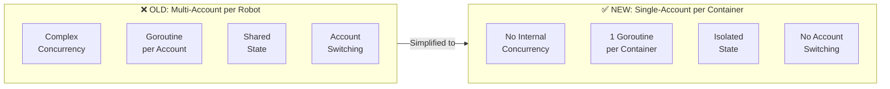
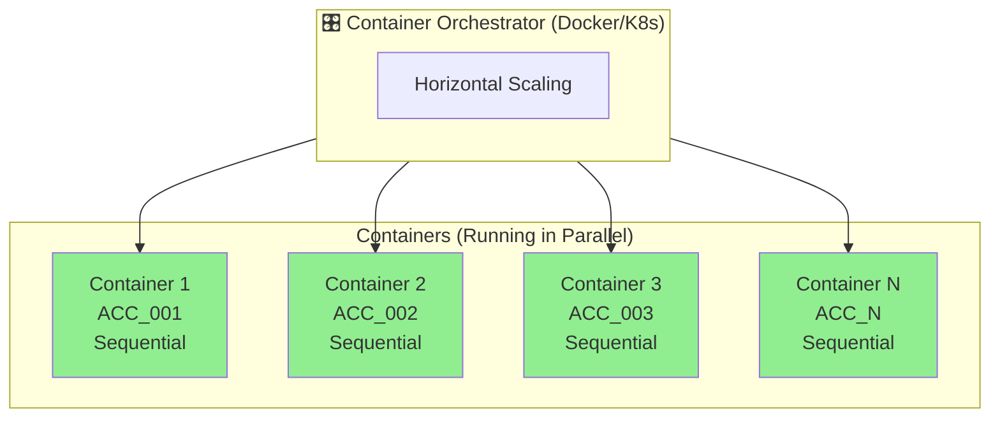
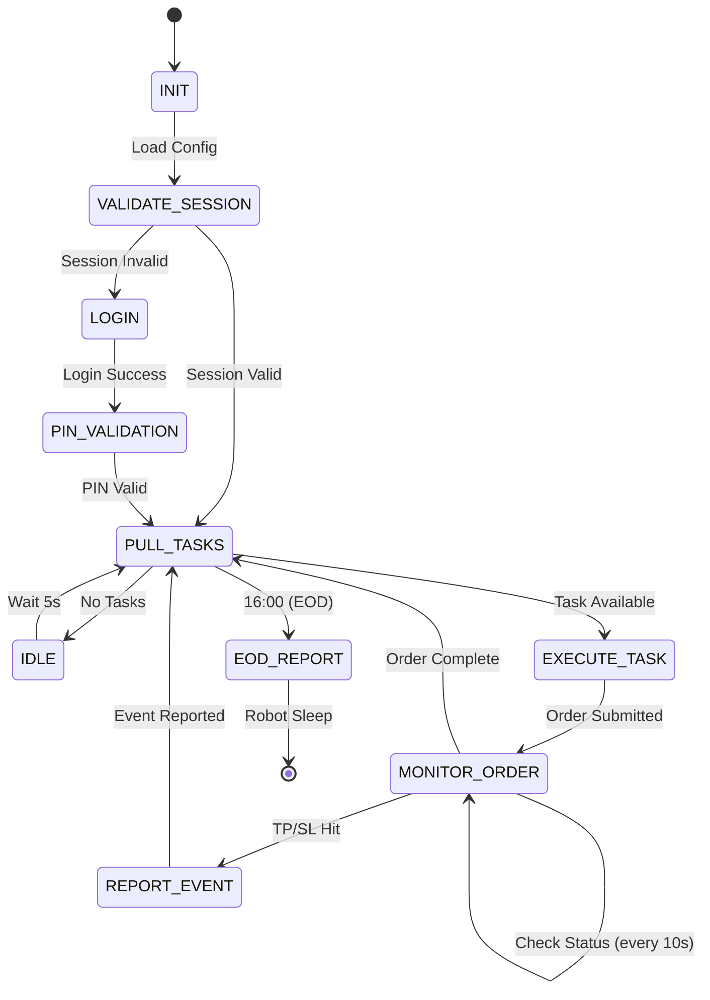
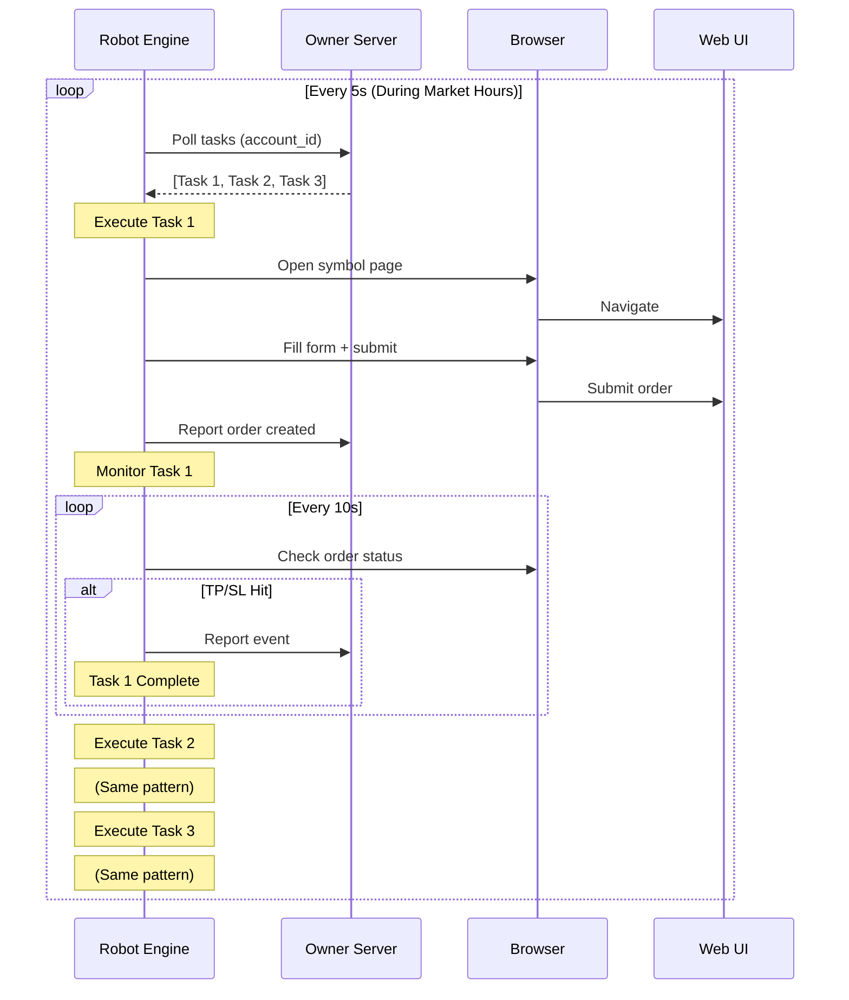
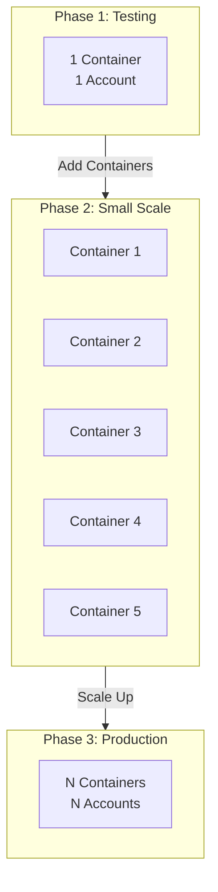
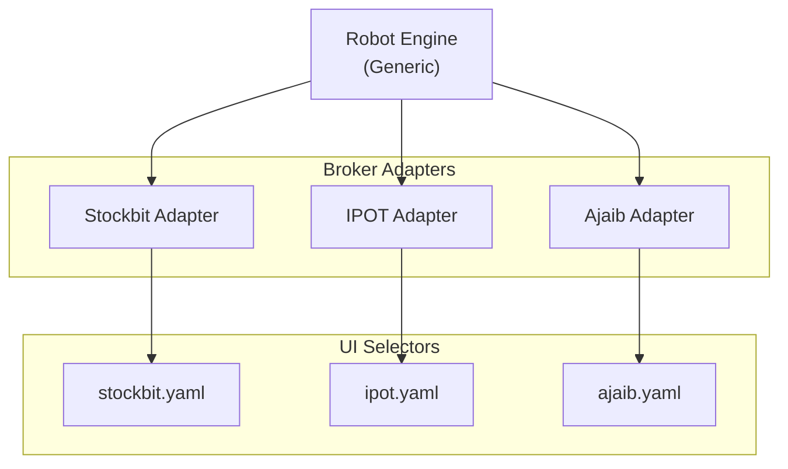
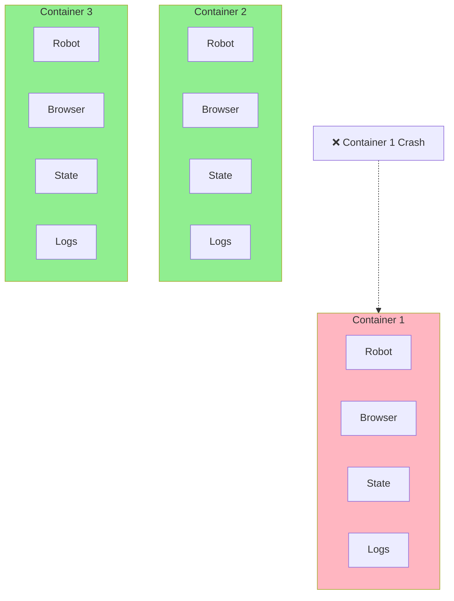
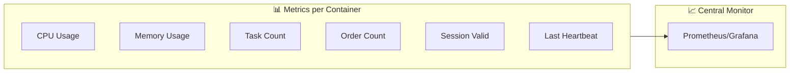

# Concurrency Model

**Architecture:** Single-Account per Container  
**Concurrency:** Container-level (Horizontal Scaling)  
**Design:** No internal concurrency needed

---

## 1. Design Philosophy


```mermaid
flowchart LR
    subgraph OLD["❌ OLD: Multi-Account per Robot"]
        O1["Complex<br/>Concurrency"]
        O2["Goroutine<br/>per Account"]
        O3["Shared<br/>State"]
        O4["Account<br/>Switching"]
    end
    
    subgraph NEW["✅ NEW: Single-Account per Container"]
        N1["No Internal<br/>Concurrency"]
        N2["1 Goroutine<br/>per Container"]
        N3["Isolated<br/>State"]
        N4["No Account<br/>Switching"]
    end
    
    OLD -->|"Simplified to"| NEW
```

**Key Principle:**
> **1 Robot = 1 Account = 1 Container = Sequential Execution**

---

## 2. Container-Level Concurrency


```mermaid
flowchart TB
    subgraph ORCHESTRATOR["🎛️ Container Orchestrator (Docker/K8s)"]
        direction LR
        SCALE["Horizontal Scaling"]
    end
    
    subgraph CONTAINERS["Containers (Running in Parallel)"]
        C1["Container 1<br/>ACC_001<br/>Sequential"]
        C2["Container 2<br/>ACC_002<br/>Sequential"]
        C3["Container 3<br/>ACC_003<br/>Sequential"]
        CN["Container N<br/>ACC_N<br/>Sequential"]
    end
    
    ORCHESTRATOR --> C1 & C2 & C3 & CN
    
    style C1 fill:#90EE90
    style C2 fill:#90EE90
    style C3 fill:#90EE90
    style CN fill:#90EE90
```

**Concurrency Pattern:**
- **Inter-Container:** Parallel (managed by Docker/K8s)
- **Intra-Container:** Sequential (single goroutine)

---

## 3. Robot Execution Model

### Per Container (Sequential)


```mermaid
stateDiagram-v2
    [*] --> INIT
    
    INIT --> VALIDATE_SESSION : Load Config
    VALIDATE_SESSION --> LOGIN : Session Invalid
    VALIDATE_SESSION --> PULL_TASKS : Session Valid
    
    LOGIN --> PIN_VALIDATION : Login Success
    PIN_VALIDATION --> PULL_TASKS : PIN Valid
    
    PULL_TASKS --> IDLE : No Tasks
    PULL_TASKS --> EXECUTE_TASK : Task Available
    
    EXECUTE_TASK --> MONITOR_ORDER : Order Submitted
    MONITOR_ORDER --> MONITOR_ORDER : Check Status (every 10s)
    MONITOR_ORDER --> REPORT_EVENT : TP/SL Hit
    MONITOR_ORDER --> PULL_TASKS : Order Complete
    
    REPORT_EVENT --> PULL_TASKS : Event Reported
    
    IDLE --> PULL_TASKS : Wait 5s
    
    PULL_TASKS --> EOD_REPORT : 16:00 (EOD)
    EOD_REPORT --> [*] : Robot Sleep
```

**Flow:**
1. Validate session (login + PIN)
2. Poll tasks from server
3. Execute 1 task at a time (sequential)
4. Monitor order status
5. Report events
6. Repeat

**No Parallelism Needed:**
- Hanya 1 account per robot
- Task execution sequential
- Order monitoring sequential

---

## 4. Operating Schedule


```mermaid
gantt
    title Robot Operating Schedule (WIB) - Per Container
    dateFormat HH:mm
    axisFormat %H:%M
    
    section Robot
    Setup & Session Check  :active, setup, 08:45, 15min
    Trading Active         :crit, trading, 09:00, 7h
    EOD Reporting          :active, eod, 16:00, 15min
    Robot Sleep            :done, sleep, 16:15, 16h30min
    
    section Market
    Pre-Market             :08:45, 15min
    Session 1              :09:00, 3h
    Lunch Break            :12:00, 1h30min
    Session 2              :13:30, 2h30min
    Post-Market            :16:00, 15min
```

| Phase | Time | Duration | Activity |
|-------|------|----------|----------|
| **Setup** | 08:45 - 09:00 | 15 min | Session validation, pull initial tasks |
| **Trading** | 09:00 - 16:00 | 7 hours | Execute tasks, monitor orders |
| **EOD Report** | 16:00 - 16:15 | 15 min | Report unmatched/expired orders |
| **Sleep** | 16:15 - 08:45 | ~16.5 hours | Robot idle, no polling |

---

## 5. Task Execution Flow

### Sequential Execution Pattern


```mermaid
sequenceDiagram
    participant R as Robot Engine
    participant API as Owner Server
    participant B as Browser
    participant W as Web UI
    
    loop Every 5s (During Market Hours)
        R->>API: Poll tasks (account_id)
        API-->>R: [Task 1, Task 2, Task 3]
        
        Note over R: Execute Task 1
        R->>B: Open symbol page
        B->>W: Navigate
        R->>B: Fill form + submit
        B->>W: Submit order
        R->>API: Report order created
        
        Note over R: Monitor Task 1
        loop Every 10s
            R->>B: Check order status
            alt TP/SL Hit
                R->>API: Report event
                Note over R: Task 1 Complete
            end
        end
        
        Note over R: Execute Task 2
        Note over R: (Same pattern)
        
        Note over R: Execute Task 3
        Note over R: (Same pattern)
    end
```

**Key Points:**
- 1 task at a time
- Finish monitoring task sebelum execute task baru
- No race condition (sequential)
- Simple state management

---

## 6. Scaling Strategy

### Horizontal Scaling


```mermaid
flowchart TB
    subgraph PHASE1["Phase 1: Testing"]
        P1["1 Container<br/>1 Account"]
    end
    
    subgraph PHASE2["Phase 2: Small Scale"]
        P2A["Container 1"]
        P2B["Container 2"]
        P2C["Container 3"]
        P2D["Container 4"]
        P2E["Container 5"]
    end
    
    subgraph PHASE3["Phase 3: Production"]
        P3["N Containers<br/>N Accounts"]
    end
    
    PHASE1 -->|"Add Containers"| PHASE2
    PHASE2 -->|"Scale Up"| PHASE3
```

**Scaling Steps:**
1. Test dengan 1 container
2. Tambah container untuk account baru
3. Monitor resource usage
4. Scale horizontal sesuai kebutuhan

**Resource per Container:**
- CPU: 0.5-1 core
- Memory: 512 MB - 1 GB
- Disk: 1-2 GB

**Total Resource (10 accounts):**
- CPU: 5-10 cores
- Memory: 5-10 GB
- Disk: 10-20 GB

---

## 7. State Management (Simplified)

### No Concurrency = Simple State

```go
type RobotState struct {
    AccountID    string
    SessionValid bool
    PINValid     bool
    ActiveTask   *Task
    ActiveOrders map[string]Order
    LastPoll     time.Time
}

// No mutex needed - single goroutine
var state RobotState

func UpdateState(newState RobotState) {
    state = newState // Direct assignment, no locking
}
```

**Benefits:**
- No mutex/lock needed
- No race conditions
- Simple debugging
- Clear execution flow

---

## 8. Multi-Broker Support

### Broker Adapter Pattern


```mermaid
flowchart TB
    ROBOT["Robot Engine<br/>(Generic)"]
    
    subgraph ADAPTERS["Broker Adapters"]
        A1["Stockbit Adapter"]
        A2["IPOT Adapter"]
        A3["Ajaib Adapter"]
    end
    
    subgraph CONFIGS["UI Selectors"]
        C1["stockbit.yaml"]
        C2["ipot.yaml"]
        C3["ajaib.yaml"]
    end
    
    ROBOT --> A1 & A2 & A3
    A1 --> C1
    A2 --> C2
    A3 --> C3
```

**Adapter Interface:**
```go
type BrokerAdapter interface {
    // Session
    ValidateSession() error
    ValidatePIN() error
    
    // Order
    SubmitOrder(ctx context.Context, order Order) (string, error)
    CancelOrder(ctx context.Context, orderID string) error
    
    // Monitoring
    GetOrderStatus(ctx context.Context, orderID string) (OrderStatus, error)
    GetOpenOrders(ctx context.Context) ([]Order, error)
}
```

**Per Container Config:**
```yaml
account:
  broker: "stockbit"  # or "ipot", "ajaib"
  broker_config: "./brokers/stockbit.yaml"
```

---

## 9. Resource Isolation

### Container Isolation Benefits


```mermaid
flowchart TB
    subgraph C1["Container 1"]
        R1["Robot"]
        B1["Browser"]
        S1["State"]
        L1["Logs"]
    end
    
    subgraph C2["Container 2"]
        R2["Robot"]
        B2["Browser"]
        S2["State"]
        L2["Logs"]
    end
    
    subgraph C3["Container 3"]
        R3["Robot"]
        B3["Browser"]
        S3["State"]
        L3["Logs"]
    end
    
    CRASH["❌ Container 1 Crash"]
    CRASH -.-> C1
    
    style C1 fill:#FFB6C1
    style C2 fill:#90EE90
    style C3 fill:#90EE90
```

**Isolation Guarantees:**
- Crash di 1 container tidak affect yang lain
- Independent resource limits
- Separate logs & state
- Easy troubleshooting per account

---

## 10. Deployment Patterns

### Docker Compose (Simple)

```yaml
version: '3.8'

services:
  robot-acc001:
    image: trading-robot:latest
    container_name: robot-acc001
    cpus: "1.0"
    mem_limit: "1g"
    volumes:
      - ./config-acc001.yaml:/app/config.yaml
      - robot-acc001-data:/app/data
    environment:
      - ACCOUNT_PASSWORD=${ACC001_PASSWORD}
      - ACCOUNT_PIN=${ACC001_PIN}
    restart: unless-stopped

  robot-acc002:
    image: trading-robot:latest
    container_name: robot-acc002
    cpus: "1.0"
    mem_limit: "1g"
    volumes:
      - ./config-acc002.yaml:/app/config.yaml
      - robot-acc002-data:/app/data
    environment:
      - ACCOUNT_PASSWORD=${ACC002_PASSWORD}
      - ACCOUNT_PIN=${ACC002_PIN}
    restart: unless-stopped

volumes:
  robot-acc001-data:
  robot-acc002-data:
```

### Kubernetes (Advanced)

```yaml
apiVersion: apps/v1
kind: Deployment
metadata:
  name: trading-robot
spec:
  replicas: 10  # 10 accounts
  selector:
    matchLabels:
      app: trading-robot
  template:
    metadata:
      labels:
        app: trading-robot
    spec:
      containers:
      - name: robot
        image: trading-robot:latest
        resources:
          requests:
            memory: "512Mi"
            cpu: "500m"
          limits:
            memory: "1Gi"
            cpu: "1000m"
        volumeMounts:
        - name: config
          mountPath: /app/config.yaml
          subPath: config.yaml
        env:
        - name: ACCOUNT_PASSWORD
          valueFrom:
            secretKeyRef:
              name: robot-secrets
              key: password
        - name: ACCOUNT_PIN
          valueFrom:
            secretKeyRef:
              name: robot-secrets
              key: pin
      volumes:
      - name: config
        configMap:
          name: robot-config
```

---

## 11. Monitoring & Health

### Per-Container Metrics


```mermaid
flowchart LR
    subgraph METRICS["📊 Metrics per Container"]
        M1["CPU Usage"]
        M2["Memory Usage"]
        M3["Task Count"]
        M4["Order Count"]
        M5["Session Valid"]
        M6["Last Heartbeat"]
    end
    
    subgraph AGGREGATOR["📈 Central Monitor"]
        AGG["Prometheus/Grafana"]
    end
    
    METRICS --> AGG
```

**Health Endpoint:**
```bash
curl http://localhost:8080/health

{
  "status": "healthy",
  "account_id": "ACC_001",
  "broker": "stockbit",
  "session_valid": true,
  "pin_valid": true,
  "active_tasks": 2,
  "active_orders": 3,
  "last_heartbeat": "2026-02-11T10:30:00Z",
  "uptime": "7h30m"
}
```

---

## 12. Summary

| Aspect | Implementation |
|--------|----------------|
| **Concurrency Model** | Container-level (horizontal) |
| **Per Container** | Sequential execution |
| **Goroutines** | Single main goroutine |
| **State Management** | No locks/mutex needed |
| **Scaling** | Add containers = add accounts |
| **Isolation** | Full container isolation |
| **Complexity** | Minimal (simple sequential logic) |

**Trade-offs:**

✅ **Pros:**
- Extremely simple codebase
- No concurrency bugs
- Easy debugging
- Perfect isolation
- Horizontal scaling

❌ **Cons:**
- More containers needed
- Higher memory footprint (total)
- Container orchestration dependency

**Decision:** ✅ Trade memory for simplicity & reliability

---

## Related Documents

- [[00-README|Overview]]
- [[01-Architecture|Architecture Detail]]
- [[13-Session-Management|Session Management]]

---

**Last Updated:** 2026-02-11
