---
tags:
  - trading
  - concurrency
  - architecture
  - scaling
created: '2026-01-20'
---
# Concurrency Model

## 1. Design Principles

```mermaid
flowchart TB
    subgraph PRINCIPLES["🎯 Design Principles"]
        P1["1️⃣ Account = Independent Worker"]
        P2["2️⃣ Config-driven (no code change)"]
        P3["3️⃣ Horizontal scaling"]
        P4["4️⃣ Multi-broker support"]
    end
```



| Principle | Meaning |
|-----------|---------|
| Account = Worker | Setiap akun jalan sebagai goroutine independen |
| Config-driven | Tambah akun = tambah config, bukan ubah code |
| Horizontal scaling | 1 akun atau 100 akun, logic sama |
| Multi-broker | Support Stockbit, IPOT, Ajaib, dll |

---

## 2. Operating Schedule


| Phase | Time | Duration | Activity |
|-------|------|----------|----------|
| **Setup** | 08:45 - 09:00 | 15 min | Login check, pull tasks, prepare |
| **Trading** | 09:00 - 16:00 | 7 hours | Submit orders, monitor TP/CL |
| **EOD Report** | 16:00 - 16:15 | 15 min | Report unmatched & expired |

---

## 3. Architecture


---

## 4. Multi-Broker Support

```mermaid
flowchart TB
    subgraph CORE["🎯 Core Engine"]
        WORKER["Worker Interface"]
    end
    
    subgraph ADAPTERS["🔌 Broker Adapters"]
        A1["Stockbit Adapter"]
        A2["IPOT Adapter"]
        A3["Ajaib Adapter"]
        AN["... (extensible)"]
    end
    
    subgraph SELECTORS["🎨 UI Selectors"]
        S1["stockbit_selectors.json"]
        S2["ipot_selectors.json"]
        S3["ajaib_selectors.json"]
    end
    
    WORKER --> A1 & A2 & A3 & AN
    A1 --> S1
    A2 --> S2
    A3 --> S3
```



### Broker Adapter Interface

```go
type BrokerAdapter interface {
    // Auth
    IsSessionValid() bool
    
    // Order
    SubmitOrder(order Order) error
    CancelOrder(orderID string) error
    
    // Read
    GetOpenOrders() ([]Order, error)
    GetOrderHistory() ([]Order, error)
    GetPortfolio() ([]Position, error)
}
```

### Selector Config Example (Stockbit)

```json
{
  "broker": "stockbit",
  "selectors": {
    "login_check": "#user-profile",
    "order_form": {
      "emiten_input": "input[name='stock']",
      "price_input": "input[name='price']",
      "lot_input": "input[name='lot']",
      "tp_input": "input[name='take_profit']",
      "cl_input": "input[name='cut_loss']",
      "submit_btn": "button[type='submit']"
    },
    "open_orders": {
      "table": "#open-orders-table",
      "cancel_btn": ".cancel-order-btn"
    },
    "order_history": {
      "table": "#order-history-table"
    },
    "toast": {
      "success": ".toast-success",
      "error": ".toast-error"
    }
  }
}
```

---

## 5. Config-Driven Account Management

```json
{
  "settings": {
    "operating_hours": {
      "start": "08:45",
      "end": "16:15"
    },
    "eod_report_time": "16:00",
    "poll_interval_ms": 2000
  },
  "accounts": [
    {
      "id": "ACC_001",
      "broker": "stockbit",
      "profile_path": "./profiles/acc_001",
      "enabled": true
    },
    {
      "id": "ACC_002",
      "broker": "ipot",
      "profile_path": "./profiles/acc_002",
      "enabled": true
    },
    {
      "id": "ACC_003",
      "broker": "ajaib",
      "profile_path": "./profiles/acc_003",
      "enabled": false
    }
  ]
}
```

### Tambah Akun Baru

```mermaid
flowchart LR
    A["1️⃣ Tambah entry<br/>di accounts.json"] --> B["2️⃣ Buat folder<br/>profile"]
    B --> C["3️⃣ Manual login<br/>sekali"]
    C --> D["4️⃣ Set enabled: true"]
    D --> E["✅ Done!"]
```



---

## 6. Worker Lifecycle


---

## 7. Rate Limiting (Natural)

```mermaid
flowchart LR
    subgraph NATURAL["⏱️ Natural Rate Limit via UI"]
        A["Click Action"] --> B["Loading<br/>(1-2s)"]
        B --> C["Response<br/>(Toast/Modal)"]
        C --> D["Verify"]
        D --> E["Next Action"]
    end
```



**Tidak perlu artificial rate limit** - UI loading (~2-5 detik per action) sudah menjadi throttle alami.

---

## 8. Scaling Strategy

```mermaid
flowchart LR
    subgraph PHASE1["Phase 1"]
        P1["🧪 Testing<br/>1 Account"]
    end
    
    subgraph PHASE2["Phase 2"]
        P2["📈 Small Scale<br/>5 Accounts"]
    end
    
    subgraph PHASE3["Phase 3"]
        P3["🚀 Full Scale<br/>10+ Accounts"]
    end
    
    PHASE1 -->|"Success"| PHASE2
    PHASE2 -->|"+ Upgrade HW"| PHASE3
```



| Phase | Accounts | RAM | CPU | Status |
|-------|----------|-----|-----|--------|
| Testing | 1 | 4 GB | 2 cores | 🎯 Start here |
| Small | 5 | 8 GB | 4 cores | Future |
| Medium | 10 | 16 GB | 6 cores | Future |
| Large | 20+ | 32 GB | 8 cores | Future |

---

## 9. EOD Report Structure

```json
{
  "event": "EOD_REPORT",
  "date": "2026-01-20",
  "robot_uptime": "7h30m",
  "summary": {
    "total_tasks": 25,
    "tp_hit": 15,
    "cl_hit": 5,
    "expired_unmatched": 3,
    "failed": 2
  },
  "unmatched_details": [
    {
      "account": "ACC_003",
      "broker": "stockbit",
      "emiten": "BBCA",
      "reason": "order_expired",
      "buy_price": 2700,
      "lot_requested": 100,
      "lot_filled": 0
    }
  ],
  "failed_details": [
    {
      "account": "ACC_005",
      "broker": "ipot",
      "emiten": "TLKM",
      "reason": "max_retry_reached",
      "last_error": "timeout_after_cancel"
    }
  ]
}
```

---

## 10. Execution Model Summary

```mermaid
flowchart TB
    subgraph MODEL["✅ Execution Model: Full Parallel"]
        direction LR
        ACC1["ACC_01"] 
        ACC2["ACC_02"]
        ACC3["ACC_03"]
        ACCN["ACC_N"]
    end
    
    TIME["Semua jalan bersamaan<br/>08:45 - 16:15"]
    
    MODEL --> TIME
```



| Aspect | Decision |
|--------|----------|
| Execution | Full Parallel (semua akun bersamaan) |
| Worker Limit | Unlimited (upgrade hardware jika perlu) |
| Rate Limit | Natural (UI loading) |
| Multi-broker | ✅ Yes (Stockbit, IPOT, Ajaib, dll) |
| Scaling | Config-driven, no code change |

---

## ✅ Status

| Item | Status |
|------|--------|
| Architecture | ✅ Final |
| Multi-broker support | ✅ Final |
| Operating schedule | ✅ Final |
| Worker lifecycle | ✅ Final |
| Scaling strategy | ✅ Final |
| EOD Report | ✅ Final |
