---
tags:
  - trading
  - logging
  - audit
created: '2026-01-20'
---
# Logging & Audit Trail

## 1. Overview

```mermaid
flowchart LR
    subgraph ROBOT["🤖 Robot"]
        WORKER["Workers"]
        ENGINE["Engine"]
    end
    
    subgraph LOGGING["📝 Logging"]
        LOGGER["Logger"]
        FILE[("Log Files<br/>(Local)")]
    end
    
    WORKER --> LOGGER
    ENGINE --> LOGGER
    LOGGER --> FILE
```



| Aspect | Decision |
|--------|----------|
| Log Level | DEBUG (full detail) |
| Storage | Local file only |
| Retention | Unlimited (kenang-kenangan 📜) |

---

## 2. Log Levels

```mermaid
flowchart TB
    subgraph LEVELS["📊 Log Levels"]
        DEBUG["🔍 DEBUG<br/>Setiap action detail"]
        INFO["ℹ️ INFO<br/>State changes, events"]
        WARN["⚠️ WARN<br/>Retry, timeout"]
        ERROR["❌ ERROR<br/>Failures"]
    end
    
    DEBUG --> INFO --> WARN --> ERROR
```



| Level | When to Use | Example |
|-------|-------------|---------|
| `DEBUG` | Setiap action detail | "Clicking submit button", "Waiting for toast" |
| `INFO` | State changes, order events | "Order SUBMITTED", "TP_HIT detected" |
| `WARN` | Retry, timeout, recoverable issues | "Order timeout, retrying (1/3)" |
| `ERROR` | Failures, unrecoverable | "Max retry reached", "Session expired" |

---

## 3. Log File Structure

```
logs/
├── robot_2026-01-20.log      # Main robot log
├── robot_2026-01-21.log
├── acc_001_2026-01-20.log    # Per-account log
├── acc_001_2026-01-21.log
├── acc_002_2026-01-20.log
└── ...
```

### File Naming Convention

| Type | Pattern | Example |
|------|---------|---------|
| Robot (global) | `robot_YYYY-MM-DD.log` | `robot_2026-01-20.log` |
| Account | `{account_id}_YYYY-MM-DD.log` | `acc_001_2026-01-20.log` |

---

## 4. Log Format

### Standard Format

```
[TIMESTAMP] [LEVEL] [COMPONENT] [ACCOUNT] MESSAGE {metadata}
```

### Examples

```log
[2026-01-20 08:45:00.123] [INFO]  [ROBOT]    [-]       Robot starting...
[2026-01-20 08:45:01.456] [INFO]  [ROBOT]    [-]       Loaded 3 accounts from config
[2026-01-20 08:45:02.789] [DEBUG] [WORKER]   [ACC_001] Launching Chromium profile
[2026-01-20 08:45:05.012] [DEBUG] [WORKER]   [ACC_001] Checking session validity
[2026-01-20 08:45:05.234] [INFO]  [WORKER]   [ACC_001] Session valid ✓
[2026-01-20 08:45:06.567] [INFO]  [WORKER]   [ACC_002] Session valid ✓
[2026-01-20 09:00:00.001] [INFO]  [SCHED]    [-]       Market open - starting trading
[2026-01-20 09:00:01.123] [DEBUG] [WORKER]   [ACC_001] Navigating to order form
[2026-01-20 09:00:02.456] [DEBUG] [WORKER]   [ACC_001] Filling order: BBCA @ 2700 x 100 lot
[2026-01-20 09:00:03.789] [DEBUG] [WORKER]   [ACC_001] Setting TP: 3000, CL: 2300
[2026-01-20 09:00:04.012] [DEBUG] [WORKER]   [ACC_001] Clicking submit button
[2026-01-20 09:00:05.234] [DEBUG] [WORKER]   [ACC_001] Waiting for toast confirmation
[2026-01-20 09:00:06.567] [INFO]  [WORKER]   [ACC_001] Order SUBMITTED {"task_id":"TASK_001","emiten":"BBCA","order_id":"SB123456"}
[2026-01-20 09:15:32.890] [INFO]  [WORKER]   [ACC_001] TP_HIT detected {"emiten":"BBCA","sell_price":3000,"profit":30000}
[2026-01-20 09:30:00.123] [WARN]  [WORKER]   [ACC_002] Order timeout, cancelling {"task_id":"TASK_002","emiten":"TLKM"}
[2026-01-20 09:30:05.456] [WARN]  [WORKER]   [ACC_002] Retrying order (1/3) {"task_id":"TASK_002"}
[2026-01-20 10:00:00.789] [ERROR] [WORKER]   [ACC_002] Max retry reached {"task_id":"TASK_002","emiten":"TLKM"}
[2026-01-20 16:00:00.012] [INFO]  [ROBOT]    [-]       EOD Report generated
[2026-01-20 16:15:00.345] [INFO]  [ROBOT]    [-]       Robot shutdown complete
```

---

## 5. What to Log

### Robot Level

```mermaid
flowchart TB
    subgraph ROBOT_LOG["🤖 Robot Events"]
        R1["Startup / Shutdown"]
        R2["Config loaded"]
        R3["Schedule triggers"]
        R4["EOD Report"]
    end
```



### Worker/Account Level

```mermaid
flowchart TB
    subgraph WORKER_LOG["👷 Worker Events"]
        W1["Session check"]
        W2["Task received"]
        W3["UI navigation"]
        W4["Form filling"]
        W5["Button clicks"]
        W6["Toast/Modal detection"]
        W7["State transitions"]
        W8["Order events"]
        W9["TP/CL detection"]
        W10["Errors & retries"]
    end
```



### Log Categories

| Category | Level | Events |
|----------|-------|--------|
| **Lifecycle** | INFO | Start, stop, schedule triggers |
| **Session** | INFO/WARN | Valid, expired, re-login needed |
| **Navigation** | DEBUG | Page loads, element waits |
| **UI Action** | DEBUG | Clicks, inputs, form fills |
| **Order** | INFO | Submit, cancel, state changes |
| **Detection** | DEBUG/INFO | Toast, modal, order status |
| **Result** | INFO | TP_HIT, CL_HIT, EXPIRED |
| **Error** | ERROR | Failures, max retry |

---

## 6. Metadata Structure

### Order Submitted
```json
{
  "task_id": "TASK_20260120_001",
  "account": "ACC_001",
  "broker": "stockbit",
  "emiten": "BBCA",
  "buy_price": 2700,
  "lot": 100,
  "tp_price": 3000,
  "cl_price": 2300,
  "order_id": "SB123456"
}
```

### TP/CL Hit
```json
{
  "task_id": "TASK_20260120_001",
  "account": "ACC_001",
  "emiten": "BBCA",
  "type": "TP_HIT",
  "buy_price": 2700,
  "sell_price": 3000,
  "lot": 100,
  "profit": 30000
}
```

### Error
```json
{
  "task_id": "TASK_20260120_002",
  "account": "ACC_002",
  "emiten": "TLKM",
  "error": "timeout_after_cancel",
  "retry_count": 3,
  "last_state": "CANCELLED"
}
```

---

## 7. Log Rotation (Optional)

Karena retention unlimited, file akan terus bertambah. Rekomendasi struktur folder per bulan:

```
logs/
├── 2026-01/
│   ├── robot_2026-01-20.log
│   ├── robot_2026-01-21.log
│   ├── acc_001_2026-01-20.log
│   └── ...
├── 2026-02/
│   └── ...
└── 2026-03/
    └── ...
```

---

## 8. Go Logger Implementation

```go
type LogLevel int

const (
    DEBUG LogLevel = iota
    INFO
    WARN
    ERROR
)

type Logger struct {
    robotFile   *os.File
    accountFile *os.File
    accountID   string
    minLevel    LogLevel
}

func (l *Logger) Log(level LogLevel, component, message string, metadata map[string]interface{}) {
    if level < l.minLevel {
        return
    }
    
    timestamp := time.Now().Format("2006-01-02 15:04:05.000")
    levelStr := []string{"DEBUG", "INFO", "WARN", "ERROR"}[level]
    
    // Format metadata as JSON if present
    metaStr := ""
    if metadata != nil {
        metaBytes, _ := json.Marshal(metadata)
        metaStr = " " + string(metaBytes)
    }
    
    logLine := fmt.Sprintf("[%s] [%-5s] [%-8s] [%-7s] %s%s\n",
        timestamp, levelStr, component, l.accountID, message, metaStr)
    
    // Write to appropriate file
    l.robotFile.WriteString(logLine)
    if l.accountFile != nil {
        l.accountFile.WriteString(logLine)
    }
}

// Convenience methods
func (l *Logger) Debug(component, message string, meta ...map[string]interface{}) {
    l.Log(DEBUG, component, message, getFirstMeta(meta))
}

func (l *Logger) Info(component, message string, meta ...map[string]interface{}) {
    l.Log(INFO, component, message, getFirstMeta(meta))
}

func (l *Logger) Warn(component, message string, meta ...map[string]interface{}) {
    l.Log(WARN, component, message, getFirstMeta(meta))
}

func (l *Logger) Error(component, message string, meta ...map[string]interface{}) {
    l.Log(ERROR, component, message, getFirstMeta(meta))
}
```

---

## 9. Usage Example

```go
// Robot startup
logger.Info("ROBOT", "Robot starting...")
logger.Info("ROBOT", "Loaded accounts from config", map[string]interface{}{
    "count": 3,
})

// Worker operations
logger.Debug("WORKER", "Navigating to order form")
logger.Debug("WORKER", "Filling order", map[string]interface{}{
    "emiten": "BBCA",
    "price": 2700,
    "lot": 100,
})
logger.Info("WORKER", "Order SUBMITTED", map[string]interface{}{
    "task_id": "TASK_001",
    "order_id": "SB123456",
})

// Results
logger.Info("WORKER", "TP_HIT detected", map[string]interface{}{
    "emiten": "BBCA",
    "profit": 30000,
})

// Errors
logger.Warn("WORKER", "Order timeout, retrying", map[string]interface{}{
    "retry": 1,
    "max": 3,
})
logger.Error("WORKER", "Max retry reached", map[string]interface{}{
    "task_id": "TASK_002",
    "error": "timeout_after_cancel",
})
```

---

## ✅ Status

| Item | Status |
|------|--------|
| Log levels | ✅ Final (DEBUG for development) |
| Storage | ✅ Final (local file only) |
| Retention | ✅ Final (unlimited) |
| Format | ✅ Final |
| Structure | ✅ Final |
