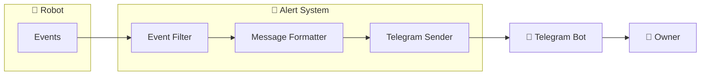
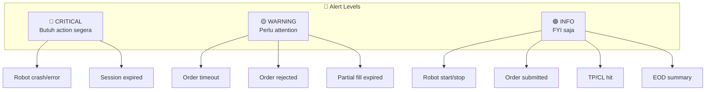
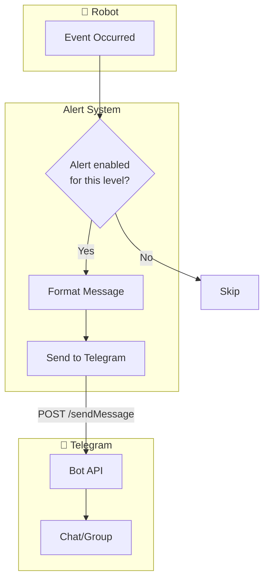
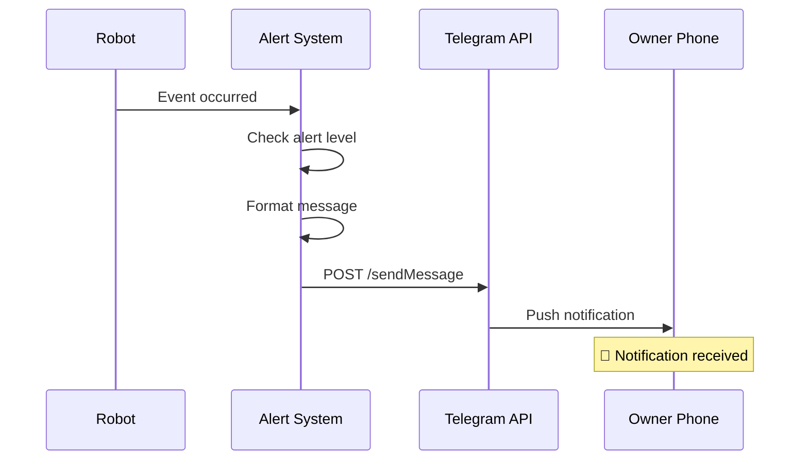

---
tags:
  - trading
  - alerting
  - telegram
created: '2026-01-20'
---
# Alerting Mechanism

## 1. Overview



| Aspect | Decision |
|--------|----------|
| Channel | Telegram Bot |
| Urgency Levels | 🔴 Critical, 🟡 Warning, 🟢 Info |
| Critical Events | Error, Session Expired (need login) |

---

## 2. Alert Levels



---

## 3. Alert Events Matrix

| Event | Level | Alert? | Message |
|-------|-------|--------|---------|
| Robot start | 🟢 Info | ✅ | Robot started |
| Robot stop | 🟢 Info | ✅ | Robot stopped |
| Robot crash/error | 🔴 Critical | ✅ | ⚠️ Robot error! |
| Session expired | 🔴 Critical | ✅ | ⚠️ Need login! |
| Order submitted | 🟢 Info | ✅ | Order submitted |
| Order timeout | 🟡 Warning | ✅ | Order timeout, retrying |
| Order rejected | 🟡 Warning | ✅ | Order rejected |
| Max retry reached | - | ❌ | (tidak di-alert) |
| TP hit | 🟢 Info | ✅ | 🎯 Take Profit! |
| CL hit | 🟢 Info | ✅ | 📉 Cut Loss |
| Partial expired | 🟡 Warning | ✅ | Order partial expired |
| EOD summary | 🟢 Info | ✅ | Daily summary |

---

## 4. Message Templates

### 🔴 Critical: Robot Error

```
🔴 CRITICAL - ROBOT ERROR

⚠️ Robot mengalami error dan berhenti!

Error: {error_message}
Time: {timestamp}

Action required: Check dan restart robot
```

### 🔴 Critical: Session Expired

```
🔴 CRITICAL - LOGIN REQUIRED

⚠️ Session expired untuk:

Account: {account_id}
Broker: {broker}
Time: {timestamp}

Action required: Manual login segera
```

### 🟡 Warning: Order Timeout

```
🟡 WARNING - ORDER TIMEOUT

Account: {account_id}
Emiten: {emiten}
Status: Timeout, retrying ({retry}/3)
Time: {timestamp}
```

### 🟡 Warning: Order Rejected

```
🟡 WARNING - ORDER REJECTED

Account: {account_id}
Emiten: {emiten}
Reason: {reject_reason}
Time: {timestamp}
```

### 🟢 Info: Robot Start

```
🟢 ROBOT STARTED

Time: {timestamp}
Accounts: {account_count} loaded
Status: Ready for trading
```

### 🟢 Info: Robot Stop

```
🟢 ROBOT STOPPED

Time: {timestamp}
Uptime: {uptime}
Status: Clean shutdown
```

### 🟢 Info: Order Submitted

```
🟢 ORDER SUBMITTED

Account: {account_id}
Emiten: {emiten}
Buy: {price} x {lot} lot
TP: {tp_price}
CL: {cl_price}
Time: {timestamp}
```

### 🟢 Info: Take Profit Hit

```
🎯 TAKE PROFIT HIT!

Account: {account_id}
Emiten: {emiten}
Buy: {buy_price}
Sell: {sell_price}
Lot: {lot}
Profit: +Rp {profit}
Time: {timestamp}
```

### 🟢 Info: Cut Loss Hit

```
📉 CUT LOSS HIT

Account: {account_id}
Emiten: {emiten}
Buy: {buy_price}
Sell: {sell_price}
Lot: {lot}
Loss: -Rp {loss}
Time: {timestamp}
```

### 🟢 Info: EOD Summary

```
📊 DAILY SUMMARY - {date}

✅ Total Tasks: {total}
🎯 TP Hit: {tp_count} (+Rp {total_profit})
📉 CL Hit: {cl_count} (-Rp {total_loss})
⏰ Expired: {expired_count}
❌ Failed: {failed_count}

Net P/L: {net_pnl}
```

---

## 5. Telegram Bot Setup

### Config

```json
{
  "telegram": {
    "bot_token": "YOUR_BOT_TOKEN",
    "chat_id": "YOUR_CHAT_ID",
    "enabled": true,
    "alert_levels": {
      "critical": true,
      "warning": true,
      "info": true
    }
  }
}
```

### Architecture



---

## 6. Alert Flow



---

## 7. Go Implementation

```go
type AlertLevel string

const (
    AlertCritical AlertLevel = "critical"
    AlertWarning  AlertLevel = "warning"
    AlertInfo     AlertLevel = "info"
)

type TelegramAlerter struct {
    botToken string
    chatID   string
    enabled  map[AlertLevel]bool
    client   *http.Client
}

func (t *TelegramAlerter) Send(level AlertLevel, message string) error {
    if !t.enabled[level] {
        return nil
    }
    
    url := fmt.Sprintf("https://api.telegram.org/bot%s/sendMessage", t.botToken)
    
    payload := map[string]interface{}{
        "chat_id":    t.chatID,
        "text":       message,
        "parse_mode": "HTML",
    }
    
    body, _ := json.Marshal(payload)
    resp, err := t.client.Post(url, "application/json", bytes.NewBuffer(body))
    if err != nil {
        return err
    }
    defer resp.Body.Close()
    
    return nil
}

// Convenience methods
func (t *TelegramAlerter) Critical(message string) error {
    return t.Send(AlertCritical, "🔴 CRITICAL\n\n" + message)
}

func (t *TelegramAlerter) Warning(message string) error {
    return t.Send(AlertWarning, "🟡 WARNING\n\n" + message)
}

func (t *TelegramAlerter) Info(message string) error {
    return t.Send(AlertInfo, "🟢 INFO\n\n" + message)
}
```

---

## 8. Alert Examples (Real Messages)

### Robot Start
```
🟢 ROBOT STARTED

Time: 2026-01-20 08:45:00
Accounts: 3 loaded
Status: Ready for trading
```

### Session Expired
```
🔴 CRITICAL - LOGIN REQUIRED

⚠️ Session expired untuk:

Account: ACC_001
Broker: Stockbit
Time: 2026-01-20 09:30:00

Action required: Manual login segera
```

### Take Profit
```
🎯 TAKE PROFIT HIT!

Account: ACC_001
Emiten: BBCA
Buy: 2700
Sell: 3000
Lot: 100
Profit: +Rp 30,000
Time: 2026-01-20 10:15:00
```

### EOD Summary
```
📊 DAILY SUMMARY - 2026-01-20

✅ Total Tasks: 10
🎯 TP Hit: 6 (+Rp 180,000)
📉 CL Hit: 2 (-Rp 80,000)
⏰ Expired: 1
❌ Failed: 1

Net P/L: +Rp 100,000
```

---

## 9. Quiet Hours (Optional)

Jika tidak mau diganggu di luar jam trading:

```json
{
  "telegram": {
    "quiet_hours": {
      "enabled": false,
      "start": "16:30",
      "end": "08:30",
      "except_critical": true
    }
  }
}
```

📌 Critical alerts tetap dikirim meski quiet hours.

---

## ✅ Status

| Item | Status |
|------|--------|
| Channel | ✅ Final (Telegram) |
| Alert levels | ✅ Final (Critical, Warning, Info) |
| Critical events | ✅ Final (Error, Need Login) |
| Message templates | ✅ Final |
| Excluded events | ✅ Final (Max retry) |
