---
tags:
  - trading
  - market-hours
  - special-cases
created: '2026-01-20'
---
# Market Hours & Special Cases

## 1. Trading Schedule (IDX)


| Session | Time | Duration |
|---------|------|----------|
| Pre-market (Setup) | 08:45 - 09:00 | 15 min |
| Session 1 | 09:00 - 12:00 | 3 hours |
| Lunch Break | 12:00 - 13:30 | 1.5 hours |
| Session 2 | 13:30 - 16:00 | 2.5 hours |
| EOD Report | 16:00 - 16:15 | 15 min |

---

## 2. Robot Behavior by Session


| Phase | Submit Order | Monitor | Report |
|-------|--------------|---------|--------|
| **Setup** (08:45-09:00) | ❌ | ❌ | ✅ (start) |
| **Session 1** (09:00-12:00) | ✅ | ✅ | ✅ |
| **Lunch** (12:00-13:30) | ❌ | ✅ | ✅ |
| **Session 2** (13:30-16:00) | ✅ | ✅ | ✅ |
| **EOD** (16:00-16:15) | ❌ | ❌ | ✅ (summary) |

📌 **Lunch Break**: Tetap monitor (TP/CL bisa hit), tapi tidak submit order baru.

---

## 3. Session Logic


### Go Implementation

```go
type MarketSession string

const (
    SessionSetup    MarketSession = "SETUP"
    SessionTrading1 MarketSession = "SESSION_1"
    SessionLunch    MarketSession = "LUNCH"
    SessionTrading2 MarketSession = "SESSION_2"
    SessionEOD      MarketSession = "EOD"
    SessionIdle     MarketSession = "IDLE"
)

func GetCurrentSession(t time.Time) MarketSession {
    h, m := t.Hour(), t.Minute()
    mins := h*60 + m
    
    switch {
    case mins >= 525 && mins < 540:   // 08:45 - 09:00
        return SessionSetup
    case mins >= 540 && mins < 720:   // 09:00 - 12:00
        return SessionTrading1
    case mins >= 720 && mins < 810:   // 12:00 - 13:30
        return SessionLunch
    case mins >= 810 && mins < 960:   // 13:30 - 16:00
        return SessionTrading2
    case mins >= 960 && mins < 975:   // 16:00 - 16:15
        return SessionEOD
    default:
        return SessionIdle
    }
}

func (s MarketSession) CanSubmitOrder() bool {
    return s == SessionTrading1 || s == SessionTrading2
}

func (s MarketSession) CanMonitor() bool {
    return s == SessionTrading1 || s == SessionLunch || s == SessionTrading2
}
```

---

## 4. Market Holiday Handling


### Server Response (Holiday)

```json
{
  "date": "2026-01-29",
  "holiday": true,
  "reason": "Tahun Baru Imlek",
  "tasks": []
}
```

### Robot Behavior on Holiday

```mermaid
flowchart TD
    PULL["Pull Tasks from Server"] --> CHECK{"holiday: true?"}
    CHECK -->|Yes| ALERT["🟢 Send Info Alert<br/>'Market holiday: {reason}'"]
    ALERT --> IDLE["Stay IDLE all day"]
    CHECK -->|No| NORMAL["Normal trading flow"]
```



---

## 5. Special Market Conditions

### Handling Strategy: Let Broker Decide

```mermaid
flowchart LR
    subgraph ROBOT["🤖 Robot"]
        SUBMIT["Submit Order<br/>(as planned)"]
    end
    
    subgraph BROKER["🏦 Broker"]
        PROCESS["Process Order"]
        ACCEPT["✅ Accepted"]
        REJECT["❌ Rejected"]
    end
    
    subgraph REPORT["📡 Report"]
        LOG["Log result"]
        ALERT["Alert if rejected"]
    end
    
    SUBMIT --> PROCESS
    PROCESS --> ACCEPT
    PROCESS --> REJECT
    ACCEPT --> LOG
    REJECT --> LOG
    REJECT --> ALERT
```



| Condition | Robot Action | Expected Result |
|-----------|--------------|-----------------|
| **ARA** (Auto Reject Atas) | Submit as normal | Broker may reject (price too high) |
| **ARB** (Auto Reject Bawah) | Submit as normal | Broker may reject (price too low) |
| **Trading Halt** | Submit as normal | Broker will reject |
| **Suspension** | Submit as normal | Broker will reject |

📌 **Philosophy**: Robot tidak perlu logic untuk detect kondisi special. Submit sesuai plan, biar broker yang decide. Robot hanya report hasilnya.

---

## 6. Pre-Market / Pre-Order

### Current Status: Not Implemented


📌 Untuk MVP, robot submit order setelah market buka (09:00). Pre-order bisa jadi enhancement di masa depan.

---

## 7. Config

```json
{
  "market_hours": {
    "timezone": "Asia/Jakarta",
    "sessions": {
      "setup": { "start": "08:45", "end": "09:00" },
      "session_1": { "start": "09:00", "end": "12:00" },
      "lunch": { "start": "12:00", "end": "13:30" },
      "session_2": { "start": "13:30", "end": "16:00" },
      "eod": { "start": "16:00", "end": "16:15" }
    }
  }
}
```

---

## 8. Summary

```mermaid
flowchart TB
    subgraph DECISIONS["✅ Key Decisions"]
        D1["Lunch: Monitor only, no submit"]
        D2["Holiday: Server informs via task API"]
        D3["ARA/ARB/Halt: Let broker decide"]
        D4["Pre-order: Not in MVP"]
    end
```



| Aspect | Decision |
|--------|----------|
| Lunch break | Monitor only, no submit |
| Holiday | Server tells robot via task response |
| ARA/ARB | Submit as normal, let broker reject |
| Trading Halt | Submit as normal, let broker reject |
| Pre-order | Not implemented (future feature) |

---

## ✅ Status

| Item | Status |
|------|--------|
| Trading sessions | ✅ Final |
| Lunch behavior | ✅ Final (monitor only) |
| Holiday handling | ✅ Final (server informs) |
| Special conditions | ✅ Final (let broker decide) |
| Pre-order | ⏸️ Future feature |
