---
tags:
  - trading
  - ui-automation
  - selectors
created: '2026-01-20'
---
# UI Element Detection Strategy

## 1. Overview

```mermaid
flowchart LR
    subgraph ROBOT["🤖 Robot"]
        ACTION["Action needed"]
    end
    
    subgraph DETECTION["🔍 Detection"]
        CSS["CSS Selector<br/>(Primary)"]
        XPATH["XPath<br/>(Fallback)"]
    end
    
    subgraph BROWSER["🌐 Browser"]
        ELEMENT["DOM Element"]
    end
    
    ACTION --> CSS
    CSS -->|"Found"| ELEMENT
    CSS -->|"Not found"| XPATH
    XPATH -->|"Found"| ELEMENT
    XPATH -->|"Not found"| ERROR["❌ Error"]
```



| Aspect | Decision |
|--------|----------|
| Primary | CSS Selector |
| Fallback | XPath |
| Wait timeout | 5 seconds |
| Anti-detection | Not needed |

---

## 2. Selector Strategy

```mermaid
flowchart TD
    FIND["Find Element"] --> TRY_CSS{"Try CSS Selector"}
    TRY_CSS -->|"Found"| SUCCESS["✅ Element Found"]
    TRY_CSS -->|"Not found<br/>(timeout 2.5s)"| TRY_XPATH{"Try XPath"}
    TRY_XPATH -->|"Found"| SUCCESS
    TRY_XPATH -->|"Not found<br/>(timeout 2.5s)"| FAIL["❌ Element Not Found"]
    
    FAIL --> LOG["Log error"]
    FAIL --> RETRY["Retry or fail task"]
```



### Timeout Split

| Phase | Duration |
|-------|----------|
| CSS Selector attempt | 2.5 seconds |
| XPath fallback attempt | 2.5 seconds |
| **Total** | **5 seconds** |

---

## 3. Selector Config Structure

### Per-Broker Selector File

```
selectors/
├── stockbit.json
├── ipot.json
└── ajaib.json
```

### Selector Schema

```json
{
  "broker": "stockbit",
  "version": "1.0.0",
  "last_updated": "2026-01-20",
  "selectors": {
    "login": {
      "session_check": {
        "css": "#user-profile-menu",
        "xpath": "//div[@id='user-profile-menu']"
      }
    },
    "order_form": {
      "emiten_input": {
        "css": "input[name='stock-search']",
        "xpath": "//input[@name='stock-search']"
      },
      "price_input": {
        "css": "input[name='price']",
        "xpath": "//input[@placeholder='Harga']"
      },
      "lot_input": {
        "css": "input[name='lot']",
        "xpath": "//input[@placeholder='Lot']"
      },
      "tp_input": {
        "css": "input[name='take-profit']",
        "xpath": "//input[@data-testid='tp-input']"
      },
      "cl_input": {
        "css": "input[name='cut-loss']",
        "xpath": "//input[@data-testid='cl-input']"
      },
      "submit_button": {
        "css": "button[type='submit'].order-btn",
        "xpath": "//button[contains(text(), 'Beli')]"
      }
    },
    "feedback": {
      "toast_success": {
        "css": ".toast-success, .notification-success",
        "xpath": "//div[contains(@class, 'toast') and contains(@class, 'success')]"
      },
      "toast_error": {
        "css": ".toast-error, .notification-error",
        "xpath": "//div[contains(@class, 'toast') and contains(@class, 'error')]"
      }
    },
    "open_orders": {
      "table": {
        "css": "#open-orders-table, .open-orders",
        "xpath": "//table[@id='open-orders-table']"
      },
      "row": {
        "css": ".order-row, tr.order-item",
        "xpath": "//tr[contains(@class, 'order')]"
      },
      "cancel_button": {
        "css": ".cancel-btn, button.cancel",
        "xpath": "//button[contains(text(), 'Cancel')]"
      }
    },
    "order_history": {
      "table": {
        "css": "#order-history-table, .order-history",
        "xpath": "//table[@id='order-history-table']"
      },
      "row": {
        "css": ".history-row, tr.history-item",
        "xpath": "//tr[contains(@class, 'history')]"
      }
    },
    "portfolio": {
      "table": {
        "css": "#portfolio-table, .portfolio-list",
        "xpath": "//table[@id='portfolio-table']"
      },
      "stock_row": {
        "css": ".stock-row, tr.stock-item",
        "xpath": "//tr[contains(@class, 'stock')]"
      }
    }
  }
}
```

---

## 4. Element Finder Implementation

```go
type Selector struct {
    CSS   string `json:"css"`
    XPath string `json:"xpath"`
}

type ElementFinder struct {
    page    *playwright.Page
    timeout time.Duration
}

func NewElementFinder(page *playwright.Page) *ElementFinder {
    return &ElementFinder{
        page:    page,
        timeout: 5 * time.Second,
    }
}

func (f *ElementFinder) Find(sel Selector) (playwright.ElementHandle, error) {
    // Try CSS first (2.5s)
    cssTimeout := f.timeout / 2
    
    element, err := f.page.WaitForSelector(sel.CSS, playwright.PageWaitForSelectorOptions{
        Timeout: playwright.Float(float64(cssTimeout.Milliseconds())),
    })
    
    if err == nil && element != nil {
        return element, nil
    }
    
    // Fallback to XPath (2.5s)
    xpathTimeout := f.timeout / 2
    
    element, err = f.page.WaitForSelector(sel.XPath, playwright.PageWaitForSelectorOptions{
        Timeout: playwright.Float(float64(xpathTimeout.Milliseconds())),
    })
    
    if err == nil && element != nil {
        return element, nil
    }
    
    return nil, fmt.Errorf("element not found: css=%s, xpath=%s", sel.CSS, sel.XPath)
}

func (f *ElementFinder) Click(sel Selector) error {
    element, err := f.Find(sel)
    if err != nil {
        return err
    }
    return element.Click()
}

func (f *ElementFinder) Fill(sel Selector, value string) error {
    element, err := f.Find(sel)
    if err != nil {
        return err
    }
    return element.Fill(value)
}

func (f *ElementFinder) GetText(sel Selector) (string, error) {
    element, err := f.Find(sel)
    if err != nil {
        return "", err
    }
    return element.TextContent()
}

func (f *ElementFinder) Exists(sel Selector) bool {
    _, err := f.Find(sel)
    return err == nil
}
```

---

## 5. Common UI Actions


### Order Submission Implementation

```go
func (w *Worker) SubmitOrder(order Order) error {
    finder := NewElementFinder(w.page)
    selectors := w.broker.Selectors.OrderForm
    
    // Fill emiten
    if err := finder.Fill(selectors.EmitenInput, order.Emiten); err != nil {
        return fmt.Errorf("failed to fill emiten: %w", err)
    }
    
    // Fill price
    if err := finder.Fill(selectors.PriceInput, fmt.Sprintf("%d", order.Price)); err != nil {
        return fmt.Errorf("failed to fill price: %w", err)
    }
    
    // Fill lot
    if err := finder.Fill(selectors.LotInput, fmt.Sprintf("%d", order.Lot)); err != nil {
        return fmt.Errorf("failed to fill lot: %w", err)
    }
    
    // Fill TP
    if err := finder.Fill(selectors.TPInput, fmt.Sprintf("%d", order.TPPrice)); err != nil {
        return fmt.Errorf("failed to fill TP: %w", err)
    }
    
    // Fill CL
    if err := finder.Fill(selectors.CLInput, fmt.Sprintf("%d", order.CLPrice)); err != nil {
        return fmt.Errorf("failed to fill CL: %w", err)
    }
    
    // Click submit
    if err := finder.Click(selectors.SubmitButton); err != nil {
        return fmt.Errorf("failed to click submit: %w", err)
    }
    
    // Wait for toast
    feedbackSel := w.broker.Selectors.Feedback
    
    // Check for success or error toast
    successChan := make(chan bool)
    errorChan := make(chan bool)
    
    go func() {
        if finder.Exists(feedbackSel.ToastSuccess) {
            successChan <- true
        }
    }()
    
    go func() {
        if finder.Exists(feedbackSel.ToastError) {
            errorChan <- true
        }
    }()
    
    select {
    case <-successChan:
        return nil
    case <-errorChan:
        return fmt.Errorf("order rejected by broker")
    case <-time.After(5 * time.Second):
        return fmt.Errorf("timeout waiting for order confirmation")
    }
}
```

---

## 6. Detection Scenarios

### 6.1 Session Check

```mermaid
flowchart TD
    CHECK["Check Session"] --> FIND{"Find user profile<br/>element?"}
    FIND -->|"Found"| VALID["✅ Session Valid"]
    FIND -->|"Not found"| INVALID["❌ Session Expired"]
    INVALID --> ALERT["🔴 Alert: Need Login"]
```



### 6.2 Order Status Detection


### 6.3 TP/CL Detection

```mermaid
flowchart TD
    POLL["Poll Order History"] --> FIND_SELL{"Find SELL order<br/>for monitored emiten?"}
    FIND_SELL -->|"No"| CONTINUE["Continue monitoring"]
    FIND_SELL -->|"Yes"| GET_PRICE["Get sell price"]
    
    GET_PRICE --> CHECK_TP{"price == tp_price?"}
    CHECK_TP -->|"Yes"| TP["✅ TP_HIT"]
    CHECK_TP -->|"No"| CHECK_CL{"price == cl_price?"}
    CHECK_CL -->|"Yes"| CL["✅ CL_HIT"]
    CHECK_CL -->|"No"| WARN["⚠️ Unknown sell"]
```



---

## 7. Error Handling

### Element Not Found

```go
func (w *Worker) handleElementNotFound(err error, action string) {
    w.logger.Error("WORKER", fmt.Sprintf("Element not found during %s", action), map[string]interface{}{
        "error":   err.Error(),
        "account": w.accountID,
        "broker":  w.broker.Name,
    })
    
    // Take screenshot for debugging
    w.takeScreenshot(fmt.Sprintf("error_%s_%d", action, time.Now().Unix()))
    
    // Possible recovery actions
    // 1. Refresh page and retry
    // 2. Mark task as failed
    // 3. Alert owner
}
```

### Screenshot on Error

```go
func (w *Worker) takeScreenshot(name string) {
    path := fmt.Sprintf("logs/screenshots/%s_%s.png", w.accountID, name)
    w.page.Screenshot(playwright.PageScreenshotOptions{
        Path: playwright.String(path),
    })
    w.logger.Debug("WORKER", "Screenshot saved", map[string]interface{}{
        "path": path,
    })
}
```

---

## 8. Selector Maintenance

### When to Update Selectors


### Versioning

```json
{
  "broker": "stockbit",
  "version": "1.0.1",
  "last_updated": "2026-01-25",
  "changelog": [
    {
      "version": "1.0.1",
      "date": "2026-01-25",
      "changes": ["Updated submit button selector"]
    },
    {
      "version": "1.0.0",
      "date": "2026-01-20",
      "changes": ["Initial selectors"]
    }
  ]
}
```

---

## 9. Summary

| Aspect | Decision |
|--------|----------|
| Primary selector | CSS Selector |
| Fallback selector | XPath |
| Wait timeout | 5 seconds (2.5s per method) |
| Anti-detection | Not needed |
| Error handling | Screenshot + log + alert |
| Maintenance | Version-controlled selector configs |

---

## ✅ Status

| Item | Status |
|------|--------|
| Selector strategy | ✅ Final (CSS + XPath fallback) |
| Timeout | ✅ Final (5 seconds) |
| Anti-detection | ✅ Final (not needed) |
| Implementation | ✅ Final |
| Error handling | ✅ Final |
