---
tags:
  - trading
  - session
  - authentication
created: '2026-01-20'
---
# Session Management

## 1. Overview

```mermaid
flowchart TB
    subgraph SESSION["🔐 Session Management"]
        PROFILE[("Chromium Profile<br/>(Cookies persist)")]
        CHECK["Session Checker"]
    end
    
    subgraph TRIGGERS["⏰ Check Triggers"]
        T1["Startup (08:45)"]
        T2["Before Submit Order"]
    end
    
    T1 --> CHECK
    T2 --> CHECK
    CHECK --> PROFILE
```



| Aspect | Decision |
|--------|----------|
| Storage | Chromium profile only (no extra storage) |
| Check frequency | Startup + before submit order |
| Expired handling | Task expired for the day |

---

## 2. Session Check Triggers

```mermaid
flowchart LR
    subgraph WHEN["When to Check"]
        A["🌅 Startup<br/>(08:45)"]
        B["📝 Before Submit<br/>(every order)"]
    end
```



| Trigger | Purpose |
|---------|---------|
| **Startup** | Ensure all accounts ready before market opens |
| **Before Submit** | Prevent submitting order with expired session |

---

## 3. Startup Session Check Flow

```mermaid
flowchart TD
    START["🤖 Robot Start (08:45)"] --> LOAD["Load accounts config"]
    LOAD --> LOOP["For each account"]
    
    LOOP --> LAUNCH["Launch Chromium profile"]
    LAUNCH --> NAV["Navigate to broker"]
    NAV --> CHECK{"Session valid?"}
    
    CHECK -->|"✅ Yes"| READY["Mark: READY"]
    CHECK -->|"❌ No"| ALERT["🔴 Alert: Need Login"]
    
    ALERT --> WAIT["Wait for manual login"]
    WAIT --> RECHECK{"Re-check session"}
    RECHECK -->|"✅ Valid"| READY
    RECHECK -->|"❌ Still invalid"| TIMEOUT{"Timeout?<br/>(09:00)"}
    TIMEOUT -->|"Yes"| SKIP["Skip account for today"]
    TIMEOUT -->|"No"| WAIT
    
    READY --> NEXT["Next account"]
    SKIP --> NEXT
    NEXT --> DONE{"All accounts<br/>checked?"}
    DONE -->|"No"| LOOP
    DONE -->|"Yes"| COMPLETE["✅ Startup complete"]
```



---

## 4. Pre-Submit Session Check Flow

```mermaid
flowchart TD
    SUBMIT["Submit Order Request"] --> CHECK{"Quick session<br/>check"}
    
    CHECK -->|"✅ Valid"| PROCEED["Proceed with order"]
    CHECK -->|"❌ Expired"| STOP["Stop order"]
    
    STOP --> MARK["Mark task: EXPIRED"]
    STOP --> ALERT["🔴 Alert: Session Expired"]
    STOP --> LOG["Log: Task skipped"]
```



---

## 5. Session Expired Handling

```mermaid
flowchart TD
    EXPIRED["Session Expired Detected"] --> ACTION["Actions"]
    
    ACTION --> A1["1️⃣ Stop all tasks for this account"]
    ACTION --> A2["2️⃣ Mark pending tasks: EXPIRED"]
    ACTION --> A3["3️⃣ Send Critical Alert"]
    ACTION --> A4["4️⃣ Log event"]
    
    A1 --> WAIT["Account waits for manual login"]
    A2 --> EOD["Include in EOD report"]
```



### Task State When Session Expires

| Task State | New State | Notes |
|------------|-----------|-------|
| PENDING | EXPIRED | Tidak akan diproses hari ini |
| SUBMITTED | Keep monitoring | Order sudah di broker |
| ACTIVE | Keep monitoring | TP/CL sudah aktif di broker |

📌 **Key Point**: Task yang belum di-submit akan EXPIRED. Task yang sudah di-submit tetap di-monitor (karena order sudah masuk ke broker).

---

## 6. Session Validity Check Implementation

```go
type SessionChecker struct {
    finder *ElementFinder
    broker *BrokerConfig
}

func (s *SessionChecker) IsValid() bool {
    // Try to find user profile element
    // If found = session valid
    // If not found = session expired
    
    selector := s.broker.Selectors.Login.SessionCheck
    return s.finder.Exists(selector)
}

func (w *Worker) CheckSessionBeforeSubmit() error {
    if !w.sessionChecker.IsValid() {
        // Mark remaining tasks as expired
        w.expireRemainingTasks()
        
        // Send alert
        w.alerter.Critical(fmt.Sprintf(
            "Session expired untuk %s (%s). Manual login required.",
            w.accountID, w.broker.Name,
        ))
        
        return fmt.Errorf("session expired")
    }
    return nil
}
```

---

## 7. Startup Sequence

```mermaid
sequenceDiagram
    participant R as Robot
    participant W as Worker
    participant B as Browser
    participant O as Owner
    
    Note over R: 08:45 - Startup
    
    R->>W: Initialize workers
    
    loop For each account
        W->>B: Launch Chromium profile
        W->>B: Navigate to broker
        W->>B: Check session element
        
        alt Session Valid
            W->>R: Status: READY
        else Session Expired
            W->>O: 🔴 Alert: Need login
            O->>B: Manual login
            W->>B: Re-check session
            W->>R: Status: READY
        end
    end
    
    Note over R: 09:00 - Start trading
```



---

## 8. Account States


| State | Description |
|-------|-------------|
| `INIT` | Worker initializing |
| `CHECKING` | Checking session validity |
| `READY` | Session valid, ready to trade |
| `NEED_LOGIN` | Session expired, waiting manual login |
| `DISABLED` | Skipped for today (login timeout) |
| `TRADING` | Actively trading |
| `EOD` | End of day reporting |

---

## 9. Config

```json
{
  "session": {
    "check_on_startup": true,
    "check_before_submit": true,
    "startup_timeout_minutes": 15,
    "login_wait_interval_seconds": 30
  }
}
```

| Config | Value | Description |
|--------|-------|-------------|
| `check_on_startup` | true | Check session saat robot start |
| `check_before_submit` | true | Check session sebelum submit order |
| `startup_timeout_minutes` | 15 | Max wait untuk login (08:45-09:00) |
| `login_wait_interval_seconds` | 30 | Interval re-check saat waiting login |

---

## 10. Alert Messages

### Session Expired (Startup)

```
🔴 CRITICAL - LOGIN REQUIRED

Account: ACC_001
Broker: Stockbit
Time: 2026-01-20 08:47:00

⚠️ Session expired. Please login manually.

Deadline: 09:00 (13 minutes remaining)
```

### Session Expired (Mid-Trading)

```
🔴 CRITICAL - SESSION EXPIRED

Account: ACC_001
Broker: Stockbit
Time: 2026-01-20 10:30:00

⚠️ Session expired during trading!

Action taken:
- Pending tasks marked as EXPIRED
- Active orders still monitored
- Manual login required for new orders
```

### Login Timeout

```
🟡 WARNING - ACCOUNT SKIPPED

Account: ACC_001
Broker: Stockbit

⚠️ Login timeout reached (09:00).
Account disabled for today.

Pending tasks: 3 (marked EXPIRED)
```

---

## 11. Summary Flow

```mermaid
flowchart TB
    subgraph STARTUP["🌅 Startup (08:45)"]
        S1["Check all accounts"]
        S2["Alert if expired"]
        S3["Wait for login"]
        S4["Timeout at 09:00"]
    end
    
    subgraph TRADING["📈 Trading (09:00-16:00)"]
        T1["Before each submit"]
        T2["Quick session check"]
        T3["If expired → task EXPIRED"]
    end
    
    subgraph RESULT["📊 Result"]
        R1["Valid → proceed"]
        R2["Expired → alert + skip"]
    end
    
    STARTUP --> TRADING
    TRADING --> RESULT
```



---

## ✅ Status

| Item | Status |
|------|--------|
| Storage | ✅ Final (Chromium profile only) |
| Check triggers | ✅ Final (startup + before submit) |
| Expired handling | ✅ Final (task expired for day) |
| Implementation | ✅ Final |
