---
tags:
  - trading
  - risks
  - improvements
created: '2026-01-20'
---
# Known Risks & Future Improvements

## 📊 Risk Summary

| # | Risk | Severity | Status | Notes |
|---|------|----------|--------|-------|
| 1 | ~~Network failure mid-submit~~ | 🔴 High | ✅ Mitigated | Check Open Orders before retry |
| 2 | ~~Multiple tasks same emiten~~ | 🔴 High | ✅ Mitigated | Server enforces uniqueness |
| 3 | State file corruption | 🟡 Medium | ⏸️ Backlog | Atomic write + backup |
| 4 | Time synchronization | 🟡 Medium | ⏸️ Backlog | NTP sync at startup |
| 5 | PC single point of failure | 🟡 Medium | ⏸️ Backlog | Server-side heartbeat monitor |
| 6 | Broker UI changes | 🟢 Low | ✅ Mitigated | CSS + XPath fallback |

---

## ✅ Mitigated Risks

### 1. Network Failure Mid-Submit
**Problem:** Order might be submitted but robot doesn't know due to network failure.

**Solution:** Before retry, ALWAYS check Open Orders first.
- See: [[05-Timeout-Retry#5. Network Failure Safety (CRITICAL)]]

### 2. Multiple Tasks Same Emiten
**Problem:** TP/CL detection ambiguity if multiple tasks for same stock.

**Solution:** Server guarantees no duplicate emiten per account per day.
- See: [[03-Task-Format#Task Constraints]]

### 6. Broker UI Changes
**Problem:** Broker dapat update UI kapan saja → selector invalid.

**Solution:** 
- CSS Selector + XPath fallback
- Screenshot on error
- Alert to owner
- See: [[12-UI-Detection]]

---

## ⏸️ Backlog (Future Improvements)

### 3. State File Corruption

**Risk:** Power failure saat writing state → file corrupt → double order potential.

**Mitigation Options:**
```go
// Option A: Atomic write
func (s *StateStore) Save(state *State) error {
    tempFile := s.path + ".tmp"
    
    // Write to temp file
    if err := writeJSON(tempFile, state); err != nil {
        return err
    }
    
    // Atomic rename
    return os.Rename(tempFile, s.path)
}

// Option B: Backup before write
func (s *StateStore) Save(state *State) error {
    // Backup current
    os.Rename(s.path, s.path + ".bak")
    
    // Write new
    return writeJSON(s.path, state)
}
```

**Priority:** Nice to have for MVP, implement sebelum scale up.

---

### 4. Time Synchronization

**Risk:** PC clock drift → order timing salah.

**Mitigation:**
```go
func (r *Robot) checkTimeSync() error {
    ntpTime, err := ntp.Time("pool.ntp.org")
    if err != nil {
        return err
    }
    
    diff := time.Since(ntpTime).Abs()
    if diff > 1*time.Minute {
        r.alerter.Warning(fmt.Sprintf(
            "PC time drift detected: %v. Please sync your clock.",
            diff,
        ))
    }
    return nil
}
```

**Priority:** Nice to have.

---

### 5. PC Single Point of Failure

**Risk:** PC mati/crash → semua trading stop.

**Current Mitigation:**
- Orders yang sudah ACTIVE tetap jalan di broker (TP/CL)
- Crash recovery saat restart

**Future Enhancement:**

```mermaid
flowchart LR
    ROBOT["🤖 Robot"] -->|"Heartbeat"| SERVER["📡 Server"]
    SERVER -->|"Miss detected"| ALERT["🚨 Telegram Alert"]
```


Server-side heartbeat monitoring:
- Robot kirim heartbeat ke server
- Server detect jika heartbeat miss > 2 menit
- Server kirim alert ke Telegram

**Priority:** Nice to have for single account, MUST have saat scale up.

---

## 🧪 Testing Strategy

### Approach Options

| Option | Pros | Cons |
|--------|------|------|
| A) Paper trading | No risk | Not all brokers support |
| B) Lot terkecil (1 lot) | Real environment | Ada cost |
| C) Mock browser | Fast, repeatable | Not real world |

### Recommended Approach

```mermaid
flowchart LR
    A["1️⃣ Unit Test<br/>(Mock)"] --> B["2️⃣ Integration Test<br/>(Mock Browser)"]
    B --> C["3️⃣ Sandbox Test<br/>(1 lot, 1 account)"]
    C --> D["4️⃣ Production<br/>(Scale up gradually)"]
```



**Phase 1: Unit Test**
- Test state machine logic
- Test timeout calculation
- Test TP/CL detection logic

**Phase 2: Integration Test**
- Mock browser responses
- Test full flow end-to-end
- Test error scenarios

**Phase 3: Sandbox Test**
- 1 account, 1 broker
- 1 lot orders (minimal risk)
- Run for 1-2 weeks

**Phase 4: Production**
- Add accounts gradually
- Monitor closely
- Scale when stable

---

## 📅 Priority Matrix


---

## ✅ Conclusion

**For MVP:**
- All critical risks mitigated ✅
- Backlog items are nice-to-have
- Focus on core functionality first

**Before Scale Up:**
- Implement atomic state write
- Add server-side heartbeat monitoring
- Complete testing phases
