---
tags:
  - trading
  - team
  - agents
  - organization
created: '2026-01-21'
---
# Agent Team Structure

## 1. Overview

```mermaid
flowchart TB
    subgraph TEAM["🤖 AI Agent Team"]
        PM["🎯 PM Agent<br/>(Orchestrator)"]
        
        BE["🔧 Senior BE Agent"]
        FE["🎨 Senior FE Agent"]
        QA["🧪 QA Agent"]
        
        PM --> BE
        PM --> FE
        PM --> QA
        
        BE <-.->|"API Contract"| FE
        BE <-.->|"Test Specs"| QA
        FE <-.->|"E2E Tests"| QA
    end
```



---

## 2. Agent Roles & Responsibilities

### 2.1 PM Agent (Orchestrator)


| Aspect | Detail |
|--------|--------|
| **Primary Goal** | Ensure project delivery on time & quality |
| **Input** | Project requirements, Obsidian docs |
| **Output** | Task breakdown, sprint plans, decisions |
| **Tools** | Project management, documentation |

**Key Responsibilities:**
1. Break down epics into actionable stories
2. Prioritize backlog based on dependencies
3. Coordinate handoffs between agents
4. Make architecture decisions when needed
5. Track progress and report status
6. Manage risks and blockers

---

### 2.2 Senior BE Agent


| Aspect | Detail |
|--------|--------|
| **Primary Goal** | Build robust backend systems |
| **Language** | Go |
| **Frameworks** | Fiber/Chi, Playwright-go, GORM |
| **Output** | Working backend code, API endpoints |

**Key Responsibilities:**
1. Implement Robot Engine with Playwright
2. Build Owner Server with REST API
3. Design and implement database schema
4. Create WebSocket for real-time updates
5. Write unit tests for all components
6. Document API contracts

**Ownership:**

| Component | Status |
|-----------|--------|
| Robot Engine | ✅ Owner |
| Broker Adapters | ✅ Owner |
| Owner Server | ✅ Owner |
| REST API | ✅ Owner |
| WebSocket Server | ✅ Owner |
| Database Layer | ✅ Owner |
| Unit Tests (BE) | ✅ Owner |

---

### 2.3 Senior FE Agent


| Aspect | Detail |
|--------|--------|
| **Primary Goal** | Build intuitive monitoring dashboard |
| **Framework** | Next.js + React |
| **Styling** | Tailwind CSS |
| **Charts** | Recharts / Tremor |

**Key Responsibilities:**
1. Implement dashboard UI/UX
2. Integrate with backend API
3. Build real-time data visualization
4. Handle WebSocket connections
5. Write component tests
6. Ensure responsive design

**Ownership:**

| Component | Status |
|-----------|--------|
| Dashboard UI | ✅ Owner |
| Charts & Viz | ✅ Owner |
| WebSocket Client | ✅ Owner |
| State Management | ✅ Owner |
| Component Tests | ✅ Owner |
| Responsive Design | ✅ Owner |

---

### 2.4 QA Agent


| Aspect | Detail |
|--------|--------|
| **Primary Goal** | Ensure quality through automated testing |
| **Tools** | Go test, Jest, Playwright Test, k6 |
| **Output** | Test suites, coverage reports, bug reports |

**Key Responsibilities:**
1. Define test strategy and coverage goals
2. Review unit tests from BE/FE agents
3. Write integration tests
4. Implement E2E test automation
5. Set up CI/CD test pipelines
6. Performance and load testing

**Ownership:**

| Component | Status |
|-----------|--------|
| Test Strategy | ✅ Owner |
| Integration Tests | ✅ Owner |
| E2E Tests | ✅ Owner |
| CI/CD Tests | ✅ Owner |
| Load Testing | ✅ Owner |
| Test Reporting | ✅ Owner |

---

## 3. Responsibility Matrix (RACI)

```
R = Responsible (does the work)
A = Accountable (final decision)
C = Consulted (provides input)
I = Informed (kept updated)
```

| Deliverable | PM | BE | FE | QA |
|-------------|:--:|:--:|:--:|:--:|
| **Project Planning** | A,R | C | C | C |
| **Architecture Design** | A | R | C | I |
| **Robot Engine** | I | A,R | - | C |
| **Owner Server** | I | A,R | C | C |
| **API Design** | C | A,R | C | C |
| **Database Schema** | I | A,R | - | C |
| **Dashboard UI** | I | C | A,R | C |
| **WebSocket (Server)** | I | A,R | C | C |
| **WebSocket (Client)** | I | C | A,R | C |
| **Unit Tests** | I | R | R | A,C |
| **Integration Tests** | I | C | C | A,R |
| **E2E Tests** | I | C | C | A,R |
| **Documentation** | A,R | R | R | R |
| **Code Review** | C | R | R | R |
| **Release** | A | R | R | R |

---

## 4. Communication Flow


---

## 5. Sprint Workflow

```mermaid
flowchart LR
    subgraph SPRINT["🔄 Sprint Cycle"]
        PLAN["📋 Planning<br/>(PM leads)"]
        DEV["💻 Development<br/>(BE + FE)"]
        TEST["🧪 Testing<br/>(QA)"]
        REVIEW["🔍 Review<br/>(All)"]
        DEPLOY["🚀 Deploy<br/>(PM + BE)"]
    end
    
    PLAN --> DEV --> TEST --> REVIEW --> DEPLOY
    DEPLOY -.->|"Next Sprint"| PLAN
```



### Sprint Ceremonies

| Ceremony | Frequency | Participants | Owner |
|----------|-----------|--------------|-------|
| Sprint Planning | Start of sprint | All | PM |
| Daily Standup | Daily | All | PM |
| Code Review | Ongoing | All | Rotating |
| Sprint Review | End of sprint | All | PM |
| Retrospective | End of sprint | All | PM |

---

## 6. Handoff Protocols

### 6.1 BE → FE Handoff (API Ready)


**Checklist:**
- [ ] API endpoint documented
- [ ] Request/response examples provided
- [ ] Error codes documented
- [ ] Postman/Insomnia collection updated
- [ ] FE agent notified

### 6.2 BE/FE → QA Handoff (Ready for Testing)


**Checklist:**
- [ ] Feature implemented
- [ ] Unit tests written and passing
- [ ] Deployed to staging environment
- [ ] Test data prepared
- [ ] QA agent notified with context

---

## 7. Decision Making

### Architecture Decisions


### Decision Authority

| Decision Type | Authority |
|---------------|-----------|
| Architecture | PM (with BE input) |
| API Design | BE Agent |
| UI/UX Design | FE Agent |
| Test Strategy | QA Agent |
| Timeline | PM Agent |
| Tech Stack | PM + relevant agent |

---

## 8. Tools & Artifacts

| Agent | Primary Tools | Artifacts |
|-------|---------------|-----------|
| PM | Obsidian, Task tracker | Requirements, Plans, Decisions |
| BE | Go, VSCode, Postman | Code, API docs, DB schema |
| FE | Next.js, Figma, Chrome DevTools | Code, Components, Storybook |
| QA | Playwright, k6, Jest | Test suites, Reports, Bugs |

---

## 9. Success Metrics

| Agent | KPIs |
|-------|------|
| **PM** | On-time delivery, scope completion, blocker resolution time |
| **BE** | API reliability, code coverage, performance benchmarks |
| **FE** | UI responsiveness, lighthouse score, component reusability |
| **QA** | Test coverage, bug escape rate, automation percentage |

---

## ✅ Status

| Item | Status |
|------|--------|
| Team structure | ✅ Defined |
| Roles & responsibilities | ✅ Defined |
| RACI matrix | ✅ Defined |
| Communication flow | ✅ Defined |
| Handoff protocols | ✅ Defined |
