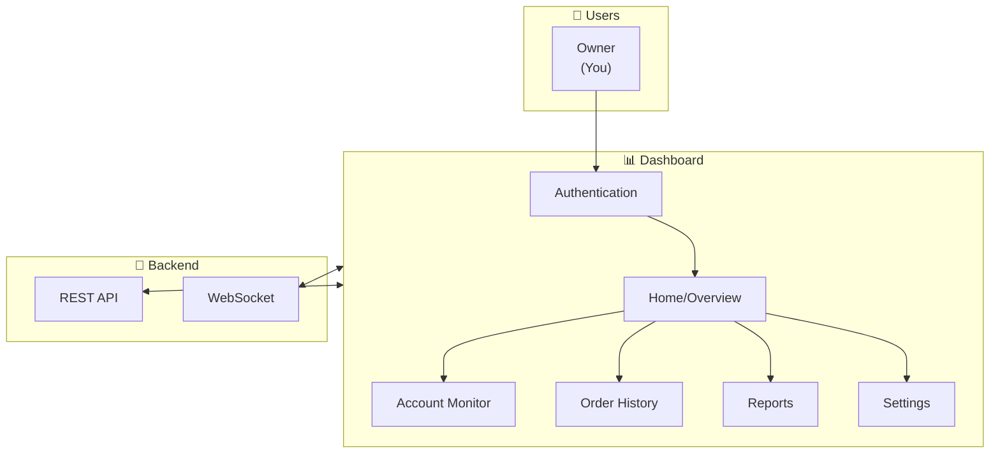
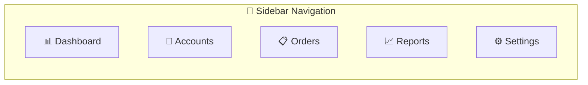
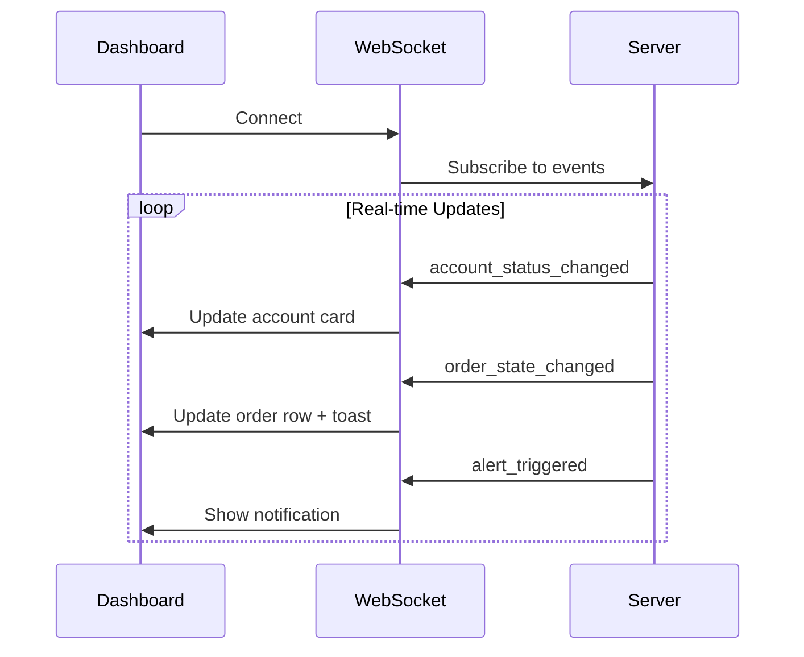

---
tags:
  - trading
  - dashboard
  - frontend
  - ui
  - requirements
created: '2026-01-21'
---
# Dashboard Requirements

## 1. Overview



---

## 2. Tech Stack

| Layer | Technology | Reason |
|-------|------------|--------|
| Framework | Next.js 14+ (App Router) | SSR, good DX, React ecosystem |
| Styling | Tailwind CSS | Utility-first, fast development |
| Components | shadcn/ui | Beautiful, accessible, customizable |
| Charts | Tremor / Recharts | Trading-style visualizations |
| State | Zustand / React Query | Lightweight, good for real-time |
| Real-time | Socket.io-client | WebSocket with fallback |
| Forms | React Hook Form + Zod | Validation, performance |
| Icons | Lucide React | Consistent, lightweight |

---

## 3. Pages & Features

### 3.1 Page Structure

```
/                       → Dashboard Home (Overview)
/accounts               → Account List & Status
/accounts/[id]          → Account Detail
/orders                 → Order History
/orders/[id]            → Order Detail
/reports                → Reports & Analytics
/reports/daily          → Daily Report
/reports/weekly         → Weekly Summary
/settings               → App Settings
/settings/accounts      → Account Management
/settings/alerts        → Alert Configuration
```

### 3.2 Navigation



---

## 4. Page Specifications

### 4.1 Dashboard Home (Overview)

```
┌─────────────────────────────────────────────────────────────────┐
│  📊 Trading Dashboard                        🔔  👤  ⚙️        │
├─────────────────────────────────────────────────────────────────┤
│                                                                 │
│  ┌──────────────┐ ┌──────────────┐ ┌──────────────┐            │
│  │ 🟢 Robot     │ │ 📋 Today's   │ │ ⏰ Market    │            │
│  │   Status     │ │    Tasks     │ │    Status    │            │
│  │   RUNNING    │ │     25       │ │   OPEN       │            │
│  │   since 08:45│ │  15 done     │ │  until 16:00 │            │
│  └──────────────┘ └──────────────┘ └──────────────┘            │
│                                                                 │
│  ┌──────────────────────────────────────────────────────┐      │
│  │              📈 Today's Performance                   │      │
│  │  ┌────────┐ ┌────────┐ ┌────────┐ ┌────────┐        │      │
│  │  │ TP Hit │ │ CL Hit │ │Pending │ │ Failed │        │      │
│  │  │   15   │ │   5    │ │   3    │ │   2    │        │      │
│  │  │  60%   │ │  20%   │ │  12%   │ │   8%   │        │      │
│  │  └────────┘ └────────┘ └────────┘ └────────┘        │      │
│  └──────────────────────────────────────────────────────┘      │
│                                                                 │
│  ┌─────────────────────────┐ ┌─────────────────────────┐       │
│  │  👥 Account Status      │ │  📋 Recent Activity     │       │
│  │                         │ │                         │       │
│  │  ACC_01 🟢 Stockbit     │ │  09:45 ACC_01 BBCA     │       │
│  │  ACC_02 🟢 IPOT         │ │        BUY → TP_HIT    │       │
│  │  ACC_03 🔴 Ajaib        │ │  09:32 ACC_02 TLKM     │       │
│  │  ACC_04 🟢 Stockbit     │ │        BUY → MONITORING│       │
│  │  ACC_05 🟡 IPOT         │ │  09:28 ACC_03 ASII     │       │
│  │         (session warn)  │ │        BUY → CL_HIT    │       │
│  └─────────────────────────┘ └─────────────────────────┘       │
│                                                                 │
└─────────────────────────────────────────────────────────────────┘
```

**Components:**
| Component | Data Source | Update |
|-----------|-------------|--------|
| Robot Status | WebSocket | Real-time |
| Today's Tasks | REST API | 30s poll |
| Market Status | Calculated | 1min |
| Performance Stats | REST API | 30s poll |
| Account Status | WebSocket | Real-time |
| Recent Activity | WebSocket | Real-time |

---

### 4.2 Accounts Page

```
┌─────────────────────────────────────────────────────────────────┐
│  👥 Accounts                                  [+ Add Account]   │
├─────────────────────────────────────────────────────────────────┤
│                                                                 │
│  Filter: [All ▼] [All Brokers ▼]  Search: [____________]       │
│                                                                 │
│  ┌─────────────────────────────────────────────────────────┐   │
│  │ Account    │ Broker   │ Status │ Today │ Session │ Act  │   │
│  ├─────────────────────────────────────────────────────────┤   │
│  │ ACC_01     │ Stockbit │ 🟢     │ 5/5   │ Valid   │ [→] │   │
│  │ ACC_02     │ IPOT     │ 🟢     │ 3/4   │ Valid   │ [→] │   │
│  │ ACC_03     │ Ajaib    │ 🔴     │ 0/3   │ Expired │ [→] │   │
│  │ ACC_04     │ Stockbit │ 🟢     │ 2/2   │ Valid   │ [→] │   │
│  │ ACC_05     │ IPOT     │ 🟡     │ 1/3   │ Warning │ [→] │   │
│  └─────────────────────────────────────────────────────────┘   │
│                                                                 │
│  Showing 5 of 10 accounts                    [< 1 2 >]         │
│                                                                 │
└─────────────────────────────────────────────────────────────────┘
```

**Account Status Legend:**
| Status | Icon | Meaning |
|--------|------|---------|
| Online | 🟢 | Running, session valid |
| Warning | 🟡 | Session expiring soon / minor issue |
| Offline | 🔴 | Session expired / error |
| Disabled | ⚫ | Manually disabled |

---

### 4.3 Account Detail Page

```
┌─────────────────────────────────────────────────────────────────┐
│  ← Back    ACC_01 - Stockbit                    [Disable] [⚙️] │
├─────────────────────────────────────────────────────────────────┤
│                                                                 │
│  ┌──────────────┐ ┌──────────────┐ ┌──────────────┐            │
│  │ Status       │ │ Session      │ │ Last Active  │            │
│  │ 🟢 Online    │ │ Valid        │ │ 2 min ago    │            │
│  └──────────────┘ └──────────────┘ └──────────────┘            │
│                                                                 │
│  ┌──────────────────────────────────────────────────────┐      │
│  │  📊 Today's Performance                               │      │
│  │                                                       │      │
│  │  Tasks: 5/5 completed                                │      │
│  │  ████████████████████████████ 100%                   │      │
│  │                                                       │      │
│  │  TP: 3  |  CL: 1  |  Expired: 1  |  Failed: 0       │      │
│  └──────────────────────────────────────────────────────┘      │
│                                                                 │
│  ┌──────────────────────────────────────────────────────┐      │
│  │  📋 Order History                          [View All]│      │
│  │                                                       │      │
│  │  Time   │ Emiten │ Action │ Price  │ Lot │ Status   │      │
│  │  09:45  │ BBCA   │ BUY    │ 9,250  │ 10  │ TP_HIT   │      │
│  │  09:32  │ TLKM   │ BUY    │ 3,450  │ 20  │ CL_HIT   │      │
│  │  09:28  │ ASII   │ BUY    │ 5,100  │ 15  │ EXPIRED  │      │
│  └──────────────────────────────────────────────────────┘      │
│                                                                 │
│  ┌──────────────────────────────────────────────────────┐      │
│  │  🔔 Recent Alerts                                     │      │
│  │                                                       │      │
│  │  09:30  ⚠️ Order timeout - retrying...               │      │
│  │  09:28  ℹ️ Session validated                          │      │
│  └──────────────────────────────────────────────────────┘      │
│                                                                 │
└─────────────────────────────────────────────────────────────────┘
```

---

### 4.4 Orders Page

```
┌─────────────────────────────────────────────────────────────────┐
│  📋 Order History                                               │
├─────────────────────────────────────────────────────────────────┤
│                                                                 │
│  Date: [Today ▼]  Account: [All ▼]  Status: [All ▼]            │
│  Emiten: [________]                          [🔍 Search]        │
│                                                                 │
│  ┌─────────────────────────────────────────────────────────┐   │
│  │ Time  │ Account│ Emiten│ Type│ Price │ Lot│ TP   │Status│   │
│  ├─────────────────────────────────────────────────────────┤   │
│  │ 09:45 │ ACC_01 │ BBCA  │ BUY │ 9,250 │ 10 │9,500 │TP_HIT│   │
│  │ 09:32 │ ACC_02 │ TLKM  │ BUY │ 3,450 │ 20 │3,550 │CL_HIT│   │
│  │ 09:28 │ ACC_01 │ ASII  │ BUY │ 5,100 │ 15 │5,300 │MONIT │   │
│  │ 09:15 │ ACC_03 │ BMRI  │ BUY │ 6,200 │ 10 │6,400 │EXPRD │   │
│  │ 09:10 │ ACC_02 │ UNVR  │ BUY │12,500 │  5 │12,800│FAILD │   │
│  └─────────────────────────────────────────────────────────┘   │
│                                                                 │
│  📊 Export: [CSV] [PDF]              Showing 1-20 of 156       │
│                                                                 │
└─────────────────────────────────────────────────────────────────┘
```

**Status Colors:**
| Status | Color | Badge |
|--------|-------|-------|
| TP_HIT | Green | Success |
| CL_HIT | Red | Warning |
| MONITORING | Blue | Info |
| SUBMITTED | Yellow | Pending |
| EXPIRED | Gray | Neutral |
| FAILED | Red | Error |

---

### 4.5 Reports Page

```
┌─────────────────────────────────────────────────────────────────┐
│  📈 Reports & Analytics                                         │
├─────────────────────────────────────────────────────────────────┤
│                                                                 │
│  Period: [This Week ▼]  [2026-01-15] to [2026-01-21]           │
│                                                                 │
│  ┌──────────────────────────────────────────────────────┐      │
│  │  📊 Performance Overview                              │      │
│  │                                                       │      │
│  │  Total Tasks: 125    Success Rate: 72%               │      │
│  │                                                       │      │
│  │     TP Hit     CL Hit    Expired    Failed           │      │
│  │  ┌────────┐ ┌────────┐ ┌────────┐ ┌────────┐        │      │
│  │  │   75   │ │   15   │ │   25   │ │   10   │        │      │
│  │  │  60%   │ │  12%   │ │  20%   │ │   8%   │        │      │
│  │  └────────┘ └────────┘ └────────┘ └────────┘        │      │
│  └──────────────────────────────────────────────────────┘      │
│                                                                 │
│  ┌──────────────────────────────────────────────────────┐      │
│  │  📈 Daily Trend                                       │      │
│  │                                                       │      │
│  │  20 │      ╭─╮                                       │      │
│  │  15 │  ╭─╮ │ │ ╭─╮     ╭─╮                          │      │
│  │  10 │╭─┤ ├─┤ ├─┤ ├─╮ ╭─┤ ├─╮                        │      │
│  │   5 ││ │ │ │ │ │ │ ├─┤ │ │ │                        │      │
│  │   0 │┴─┴─┴─┴─┴─┴─┴─┴─┴─┴─┴─┴─                       │      │
│  │      Mon Tue Wed Thu Fri                             │      │
│  │                                                       │      │
│  │  ■ TP Hit  ■ CL Hit  ■ Other                        │      │
│  └──────────────────────────────────────────────────────┘      │
│                                                                 │
│  ┌─────────────────────────┐ ┌─────────────────────────┐       │
│  │  🏆 Top Performing      │ │  📉 Underperforming     │       │
│  │     Accounts            │ │     Accounts            │       │
│  │                         │ │                         │       │
│  │  1. ACC_01 - 85%        │ │  1. ACC_03 - 45%        │       │
│  │  2. ACC_04 - 80%        │ │  2. ACC_07 - 52%        │       │
│  │  3. ACC_02 - 78%        │ │  3. ACC_05 - 55%        │       │
│  └─────────────────────────┘ └─────────────────────────┘       │
│                                                                 │
│  [📥 Download Report]                                           │
│                                                                 │
└─────────────────────────────────────────────────────────────────┘
```

---

### 4.6 Settings Page

```
┌─────────────────────────────────────────────────────────────────┐
│  ⚙️ Settings                                                    │
├─────────────────────────────────────────────────────────────────┤
│                                                                 │
│  ┌─────────────┐                                               │
│  │ General     │  ┌───────────────────────────────────────┐   │
│  │ Accounts    │  │  🔔 Alert Settings                     │   │
│  │ Alerts    ◄─┼──│                                       │   │
│  │ Display     │  │  Email Notifications                  │   │
│  │ API Keys    │  │  [✓] Session expired alerts           │   │
│  └─────────────┘  │  [✓] Daily summary                    │   │
│                   │  [ ] Every TP/CL hit                  │   │
│                   │                                       │   │
│                   │  Telegram Notifications               │   │
│                   │  [✓] Critical alerts only             │   │
│                   │  Bot Token: [••••••••••••]            │   │
│                   │  Chat ID: [••••••••]                  │   │
│                   │                                       │   │
│                   │  Alert Thresholds                     │   │
│                   │  Session warning: [30] minutes before │   │
│                   │  Max retries alert: [3] attempts      │   │
│                   │                                       │   │
│                   │                        [Save Changes] │   │
│                   └───────────────────────────────────────┘   │
│                                                                 │
└─────────────────────────────────────────────────────────────────┘
```

---

## 5. Real-time Features

### 5.1 WebSocket Events



### 5.2 Event Types

| Event | Payload | UI Action |
|-------|---------|-----------|
| `robot_status` | `{status, uptime}` | Update status badge |
| `account_status` | `{id, status, session}` | Update account card |
| `order_created` | `{order}` | Add to activity feed |
| `order_updated` | `{order, prev_state}` | Update + toast |
| `tp_hit` | `{order, profit}` | Success toast + sound |
| `cl_hit` | `{order, loss}` | Warning toast |
| `alert` | `{level, message}` | Notification |
| `heartbeat` | `{timestamp}` | Connection check |

---

## 6. UI Components

### 6.1 Core Components

| Component | Purpose | Library |
|-----------|---------|---------|
| `StatusBadge` | Show status with color | Custom |
| `StatCard` | Display metric with icon | shadcn Card |
| `DataTable` | Sortable, filterable table | TanStack Table |
| `Chart` | Line/Bar/Pie charts | Tremor |
| `Toast` | Notifications | shadcn Toast |
| `Dialog` | Modals | shadcn Dialog |
| `DatePicker` | Date selection | shadcn Calendar |
| `Select` | Dropdowns | shadcn Select |

### 6.2 Layout Components

```
┌─────────────────────────────────────────────────────────────┐
│                        Header                                │
├──────────┬──────────────────────────────────────────────────┤
│          │                                                  │
│          │                                                  │
│ Sidebar  │                  Main Content                    │
│          │                                                  │
│          │                                                  │
│          │                                                  │
└──────────┴──────────────────────────────────────────────────┘
```

---

## 7. Responsive Design

| Breakpoint | Layout |
|------------|--------|
| Desktop (>1024px) | Sidebar + full content |
| Tablet (768-1024px) | Collapsible sidebar |
| Mobile (<768px) | Bottom nav + stacked cards |

---

## 8. Dark Mode

| Element | Light | Dark |
|---------|-------|------|
| Background | white | slate-900 |
| Card | gray-50 | slate-800 |
| Text | gray-900 | gray-100 |
| Border | gray-200 | slate-700 |
| Success | green-500 | green-400 |
| Warning | yellow-500 | yellow-400 |
| Error | red-500 | red-400 |

---

## 9. Performance Requirements

| Metric | Target |
|--------|--------|
| First Contentful Paint | < 1.5s |
| Time to Interactive | < 3s |
| Lighthouse Performance | > 90 |
| WebSocket latency | < 100ms |
| Table render (100 rows) | < 200ms |

---

## 10. Accessibility

- [ ] Keyboard navigation
- [ ] Screen reader support
- [ ] Color contrast ratio > 4.5:1
- [ ] Focus indicators
- [ ] ARIA labels

---

## ✅ Status

| Item | Status |
|------|--------|
| Page structure | ✅ Defined |
| Component specs | ✅ Defined |
| Real-time requirements | ✅ Defined |
| Responsive design | ✅ Defined |
| Dark mode | ✅ Defined |
