---
tags:
  - trading
  - api
  - backend
  - contract
  - rest
  - websocket
created: '2026-01-21'
---
# API Contract

## 1. Overview

```mermaid
flowchart LR
    subgraph CLIENTS["📱 Clients"]
        DASH["Dashboard"]
        ROBOT["Robot Engine"]
    end
    
    subgraph SERVER["🖥️ Owner Server"]
        REST["REST API"]
        WS["WebSocket"]
    end
    
    subgraph DATA["💾 Data"]
        DB[(PostgreSQL)]
    end
    
    DASH <-->|"HTTP/JSON"| REST
    DASH <-->|"WS"| WS
    ROBOT <-->|"HTTP/JSON"| REST
    ROBOT -->|"WS Events"| WS
    REST <--> DB
    WS <--> DB
```



---

## 2. Base Configuration

```yaml
Base URL: http://localhost:8080/api/v1
WebSocket: ws://localhost:8080/ws

Content-Type: application/json
Authentication: Bearer Token (JWT)
```

---

## 3. Authentication

### 3.1 Login

```http
POST /auth/login
```

**Request:**
```json
{
  "username": "owner",
  "password": "secure_password"
}
```

**Response (200):**
```json
{
  "success": true,
  "data": {
    "token": "eyJhbGciOiJIUzI1NiIs...",
    "expires_at": "2026-01-22T08:45:00Z",
    "user": {
      "id": "usr_001",
      "username": "owner",
      "role": "admin"
    }
  }
}
```

### 3.2 Refresh Token

```http
POST /auth/refresh
Authorization: Bearer <token>
```

**Response (200):**
```json
{
  "success": true,
  "data": {
    "token": "eyJhbGciOiJIUzI1NiIs...",
    "expires_at": "2026-01-22T08:45:00Z"
  }
}
```

---

## 4. Robot Status

### 4.1 Get Robot Status

```http
GET /robot/status
```

**Response (200):**
```json
{
  "success": true,
  "data": {
    "status": "running",
    "started_at": "2026-01-21T08:45:00+07:00",
    "uptime_seconds": 3600,
    "market_status": "open",
    "market_close_at": "2026-01-21T16:00:00+07:00",
    "active_accounts": 8,
    "total_accounts": 10,
    "today_tasks": {
      "total": 25,
      "completed": 15,
      "pending": 7,
      "failed": 3
    }
  }
}
```

### 4.2 Robot Control

```http
POST /robot/control
```

**Request:**
```json
{
  "action": "stop"  // "start" | "stop" | "restart"
}
```

**Response (200):**
```json
{
  "success": true,
  "message": "Robot stopped successfully"
}
```

---

## 5. Accounts

### 5.1 List Accounts

```http
GET /accounts?status=online&broker=stockbit&page=1&limit=10
```

**Query Parameters:**
| Param | Type | Default | Description |
|-------|------|---------|-------------|
| status | string | all | online, offline, warning, disabled |
| broker | string | all | stockbit, ipot, ajaib |
| page | int | 1 | Page number |
| limit | int | 10 | Items per page |

**Response (200):**
```json
{
  "success": true,
  "data": {
    "accounts": [
      {
        "id": "ACC_001",
        "broker": "stockbit",
        "status": "online",
        "session_status": "valid",
        "session_expires_at": "2026-01-21T18:00:00+07:00",
        "last_active_at": "2026-01-21T10:30:00+07:00",
        "enabled": true,
        "today_stats": {
          "tasks": 5,
          "completed": 4,
          "tp_hit": 3,
          "cl_hit": 1
        }
      }
    ],
    "pagination": {
      "page": 1,
      "limit": 10,
      "total": 10,
      "total_pages": 1
    }
  }
}
```

### 5.2 Get Account Detail

```http
GET /accounts/:id
```

**Response (200):**
```json
{
  "success": true,
  "data": {
    "id": "ACC_001",
    "broker": "stockbit",
    "profile_path": "./profiles/acc_001",
    "status": "online",
    "session_status": "valid",
    "session_expires_at": "2026-01-21T18:00:00+07:00",
    "last_active_at": "2026-01-21T10:30:00+07:00",
    "enabled": true,
    "created_at": "2026-01-15T00:00:00+07:00",
    "stats": {
      "today": {
        "tasks": 5,
        "completed": 4,
        "tp_hit": 3,
        "cl_hit": 1,
        "expired": 0,
        "failed": 0
      },
      "this_week": {
        "tasks": 25,
        "completed": 22,
        "tp_hit": 15,
        "cl_hit": 5,
        "expired": 2,
        "failed": 3
      }
    },
    "recent_alerts": [
      {
        "id": "alert_001",
        "level": "warning",
        "message": "Order timeout - retrying...",
        "timestamp": "2026-01-21T09:30:00+07:00"
      }
    ]
  }
}
```

### 5.3 Update Account

```http
PATCH /accounts/:id
```

**Request:**
```json
{
  "enabled": false
}
```

**Response (200):**
```json
{
  "success": true,
  "message": "Account updated successfully",
  "data": {
    "id": "ACC_001",
    "enabled": false
  }
}
```

### 5.4 Trigger Session Check

```http
POST /accounts/:id/check-session
```

**Response (200):**
```json
{
  "success": true,
  "data": {
    "session_status": "valid",
    "session_expires_at": "2026-01-21T18:00:00+07:00",
    "checked_at": "2026-01-21T10:35:00+07:00"
  }
}
```

---

## 6. Tasks

### 6.1 List Tasks

```http
GET /tasks?date=2026-01-21&account=ACC_001&status=pending
```

**Query Parameters:**
| Param | Type | Default | Description |
|-------|------|---------|-------------|
| date | date | today | Filter by date |
| account | string | all | Filter by account |
| status | string | all | pending, running, completed, failed |
| page | int | 1 | Page number |
| limit | int | 20 | Items per page |

**Response (200):**
```json
{
  "success": true,
  "data": {
    "tasks": [
      {
        "id": "task_001",
        "account_id": "ACC_001",
        "emiten": "BBCA",
        "action": "BUY",
        "price": 9250,
        "lot": 10,
        "tp_price": 9500,
        "cl_price": 9100,
        "status": "completed",
        "result": "tp_hit",
        "created_at": "2026-01-21T08:45:00+07:00",
        "submitted_at": "2026-01-21T09:00:05+07:00",
        "completed_at": "2026-01-21T09:45:00+07:00"
      }
    ],
    "pagination": {
      "page": 1,
      "limit": 20,
      "total": 25,
      "total_pages": 2
    }
  }
}
```

### 6.2 Create Task

```http
POST /tasks
```

**Request:**
```json
{
  "account_id": "ACC_001",
  "emiten": "BBCA",
  "action": "BUY",
  "price": 9250,
  "lot": 10,
  "tp_price": 9500,
  "cl_price": 9100
}
```

**Response (201):**
```json
{
  "success": true,
  "data": {
    "id": "task_002",
    "account_id": "ACC_001",
    "emiten": "BBCA",
    "action": "BUY",
    "price": 9250,
    "lot": 10,
    "tp_price": 9500,
    "cl_price": 9100,
    "status": "pending",
    "created_at": "2026-01-21T10:00:00+07:00"
  }
}
```

### 6.3 Bulk Create Tasks

```http
POST /tasks/bulk
```

**Request:**
```json
{
  "tasks": [
    {
      "account_id": "ACC_001",
      "emiten": "BBCA",
      "action": "BUY",
      "price": 9250,
      "lot": 10,
      "tp_price": 9500,
      "cl_price": 9100
    },
    {
      "account_id": "ACC_002",
      "emiten": "BBCA",
      "action": "BUY",
      "price": 9250,
      "lot": 15,
      "tp_price": 9500,
      "cl_price": 9100
    }
  ]
}
```

**Response (201):**
```json
{
  "success": true,
  "data": {
    "created": 2,
    "tasks": [
      {"id": "task_003", "account_id": "ACC_001", "status": "pending"},
      {"id": "task_004", "account_id": "ACC_002", "status": "pending"}
    ]
  }
}
```

### 6.4 Cancel Task

```http
POST /tasks/:id/cancel
```

**Response (200):**
```json
{
  "success": true,
  "message": "Task cancellation requested",
  "data": {
    "id": "task_002",
    "status": "cancelling"
  }
}
```

---

## 7. Orders

### 7.1 List Orders

```http
GET /orders?date=2026-01-21&account=ACC_001&status=tp_hit&emiten=BBCA
```

**Query Parameters:**
| Param | Type | Default | Description |
|-------|------|---------|-------------|
| date_from | date | today | Start date |
| date_to | date | today | End date |
| account | string | all | Filter by account |
| status | string | all | submitted, filled, tp_hit, cl_hit, expired, cancelled, failed |
| emiten | string | - | Filter by stock code |
| page | int | 1 | Page number |
| limit | int | 20 | Items per page |

**Response (200):**
```json
{
  "success": true,
  "data": {
    "orders": [
      {
        "id": "ord_001",
        "task_id": "task_001",
        "account_id": "ACC_001",
        "broker": "stockbit",
        "broker_order_id": "STK123456",
        "emiten": "BBCA",
        "action": "BUY",
        "price": 9250,
        "lot": 10,
        "filled_lot": 10,
        "tp_price": 9500,
        "cl_price": 9100,
        "status": "tp_hit",
        "exit_price": 9500,
        "profit_loss": 2500000,
        "submitted_at": "2026-01-21T09:00:05+07:00",
        "filled_at": "2026-01-21T09:00:15+07:00",
        "exited_at": "2026-01-21T09:45:00+07:00"
      }
    ],
    "pagination": {
      "page": 1,
      "limit": 20,
      "total": 156,
      "total_pages": 8
    }
  }
}
```

### 7.2 Get Order Detail

```http
GET /orders/:id
```

**Response (200):**
```json
{
  "success": true,
  "data": {
    "id": "ord_001",
    "task_id": "task_001",
    "account_id": "ACC_001",
    "broker": "stockbit",
    "broker_order_id": "STK123456",
    "emiten": "BBCA",
    "action": "BUY",
    "price": 9250,
    "lot": 10,
    "filled_lot": 10,
    "tp_price": 9500,
    "cl_price": 9100,
    "status": "tp_hit",
    "exit_price": 9500,
    "profit_loss": 2500000,
    "submitted_at": "2026-01-21T09:00:05+07:00",
    "filled_at": "2026-01-21T09:00:15+07:00",
    "exited_at": "2026-01-21T09:45:00+07:00",
    "state_history": [
      {
        "state": "pending",
        "timestamp": "2026-01-21T08:45:00+07:00"
      },
      {
        "state": "submitting",
        "timestamp": "2026-01-21T09:00:00+07:00"
      },
      {
        "state": "submitted",
        "timestamp": "2026-01-21T09:00:05+07:00"
      },
      {
        "state": "filled",
        "timestamp": "2026-01-21T09:00:15+07:00"
      },
      {
        "state": "monitoring",
        "timestamp": "2026-01-21T09:00:16+07:00"
      },
      {
        "state": "tp_hit",
        "timestamp": "2026-01-21T09:45:00+07:00"
      }
    ],
    "retry_count": 0,
    "last_error": null
  }
}
```

---

## 8. Reports

### 8.1 Daily Summary

```http
GET /reports/daily?date=2026-01-21
```

**Response (200):**
```json
{
  "success": true,
  "data": {
    "date": "2026-01-21",
    "robot_uptime": "7h30m",
    "market_hours": "09:00-16:00",
    "summary": {
      "total_tasks": 25,
      "completed": 20,
      "tp_hit": 15,
      "cl_hit": 5,
      "expired": 3,
      "failed": 2,
      "success_rate": 0.75,
      "tp_rate": 0.60,
      "cl_rate": 0.20
    },
    "by_account": [
      {
        "account_id": "ACC_001",
        "broker": "stockbit",
        "tasks": 5,
        "tp_hit": 3,
        "cl_hit": 1,
        "other": 1,
        "success_rate": 0.80
      }
    ],
    "by_emiten": [
      {
        "emiten": "BBCA",
        "tasks": 8,
        "tp_hit": 5,
        "cl_hit": 2,
        "other": 1
      }
    ],
    "alerts": [
      {
        "level": "warning",
        "count": 5,
        "message": "Order timeout"
      },
      {
        "level": "error",
        "count": 2,
        "message": "Session expired"
      }
    ]
  }
}
```

### 8.2 Weekly Summary

```http
GET /reports/weekly?week=2026-W03
```

**Response (200):**
```json
{
  "success": true,
  "data": {
    "week": "2026-W03",
    "date_range": {
      "from": "2026-01-13",
      "to": "2026-01-17"
    },
    "trading_days": 5,
    "summary": {
      "total_tasks": 125,
      "completed": 110,
      "tp_hit": 75,
      "cl_hit": 20,
      "expired": 10,
      "failed": 5,
      "success_rate": 0.76,
      "tp_rate": 0.60
    },
    "daily_breakdown": [
      {
        "date": "2026-01-13",
        "tasks": 25,
        "tp_hit": 15,
        "cl_hit": 4,
        "other": 6
      }
    ],
    "top_performers": [
      {
        "account_id": "ACC_001",
        "success_rate": 0.85
      }
    ],
    "underperformers": [
      {
        "account_id": "ACC_003",
        "success_rate": 0.45
      }
    ]
  }
}
```

### 8.3 Export Report

```http
GET /reports/export?type=daily&date=2026-01-21&format=csv
```

**Query Parameters:**
| Param | Type | Options |
|-------|------|---------|
| type | string | daily, weekly, monthly |
| date | date | Target date |
| format | string | csv, pdf |

**Response:** File download

---

## 9. Alerts

### 9.1 List Alerts

```http
GET /alerts?level=error&from=2026-01-21T00:00:00Z
```

**Response (200):**
```json
{
  "success": true,
  "data": {
    "alerts": [
      {
        "id": "alert_001",
        "level": "error",
        "type": "session_expired",
        "account_id": "ACC_003",
        "message": "Session expired for ACC_003 (Ajaib)",
        "timestamp": "2026-01-21T10:30:00+07:00",
        "acknowledged": false
      }
    ],
    "pagination": {
      "page": 1,
      "limit": 20,
      "total": 15
    }
  }
}
```

### 9.2 Acknowledge Alert

```http
POST /alerts/:id/acknowledge
```

**Response (200):**
```json
{
  "success": true,
  "message": "Alert acknowledged"
}
```

---

## 10. Settings

### 10.1 Get Settings

```http
GET /settings
```

**Response (200):**
```json
{
  "success": true,
  "data": {
    "operating_hours": {
      "start": "08:45",
      "end": "16:15"
    },
    "poll_interval_ms": 2000,
    "eod_report_time": "16:00",
    "alerts": {
      "email_enabled": true,
      "email": "owner@example.com",
      "telegram_enabled": true,
      "telegram_bot_token": "***",
      "telegram_chat_id": "***",
      "session_warning_minutes": 30,
      "max_retry_alert": 3
    }
  }
}
```

### 10.2 Update Settings

```http
PATCH /settings
```

**Request:**
```json
{
  "alerts": {
    "session_warning_minutes": 60
  }
}
```

**Response (200):**
```json
{
  "success": true,
  "message": "Settings updated"
}
```

---

## 11. WebSocket Events

### 11.1 Connection

```javascript
// Connect
const ws = new WebSocket('ws://localhost:8080/ws?token=<jwt_token>');

// Subscribe to events
ws.send(JSON.stringify({
  type: 'subscribe',
  channels: ['robot', 'accounts', 'orders', 'alerts']
}));
```

### 11.2 Event Types

#### Robot Status Event
```json
{
  "event": "robot_status",
  "data": {
    "status": "running",
    "uptime_seconds": 3600
  },
  "timestamp": "2026-01-21T10:00:00+07:00"
}
```

#### Account Status Event
```json
{
  "event": "account_status",
  "data": {
    "account_id": "ACC_001",
    "status": "online",
    "session_status": "valid"
  },
  "timestamp": "2026-01-21T10:00:00+07:00"
}
```

#### Order Event
```json
{
  "event": "order_updated",
  "data": {
    "order_id": "ord_001",
    "account_id": "ACC_001",
    "emiten": "BBCA",
    "prev_state": "monitoring",
    "new_state": "tp_hit",
    "exit_price": 9500,
    "profit_loss": 2500000
  },
  "timestamp": "2026-01-21T09:45:00+07:00"
}
```

#### Alert Event
```json
{
  "event": "alert",
  "data": {
    "id": "alert_002",
    "level": "warning",
    "type": "order_timeout",
    "account_id": "ACC_002",
    "message": "Order timeout for TLKM - retrying..."
  },
  "timestamp": "2026-01-21T10:05:00+07:00"
}
```

#### Heartbeat Event
```json
{
  "event": "heartbeat",
  "timestamp": "2026-01-21T10:00:00+07:00"
}
```

---

## 12. Error Responses

### Standard Error Format

```json
{
  "success": false,
  "error": {
    "code": "VALIDATION_ERROR",
    "message": "Invalid request body",
    "details": [
      {
        "field": "price",
        "message": "Price must be positive"
      }
    ]
  }
}
```

### Error Codes

| Code | HTTP Status | Description |
|------|-------------|-------------|
| UNAUTHORIZED | 401 | Invalid or expired token |
| FORBIDDEN | 403 | Insufficient permissions |
| NOT_FOUND | 404 | Resource not found |
| VALIDATION_ERROR | 400 | Invalid request data |
| CONFLICT | 409 | Resource conflict |
| INTERNAL_ERROR | 500 | Server error |
| SERVICE_UNAVAILABLE | 503 | Robot offline |

---

## 13. Rate Limiting

| Endpoint | Limit |
|----------|-------|
| Auth endpoints | 5 req/min |
| Read endpoints | 60 req/min |
| Write endpoints | 30 req/min |
| WebSocket | 100 msg/min |

**Rate Limit Headers:**
```http
X-RateLimit-Limit: 60
X-RateLimit-Remaining: 45
X-RateLimit-Reset: 1706000000
```

---

## ✅ Status

| Item | Status |
|------|--------|
| Authentication | ✅ Defined |
| Robot endpoints | ✅ Defined |
| Account endpoints | ✅ Defined |
| Task endpoints | ✅ Defined |
| Order endpoints | ✅ Defined |
| Report endpoints | ✅ Defined |
| WebSocket events | ✅ Defined |
| Error handling | ✅ Defined |
