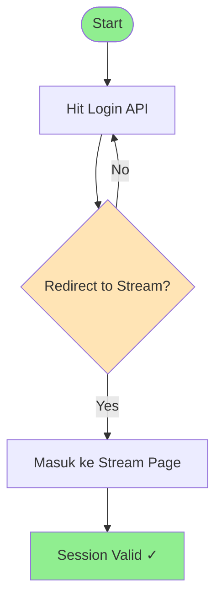
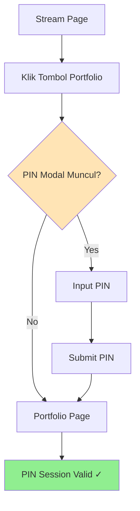
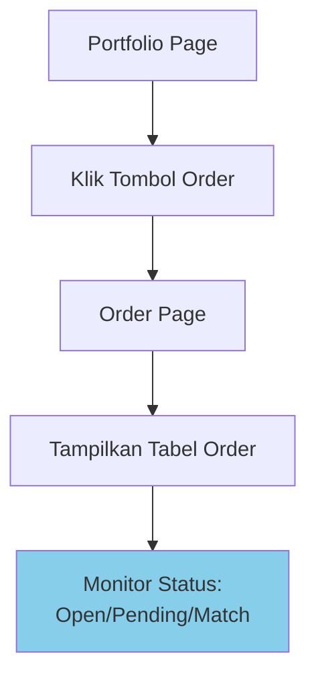
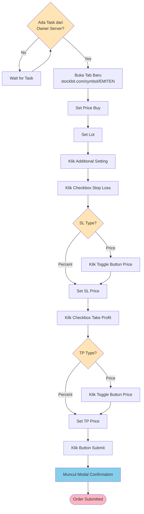
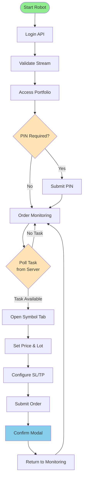

# Stockbit Broker Flow

**Status:** Standard Robot Engine  
**Broker:** Stockbit  
**Created:** 2026-02-11  
**Version:** 1.0

---

## Overview

Standard flow untuk robot trading menggunakan broker Stockbit. Flow ini mencakup:
1. Session validation (login & PIN)
2. Portfolio & order monitoring
3. Task execution (buy order dengan SL/TP)

---

## 1. Session Validation Flow

### 1.1 Login & Stream Validation



**Steps:**
1. Hit login endpoint
2. Check redirect → jika diarahkan ke stream = login success
3. Konfirmasi sudah masuk stream page

---

### 1.2 PIN Validation & Portfolio Access



**Steps:**
1. Klik tombol Portfolio
2. Check apakah muncul PIN modal
3. Jika ya → input PIN dan submit
4. Redirect ke Portfolio page = PIN session valid

---

### 1.3 Order Monitoring Access



**Steps:**
1. Dari Portfolio → klik tombol Order
2. Masuk Order page
3. Tabel order menampilkan status:
   - **Open:** Order aktif di market
   - **Pending:** Order menunggu eksekusi (buy/sell)
   - **Match:** Order berhasil dieksekusi

---

## 2. Task Execution Flow

### 2.1 Complete Buy Order Flow



---

### 2.2 Task Structure

**Input dari Owner Server:**
```json
{
  "emiten": "FPNI",
  "action": "buy",
  "price": 1500,
  "lot": 10,
  "stop_loss": {
    "type": "price",  // or "percent"
    "value": 1450
  },
  "take_profit": {
    "type": "price",  // or "percent"
    "value": 1600
  }
}
```

---

### 2.3 Step-by-Step Execution

#### Step 1: Open Symbol Page
- Buka tab baru: `https://stockbit.com/symbol/{EMITEN}`
- **Session inheritance:** Tab baru otomatis inherit login session & PIN session dari tab monitoring

#### Step 2: Set Order Parameters
1. **Price:** Input harga buy
2. **Lot:** Input jumlah lot

#### Step 3: Configure Additional Settings
1. Klik "Additional Setting"
2. **Stop Loss:**
   - Klik checkbox Stop Loss
   - Check `sl.type`:
     - Jika `"price"` → klik toggle button ke mode Price
     - Jika `"percent"` → biarkan default
   - Input SL value

3. **Take Profit:**
   - Klik checkbox Take Profit
   - Check `tp.type`:
     - Jika `"price"` → klik toggle button ke mode Price
     - Jika `"percent"` → biarkan default
   - Input TP value

#### Step 4: Submit Order
1. Klik button Submit
2. Modal confirmation akan muncul
3. Konfirmasi order

---

## 3. Complete End-to-End Flow



---

## 4. Key Technical Points

### 4.1 Session Management
- **Login Session:** Valid setelah redirect ke stream page
- **PIN Session:** Valid setelah submit PIN di portfolio
- **Session Inheritance:** Tab baru inherit session dari tab monitoring
- **Session Persistence:** Perlu periodic validation

### 4.2 State Tracking
Robot harus track state:
- `SESSION_INVALID` → perlu login
- `SESSION_VALID_NO_PIN` → perlu PIN
- `SESSION_VALID_WITH_PIN` → ready untuk trading
- `ORDER_MONITORING` → monitoring order status
- `EXECUTING_TASK` → sedang eksekusi task

### 4.3 Error Handling
- **Login failed:** Retry dengan exponential backoff
- **PIN invalid:** Alert & stop robot
- **Task execution failed:** Rollback & report ke owner server
- **Network error:** Retry mechanism

### 4.4 UI Detection
- Detect stream page elements
- Detect PIN modal
- Detect order table
- Detect confirmation modal
- Handle loading states

---

## 5. Integration Points

### 5.1 Owner Server Communication
- **Poll tasks:** REST API atau WebSocket
- **Report status:** Success/failed execution
- **Send logs:** Audit trail ke server

### 5.2 Monitoring Dashboard
- Session status indicator
- Active orders count
- Task execution history
- Error logs

---

## Related Documents

- [[00-README]] - Project overview
- [[13-Session-Management]] - Session management detail
- [[03-Task-Format]] - Task format specification
- [[04-State-Machine]] - State machine design
- [[12-UI-Detection]] - UI detection strategies

---

**Tags:** #broker #stockbit #flow #standard-engine