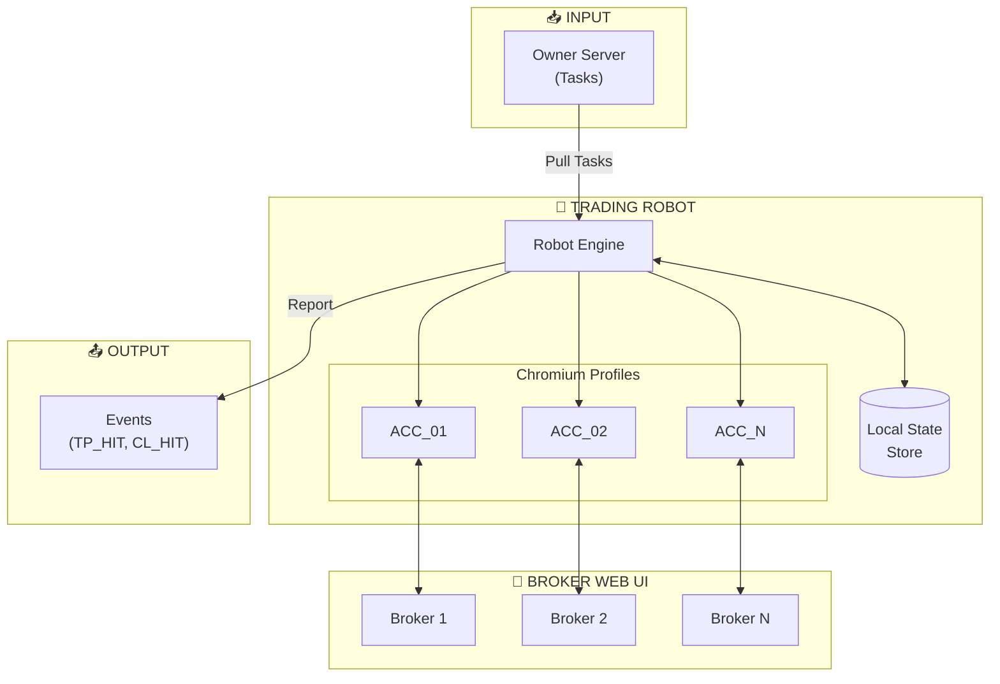

---
tags:
  - project
  - trading
  - automation
status: development-ready
created: '2026-01-20'
updated: '2026-01-21'
---
# 🤖 Multi-Account Trading Robot

> Personal Project - Indonesia Stocks
> Mode: Always-On, UI-based automation

---

## System Overview

---

## 📚 Documentation

### Core Design
- [[00-README|Overview]]
- [[01-Architecture|Architecture]]
- [[02-Security-Model|Security Model]]

### Task & State Management
- [[03-Task-Format|Task JSON Format]]
- [[04-State-Machine|State Machine Design]]
- [[05-Timeout-Retry|Timeout & Retry]]
- [[06-Partial-Fill-TPCL|Partial Fill & TP/CL Detection]]

### Operations
- [[07-Heartbeat-Monitoring|Heartbeat & Monitoring]]
- [[08-Concurrency-Model|Concurrency Model]]
- [[09-Logging-Audit|Logging & Audit Trail]]
- [[10-Alerting|Alerting Mechanism]]
- [[11-Market-Hours|Market Hours & Special Cases]]
- [[12-UI-Detection|UI Element Detection]]
- [[13-Session-Management|Session Management]]

### Risk & Planning
- [[14-Known-Risks|Known Risks & Future Improvements]]

### 🚀 Development Phase (NEW)
- [[15-Agent-Team-Structure|Agent Team Structure]]
- [[16-Dashboard-Requirements|Dashboard Requirements]]
- [[17-API-Contract|API Contract]]
- [[18-Testing-Strategy|Testing Strategy]]

---

## ✅ Design Complete

| # | Topic | Status |
|---|-------|--------|
| 1 | Timeout & Retry | ✅ Done |
| 2 | Partial Fill & TP/CL | ✅ Done |
| 3 | Cancel Order Flow | ✅ Covered |
| 4 | Retry & Failure Policy | ✅ Covered |
| 5 | Concurrency Model | ✅ Done |
| 6 | Logging & Audit Trail | ✅ Done |
| 7 | Alerting Mechanism | ✅ Done |
| 8 | Market Hours & Special Cases | ✅ Done |
| 9 | UI Element Detection | ✅ Done |
| 10 | Session Management | ✅ Done |
| 11 | Agent Team Structure | ✅ Done |
| 12 | Dashboard Requirements | ✅ Done |
| 13 | API Contract | ✅ Done |
| 14 | Testing Strategy | ✅ Done |

---

## 📅 Timeline

| Date | Activity |
|------|----------|
| 2026-01-20 | Initial design discussion |
| 2026-01-20 | Migrated to Obsidian |
| 2026-01-20 | Added Mermaid diagrams |
| 2026-01-20 | Concurrency Model finalized |
| 2026-01-20 | Logging & Audit Trail finalized |
| 2026-01-20 | Alerting Mechanism finalized |
| 2026-01-20 | Market Hours & Special Cases finalized |
| 2026-01-20 | UI Element Detection finalized |
| 2026-01-20 | Session Management finalized |
| 2026-01-20 | 🎉 All design topics completed! |
| 2026-01-20 | Added Known Risks & Future Improvements |
| 2026-01-21 | Agent Team Structure defined |
| 2026-01-21 | Dashboard Requirements defined |
| 2026-01-21 | API Contract defined |
| 2026-01-21 | Testing Strategy defined |
| 2026-01-21 | 🚀 Ready for Development Phase! |
