# Sequence Diagrams — Asisten Hunian

> Turunan dari `requirements.md` (hasil `/sa:brainstorm`, 2026-08-10).
> Dikelompokkan per actor. Setiap diagram mengacu ke FR/US terkait.
> Bagian yang masih bergantung pada Open Question (`requirements.md` §7) ditandai ⚠️.

---

## 1. User

### 1.1 Registrasi & Verifikasi Email
*FR-U01, FR-U02*

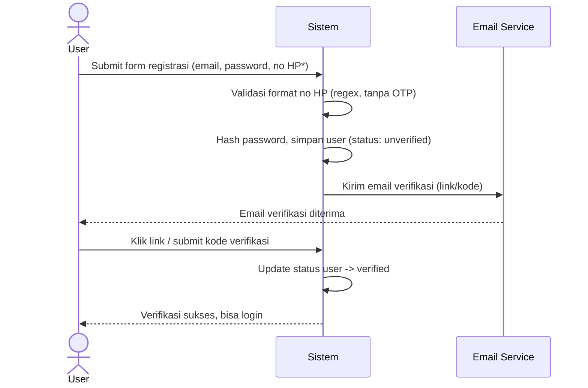

### 1.2 Browse Catalog, Order & Pembayaran QRIS
*FR-U03, FR-U04, FR-U05*

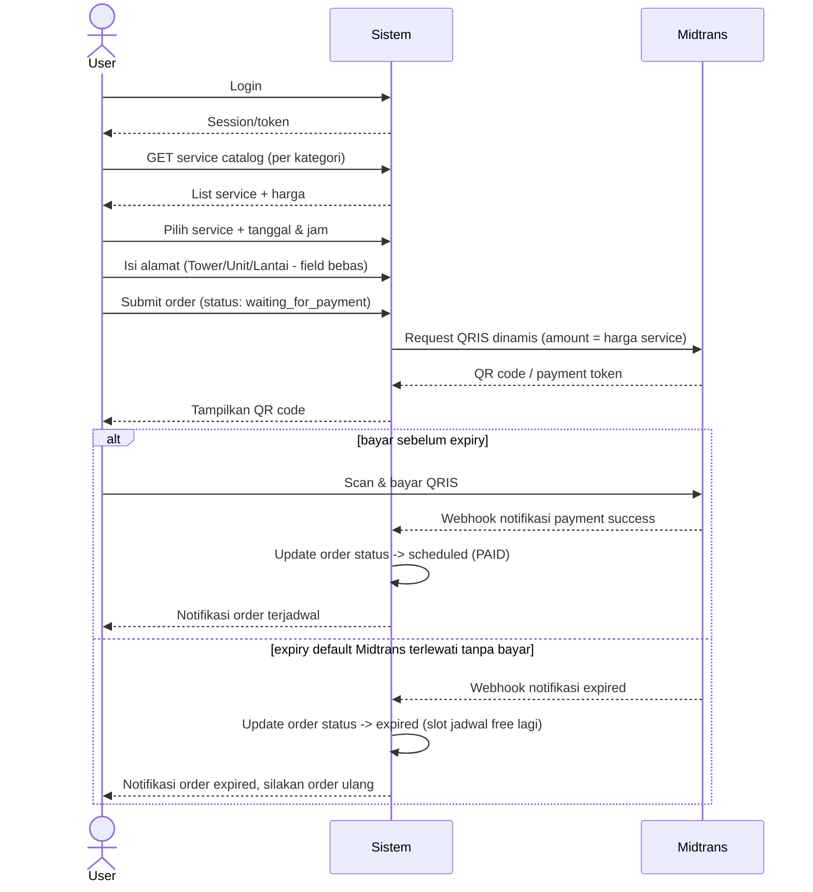

### 1.3 Lihat Order Aktif / Selesai
*FR-U06, FR-U07, FR-U08*

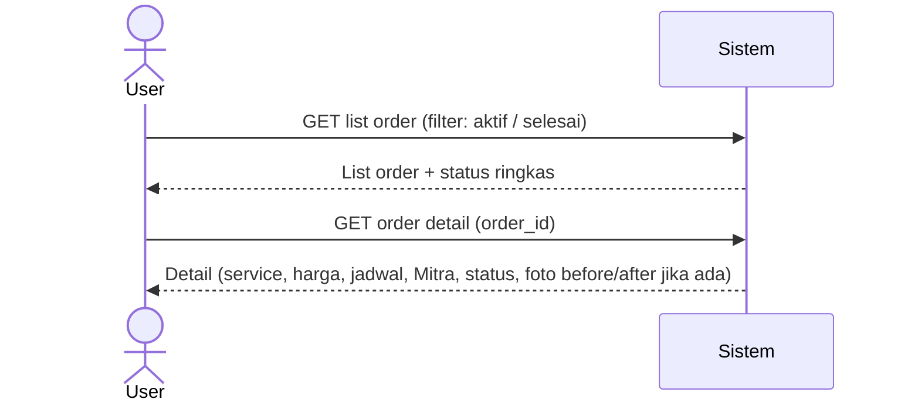

### 1.4 Rating Order
*FR-U09*

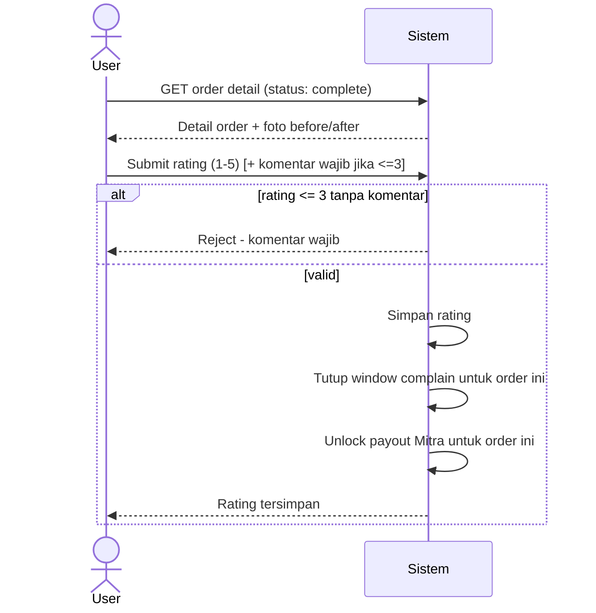

### 1.5 Ajukan Complain
*FR-U10*

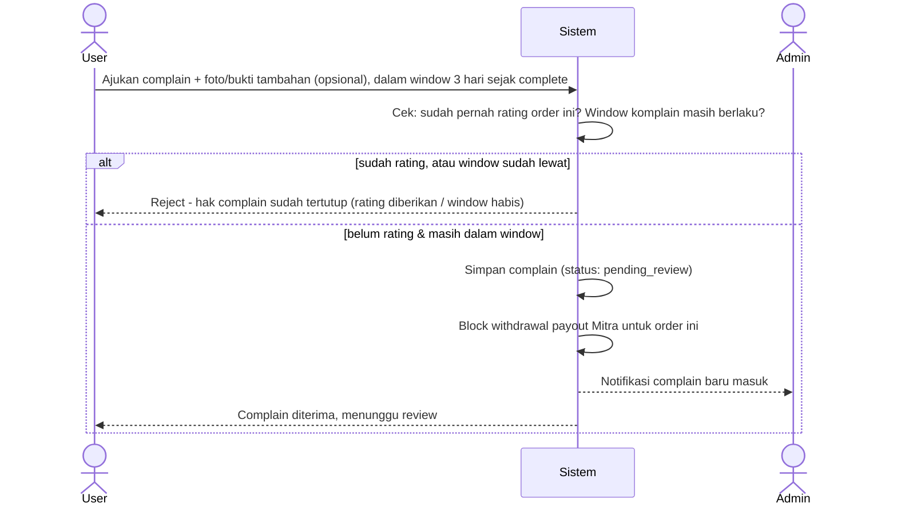

---

## 2. Admin

### 2.1 Pairing Mitra ke Order
*FR-A03, FR-A04*

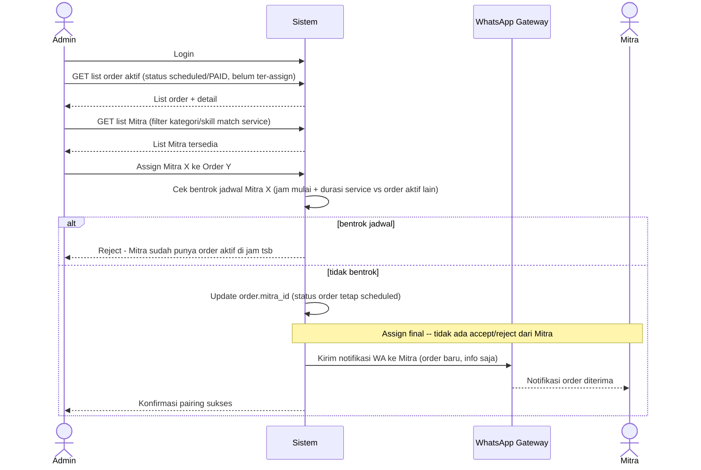

### 2.2 Kelola Service Catalog
*FR-A05*

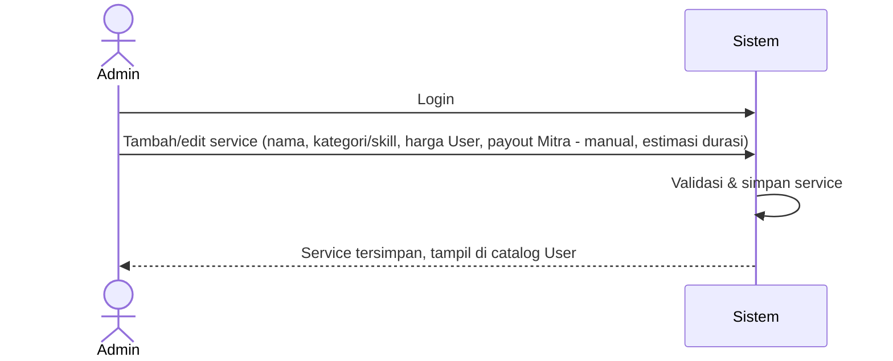

### 2.3 Review Complain
*FR-A06, US-04*

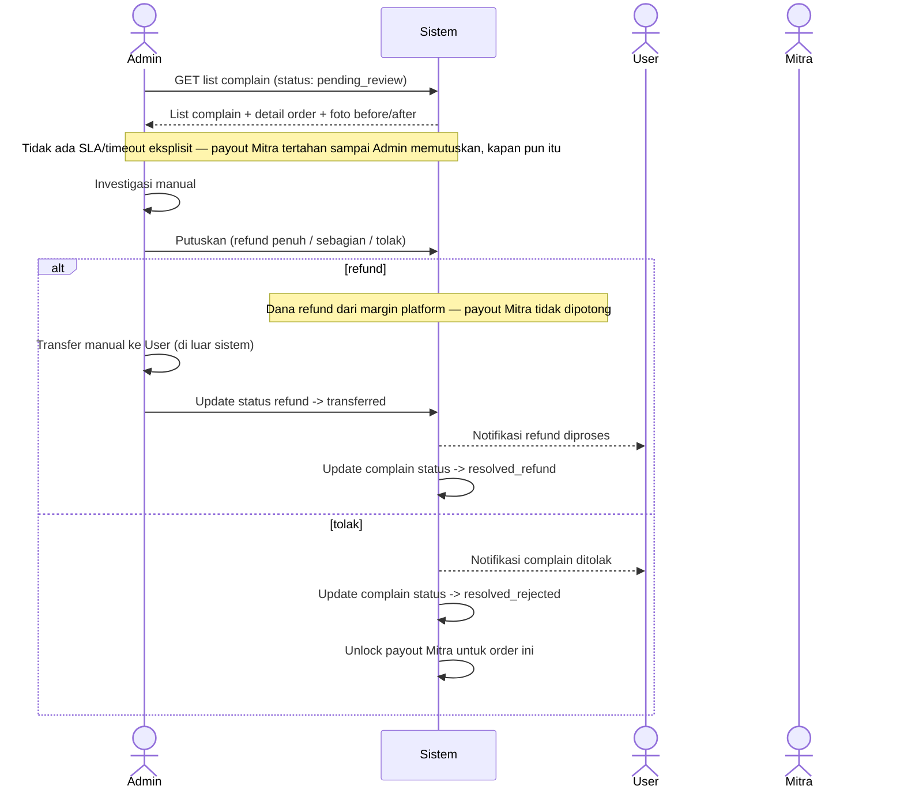

---

## 3. Mitra

### 3.1 Registrasi Mitra
*FR-M01*

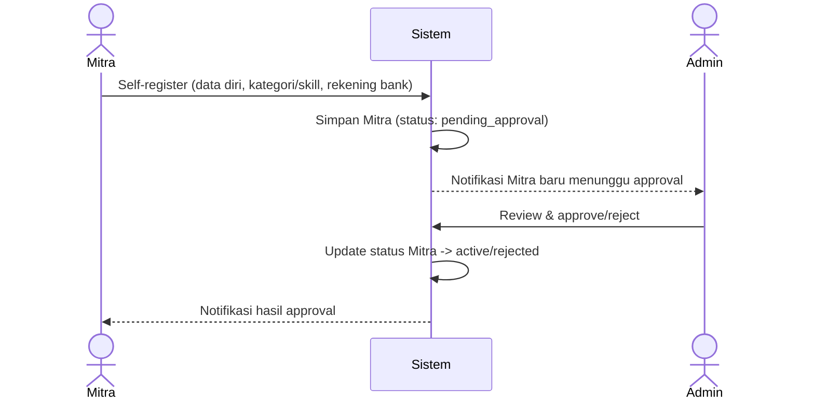

### 3.2 Start Order (Upload Foto Before)
*FR-M02*

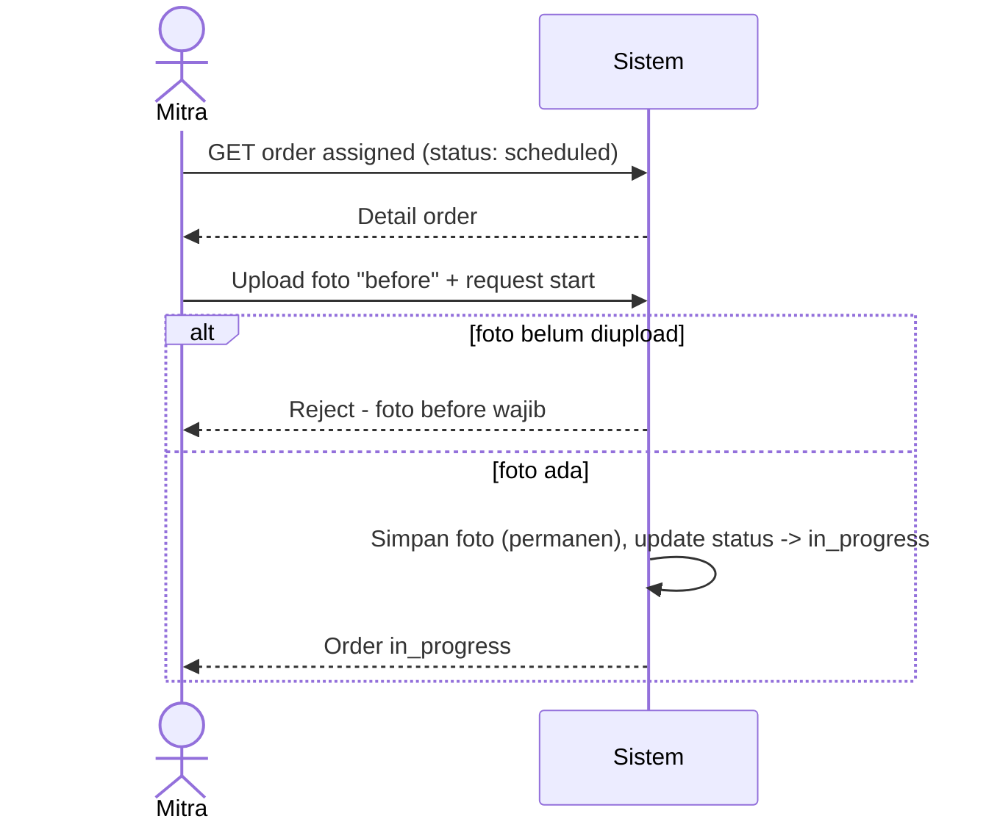

### 3.3 Complete Order (Upload Foto After)
*FR-M03*

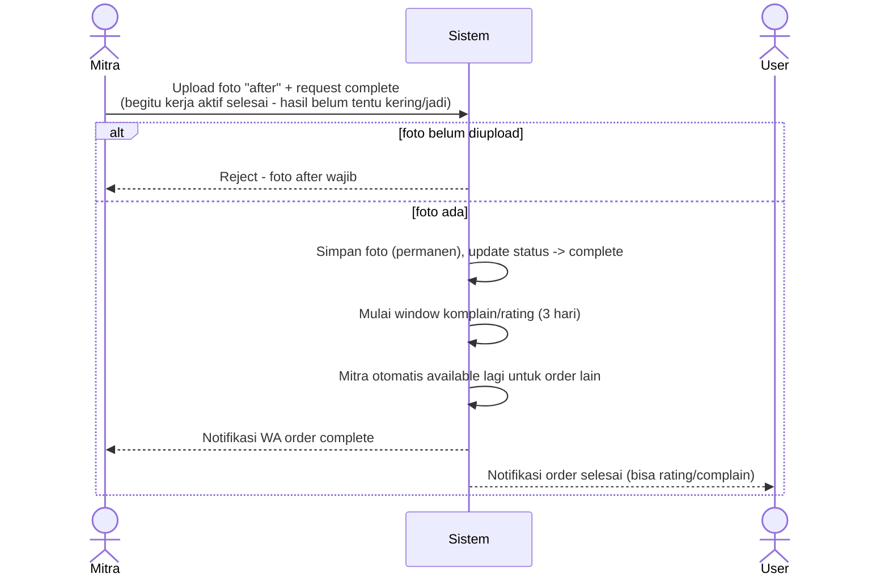

> Catatan: untuk servis dengan waktu tunggu pasif (mis. cuci karpet), Mitra tidak perlu balik lagi setelah hasil kering — foto "after" cukup diambil begitu kerja aktif kelar (lihat Decision Log #24–25 di `requirements.md`).

### 3.4 Withdrawal Payout
*FR-M04*

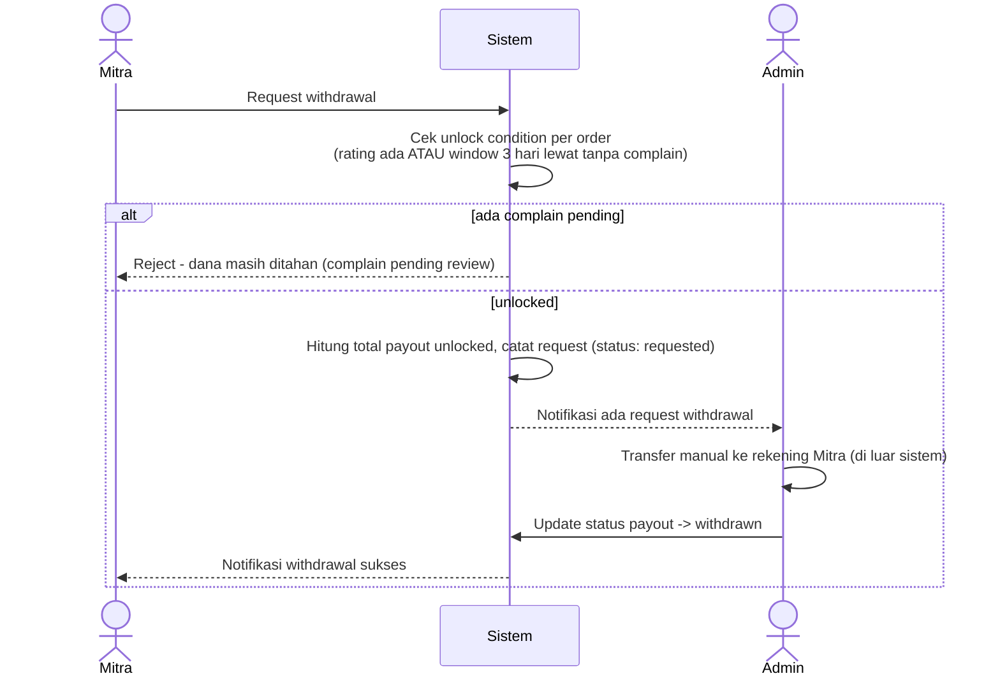

### 3.5 Login Mitra
*FR-M05*

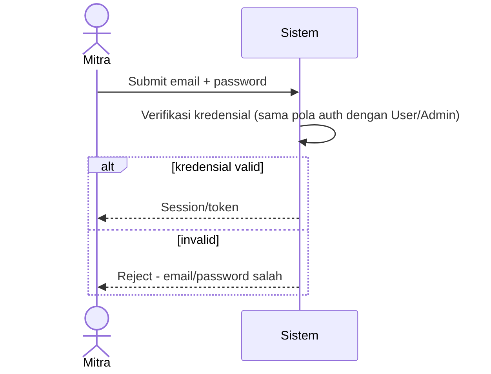

> Catatan: Mitra login pakai email + password, kredensial sama yang diisi saat registrasi (FR-M01). Notifikasi operasional (order baru, dll) tetap lewat WhatsApp — terpisah dari mekanisme login (lihat Decision Log #30).

> Catatan: Midtrans **Payouts API** (dulu Iris) mendukung disbursement otomatis real-time ke rekening bank — dipertimbangkan sebagai improvement pasca-MVP untuk menggantikan langkah transfer manual Admin di atas.

---

## 4. Shared (Semua Role)

### 4.1 Reset Password
*FR-C07 — berlaku untuk User, Admin, Mitra*

```mermaid
sequenceDiagram
    actor Actor as User/Admin/Mitra
    participant Sistem
    participant Email as Email Service

    Actor->>Sistem: Request "lupa password" (submit email)
    Sistem->>Sistem: Cek email terdaftar
    Sistem->>Email: Kirim link reset password
    Email-->>Actor: Email reset diterima
    Actor->>Sistem: Klik link, submit password baru
    Sistem->>Sistem: Validasi token reset, hash & update password
    Sistem-->>Actor: Password berhasil direset, bisa login
```

> Catatan: Self-service, reuse pola verifikasi email User (FR-U02) — satu mekanisme untuk ketiga role (lihat Decision Log #31).

---

## Status Keputusan

Semua flow di atas sudah mencerminkan keputusan final di `requirements.md` §5 (Decision Log #13–31), hasil resolusi Open Questions §7 (2026-08-11) dan sesi lanjutan grey-area (2026-08-14). Satu-satunya item yang masih terbuka: **#8 — pemisahan role Owner/Admin** (deferred, belum berdampak ke diagram MVP karena Owner memegang Admin sendiri).
