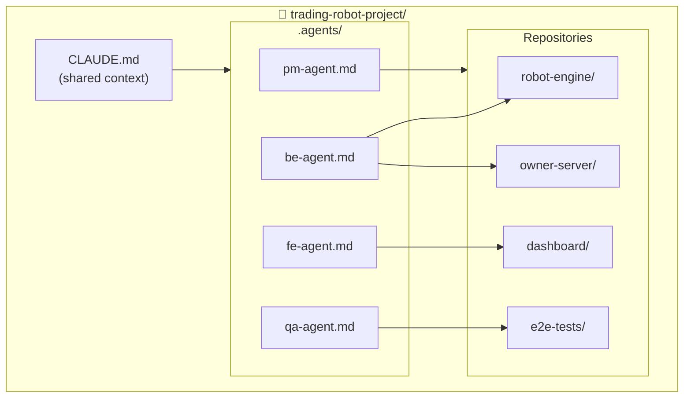

---
tags:
  - claude-code
  - agents
  - configuration
  - trading
created: '2026-01-21'
---
# 🤖 Claude Code Agent Configurations

> Konfigurasi multi-agent untuk Trading Robot project
> Untuk digunakan dengan Claude Code CLI

---

## Overview



---

## 📄 File List

| File | Purpose |
|------|---------|
| [[CLAUDE-root|CLAUDE.md (root)]] | Shared project context |
| [[pm-agent|PM Agent]] | Project Manager / Orchestrator |
| [[be-agent|BE Agent]] | Backend Engineer |
| [[fe-agent|FE Agent]] | Frontend Engineer |
| [[qa-agent|QA Agent]] | QA Engineer |

---

## 🚀 Quick Setup

```bash
# 1. Buat project folder
mkdir trading-robot-project && cd trading-robot-project

# 2. Copy CLAUDE.md ke root
cp /path/to/CLAUDE-root.md ./CLAUDE.md

# 3. Buat .agents folder dan copy agent configs
mkdir .agents
cp /path/to/pm-agent.md ./.agents/
cp /path/to/be-agent.md ./.agents/
cp /path/to/fe-agent.md ./.agents/
cp /path/to/qa-agent.md ./.agents/

# 4. Copy docs dari Obsidian
mkdir docs
cp -r /path/to/obsidian/01-Projects/Trading-Robot/* ./docs/

# 5. Init git
git init
```

---

## 🎮 Running Agents

### Multiple Terminals (Recommended)

```bash
# Terminal 1 - PM Agent
cd trading-robot-project
claude
# > Baca .agents/pm-agent.md dan act as PM Agent

# Terminal 2 - BE Agent
cd trading-robot-project
claude
# > Baca .agents/be-agent.md dan act as BE Agent

# Terminal 3 - FE Agent
cd trading-robot-project
claude
# > Baca .agents/fe-agent.md dan act as FE Agent

# Terminal 4 - QA Agent
cd trading-robot-project
claude
# > Baca .agents/qa-agent.md dan act as QA Agent
```

### Single Session (Role Switching)

```bash
claude
# > Switch ke PM mode, baca .agents/pm-agent.md
# ... do PM work ...
# > Switch ke BE mode, baca .agents/be-agent.md
# ... do BE work ...
```

---

## 📋 Related Project Docs

- [[01-Projects/Trading-Robot/_INDEX|Trading Robot Project]]
- [[01-Projects/Trading-Robot/15-Agent-Team-Structure|Agent Team Structure]]
- [[01-Projects/Trading-Robot/17-API-Contract|API Contract]]
