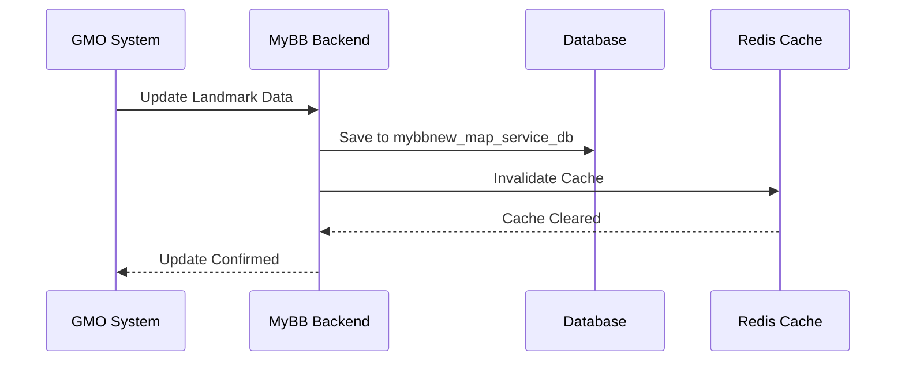

# GMO Integration Notes - Migration to HWC

**Service**: GMO (Geographic Management Operations)  
**Team**: External Partner + Internal Backend Team  
**Status**: ✅ Migrated with Coordination Requirements  
**Date**: 2025

---

## 📋 Overview

GMO (Geographic Management Operations) adalah service eksternal yang mengelola landmark data untuk platform MyBluebird. Selama migrasi ke Huawei Cloud, koordinasi khusus diperlukan untuk memastikan konsistensi data landmark.

---

## 🎯 Migration Requirements

### Critical Considerations

#### 1. Data Consistency During Cutover
**Requirement**: Landmark data tidak boleh dimanipulasi selama window migrasi

**Rationale**:
- Database synchronization sedang berlangsung
- Risk data mismatch antara GCP dan HWC
- Perubahan landmark bisa hilang atau duplikasi

**Implementation**:
- Notify GMO team 48 hours before cutover
- Request freeze on landmark updates
- Schedule maintenance window during low-traffic hours

---

#### 2. Database Coordination

**Databases Involved**:
- `mybbnew_services_db` - Contains landmark references
- `mybbnew_map_service_db` - Geographic/mapping data
- External GMO database

**Synchronization Strategy**:
- Real-time replication during migration
- Final sync before cutover
- Validation after cutover

---

## 🗂️ Landmark Management

### What is a Landmark?

Landmarks dalam konteks MyBluebird:
- Points of Interest (POI)
- Popular pickup/dropoff locations
- Airport terminals
- Shopping malls
- Hotels
- Business districts

### How GMO Manages Landmarks



---

## 🔧 Technical Integration

### API Endpoints

#### MyBluebird → GMO
```
GET  /gmo/api/v1/landmarks
POST /gmo/api/v1/landmarks
PUT  /gmo/api/v1/landmarks/{id}
DELETE /gmo/api/v1/landmarks/{id}
```

#### GMO → MyBluebird (Webhooks)
```
POST /api/webhooks/gmo/landmark-created
POST /api/webhooks/gmo/landmark-updated
POST /api/webhooks/gmo/landmark-deleted
```

### Database Schema

**Table**: `landmarks`

```sql
CREATE TABLE landmarks (
    id SERIAL PRIMARY KEY,
    external_id VARCHAR(255) UNIQUE NOT NULL, -- GMO landmark ID
    name VARCHAR(255) NOT NULL,
    description TEXT,
    latitude DECIMAL(10, 8) NOT NULL,
    longitude DECIMAL(11, 8) NOT NULL,
    location GEOGRAPHY(Point, 4326), -- PostGIS
    category VARCHAR(50),
    popularity_score INTEGER DEFAULT 0,
    is_active BOOLEAN DEFAULT TRUE,
    metadata JSONB,
    created_at TIMESTAMP DEFAULT NOW(),
    updated_at TIMESTAMP DEFAULT NOW(),
    synced_from_gmo_at TIMESTAMP,
    
    -- Spatial index for geo queries
    INDEX idx_landmarks_location USING GIST(location)
);
```

---

## ⚠️ Migration Issues & Resolutions

### Issue 1: Landmark Data Manipulation During Cutover

**Problem Statement**:
External users (GMO team) perlu aware bahwa mereka tidak boleh menambah/edit landmark data selama migration window.

**Risk**:
- Data inconsistency
- Lost updates
- Duplicate landmarks
- Orphaned landmark references

**Solution Implemented**:

#### Communication Plan
1. **48 Hours Before**:
   - Email notification to GMO team
   - Details of maintenance window
   - Expected duration
   - Emergency contact numbers

2. **24 Hours Before**:
   - Reminder email
   - Confirmation of freeze period
   - Alternative workflow if urgent updates needed

3. **During Migration**:
   - GMO access temporarily restricted
   - Read-only mode if possible
   - Emergency escalation path available

#### Technical Implementation
```go
// Feature flag to block GMO writes during migration
const (
    FeatureFlagGMOMaintenanceMode = "gmo.maintenance_mode"
)

func (h *GMOHandler) UpdateLandmark(w http.ResponseWriter, r *http.Request) {
    // Check maintenance mode
    if h.featureFlags.IsEnabled(FeatureFlagGMOMaintenanceMode) {
        http.Error(w, `{
            "error": "maintenance_mode",
            "message": "GMO landmark updates are temporarily disabled during system maintenance. Expected completion: 2025-XX-XX XX:XX UTC",
            "support": "contact-support@bluebird.com"
        }`, http.StatusServiceUnavailable)
        return
    }
    
    // Normal processing
    // ...
}
```

---

### Issue 2: Webhook Delivery During Migration

**Problem**:
GMO webhooks might fail during service migration if endpoints change

**Solution**:
- Maintain both GCP and HWC webhook URLs temporarily
- Use webhook queue with retry mechanism
- DNS-based routing for smooth transition

**Implementation**:
```go
// Webhook with retry and failover
type WebhookDelivery struct {
    Payload     []byte
    TargetURL   string
    FallbackURL string
    MaxRetries  int
}

func (w *WebhookService) DeliverLandmarkUpdate(landmark Landmark) error {
    delivery := WebhookDelivery{
        Payload:     w.marshalLandmark(landmark),
        TargetURL:   w.config.PrimaryWebhookURL,   // HWC
        FallbackURL: w.config.FallbackWebhookURL, // GCP (temporary)
        MaxRetries:  3,
    }
    
    return w.deliverWithRetry(delivery)
}
```

---

## 📊 Data Validation

### Pre-Migration Validation

#### Landmark Count Check
```sql
-- GCP Database
SELECT COUNT(*) as gcp_landmark_count FROM landmarks WHERE is_active = true;

-- HWC Database (after sync)
SELECT COUNT(*) as hwc_landmark_count FROM landmarks WHERE is_active = true;

-- Should match exactly
```

#### Data Integrity Check
```sql
-- Check for orphaned references
SELECT l.* 
FROM landmarks l
LEFT JOIN landmark_categories lc ON l.category_id = lc.id
WHERE lc.id IS NULL;

-- Check for duplicate GMO IDs
SELECT external_id, COUNT(*) as count
FROM landmarks
GROUP BY external_id
HAVING COUNT(*) > 1;
```

#### Geospatial Data Validation
```sql
-- Verify PostGIS data integrity
SELECT id, name, 
       ST_IsValid(location) as is_valid_geometry,
       ST_AsText(location) as location_wkt
FROM landmarks
WHERE NOT ST_IsValid(location);
```

---

### Post-Migration Validation

#### 1. Landmark Access Test
```bash
# Test landmark retrieval
curl -X GET "https://api.mybluebird.com/api/v1/landmarks" \
  -H "Authorization: Bearer $TOKEN"

# Test specific landmark
curl -X GET "https://api.mybluebird.com/api/v1/landmarks/123" \
  -H "Authorization: Bearer $TOKEN"
```

#### 2. Geo Query Test
```bash
# Test nearby landmarks query
curl -X GET "https://api.mybluebird.com/api/v1/landmarks/nearby?lat=-6.2088&lon=106.8456&radius=1000" \
  -H "Authorization: Bearer $TOKEN"
```

#### 3. GMO Integration Test
```bash
# Test webhook reception
curl -X POST "https://api.mybluebird.com/api/webhooks/gmo/landmark-updated" \
  -H "Content-Type: application/json" \
  -H "X-GMO-Signature: $SIGNATURE" \
  -d '{
    "landmark_id": "gmo-123",
    "name": "Test Landmark",
    "latitude": -6.2088,
    "longitude": 106.8456
  }'
```

---

## 📋 Coordination Checklist

### Pre-Migration

- [ ] **T-7 days**: Initial notification to GMO team
  - Migration date and time
  - Expected duration
  - Freeze period details

- [ ] **T-3 days**: Coordination meeting
  - Confirm freeze period
  - Review emergency procedures
  - Share rollback plan

- [ ] **T-1 day**: Final confirmation
  - Reminder email
  - Verify emergency contacts
  - Confirm on-call personnel

### During Migration

- [ ] **T-0 (Start)**: Enable maintenance mode
  - Activate GMO write-blocking feature flag
  - Send confirmation to GMO team
  - Monitor for any urgent requests

- [ ] **During**: Monitor integration health
  - Check webhook delivery status
  - Monitor landmark API access
  - Track any errors or issues

### Post-Migration

- [ ] **T+0 (Complete)**: Disable maintenance mode
  - Remove write-blocking feature flag
  - Notify GMO team of completion
  - Resume normal operations

- [ ] **T+1 hour**: Validation
  - Run data integrity checks
  - Test landmark CRUD operations
  - Verify webhook delivery

- [ ] **T+24 hours**: Follow-up
  - Review any issues encountered
  - Collect feedback from GMO team
  - Document lessons learned

---

## 🔗 Related Services

### Internal Services Dependent on Landmarks

1. **Booking Service**:
   - Popular pickup locations
   - Suggested destinations
   - Landmark-based pricing

2. **Map Service**:
   - POI rendering
   - Route suggestions
   - Location search

3. **Notification Service**:
   - Landmark-based arrival notifications
   - "You're near [landmark]" alerts

4. **Analytics Service**:
   - Landmark popularity tracking
   - Usage statistics
   - Route optimization data

---

## 📞 Contacts

### Internal Team
- **Backend Lead**: Aldian Aby
- **Database Team**: Database Administrator
- **Migration Lead**: Lukmanul Hakim

### External Team (GMO)
- **GMO Contact**: [Contact Person]
- **Technical Lead**: [Technical Contact]
- **Emergency Escalation**: [Emergency Contact]

### Coordination Channels
- **Email**: gmo-integration@bluebird.com
- **Slack**: #gmo-integration
- **Emergency**: [Phone Number]

---

## 📚 Documentation References

- [GMO API Documentation](internal-docs/gmo-api-spec.md)
- [Webhook Specification](internal-docs/gmo-webhooks.md)
- [Database Schema](../../database/schemas/landmarks.md)
- [PostGIS Guide](../../database/postgis-guide.md)

---

## 🏷️ Tags

#gmo #landmarks #external-integration #geographic-data #migration #coordination

---

*Last Updated: 2025-08-04*  
*Owner: Aldian Aby*  
*Status: Successfully Migrated*
