# Issue Report: BB01267851 - EzPay Race Condition

**Status**: ✅ Resolved - Root Cause Identified  
**Severity**: Medium (Operational/Timing Issue)  
**Date Reported**: 2025-08-04  
**Team**: MRG + BBD (Fleet Operations)

---

## 👤 User Information

| Field | Value |
|-------|-------|
| **Name** | Abrar Dia |
| **Bluebird ID** | BB01267851 |
| **Contact** | +6287877382431 |
| **Email** | abrar_dia@yahoo.co.id |

---

## 🐛 Issue Description

User encountered multiple failed EzPay booking attempts with error message: **"Please make sure your driver is already login and argometer has been activated"**

### Service Details
- **Service Type**: EzPay
- **Payment Method**: ECV (Electronic Cash Voucher)
- **Vehicle**: PD2879
- **Booking Type**: Immediate (Street Hailing)

---

## 📊 Order History

### Failed and Successful Orders

| Order ID | State | Timestamp | Result |
|----------|-------|-----------|--------|
| 109552891 | -2 | 2025-08-04 04:14:50 | ❌ Failed |
| 109552240 | -2 | 2025-08-04 04:13:14 | ❌ Failed |
| **109552173** | **2** | **2025-08-04 03:53:57** | ✅ Success (In-Progress) |
| 109551979 | -2 | 2025-08-04 03:47:41 | ❌ Failed |
| 109551935 | -2 | 2025-08-04 03:46:13 | ❌ Failed |
| **109551885** | **2** | **2025-08-04 03:45:57** | ✅ Success (In-Progress) |

### Order State Legend
- **State -2**: Order failed/cancelled
- **State 2**: Order in-progress (driver assigned, trip ongoing)

### Pattern Analysis
- **Total Attempts**: 6 orders
- **Failed Orders**: 4 (66.7%)
- **Successful Orders**: 2 (33.3%)
- **Time Window**: 03:44 - 04:14 (30 minutes)
- **Average Retry Interval**: ~1-2 minutes

---

## 💥 Error Details

### Primary Error Log

**Timestamp**: 2025-08-04 03:44:54 WIB  
**Error Type**: Argometer Not Activated

```json
{
  "log": "[Error] 2025/08/04 03:44:54.453824356 order_controller.go:1735 [event=retry_easy_ride_booking_error] [message=Please make sure your driver is already login and argometer has been activated] [topic=retry_easy_ride_booking] [user_id=BB01267851] [device_id=5a78f48118ad0bc3] [order_id=109551885] [payload={\n",
  "stream": "stdout",
  "time": "2025-08-03T20:44:54.453877982Z"
}
```

### Error Context
- **Topic**: `retry_easy_ride_booking`
- **Controller**: `order_controller.go:1735`
- **Event**: `retry_easy_ride_booking_error`
- **User Device**: `5a78f48118ad0bc3`

---

## 🔍 Investigation Timeline

### 1. Initial Error (03:44)
- **Event**: User requested EzPay booking
- **System Check**: Argometer status validation
- **Result**: ❌ Argometer not detected as active
- **Action**: Order failed, user shown error message

### 2. Retry Attempts (03:45 - 04:14)
User made multiple retry attempts:
- 03:45:57 → ✅ Success (Order 109551885 reached state 2)
- 03:46:13 → ❌ Failed
- 03:47:41 → ❌ Failed
- 03:53:57 → ✅ Success (Order 109552173 reached state 2)
- 04:13:14 → ❌ Failed
- 04:14:50 → ❌ Failed

### 3. BBD System Investigation (IoT Events)

#### Critical Finding: Start Argo Event Delay
- **EzPay Request Time**: 03:44 WIB
- **Start Argo Event Received**: 04:36 WIB
- **Delay**: **52 minutes**

---

## 🔬 Root Cause Analysis

### Primary Cause: Race Condition with IoT Device

#### The Problem
EzPay bookings require argometer to be in active state before creating an order. The system validates argometer status by checking recent IoT events from the vehicle's device.

#### What Happened
1. **Vehicle State**: PD2879 was in **street hailing mode**
2. **Driver Action**: Driver likely started argometer around 03:44
3. **IoT Device**: Device delayed sending "start argo" event to backend
4. **User Request**: User requested EzPay at 03:44
5. **System Validation**: Backend checked argometer status → Not yet received event
6. **Result**: Order rejected with error message
7. **Event Arrival**: IoT finally sent "start argo" event at 04:36 (52 minutes later)

#### Why 2 Orders Succeeded
Orders 109551885 and 109552173 succeeded (state 2) because:
- User retried at the exact moment between IoT event transmission attempts
- Temporary network conditions allowed event to reach backend faster
- Or argometer was actually activated momentarily

But subsequent failures indicate the IoT device continued having transmission delays.

---

## 💡 Technical Deep Dive

### EzPay Argometer Validation Flow

```mermaid
sequenceDiagram
    participant Driver
    participant IoT
    participant Backend
    participant User
    
    Driver->>IoT: Start Argometer
    IoT-->>Backend: Send "start_argo" event
    Note over IoT,Backend: Expected: < 5 seconds
    Note over IoT,Backend: Actual: 52 minutes!
    User->>Backend: Request EzPay
    Backend->>Backend: Check argometer status
    alt IoT event received
        Backend-->>User: ✅ Order Created
    else IoT event not received
        Backend-->>User: ❌ Error: Argometer not activated
    end
```



### System Requirements for EzPay
1. ✅ Driver logged in to BBD app
2. ✅ Vehicle in street hailing mode
3. ❌ Argometer activated (event not received in time)
4. ✅ User in proximity to vehicle

---

## 📊 Impact Assessment

### User Impact
- **User Experience**: Poor - multiple failed attempts, frustration
- **Time Lost**: ~30 minutes of retry attempts
- **Outcome**: Eventually able to complete booking (2 successful orders)

### Operational Impact
- **Failed Orders**: 4 out of 6 attempts (66.7% failure rate)
- **System Reliability**: IoT device communication unreliable
- **Driver Impact**: Driver appeared available but unable to accept orders

### Business Impact
- **Revenue**: Potential lost fares during failed attempts
- **Reputation**: Negative user experience
- **Driver Efficiency**: Vehicle unable to earn during IoT delays

---

## 🎯 Resolution

### Immediate Resolution
✅ **Issue Self-Resolved**: IoT device eventually sent start argo event at 04:36

### BBD Team Analysis
After escalation to BBD (Bluebird Device) team:

1. **Vehicle Status Confirmed**: PD2879 was in street hailing mode ✅
2. **EzPay Request Timing**: 03:44 WIB ✅
3. **Race Condition Confirmed**: Order creation happened before IoT event reception ❌
4. **Start Argo Event Timing**: BBD logs show event received at 04:36 WIB ✅
5. **IoT Device Issue**: 52-minute delay in event transmission ❌

### Conclusion
**This is an IoT device/network issue, NOT a migration-related issue.**

---

## 🛠️ Preventive Measures

### Short-term Solutions

#### 1. Improve User Messaging
**Current**: "Please make sure your driver is already login and argometer has been activated"  
**Improved**: "Your driver's meter is starting up. Please wait a moment and try again in 30 seconds."

#### 2. Retry Logic Enhancement
- Automatically retry argometer status check with exponential backoff
- Wait 5-10 seconds before failing the request
- Check for recent start argo events (within last 2 minutes)

#### 3. Grace Period
Allow short grace period for IoT events:
```go
// Check for start argo events within last 2 minutes
const iotEventGracePeriod = 2 * time.Minute

if lastArgoStartEvent.IsZero() || time.Since(lastArgoStartEvent) > iotEventGracePeriod {
    // Wait and retry
    time.Sleep(5 * time.Second)
    // Check again
}
```

### Medium-term Solutions

#### 1. Event Buffering
- Buffer recent IoT events in Redis
- Use fallback to recent events if real-time event delayed

#### 2. Timeout Optimization
- Reduce order validation timeout
- Allow order creation with pending argometer status
- Confirm status after order created

#### 3. Better Monitoring
- Alert on IoT event delays > 1 minute
- Track IoT device health per vehicle
- Dashboard for IoT event lag

### Long-term Solutions

#### 1. IoT Infrastructure Improvement (BBD Team)
- Upgrade IoT device firmware
- Improve network reliability
- Redundant communication channels
- Better cellular connectivity in vehicles

#### 2. Resilient Booking Flow
- Decouple argometer validation from order creation
- Allow order with "pending argometer" status
- Background verification and confirmation
- Cancel if not confirmed within 5 minutes

#### 3. Predictive Status
- ML model to predict argometer state based on driver patterns
- Historical data analysis for each vehicle
- Probabilistic validation instead of binary check

---

## 📋 Action Items

### Immediate (Completed) ✅
- [x] Investigate with BBD team
- [x] Confirm root cause
- [x] Document findings

### Short-term (1 week)
- [ ] Improve error messaging for users
- [ ] Implement IoT event grace period
- [ ] Add retry logic with exponential backoff
- [ ] Enhanced monitoring for IoT event delays

### Medium-term (1 month)
- [ ] BBD team: Review IoT device health for PD2879
- [ ] BBD team: Analyze IoT event transmission patterns
- [ ] Backend: Implement event buffering in Redis
- [ ] Backend: Add alerting for IoT delays

### Long-term (3 months)
- [ ] BBD team: IoT infrastructure upgrade plan
- [ ] Backend: Redesign EzPay booking flow for resilience
- [ ] Product: Consider UX improvements for IoT delays

---

## 🔗 Related Systems

### BBD (Bluebird Device) System
- IoT device management
- Argometer event processing
- Fleet tracking
- Vehicle status management

### MRG Booking Service
- Order creation and validation
- Argometer status checking
- EzPay flow orchestration

---

## 📚 Lessons Learned

### What We Learned
1. **IoT Dependency**: EzPay heavily depends on real-time IoT events
2. **Race Conditions**: Timing-sensitive validations can fail unexpectedly
3. **User Experience**: Cryptic error messages frustrate users
4. **Retry Patterns**: Users will naturally retry, creating duplicate attempts
5. **Cross-team**: Issues often span multiple systems (Backend + IoT)

### Best Practices Moving Forward
1. **Graceful Degradation**: System should handle IoT delays gracefully
2. **Better Error Messages**: Explain what user should do next
3. **Monitoring**: Alert on abnormal IoT event delays
4. **Timeout Tuning**: Balance between user wait time and system reliability
5. **Cross-team Collaboration**: Proactive communication with BBD team

---

## 📎 References

### Internal Documentation
- BBD IoT Event Specification
- EzPay Booking Flow Documentation
- Order State Machine

### Monitoring Dashboards
- IoT Event Lag Dashboard
- EzPay Success Rate
- Vehicle Argometer Status

---

## 🏷️ Tags

#ezpay #race-condition #iot #bbd #argometer #resolved #not-migration-related

---

## 📞 Contact

**MRG Team**: Booking Service Owners  
**BBD Team**: IoT Device Management  
**Escalation**: Lukmanul Hakim (Architecture Lead)

---

*Last Updated: 2025-08-04*  
*Status: Resolved - Root cause identified*  
*Ownership: BBD Team (IoT device improvements)*
