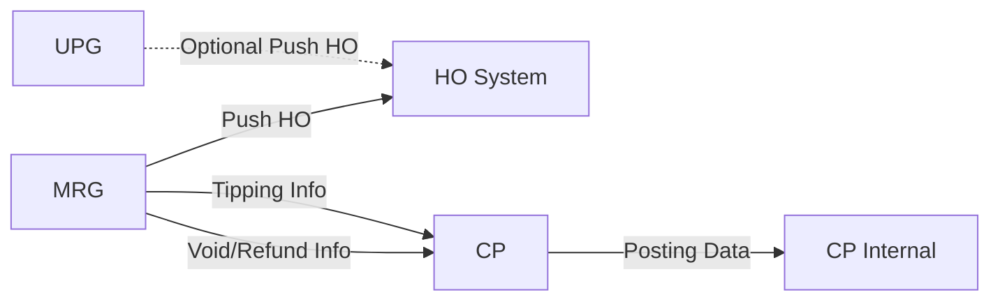

# ECV for GB Rent Revamp Discussion

## Background Context

### Current State
- **Rent Revamp**: Support advance/schedule order untuk 20 hari ke depan
- **Durasi Rental**: 2 opsi (Hourly & Daily)
  - Di Rent Revamp 6.24: ECV & cc_cp masih dibataskan untuk **hourly only**
  
### Charging Pattern
| Service | Charging | Push HO |
|---------|----------|---------|
| BB & SB | Belakang | Belakang |
| GB | **Depan** | Belakang |

---

## Questions to Confirm

1. **Flow Payment ECV untuk Rent Revamp**
   - Flow reserve, charging, refund & pelaporannya ke HO serta CP
   - Approach mau seperti Cititrans?

2. **Budget Calculation**
   - Jika order dibuat akhir bulan Jan untuk bulan Feb, bagaimana perhitungan budget?
   - Apakah sama seperti Cititrans?
   - **Info dari CP**: Push HO dilakukan saat order complete

3. **Pelaporan HO**
   - Siapa yang handle?
   - **Decision**: MRG

---

## Minutes of Meeting

### 1. Legacy Flow
- Charging di depan melalui **MPG 2 (legacy)**

### 2. Multi Charging (CP Side)

#### A. Direct Payment - Push HO
**Status**: Belum ada handling → **Target: v6.24**

**Implementation**: Handle case tipping
- MRG push HO dengan tambahan parameter `is_push_ho`
- **Logic**:
  - `is_push_ho = "false"` → MRG yang push HO
  - `is_push_ho = "true"` → UPG yang push HO

#### B. Direct Payment - Push ke CP
**Status**: Belum ada handling

**Implementation**: Seperti Cititrans untuk posting data ke CP

**Technical Details**:
1. **Topic Baru**: General untuk rent (to be bisa dipakai untuk ride juga)
2. **Handle case refund/void**: Terima info void dari MRG
3. **Handle update tipping**: Terima info dari MRG

---

## Action Items

### 1. Architecture Discussion - Push HO Flow
**Owner**: Team Discussion  
**Priority**: High  
**Description**: 
- Bahas jalur push HO untuk ECV rent revamp
- **Options**:
  - Single posting
  - Multiple posting → perlu journal routing untuk:
    - Overtime
    - Extra
    - Tipping
    - Cancel

### 2. MRG - Handle Tipping Case
**Owner**: MRG Team  
**Priority**: High  
**Scope**:
- Push HO untuk tipping ECV Rent revamp
- Push ke CP untuk tipping

### 3. CP - Internal Assessment
**Owner**: CP Team  
**Priority**: High  
**Timeline**: 
- MyBB v6.24 estimasi **START REGRESS di W4 Feb**
- Note: "Nitip ya mas" - butuh internal assessment sebelum regression

---

## Technical Considerations

### Design Points to Follow-up
1. **Journal Routing Design** (jika pilih multiple posting)
   - Define routing rules untuk overtime, extra, tipping, cancel
   
2. **Topic Schema Design**
   - Topic naming convention
   - Message schema untuk general rent topic
   - Compatibility dengan ride (future)

3. **Error Handling & Retry**
   - Mechanism untuk push HO failure
   - Mechanism untuk push CP failure
   - Idempotency considerations

4. **Testing Scenarios**
   - Tipping scenarios
   - Refund/void scenarios
   - Cross-month order scenarios (Jan order untuk Feb)
   - Budget calculation validation

5. **Monitoring & Alerting**
   - Multi-charging flow monitoring
   - Push HO success rate
   - Push CP success rate
   - Budget posting accuracy

---

## Dependencies

### Integration Points
- **MRG → HO**: Tipping case dengan parameter `is_push_ho`
- **MRG → CP**: Topic baru untuk rent general
- **UPG → HO**: Optional (based on `is_push_ho` flag)

---

## Next Steps

1. **Week 1**:
   - Architecture decision: Single vs Multiple posting
   - Define journal routing rules (if multiple)
   
2. **Week 2-3**:
   - CP internal assessment
   - MRG development: Tipping handling
   
3. **W4 Feb**:
   - Start regression (MyBB v6.24)

---

## Notes
- **Approach**: Mengikuti model Cititrans
- **Budget**: Push HO dilakukan saat order complete (bukan saat order created)
- **Timeline Critical**: W4 Feb untuk start regression
