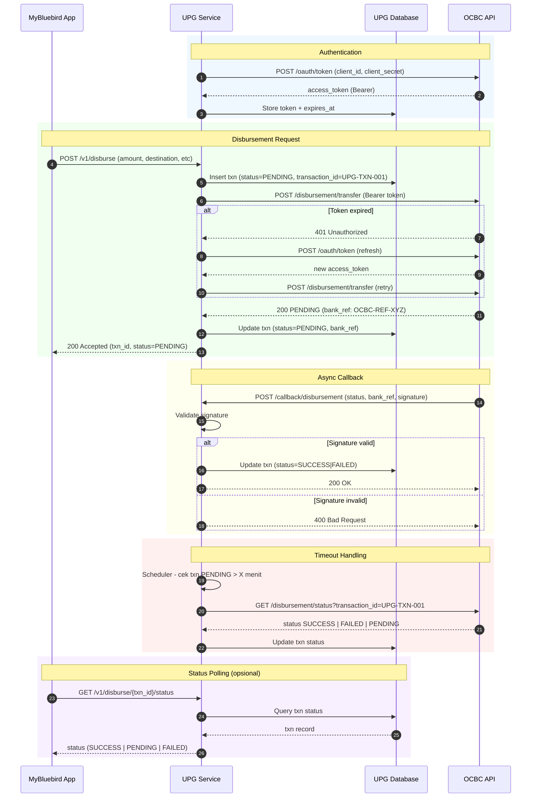

# Meeting Prep - OCBC Disbursement Integration UPG

**Tanggal:** 2026-04-17  
**Tim:** UPG  
**Topik:** Integrasi API REST OCBC untuk Disbursement

---

## Background

OCBC (PT Bank OCBC NISP, Tbk) akan menjadi channel disbursement pertama di UPG. Integrasi menggunakan **API REST** (Connect2OCBC platform). Semua tipe disbursement akan diintegrasikan:

- Real-time single transfer
- Bulk/batch disbursement
- Transfer internal sesama OCBC
- Transfer ke rekening bank lain (BI-FAST/RTGS)

---

## Mekanisme API REST Disbursement

### 1. Authentication

```
POST /oauth/token
Body: client_id + client_secret
Response: access_token (Bearer), expires_in
```

Token disimpan di DB beserta `expires_at`. Refresh otomatis saat expired.

### 2. Transfer Request

```
POST /disbursement/transfer
Header: Authorization: Bearer {token}
Body:
{
  "transaction_id": "UPG-TXN-001",   // idempotency key
  "amount": 150000,
  "currency": "IDR",
  "source_account": "xxx",
  "destination_account": "yyy",
  "destination_bank_code": "028",    // kalau ke bank lain
  "beneficiary_name": "John Doe",
  "description": "Refund order #123"
}
```

### 3. Response Flow

**Synchronous** (response langsung final):
```
← 200 OK { "status": "SUCCESS" | "FAILED", "bank_reference": "OCBC-REF-XYZ" }
```

**Asynchronous** (via callback):
```
← 200 OK { "status": "PENDING", "ref": "..." }
↓
OCBC → POST {callback_url}/disbursement/notify
       { "status": "SUCCESS" | "FAILED", "ref": "..." }
```

### 4. Status Inquiry

```
GET /disbursement/status?transaction_id=UPG-TXN-001
← { "status": "SUCCESS" | "PENDING" | "FAILED" }
```

---

## Sequence Diagram



---

## Hal Kritis di Sisi UPG

| Concern | Handling |
|--------|---------|
| **Timeout** | Selalu inquiry ulang sebelum retry |
| **Idempotency** | `transaction_id` unik per transaksi |
| **Callback keamanan** | Validasi signature dari OCBC |
| **Reconciliation** | Match internal record vs status OCBC |
| **Retry logic** | Hanya retry jika status `PENDING`, bukan `FAILED` |

---

## Pertanyaan untuk Dikonfirmasi ke OCBC

1. Apakah API disbursement sudah **SNAP BI compliant** atau masih proprietary?
2. Response transfer **synchronous** atau **asynchronous** (via callback)?
3. Mekanisme **signature/HMAC** untuk validasi callback
4. Format `transaction_id` — ada constraint panjang/karakter?
5. Limit transaksi per request dan per hari
6. Apakah ada **sandbox environment** untuk testing?
7. Metode transfer yang didukung: BI-FAST, RTGS, SKN — beda endpoint atau parameter?
8. SLA waktu proses per metode transfer

---

## Referensi

- Kode Bank OCBC NISP: `028`
- SWIFT Code: `NISPIDJAXXX`
- Platform API: Connect2OCBC (`api.ocbc.com`)
- Regulasi: SNAP BI (SK Gubernur BI No. 23/10/KEP.GBI/2021)
