# Meeting: OCBC Disbursement SNAP API — Tim UPG
**Tanggal**: 2026-04-27
**Dokumen Referensi**: Tech-Doc OCBC NISP Standar Nasional Open API Pembayaran (SNAP) V1.10
**Scope**: Greenfield implementation — BIFAST, Online Transfer (OLT), RTGS, SKN
**Context**: Diskusi Form OCBC Disbursement untuk implementasi di tim UPG

---

## BAGIAN 1: INTEGRATION FLOW DIAGRAM

### 1.1 Authentication Flow

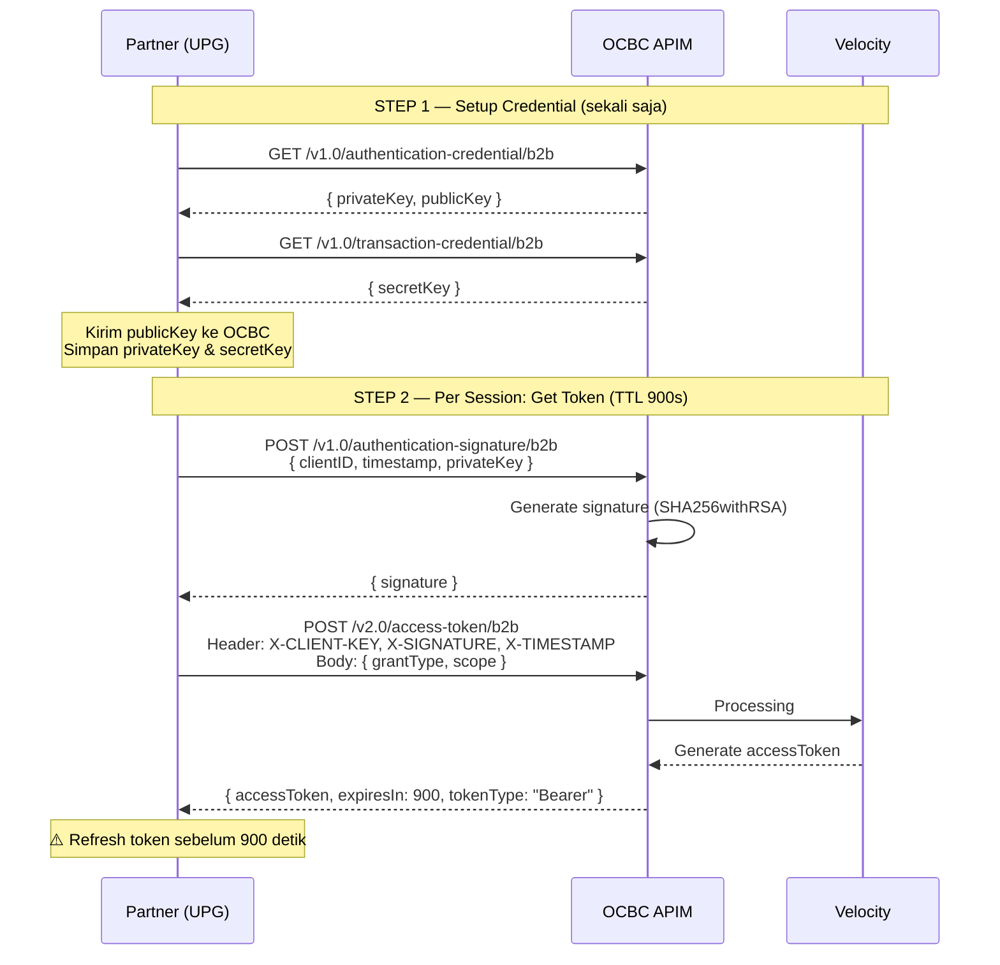

**StringToSign (Token Signature):**
```
stringToSign = client_ID + "|" + X-TIMESTAMP
HmacValue    = SHA256withRSA(SecretKey, stringToSign)
```

**StringToSign (Transaction Signature per request):**
```
stringToSign = HTTPMethod + ":" + EndpointUrl + ":" + AccessToken + ":"
             + Lowercase(HexEncode(SHA-256(minify(RequestBody)))) + ":" + TimeStamp
HmacValue    = HMAC_SHA512(clientSecret, stringToSign)
```

---

### 1.2 BIFAST Transfer Flow (Inquiry → Submit → Status)

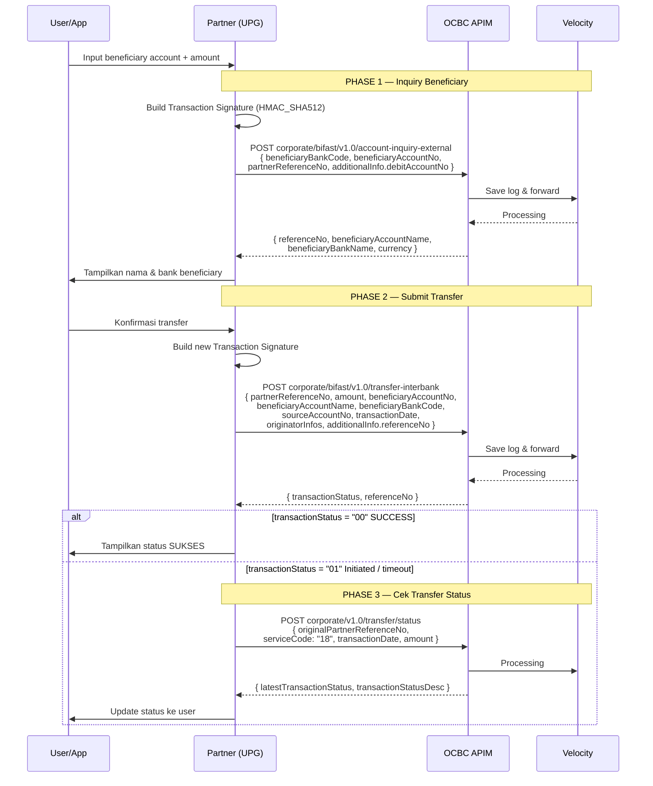

---

### 1.3 Online Transfer (OLT) Flow

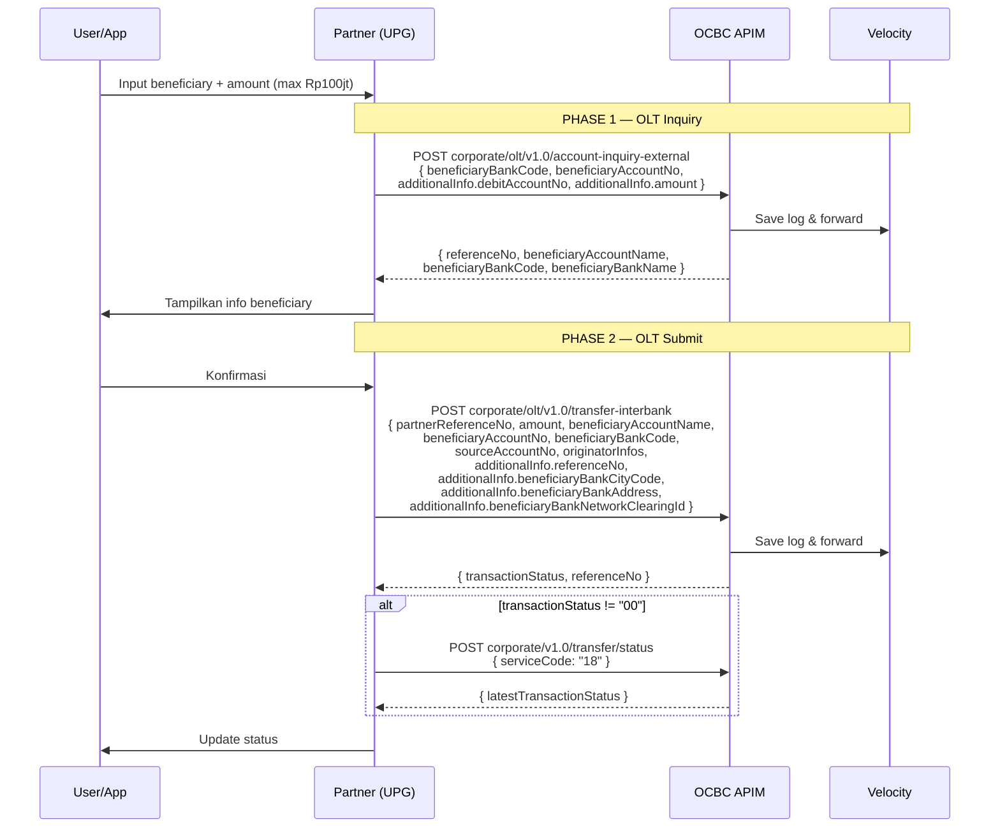

---

### 1.4 RTGS Transfer Flow (Working Hours Only)

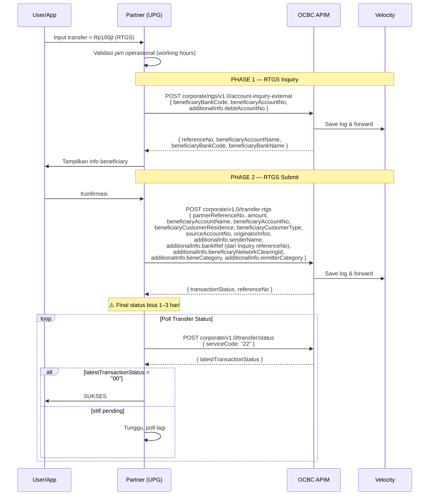

---

### 1.5 SKN Transfer Flow (Working Hours Only)

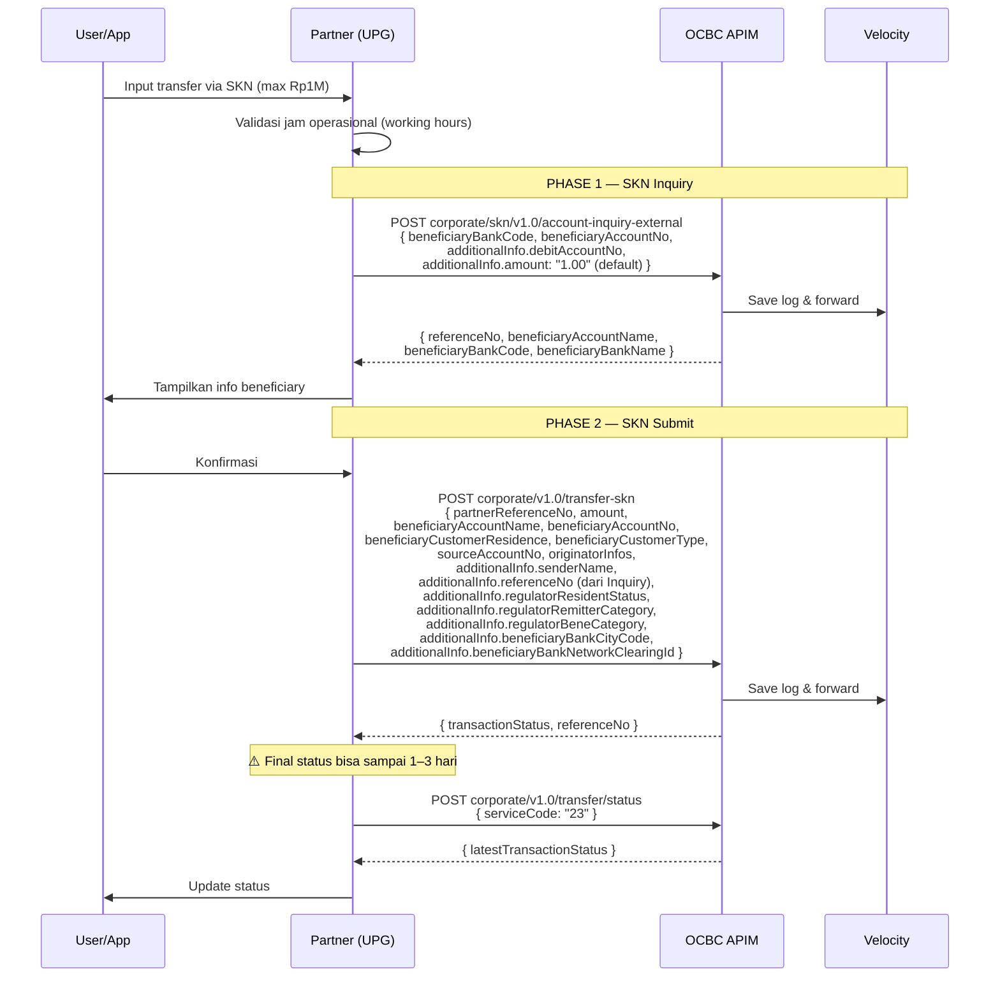

---

### 1.6 Transfer Status — Decision Flow

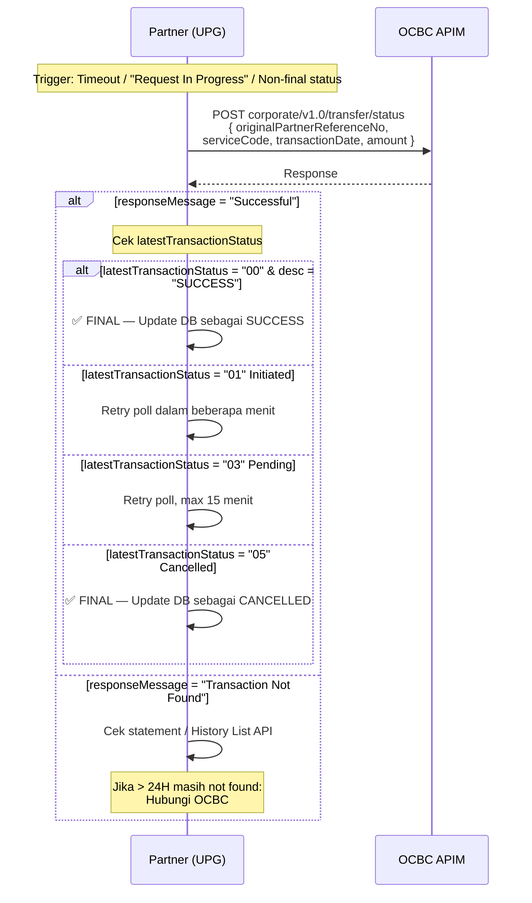

---

### 1.7 Error Handling Flow (Best Practice OCBC)

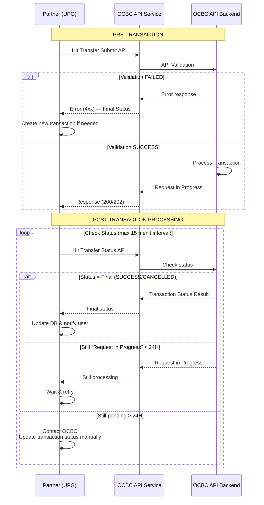

---

## BAGIAN 2: FIELD MAPPING PER CHANNEL

### Common Request Header (SEMUA Transfer API)

| Header | Attr | Keterangan |
|---|---|---|
| `Content-Type` | **M** | `application/json` |
| `Authorization` | **M** | `Bearer {accessToken}` |
| `X-PARTNER-ID` | **M** | Sama dengan ClientID dari OCBC |
| `X-SIGNATURE` | **M** | Dari Transaction Signature (HMAC_SHA512) |
| `X-TIMESTAMP` | **M** | ISO 8601: `yyyy-MM-ddTHH:mm:ss.SSSTZD` |
| `X-EXTERNAL-ID` | **M** | Numeric string, **unik per hari** |
| `CHANNEL-ID` | **M** | `"API"` |

---

### 2.1 BIFAST Inquiry
`POST corporate/bifast/v1.0/account-inquiry-external`

| Field | Type | Attr | Length | Keterangan |
|---|---|---|---|---|
| `beneficiaryBankCode` | String | **M** | 8 | BIC Code bank tujuan |
| `beneficiaryAccountNo` | String | **M** | 34 | No rekening tujuan |
| `partnerReferenceNo` | String | **M** | 64 | 4-digit prefix OCBC + ID unik |
| `additionalInfo.debitAccountNo` | String | **M** | 34 | Rekening sumber |
| `additionalInfo.amount` | String | O | 16,2 | Opsional di v1.10 |
| `additionalInfo.trxPurpose` | String | **M** | 2 | `01`=Investasi `02`=Transfer Wealth `03`=Purchase `99`=Others |

> **Response kunci**: `referenceNo` → **WAJIB disimpan** untuk dipakai di Submit

---

### 2.2 BIFAST Submit
`POST corporate/bifast/v1.0/transfer-interbank` | Max Rp250jt | Fee Rp2.500 | 24x7

| Field | Type | Attr | Length | Keterangan |
|---|---|---|---|---|
| `partnerReferenceNo` | String | **M** | 64 | Harus unik global |
| `amount.value` | String | **M** | 16,2 | Max Rp 250.000.000 |
| `amount.currency` | String | **M** | 3 | `IDR` |
| `beneficiaryAccountName` | String | **M** | 100 | Dari Inquiry response |
| `beneficiaryAccountNo` | String | **M** | 34 | |
| `beneficiaryBankCode` | String | **M** | 8 | BIC |
| `beneficiaryBankName` | String | O | 50 | |
| `beneficiaryEmail` | String | **C** | 50 | Wajib jika `sendEmailNotification=true` |
| `currency` | String | **M** | 3 | `IDR` |
| `customerReference` | String | O | 16 | Ref internal Partner |
| `sourceAccountNo` | String | **M** | 19 | Rekening debit |
| `transactionDate` | String | **M** | 25 | ISO 8601 (bisa future date) |
| `originatorInfos[0].originatorCustomerNo` | String | **M** | 34 | PPATK — ultimate sender acct no |
| `originatorInfos[0].originatorCustomerName` | String | **M** | 100 | PPATK — ultimate sender name |
| `originatorInfos[0].originatorBankCode` | String | **M** | 8 | PPATK — bank code |
| `additionalInfo.referenceNo` | String | **M** | 64 | **Dari BIFAST Inquiry response** |
| `additionalInfo.transactionPurpose` | String | **M** | 2 | `01`–`03`, `99` |
| `additionalInfo.remark` | String | O | 50 | |
| `additionalInfo.sendEmailNotification` | Boolean | **M** | — | `true`/`false` |

---

### 2.3 Online Transfer (OLT) Inquiry
`POST corporate/olt/v1.0/account-inquiry-external`

| Field | Type | Attr | Length | Keterangan |
|---|---|---|---|---|
| `beneficiaryBankCode` | String | **M** | 8 | Kode numerik bank |
| `beneficiaryAccountNo` | String | **M** | 34 | |
| `partnerReferenceNo` | String | **M** | 64 | |
| `additionalInfo.debitAccountNo` | String | **M** | 34 | Rekening sumber |
| `additionalInfo.amount` | String | **M** | 16,2 | Transfer amount |
| `additionalInfo.customerReference` | String | O | 16 | |

---

### 2.4 OLT Submit
`POST corporate/olt/v1.0/transfer-interbank` | Max Rp100jt/trx, Rp500jt/hari | Fee Rp6.500 | 24x7

> Field sama dengan BIFAST Submit, dengan **tambahan khusus OLT**:

| Field | Type | Attr | Keterangan |
|---|---|---|---|
| `additionalInfo.beneficiaryBankCityCode` | String | **M** | CITY_ID — **minta attachment ke tim OCBC** |
| `additionalInfo.beneficiaryBankAddress` | String | **M** | **Minta ke tim OCBC** |
| `additionalInfo.beneficiaryBankNetworkClearingId` | String | **M** | BI_CLEARING_ID — **minta ke tim OCBC** |
| `additionalInfo.referenceNo` | String | **M** | Dari OLT Inquiry response |
| `feeType` | String | O | `OUR` (default) / `BEN` / `SHA` |

---

### 2.5 RTGS Inquiry
`POST corporate/rtgs/v1.0/account-inquiry-external` | Min Rp100.000.001 | Working hours only

| Field | Type | Attr | Length | Keterangan |
|---|---|---|---|---|
| `beneficiaryBankCode` | String | **M** | 8 | |
| `beneficiaryAccountNo` | String | **M** | 34 | |
| `partnerReferenceNo` | String | **M** | 64 | |
| `additionalInfo.debitAccountNo` | String | **M** | 34 | |

> **Response kunci**: `referenceNo` → dipakai sebagai **`bankRef`** di RTGS Submit

---

### 2.6 RTGS Submit
`POST corporate/v1.0/transfer-rtgs` | Min Rp100.000.001 | Fee Rp25.000 | Working hours

> Field dasar sama dengan BIFAST Submit, dengan **tambahan RTGS-specific**:

| Field | Type | Attr | Keterangan |
|---|---|---|---|
| `beneficiaryCustomerResidence` | String | **M** | `1`=Indonesia, `2`=Non-Indonesia |
| `beneficiaryCustomerType` | String | **M** | `1`=Individual, `2`=Corp, `3`=Govt |
| `kodepos` | String | O | Kodepos pengirim |
| `senderCustomerResidence` | String | O | `1`/`2` |
| `senderCustomerType` | String | O | `1`/`2`/`3` |
| `additionalInfo.senderName` | String | **M** | Nama pengirim |
| `additionalInfo.beneficiaryBankBranch` | String | **M** | **Minta ke OCBC** |
| `additionalInfo.beneficiaryBankAddress` | String | **M** | **Minta ke OCBC** |
| `additionalInfo.beneficiaryNetworkClearingId` | String | **M** | RTGS Member Code — **minta ke OCBC** |
| `additionalInfo.beneficiaryCityCode` | String | **M** | 4 digit — **minta ke OCBC** |
| `additionalInfo.beneCategory` | String | **M** | Appendix 6.2 (A0=Perorangan, E0=Perusahaan...) |
| `additionalInfo.remitterCategory` | String | **M** | Appendix 6.2 |
| `additionalInfo.bankRef` | String | **M** | Dari RTGS Inquiry `referenceNo` |

---

### 2.7 SKN Inquiry
`POST corporate/skn/v1.0/account-inquiry-external` | Max Rp1M | Working hours

> Sama seperti RTGS Inquiry. `additionalInfo.amount` default `1.00`.

---

### 2.8 SKN Submit
`POST corporate/v1.0/transfer-skn` | Max Rp1M | Fee Rp2.000 | Working hours

> Field dasar sama dengan BIFAST Submit + **tambahan SKN-specific** (paling banyak field regulasi):

| Field | Type | Attr | Keterangan |
|---|---|---|---|
| `beneficiaryCustomerResidence` | String | **M** | `1`/`2` |
| `beneficiaryCustomerType` | String | **M** | `1`/`2`/`3` |
| `additionalInfo.senderName` | String | **M** | Nama pengirim |
| `additionalInfo.beneficiaryBankCityCode` | String | **M** | **Minta ke OCBC** |
| `additionalInfo.beneficiaryBankBranchName` | String | **M** | **Minta ke OCBC** |
| `additionalInfo.beneficiaryBankAddress` | String | **M** | **Minta ke OCBC** |
| `additionalInfo.beneficiaryBankNetworkClearingId` | String | **M** | BI_CLEARING_ID — **minta ke OCBC** |
| `additionalInfo.regulatorResidentStatus` | String | **M** | `Y`=Resident, `N`=Non-resident |
| `additionalInfo.regulatorRemitterCategory` | String | **M** | Appendix 6.2 |
| `additionalInfo.regulatorBeneCategory` | String | **M** | Appendix 6.2 |
| `additionalInfo.validationCheck` | String | **M** | Default `N` |
| `additionalInfo.referenceNo` | String | **M** | Dari SKN Inquiry response |

---

### 2.9 Transfer Status API
`POST corporate/v1.0/transfer/status`

| Field | Type | Attr | Keterangan |
|---|---|---|---|
| `originalPartnerReferenceNo` | String | **M** | `partnerReferenceNo` dari Submit |
| `originalReferenceNo` | String | O | `referenceNo` dari Submit response |
| `originalExternalId` | String | O | `X-EXTERNAL-ID` dari header Submit |
| `serviceCode` | String | **M** | `17`=Intrabank, `18`=BIFAST/OLT, `22`=RTGS, `23`=SKN |
| `transactionDate` | String | **M** | ISO 8601 |
| `amount.value` | String | **M** | |
| `amount.currency` | String | **M** | `IDR` |

**`latestTransactionStatus` values:**

| Code | Status | Keterangan |
|---|---|---|
| `00` | **SUCCESS** | Final |
| `01` | Initiated | Masih proses |
| `02` | Suspect/Paying | — |
| `03` | Pending | — |
| `05` | Cancelled | Final |
| `06` | Failed | Final |
| `07` | Not Found | Contact OCBC |

### Service Code Reference

| Code | Layanan |
|---|---|
| 11 | Balance Inquiry |
| 12 | History List |
| 15 | Internal Inquiry |
| 16 | BIFAST / OLT / RTGS / SKN Inquiry |
| 17 | Intrabank Submit |
| 18 | BIFAST & OLT Submit |
| 22 | RTGS Submit |
| 23 | SKN Submit |
| 36 | Transfer Status |

---

## BAGIAN 3: IMPLEMENTATION CHECKLIST

### A. Pre-Development Setup
- [ ] Hubungi `API_Solutions@ocbc.id` untuk dapatkan `clientID` dan `clientSecret`
- [ ] Generate RSA key pair: `openssl genrsa -out rsa.private 1024` → export public key
- [ ] Kirim `publicKey` ke OCBC, simpan `privateKey` aman di sistem sendiri
- [ ] **Minta attachment dari OCBC**: bankCityCode, bankAddress, networkClearingId (wajib OLT, RTGS, SKN)
- [ ] **Minta 4-digit prefix** untuk `partnerReferenceNo` dari OCBC
- [ ] Inject certificate **mTLS** dari OCBC ke backend (domain `snapapi.ocbc.id` produksi)
- [ ] Sandbox URL: `https://developer.ocbc.id/snap/apis/`
- [ ] Production URL: `https://snapapi.ocbc.id/`

### B. Authentication Layer
- [ ] Implementasi Token generation (4 step)
- [ ] Implementasi **auto-refresh** token sebelum 900 detik habis
- [ ] Implementasi Transaction Signature per request (HMAC_SHA512)
- [ ] Simpan `secretKey` secara aman (env variable / vault)

### C. Request Building
- [ ] Generator `partnerReferenceNo` yang **globally unique** — format: `{prefix}{timestamp}{uuid}`
- [ ] Generator `X-EXTERNAL-ID` yang **unik per hari** (reset setiap hari / rolling)
- [ ] `transactionDate` format ISO 8601: `yyyy-MM-ddTHH:mm:ss.SSSTZD`
- [ ] **BIFAST/OLT**: Inquiry → simpan `referenceNo` → kirim ke `additionalInfo.referenceNo` di Submit
- [ ] **RTGS**: Inquiry → simpan `referenceNo` → kirim sebagai `additionalInfo.bankRef` di Submit
- [ ] **SKN**: Inquiry → simpan `referenceNo` → kirim ke `additionalInfo.referenceNo` di Submit
- [ ] Selalu isi `originatorInfos` (kepatuhan PPATK — pasal 8 ayat 5 UU No.3/2011)

### D. Error Handling & Retry Logic
- [ ] **Timeout / 504**: Jangan buat transaksi baru — hit Transfer Status API dulu
- [ ] **Request In Progress (202)**: Polling Transfer Status tiap X menit, max 15 menit sebelum eskalasi
- [ ] **Duplicate `partnerReferenceNo` (409-01)**: Submit sebelumnya sudah sukses — cek status, jangan retry
- [ ] **Duplicate `X-EXTERNAL-ID` (409-00)**: Generate `X-EXTERNAL-ID` baru
- [ ] Status **Request In Progress > 24 jam**: hubungi OCBC
- [ ] Implementasi **idempotency**: simpan mapping `partnerReferenceNo ↔ status` di database

### E. RTGS & SKN Khusus
- [ ] Validasi jam operasional di backend sebelum submit (working hours only)
- [ ] EOD window BIFAST/OLT (00.00–05.01): akan return "Request In Progress" — inform user
- [ ] Final status RTGS/SKN bisa 1–3 hari — jangan retry sebelum cek Transfer Status
- [ ] Siapkan data regulasi SKN: `regulatorResidentStatus`, `regulatorRemitterCategory`, `regulatorBeneCategory`
- [ ] Siapkan `beneCategory` + `remitterCategory` RTGS dari Appendix 6.2

### F. Testing & Go-Live
- [ ] Test semua channel di Sandbox
- [ ] Selesaikan **ASPI Functional Scenario & Developer Site Testing** di ASPI Portal sebelum produksi
- [ ] Test Transfer Status API untuk skenario: success, pending, timeout, not found
- [ ] Verifikasi signature calculation dengan Postman (`/v1.0/transaction-signature/b2b` — testing only)

---

## BAGIAN 4: FLOW DIAGRAMS — Mermaid Flowchart (dari PDF)

> Konversi dari diagram asli PDF OCBC SNAP v1.10

---

### 4.1 Token Flow to Service (Hal. 10)

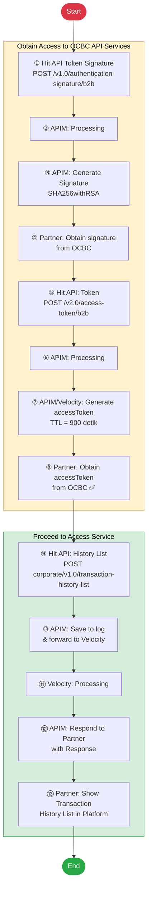

---

### 4.2 Balance Inquiry Flow (Hal. 21)

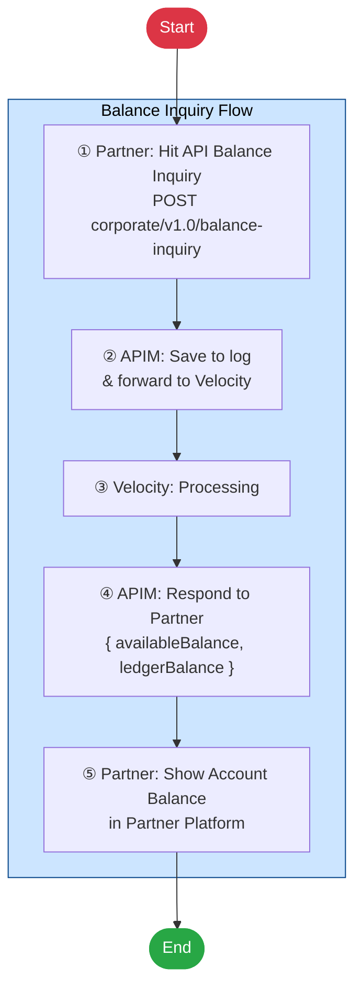

---

### 4.3 History List Flow (Hal. 25)

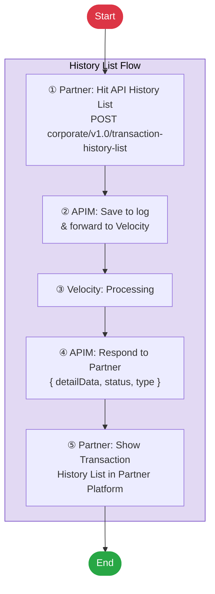

---

### 4.4 API Transfer Flow — Generic (Hal. 31)

> Berlaku untuk: **BIFAST, Online Transfer, SKN, RTGS, Intrabank**

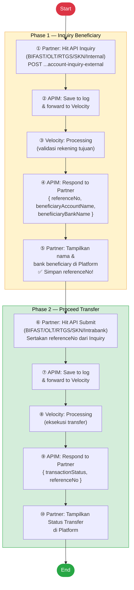

---

### 4.5 Transfer Status Flow + Decision Tree (Hal. 78)

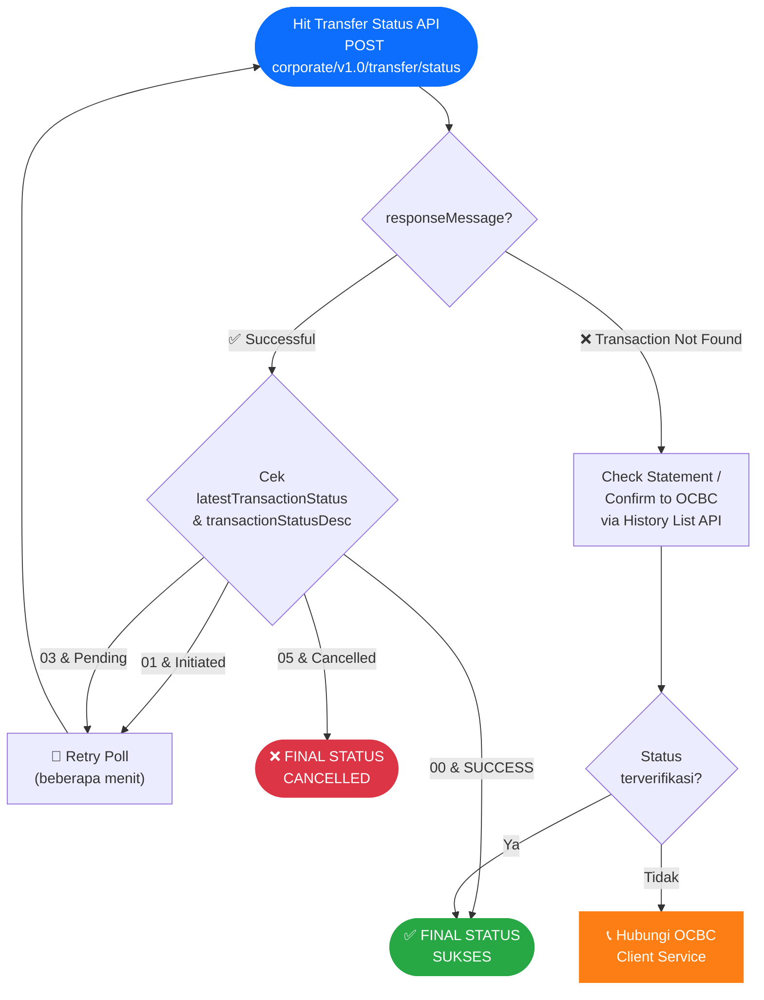

---

### 4.6 Error Handling Flow for Partner (Hal. 84)

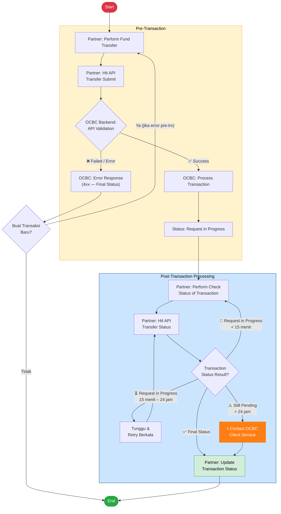

---

### 4.7 Transaction Signature Generation Flow (Hal. 18-20)

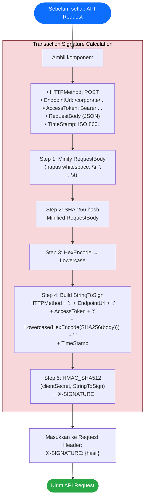

---

### 4.8 Ringkasan Alur Lengkap — End-to-End Disbursement

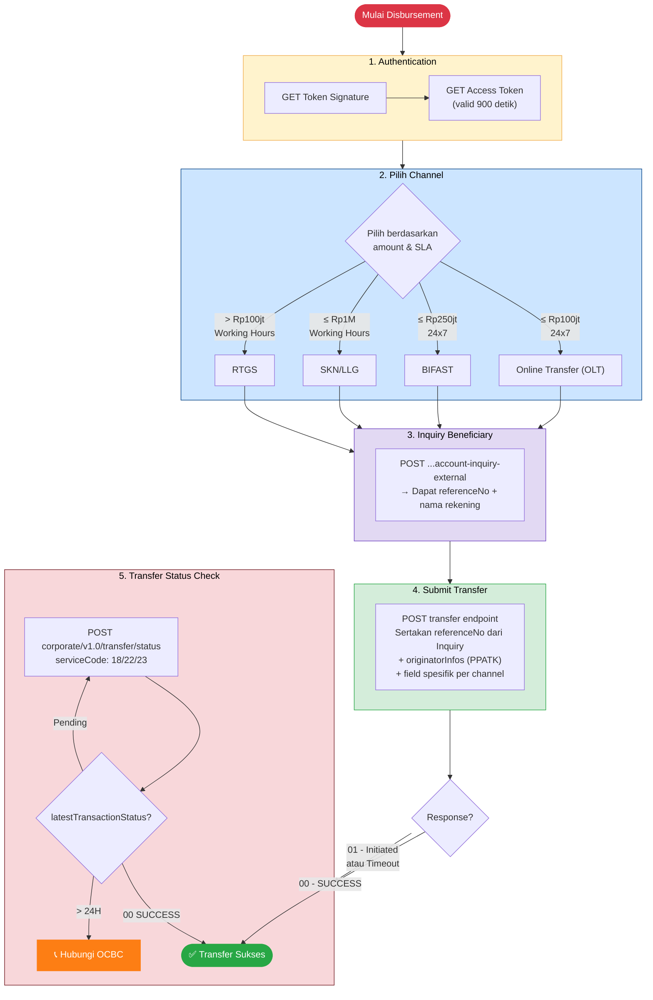

---

## REMITTER / BENEFICIARY CATEGORY CODE (Appendix 6.2)

| Code | Keterangan |
|---|---|
| A0 | Perorangan |
| B0 | Pemerintah |
| C0 | Bank Central |
| C1 | Bank Pelapor di Dalam Negeri |
| C9 | Bank Lainnya |
| D0 | Lembaga Keuangan Non-Bank |
| E0 | Perusahaan |
| F1 | Lembaga/Organisasi Internasional Berbentuk Bank |
| F2 | Lembaga/Organisasi Internasional Bukan Bank |
| I0 | Pelaku Identik |
| Z9 | Lainnya |

---

## KEY DECISIONS — Pertanyaan untuk Meeting

| Topik | Yang Perlu Diputuskan |
|---|---|
| **Token refresh strategy** | Background job atau lazy refresh? |
| **`partnerReferenceNo` format** | Convention yang disepakati tim UPG? |
| **`originatorInfos` source** | Data ultimate sender diambil dari mana di sistem UPG? |
| **Bank metadata attachment** | Kapan file attachment dari OCBC bisa diterima? |
| **Error escalation SLA** | Berapa lama sebelum kontak OCBC jika status stuck >24H? |
| **SKN regulatory fields** | `regulatorResidentStatus` hardcode atau dari data nasabah? |
| **Email notification** | `sendEmailNotification` selalu `false` atau configurable? |
| **RTGS/SKN working hours guard** | Validasi di UI atau backend? |
| **Transfer channel selection** | Logika pemilihan channel otomatis atau pilihan user? |

---

## TRANSACTION LIMIT SUMMARY

| Channel | Min | Max/Trx | Limit/Hari | Fee | Jam Operasi |
|---|---|---|---|---|---|
| Intrabank (Overbooking) | Rp1 | Unlimited | Unlimited | — | 24x7 |
| Online Transfer (OLT) | Rp10.000 | Rp100.000.000 | Rp500.000.000 | Rp6.500 | 24x7 |
| BIFAST | Rp1 | Rp250.000.000 | Unlimited | Rp2.500 | 24x7 |
| SKN/LLG | Rp1 | Rp1.000.000.000 | Unlimited | Rp2.000 | Working hours |
| RTGS | Rp100.000.001 | Unlimited | Unlimited | Rp25.000 | Working hours |

---

*Sumber: OCBC NISP Tech-Doc SNAP v1.10 (17 Jul 2025)*
*Reference document: "D:\reference document\2. Tech-Doc-OCBC NISP Standar Nasional Open API Pembayaran (SNAP) V1.10 (1).pdf"
*Ditulis otomatis via Claude Code — 2026-04-27*
