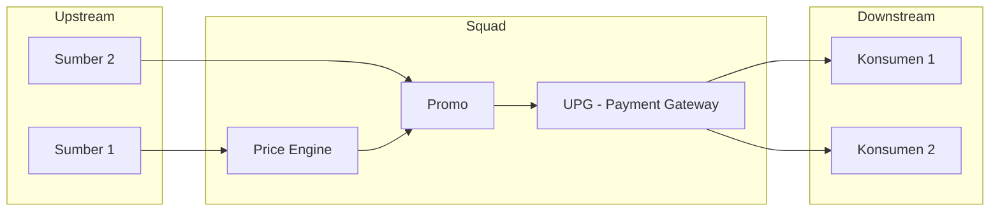
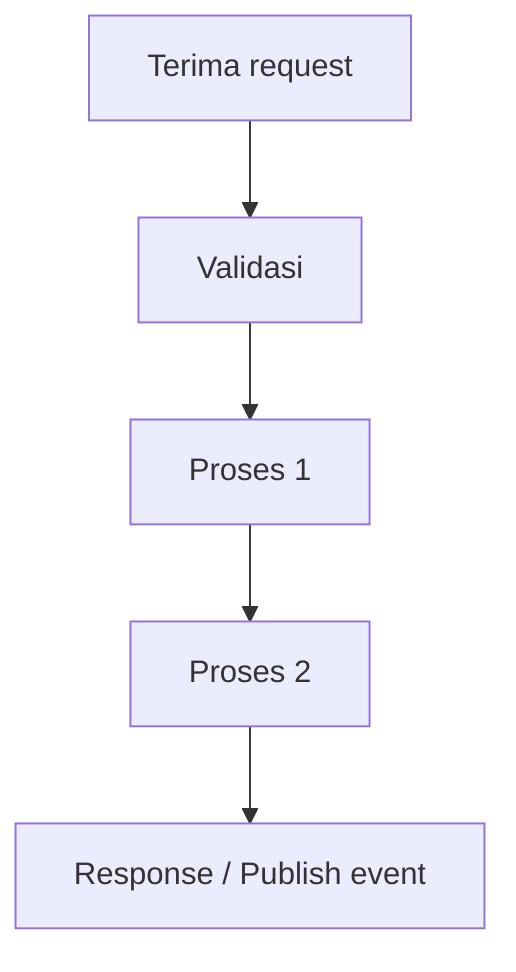
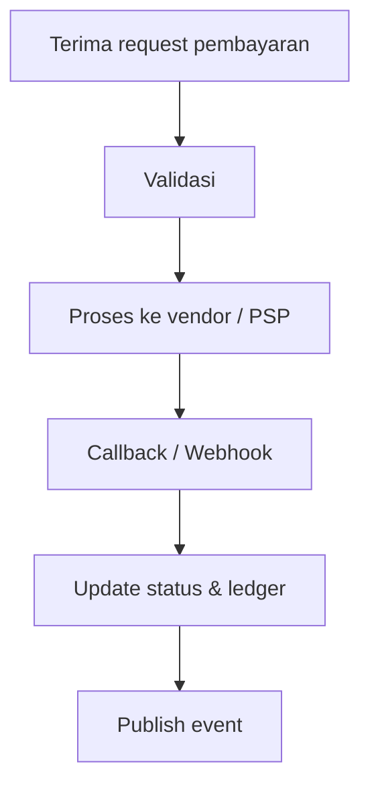
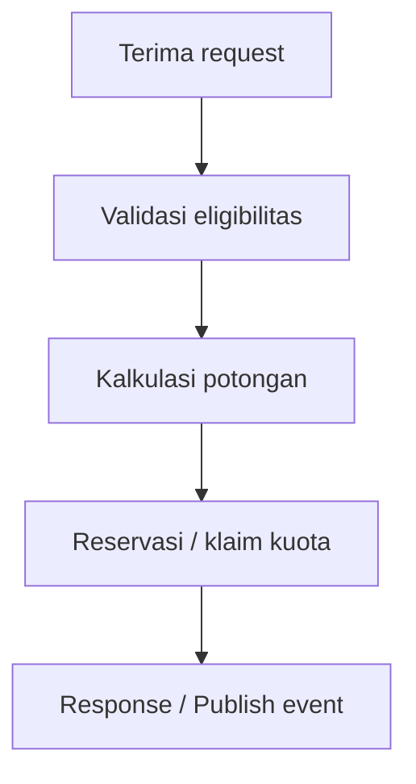

# Workshop IT Risk Management — Upstream/Downstream & Impact Analysis

## 📋 Info
| Item | Detail |
|------|--------|
| Tanggal | 2026-09-29 |
| Waktu | |
| Lokasi / Media | |
| Penyelenggara | |
| Pembicara / Fasilitator | |
| Peserta | |

## 🎯 Ekspektasi Workshop
Untuk setiap tim/layanan, siapkan:
1. **Upstream data** — dari mana data masuk
2. **Downstream data** — ke mana data keluar
3. **Analisis dampak** — jika bermasalah, tim mana saja yang terdampak
4. **Proses internal** — proses apa saja yang terjadi di dalam layanan
5. **Diskusi terbuka** — *drill-down* alur dan data

---

## 🗺️ Peta Dependensi Antar Tim

> Sesuaikan node dan arah panah dengan kondisi aktual.

---

## 1️⃣ Price Engine

### Upstream Data
| Sumber (Tim/Service) | Data | Protokol (gRPC/REST/Kafka/RabbitMQ) | Pola (sync/async) | Frekuensi / Volume |
|----------------------|------|-------------------------------------|-------------------|--------------------|
| | | | | |

### Downstream Data
| Tujuan (Tim/Service) | Data | Protokol | Pola | Kritikalitas |
|----------------------|------|----------|------|--------------|
| | | | | |

### Proses Internal

- Data store (PostgreSQL/Redis): 
- Konfigurasi / rule: 
- Ketergantungan eksternal: 

### Analisis Dampak
| Skenario Gangguan | Tim Terdampak | Dampak Bisnis | Severity | Fallback / Mitigasi |
|-------------------|---------------|---------------|----------|---------------------|
| Service down | | | | |
| Latensi tinggi | | | | |
| Data tidak valid | | | | |
| Dependensi upstream gagal | | | | |

---

## 2️⃣ UPG (Universal Payment Gateway)

### Upstream Data
| Sumber (Tim/Service) | Data | Protokol (gRPC/REST/Kafka/RabbitMQ) | Pola (sync/async) | Frekuensi / Volume |
|----------------------|------|-------------------------------------|-------------------|--------------------|
| | | | | |

### Downstream Data
| Tujuan (Tim/Service/Vendor) | Data | Protokol | Pola | Kritikalitas |
|-----------------------------|------|----------|------|--------------|
| | | | | |

### Proses Internal

- Data store (PostgreSQL/Redis): 
- Integrasi vendor/PSP: 
- Rekonsiliasi: 

### Analisis Dampak
| Skenario Gangguan | Tim Terdampak | Dampak Bisnis | Severity | Fallback / Mitigasi |
|-------------------|---------------|---------------|----------|---------------------|
| Service down | | | | |
| Vendor/PSP gagal | | | | |
| Webhook tertunda/hilang | | | | |
| Inkonsistensi ledger | | | | |

---

## 3️⃣ Promo

### Upstream Data
| Sumber (Tim/Service) | Data | Protokol (gRPC/REST/Kafka/RabbitMQ) | Pola (sync/async) | Frekuensi / Volume |
|----------------------|------|-------------------------------------|-------------------|--------------------|
| | | | | |

### Downstream Data
| Tujuan (Tim/Service) | Data | Protokol | Pola | Kritikalitas |
|----------------------|------|----------|------|--------------|
| | | | | |

### Proses Internal

- Data store (PostgreSQL/Redis): 
- Pengelolaan kuota & budget: 
- Ketergantungan eksternal: 

### Analisis Dampak
| Skenario Gangguan | Tim Terdampak | Dampak Bisnis | Severity | Fallback / Mitigasi |
|-------------------|---------------|---------------|----------|---------------------|
| Service down | | | | |
| Kuota tidak sinkron | | | | |
| Promo salah terapkan | | | | |
| Dependensi upstream gagal | | | | |

---

## 🔍 Diskusi Terbuka — Drill-down Alur & Data
### Pertanyaan Pemandu
- Titik tunggal kegagalan (*single point of failure*) ada di mana?
- Alur mana yang *sync* dan berpotensi *cascading failure*?
- Bagaimana penanganan *retry*, *idempotency*, dan *timeout*?
- Data apa yang bersifat sensitif (PII/finansial) dan bagaimana perlindungannya?
- Bagaimana *observability* (Grafana/Kibana) untuk mendeteksi gangguan?
- Siapa *owner* dan alur eskalasi saat insiden?

### Catatan Diskusi
- 

---

## ⚠️ Risk Register
| ID | Risk | Tim / Service | Likelihood | Impact | Level | Mitigasi | Owner |
|----|------|---------------|-----------|--------|-------|----------|-------|
| R-01 | | | | | | | |
| R-02 | | | | | | | |
| R-03 | | | | | | | |

## ✅ Action Items
- [ ] Lengkapi upstream/downstream Price Engine
- [ ] Lengkapi upstream/downstream UPG
- [ ] Lengkapi upstream/downstream Promo
- [ ] Validasi analisis dampak dengan masing-masing tim
- [ ] 

## 📎 Referensi
- Materi / slide: 
- Link terkait: 
