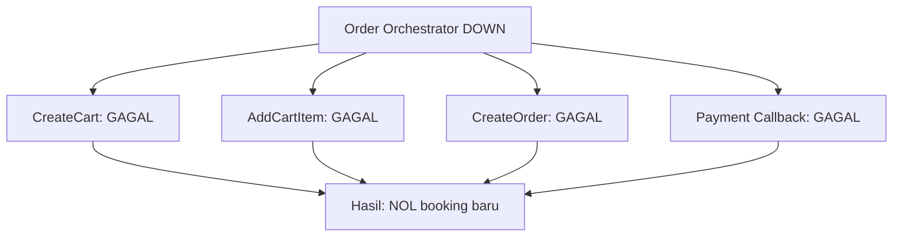
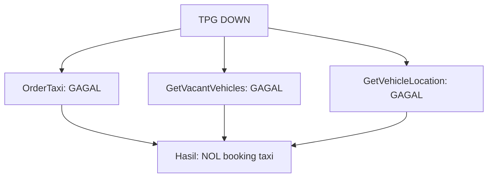
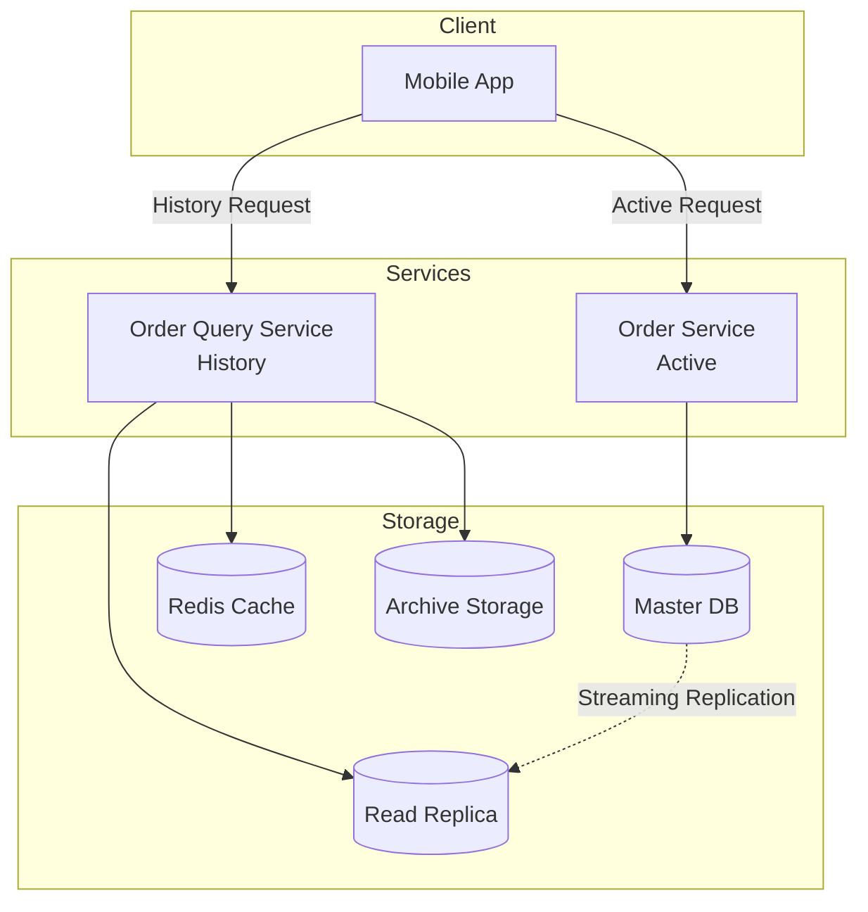
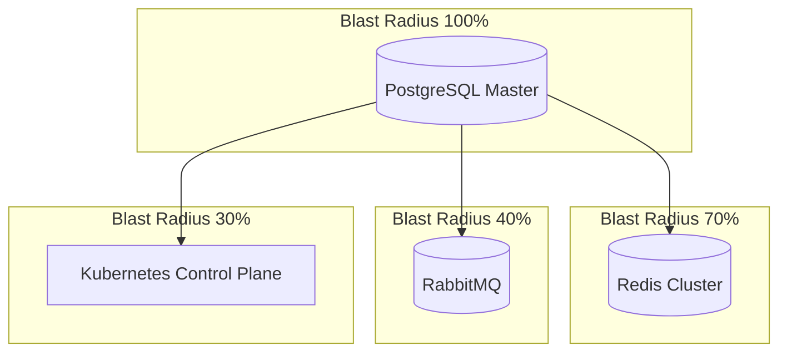
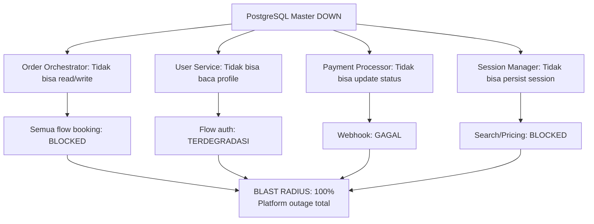
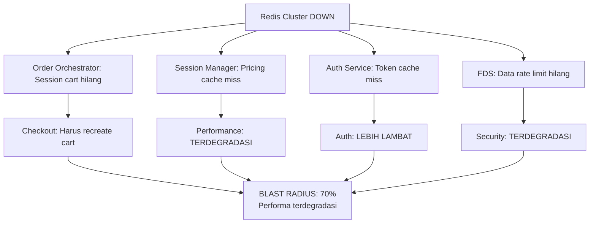
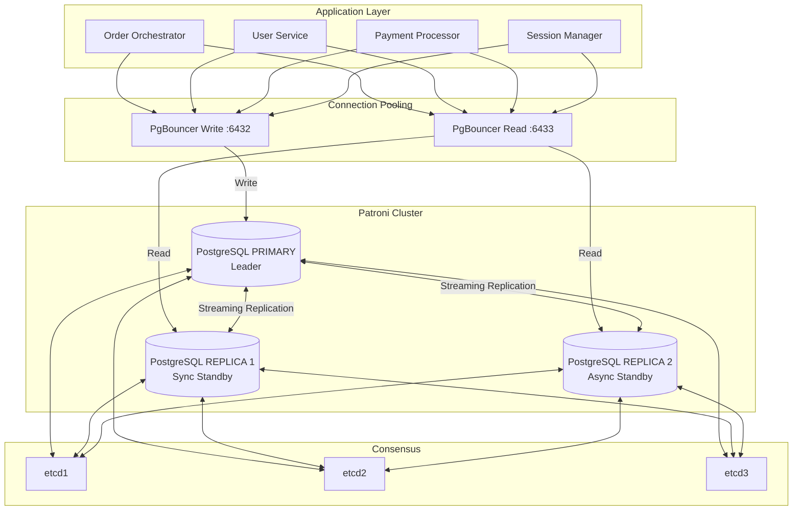

---
tags:
  - mrg
  - architecture
  - spof
  - reliability
  - incident-response
  - database-ha
  - patroni
  - circuit-breaker
type: technical-analysis
status: active
severity: high-priority
created: '2025-01-08'
updated: '2026-01-08'
version: '3.0'
reviewed_by: Senior Architect
aliases:
  - SPOF Assessment
  - Single Point of Failure
---
# MRG - Analisis Single Point of Failure & Strategi Mitigasi

> [!info] Metadata Dokumen
> **Versi**: 3.0 | **Terakhir Diperbarui**: 2026-01-08  
> **Pemilik**: Tim Platform Engineering MRG  
> **Status**: Analisis Aktif & Implementasi  
> **Reviewer**: Senior Architect

---

## Ringkasan Eksekutif

Analisis komprehensif terhadap arsitektur MRG mengidentifikasi **multiple layers of SPOF**:

- **10 Service Kritikal** dengan karakteristik Single Point of Failure
- **SPOF Level Arsitektur** pada endpoint Order Detail yang mempengaruhi skalabilitas database
- **SPOF Infrastruktur** pada database, cache, dan dependensi message queue
- **SPOF Dependensi Eksternal** pada payment gateway, sistem dispatch, dan map provider

> [!warning] Temuan Utama v3.0
> - PostgreSQL adalah SPOF terbesar dengan blast radius 100% - membutuhkan Patroni HA
> - Taxi Partner Gateway HIGH RISK - tidak ada circuit breaker atau fallback
> - Sistem BBD adalah single external dependency tanpa redundancy
> - Health check sudah 100% coverage
> - Payment gateway sudah multi-provider dengan failover

**Dampak Bisnis**:
- Potensi kehilangan revenue: signifikan per jam untuk insiden P0
- Dampak kepuasan pelanggan pada degradasi layanan
- Kompleksitas operasional meningkat dengan banyak interdependencies

---

## Daftar Isi

1. [[#Analisis SPOF Level Service]]
2. [[#SPOF Level Arsitektur - Optimasi Order Detail]]
3. [[#Matriks Dampak SPOF]]
4. [[#Analisis Blast Radius]]
5. [[#Objektif RTO dan RPO]]
6. [[#Checklist Audit Kode]]
7. [[#SPOF Dependensi Eksternal]]
8. [[#Arsitektur High Availability Database]]
9. [[#Strategi Mitigasi]]
10. [[#Roadmap Implementasi]]
11. [[#Monitoring dan Alerting]]
12. [[#Respons Insiden]]

---

## Analisis SPOF Level Service

> [!note] Catatan
> Semua service yang terdaftar sudah mengimplementasi health check (liveness + readiness probe) dan berjalan dengan multiple pod untuk high availability. Detail implementasi health check tersedia di bagian [[#Referensi Implementasi Health Check]].

### Service SPOF Kritikal

#### 1. Order Orchestrator

> [!danger] KRITIKAL
> **Repository**: `git.bluebird.id/mybb-ms/orderorchestrator`  
> **Dampak**: Kegagalan total pembuatan order

**Mengapa SPOF**:
- **Central Orchestration Point**: Koordinasi seluruh lifecycle order multi-service (Taxi, Rent, Delivery, Shuttle)
- **Shopping Cart Management**: Semua operasi cart (create, add item, checkout)
- **Payment Orchestration**: Pembuatan payment link dan webhook callback
- **Saga Pattern Coordinator**: Manajemen distributed transaction
- **No Bypass**: Tidak ada jalur alternatif untuk membuat order

**Skenario Kegagalan**:



**Dependensi yang Menyebabkan Cascading Failure**:
- PostgreSQL down → Tidak bisa create/read booking
- Redis down → Session cart hilang
- RabbitMQ down → Saga compensation tidak jalan
- Payment Processor down → Tidak bisa generate payment link

**Mitigasi Saat Ini**:
- [x] Multiple pod (K8s deployment) dengan auto-scaling
- [x] Health check terimplementasi: `/health` (liveness), `/ready` (readiness)
- [x] Database connection pooling dengan health validation
- [x] Redis failover via sentinel dengan connection health check
- [x] Kubernetes auto-healing berdasarkan probe failure

**Perbaikan yang Direkomendasikan**:
- [ ] Circuit breaker untuk downstream service
- [ ] Saga timeout dengan manual intervention queue
- [ ] Read-write separation untuk endpoint high-traffic
- [ ] Graceful degradation: Izinkan pembuatan cart tanpa real-time pricing

---

#### 2. Payment Processor / UPG

> [!danger] KRITIKAL
> **Repository**: `git.bluebird.id/mybb-ms/paymentprocessor` (tim UPG)  
> **Dampak**: Flow pembayaran completely blocked

**Mengapa SPOF**:
- **Payment Link Generation**: Semua order butuh payment URL
- **Payment Webhook Handler**: Proses payment success/failure
- **Multi-Payment Gateway Proxy**: Interface ke Midtrans, Nicepay, Xendit
- **Refund Orchestration**: Handle refund request
- **No Alternative**: Tidak ada direct integration ke payment gateway

**Perbaikan yang Direkomendasikan**:
- [ ] Payment gateway health check dengan auto-routing
- [ ] Async payment webhook dengan retry queue
- [ ] Dashboard manual intervention untuk stuck payment
- [ ] Payment link pre-generation dan caching

---

#### 3. Taxi Partner Gateway

> [!danger] KRITIKAL
> **Repository**: `git.bluebird.id/mybb-ms/taxipartnergateway`  
> **Dampak**: Tidak bisa booking order taxi (core business)

**Mengapa SPOF**:
- **Single Bridge ke BBD**: Interface ke Bluebird Dispatch system
- **Driver Assignment**: Semua taxi order dispatch
- **Real-time Vehicle Tracking**: Update lokasi
- **Order Lifecycle Management**: Create, update, cancel
- **No Direct Access**: Service lain tidak bisa langsung call BBD



**SPOF Dependensi Eksternal**:
- BBD System Down → Tidak bisa create order
- BBD Auth Service Down → API call blocked

**Perbaikan yang Direkomendasikan**:
- [ ] BBD health check dengan fallback notification
- [ ] Order queue untuk BBD downtime
- [ ] Cache lokasi kendaraan untuk grace period
- [ ] Circuit breaker pattern dengan exponential backoff

---

#### 4. User Service

> [!danger] KRITIKAL
> **Repository**: `git.bluebird.id/mybb-ms/userservice`  
> **Dampak**: Tidak bisa authenticate, operasi profile gagal

**Mengapa SPOF**:
- **Profile Management**: CRUD user profile
- **Payment Method Storage**: Default payment, saved method
- **Favorite Address**: Digunakan di 90% booking
- **Login Support**: Password validation, OTP management
- **User Context**: Hampir semua service butuh data user

**Perbaikan yang Direkomendasikan**:
- [ ] User data caching di client side dengan TTL
- [ ] Graceful degradation: Izinkan order dengan manual input
- [ ] Essential data replication ke service lain
- [ ] Stale cache serving mode untuk emergency

---

### Service SPOF Tinggi

#### 5. Session Manager

> [!warning] TINGGI
> **Dampak**: Tidak bisa search/pricing kendaraan

**Mengapa SPOF**: Fleet search session management, pricing engine, vehicle availability check

**Perbaikan yang Direkomendasikan**:
- [ ] Pricing snapshot di Order Orchestrator
- [ ] Last-known-good pricing fallback
- [ ] Pre-calculated fare table untuk rute umum

---

#### 6. Auth Service

> [!warning] TINGGI
> **Dampak**: Tidak bisa authenticate session baru

**Mengapa SPOF**: Token generation, validation, session management

**Perbaikan yang Direkomendasikan**:
- [ ] Token validation caching dengan sliding window
- [ ] Multi-factor fallback authentication
- [ ] Offline token validation mode (public key cryptography)

---

#### 7. Config Service

> [!warning] TINGGI
> **Dampak**: Update konfigurasi dinamis blocked

**Mengapa SPOF**: Feature flag, operational city mapping (kritikal untuk HO Gateway), dynamic config

**Perbaikan yang Direkomendasikan**:
- [ ] Config snapshot di local file (boot-time fallback)
- [ ] Config cache dengan long TTL
- [ ] Pisahkan critical config dari feature flag

---

#### 8. Notification Center

> [!warning] TINGGI
> **Dampak**: Customer tidak menerima notifikasi

**Mengapa SPOF**: Multi-channel notification (Email, SMS, Push, WhatsApp), OTP delivery

**Perbaikan yang Direkomendasikan**:
- [ ] Notification queue dengan DLQ
- [ ] Provider fallback (SendGrid → AWS SES)
- [ ] Prioritas notifikasi kritikal vs non-kritikal

---

### Service SPOF Sedang

#### 9. FDS (Fraud Detection System)

> [!note] SEDANG
> **Dampak**: Security control disabled

**Mengapa SPOF**: Soft/hard ban management, OTP spam prevention, login attempt tracking

**Perbaikan yang Direkomendasikan**:
- [ ] Cached ban list di consuming service
- [ ] Fallback ke strict mode vs allow-all
- [ ] Rate limiting di API Gateway level

---

#### 10. HO Gateway

> [!note] SEDANG
> **Dampak**: Transaksi e-wallet tidak sync ke HO

**Mengapa SPOF**: HO system integration, e-wallet transaction sync, accounting reconciliation

**Perbaikan yang Direkomendasikan**:
- [ ] Batch reconciliation job
- [ ] Dashboard manual retry
- [ ] Multiple retry strategy

---

## SPOF Level Arsitektur - Optimasi Order Detail

### Masalah yang Teridentifikasi

> [!warning] Performance Bottleneck Kritikal
> Endpoint Order Detail dapat menyebabkan:
> - Database load tinggi pada master DB
> - Blocking write operation (order creation/update)
> - Poor scalability pattern untuk operasi read-heavy

### Analisis Root Cause

**Problem**: Single endpoint `/orders/{orderId}` melayani:
- Active order tracking (5-10% traffic, butuh real-time)
- History order browsing (90-95% traffic, eventual consistency OK)
- Keduanya hit **master database** → Tidak optimal!

**Dampak**:
- Master DB overload dengan read query
- Write path (order creation) terganggu
- Tidak bisa scale read dan write secara independen
- Biaya infrastruktur tinggi (over-provisioned master DB)

### Strategi Smart Endpoint: Active vs History Order

> [!tip] Key Insight
> Perilaku order berbeda berdasarkan state:
> - **Active Order** (ongoing, assigned, picked_up): Data **mutable**, butuh update **real-time**
> - **History Order** (completed, cancelled): Data **immutable**, tidak ada perubahan lagi

**Mengapa Strategi Ini Berhasil**:

| Aspek | Active Order | History Order |
|-------|--------------|---------------|
| Volume | 5-10% traffic | 90-95% traffic |
| Konsistensi | Real-time needed | Eventual OK |
| Sumber Data | Master/hot replica | Read replica/cache |
| Cache TTL | 10-30 detik | 1-24 jam |

### Desain Endpoint

```
GET /orders/{orderId}/active     → Detail order aktif (real-time)
GET /orders/{orderId}/history    → Detail order history (eventual consistency)
GET /orders/history              → Daftar order history
GET /orders/active               → Daftar order aktif
```

### Diagram Arsitektur



### Implementasi Kode

```go
// Order Query Service - Smart Routing
type OrderQueryService struct {
    masterDB     *sql.DB
    replicaDB    *sql.DB
    cache        *redis.Client
    archiveStore ArchiveStore
}

func (s *OrderQueryService) GetOrderDetail(ctx context.Context, orderID string, orderType string) (*OrderDetail, error) {
    switch orderType {
    case "active":
        return s.getActiveOrderDetail(ctx, orderID)
    case "history":
        return s.getHistoryOrderDetail(ctx, orderID)
    default:
        return s.getOrderDetailAuto(ctx, orderID)
    }
}

// Active Order: Real-time dari master
func (s *OrderQueryService) getActiveOrderDetail(ctx context.Context, orderID string) (*OrderDetail, error) {
    // Cek cache short-lived (10-30s TTL)
    if cached, err := s.cache.Get(ctx, "active:"+orderID).Result(); err == nil {
        var order OrderDetail
        if json.Unmarshal([]byte(cached), &order) == nil {
            return &order, nil
        }
    }
    
    // Baca dari master DB dengan timeout
    ctx, cancel := context.WithTimeout(ctx, 200*time.Millisecond)
    defer cancel()
    
    order, err := s.queryFromMaster(ctx, orderID)
    if err != nil {
        return nil, fmt.Errorf("gagal mendapatkan active order: %w", err)
    }
    
    // Cache dengan short TTL
    s.cacheOrder(ctx, "active:"+orderID, order, 30*time.Second)
    return order, nil
}

// History Order: Eventual consistency dari replica/cache
func (s *OrderQueryService) getHistoryOrderDetail(ctx context.Context, orderID string) (*OrderDetail, error) {
    // Cek cache long-lived dulu (1-24 jam TTL)
    cacheKey := "history:" + orderID
    if cached, err := s.cache.Get(ctx, cacheKey).Result(); err == nil {
        var order OrderDetail
        if json.Unmarshal([]byte(cached), &order) == nil {
            return &order, nil
        }
    }
    
    // Coba read replica (acceptable lag: 1-5s)
    order, err := s.queryFromReplica(ctx, orderID)
    if err != nil {
        if isOldOrder(orderID) {
            return s.queryFromArchive(ctx, orderID)
        }
        return nil, fmt.Errorf("gagal mendapatkan history order: %w", err)
    }
    
    // Cache dengan long TTL karena immutable
    s.cacheOrder(ctx, cacheKey, order, 24*time.Hour)
    return order, nil
}

// Helper: Tentukan apakah order di final state
func (o *OrderDetail) IsFinalState() bool {
    finalStates := map[string]bool{
        "completed":           true,
        "cancelled":           true,
        "cancelled_by_user":   true,
        "cancelled_by_driver": true,
        "failed":              true,
        "expired":             true,
    }
    return finalStates[o.Status]
}
```

### Manfaat Performa

| Metrik | Sebelum | Setelah | Peningkatan |
|--------|---------|---------|-------------|
| Load Master DB | 100% | 10-15% | 85% reduksi |
| Latensi P95 (History) | 300ms | 50ms | 83% lebih cepat |
| Cache Hit Rate | 60% | 95% | 58% peningkatan |
| Koneksi DB | 200 | 50 (master) + 80 (replica) | Distribusi lebih baik |

---

## Matriks Dampak SPOF

| Service | Severity | Dampak Kegagalan | Flow Terpengaruh | Waktu Recovery | Dampak Bisnis |
|---------|----------|------------------|------------------|----------------|---------------|
| Order Orchestrator | 🔴 KRITIKAL | Kegagalan total order | Semua booking | < 5 menit | PARAH |
| Payment Processor | 🔴 KRITIKAL | Tidak bisa bayar | Semua pembayaran | < 5 menit | PARAH |
| Taxi Partner Gateway | 🔴 KRITIKAL | Tidak bisa booking taxi | Order taxi | < 10 menit | PARAH |
| User Service | 🔴 KRITIKAL | Profile/auth blocked | Semua operasi user | < 5 menit | TINGGI |
| Session Manager | 🟠 TINGGI | Tidak bisa search kendaraan | Booking baru | < 10 menit | TINGGI |
| Auth Service | 🟠 TINGGI | Login baru blocked | Session baru | < 10 menit | SEDANG |
| Config Service | 🟠 TINGGI | Update config blocked | Sync HO | < 15 menit | SEDANG |
| Notification Center | 🟠 TINGGI | Tidak ada notifikasi | Komunikasi | < 30 menit | RENDAH |
| FDS | 🟡 SEDANG | Security disabled | Pencegahan fraud | < 30 menit | SEDANG |
| HO Gateway | 🟡 SEDANG | Tidak ada sync HO | Akuntansi e-wallet | < 1 jam | RENDAH |

---

## Analisis Blast Radius

### Definisi Blast Radius

**Blast Radius** mengukur seberapa besar dampak cascading failure ketika satu komponen gagal. Ini membantu memprioritaskan upaya hardening.

### Blast Radius Level Infrastruktur



### Matriks Blast Radius Level Service

| Jika Ini Gagal | Dampak Langsung | Cascading Failure | Blast Radius | Dampak Revenue |
|----------------|-----------------|-------------------|--------------|----------------|
| **PostgreSQL Master** | Semua operasi DB | SEMUA service | **100%** | Signifikan/jam |
| **Redis Cluster** | Cart, Session, Cache | Pembuatan order, Auth | **70%** | Tinggi/jam |
| **Order Orchestrator** | Semua order baru | Payment, Dispatch | **90%** | Signifikan/jam |
| **Payment Processor** | Semua pembayaran | Penyelesaian order | **80%** | Signifikan/jam |
| **Taxi Partner Gateway** | Booking taxi | 60% order | **60%** | Tinggi/jam |
| **User Service** | Profile, Auth support | UX terdegradasi | **50%** | Sedang/jam |
| **Session Manager** | Search kendaraan, Pricing | Booking baru saja | **45%** | Sedang/jam |
| **Auth Service** | Login baru | User baru blocked | **35%** | Rendah/jam |
| **RabbitMQ** | Saga, Async job | Eventual consistency | **40%** | Sedang/jam |

### Skenario Cascading Failure

#### Skenario 1: Database Master Failure



**Mitigasi**: Database HA dengan automatic failover (Patroni)

#### Skenario 2: Redis Cluster Failure



**Mitigasi**: Redis Sentinel/Cluster dengan automatic failover

### Strategi Reduksi Blast Radius

| Strategi | Mengurangi Blast Radius | Effort Implementasi |
|----------|-------------------------|---------------------|
| Database HA (Patroni) | 100% → 5% (saat failover) | TINGGI |
| Redis Sentinel | 70% → 10% | SEDANG |
| Circuit Breaker | Bervariasi, mencegah cascade | SEDANG |
| Async Processing | Decouple dependensi | TINGGI |
| Graceful Degradation | Partial service vs total failure | SEDANG |
| Multi-region | Isolasi geografis | SANGAT TINGGI |

---

## Objektif RTO dan RPO

### Definisi

> [!info] Istilah
> - **RTO (Recovery Time Objective)**: Maksimum downtime yang dapat diterima
> - **RPO (Recovery Point Objective)**: Maksimum data loss yang dapat diterima (berbasis waktu)

### Matriks RTO/RPO Level Service

| Service | Target RTO | Target RPO | RTO Saat Ini | RPO Saat Ini | Analisis Gap |
|---------|------------|------------|--------------|--------------|--------------|
| PostgreSQL Master | < 5 menit | 0 | ~15-30 menit (manual) | < 1 menit | ⚠️ Butuh automatic failover |
| Redis Cluster | < 2 menit | < 5 menit | < 2 menit (Sentinel) | N/A | ✅ Tercapai |
| Order Orchestrator | < 3 menit | N/A | < 2 menit (K8s) | N/A | ✅ Tercapai |
| Payment Processor | < 3 menit | 0 | < 2 menit (K8s) | 0 | ✅ Tercapai |
| Taxi Partner Gateway | < 5 menit | N/A | < 2 menit (K8s) | N/A | ✅ Tercapai |
| User Service | < 3 menit | 0 | < 2 menit (K8s) | 0 | ✅ Tercapai |
| RabbitMQ | < 10 menit | < 1 menit | ~10-15 menit | < 1 menit | ⚠️ Butuh cluster HA |

### RTO/RPO Infrastruktur

| Komponen | Target RTO | Target RPO | Kapabilitas Saat Ini | Aksi Diperlukan |
|----------|------------|------------|----------------------|-----------------|
| PostgreSQL | < 5 menit | 0 | Manual failover (~15 menit) | Implementasi Patroni |
| Redis | < 2 menit | N/A | Sentinel auto-failover | ✅ OK |
| RabbitMQ | < 5 menit | < 1 menit | Single node | Implementasi cluster |
| Kubernetes | < 10 menit | N/A | Multi-node cluster | ✅ OK |

### Ringkasan Prosedur Recovery

```
┌─────────────────────────────────────────────────────────────────┐
│                    BREAKDOWN WAKTU RECOVERY                      │
├─────────────────────────────────────────────────────────────────┤
│                                                                  │
│   Deteksi    Notifikasi    Diagnosis    Recovery    Verifikasi   │
│                                                                  │
│   PostgreSQL (Saat Ini - Manual):                                │
│   [ 1 menit ] [ 2 menit ] [ 5 menit ] [ 10 menit ] [ 2 menit ]  │
│   Total: ~20 menit ❌ Melebihi target 5 menit                    │
│                                                                  │
│   PostgreSQL (Target - Patroni):                                 │
│   [ 30 detik ] [ auto ] [ auto ] [ 2 menit ] [ 30 detik ]       │
│   Total: ~3 menit ✅ Memenuhi target                             │
│                                                                  │
│   Application Service (K8s auto-healing):                        │
│   [ 10 detik ] [ auto ] [ auto ] [ 30 detik ] [ 20 detik ]      │
│   Total: ~1 menit ✅ Memenuhi target                             │
│                                                                  │
└─────────────────────────────────────────────────────────────────┘
```

---

## Checklist Audit Kode

### Metodologi Audit

Setiap service di-audit untuk pattern yang menyebabkan SPOF di level implementasi:

1. **Timeout**: Apakah semua external call punya timeout?
2. **Circuit Breaker**: Apakah ada proteksi untuk cascading failure?
3. **Fallback**: Apakah ada jalur alternatif saat dependensi gagal?
4. **Retry**: Apakah ada retry logic dengan exponential backoff?
5. **Graceful Degradation**: Apakah bisa partial service saat terdegradasi?

### Hasil Audit per Service

#### Service Kritikal

| Service | Timeout | Circuit Breaker | Fallback | Retry | Graceful Degrade | Status |
|---------|---------|-----------------|----------|-------|------------------|--------|
| Order Orchestrator | ✅ 2-5s | ❌ Belum impl | ⚠️ Partial | ✅ 3x | ⚠️ Partial | **PERLU PERBAIKAN** |
| Payment Processor | ✅ 10s | ❌ Belum impl | ⚠️ Multi-gateway | ✅ 3x | ⚠️ Partial | **PERLU PERBAIKAN** |
| Taxi Partner Gateway | ✅ 5s | ❌ Belum impl | ❌ Tidak ada | ✅ 3x | ❌ Tidak ada | **RISIKO TINGGI** |
| User Service | ✅ 1s | ❌ Belum impl | ✅ Cache fallback | ✅ 3x | ✅ Ya | **OK** |

#### Service Prioritas Tinggi

| Service | Timeout | Circuit Breaker | Fallback | Retry | Graceful Degrade | Status |
|---------|---------|-----------------|----------|-------|------------------|--------|
| Session Manager | ✅ 2s | ❌ Belum impl | ⚠️ Cached pricing | ✅ 3x | ⚠️ Partial | **PERLU PERBAIKAN** |
| Auth Service | ✅ 1s | ❌ Belum impl | ✅ Token cache | ✅ 3x | ✅ Ya | **OK** |
| Config Service | ✅ 1s | ❌ Belum impl | ✅ Local snapshot | ✅ 3x | ✅ Ya | **OK** |
| Notification Center | ✅ 5s | ❌ Belum impl | ✅ Multi-provider | ✅ 5x | ✅ Async queue | **OK** |

### Temuan Detail

#### Order Orchestrator - Butuh Circuit Breaker

> [!danger] Pattern Kode Bermasalah

```go
// ❌ Tidak ada circuit breaker - akan terus memanggil service yang gagal
func (s *OrderService) CreateOrder(ctx context.Context, req CreateOrderRequest) (*Order, error) {
    // Call langsung ke TPG tanpa proteksi
    vehicle, err := s.tpgClient.GetVacantVehicle(ctx, req.Location)
    if err != nil {
        return nil, fmt.Errorf("gagal mendapatkan kendaraan: %w", err)
    }
    
    // Call langsung ke Payment tanpa proteksi
    paymentLink, err := s.paymentClient.GenerateLink(ctx, order.ID)
    if err != nil {
        return nil, fmt.Errorf("gagal generate payment: %w", err)
    }
    
    return order, nil
}
```

> [!tip] Perbaikan yang Direkomendasikan

```go
// ✅ Dengan proteksi circuit breaker
func (s *OrderService) CreateOrder(ctx context.Context, req CreateOrderRequest) (*Order, error) {
    // Call terproteksi ke TPG
    vehicle, err := s.tpgBreaker.Execute(func() (interface{}, error) {
        return s.tpgClient.GetVacantVehicle(ctx, req.Location)
    })
    if err != nil {
        if errors.Is(err, gobreaker.ErrOpenState) {
            // Circuit open - TPG diketahui down
            return nil, ErrServiceTemporarilyUnavailable
        }
        return nil, fmt.Errorf("gagal mendapatkan kendaraan: %w", err)
    }
    
    // Call terproteksi ke Payment dengan fallback
    paymentLink, err := s.paymentBreaker.Execute(func() (interface{}, error) {
        return s.paymentClient.GenerateLink(ctx, order.ID)
    })
    if err != nil {
        // Fallback: Buat order tanpa payment link, generate async
        order.PaymentStatus = PaymentStatusPending
        go s.generatePaymentLinkAsync(order.ID)
        return order, nil // Graceful degradation
    }
    
    return order, nil
}
```

#### Taxi Partner Gateway - RISIKO TINGGI

> [!danger] Masalah Kritikal

```go
// ❌ Tidak ada fallback saat BBD down - gagal total
func (g *TPGateway) CreateTaxiOrder(ctx context.Context, req TaxiOrderRequest) (*TaxiOrder, error) {
    // Single point of failure - tidak ada alternatif
    resp, err := g.bbdClient.CreateOrder(ctx, req)
    if err != nil {
        return nil, err // Gagal langsung, tidak ada queue
    }
    return resp, nil
}
```

> [!tip] Perbaikan yang Direkomendasikan

```go
// ✅ Dengan queue fallback untuk BBD outage
func (g *TPGateway) CreateTaxiOrder(ctx context.Context, req TaxiOrderRequest) (*TaxiOrder, error) {
    // Coba BBD dengan circuit breaker
    resp, err := g.bbdBreaker.Execute(func() (interface{}, error) {
        return g.bbdClient.CreateOrder(ctx, req)
    })
    
    if err != nil {
        if errors.Is(err, gobreaker.ErrOpenState) {
            // BBD down - queue untuk dispatch nanti
            queuedOrder := g.queueForManualDispatch(ctx, req)
            return &TaxiOrder{
                ID:     queuedOrder.ID,
                Status: StatusQueuedForDispatch,
                Note:   "Order dalam antrian - akan di-dispatch saat sistem pulih",
            }, nil
        }
        return nil, err
    }
    
    return resp.(*TaxiOrder), nil
}

func (g *TPGateway) queueForManualDispatch(ctx context.Context, req TaxiOrderRequest) *QueuedOrder {
    // Persist ke database untuk manual/retry dispatch
    queued := &QueuedOrder{
        ID:        uuid.New().String(),
        Request:   req,
        Status:    QueueStatusPending,
        CreatedAt: time.Now(),
        RetryAt:   time.Now().Add(5 * time.Minute),
    }
    g.db.Create(queued)
    
    // Notifikasi tim operasional
    g.alertOps("BBD_DOWN", "Order dalam antrian untuk manual dispatch", queued.ID)
    
    return queued
}
```

### Rekomendasi Konfigurasi Circuit Breaker

```go
// Rekomendasi setting circuit breaker per service
var CircuitBreakerConfigs = map[string]gobreaker.Settings{
    "taxipartnergateway": {
        Name:        "tpg-bbd",
        MaxRequests: 3,                    // Izinkan 3 request di half-open
        Interval:    60 * time.Second,     // Reset count setiap 60s
        Timeout:     30 * time.Second,     // Tetap open 30s sebelum half-open
        ReadyToTrip: func(counts gobreaker.Counts) bool {
            failureRatio := float64(counts.TotalFailures) / float64(counts.Requests)
            return counts.Requests >= 10 && failureRatio >= 0.5 // 50% failure rate
        },
        OnStateChange: func(name string, from, to gobreaker.State) {
            metrics.CircuitBreakerStateChange(name, from.String(), to.String())
            if to == gobreaker.StateOpen {
                alert.Send("circuit_breaker_open", name)
            }
        },
    },
}
```

### Item Aksi Audit

| Prioritas | Service | Masalah | Aksi | Owner | Sprint |
|-----------|---------|---------|------|-------|--------|
| **P0** | Taxi Partner Gateway | Tidak ada fallback | Implementasi queue + CB | Platform | Sprint 1 |
| **P0** | Order Orchestrator | Tidak ada circuit breaker | Tambah CB untuk semua deps | Platform | Sprint 1 |
| **P1** | Payment Processor | Fallback partial | Lengkapi impl CB | Platform | Sprint 2 |
| **P1** | Session Manager | Fallback terbatas | Tambah pricing fallback | Platform | Sprint 2 |

---

## SPOF Dependensi Eksternal

### Peta Dependensi Eksternal

```mermaid
flowchart TB
    subgraph "Sistem Dispatch - KRITIKAL"
        BBD[BBD Bluebird Dispatch]
        PFS[Partner Fleet System]
    end
    
    subgraph "Payment Gateway - KRITIKAL"
        MT[Midtrans - Primary]
        XD[Xendit - Secondary]
        NP[Nicepay - Backup]
    end
    
    subgraph "Map & Lokasi - TINGGI"
        GM[Google Maps - Primary]
        HM[HERE Maps - Fallback]
    end
    
    subgraph "Provider Komunikasi - SEDANG"
        TW[Twilio SMS]
        IB[Infobip Backup]
        SG[SendGrid Email]
        SES[AWS SES Backup]
        FCM[FCM Push]
        APNS[APNs Push]
    end
    
    TPG[Taxi Partner Gateway] --> BBD
    TPG --> PFS
    
    PP[Payment Processor] --> MT
    PP --> XD
    PP --> NP
    
    LOC[Location Service] --> GM
    LOC --> HM
    
    NC[Notification Center] --> TW
    NC --> IB
    NC --> SG
    NC --> SES
    NC --> FCM
    NC --> APNS
```



### Matriks Risiko Dependensi Eksternal

| Dependensi | Kategori | Kritikalitas | Redundansi Saat Ini | Level Risiko | Mitigasi |
|------------|----------|--------------|---------------------|--------------|----------|
| Sistem BBD | Dispatch | 🔴 KRITIKAL | ❌ Single | **TINGGI** | Queue + manual dispatch |
| Midtrans | Payment | 🔴 KRITIKAL | ✅ Multi-gateway | RENDAH | Auto-failover ke Xendit |
| Xendit | Payment | 🔴 KRITIKAL | ✅ Multi-gateway | RENDAH | Auto-failover ke Nicepay |
| Google Maps | Lokasi | 🟠 TINGGI | ⚠️ Partial | **SEDANG** | HERE Maps + caching |
| Twilio SMS | Komunikasi | 🟠 TINGGI | ✅ Multi-provider | RENDAH | Infobip fallback |
| SendGrid | Komunikasi | 🟡 SEDANG | ✅ Multi-provider | RENDAH | AWS SES fallback |
| WhatsApp API | Komunikasi | 🟡 SEDANG | ❌ Single | SEDANG | SMS fallback |

### Strategi Failover Payment Gateway

```go
// Payment Gateway Router dengan automatic failover
type PaymentRouter struct {
    gateways      []PaymentGateway
    healthChecker *HealthChecker
    metrics       *Metrics
}

func (r *PaymentRouter) CreatePaymentLink(ctx context.Context, req PaymentRequest) (*PaymentLink, error) {
    // Dapatkan gateway sehat yang diurutkan berdasarkan prioritas
    healthyGateways := r.getHealthyGateways(req.Method)
    
    var lastErr error
    for _, gw := range healthyGateways {
        // Coba dengan circuit breaker
        result, err := gw.CircuitBreaker.Execute(func() (interface{}, error) {
            return gw.Client.CreatePaymentLink(ctx, req)
        })
        
        if err == nil {
            r.metrics.PaymentSuccess(gw.Name, req.Method)
            return result.(*PaymentLink), nil
        }
        
        lastErr = err
        r.metrics.PaymentFailure(gw.Name, req.Method, err)
        
        log.Warn("Payment gateway gagal, mencoba berikutnya",
            "gateway", gw.Name,
            "error", err,
        )
    }
    
    return nil, fmt.Errorf("semua payment gateway gagal: %w", lastErr)
}
```

---

## Arsitektur High Availability Database

### Analisis State Saat Ini

**PostgreSQL (Setup Saat Ini)**:
- Single master instance
- Streaming replication ke read replica (async)
- Prosedur failover manual
- RTO: ~15-30 menit (tidak dapat diterima untuk sistem kritikal)

### Arsitektur Target: Patroni + PgBouncer



### Konfigurasi Patroni

```yaml
# patroni.yml
scope: mrg-postgres-cluster
name: pg-node-1

restapi:
  listen: 0.0.0.0:8008
  connect_address: pg-node-1:8008

etcd3:
  hosts:
    - etcd1:2379
    - etcd2:2379
    - etcd3:2379

bootstrap:
  dcs:
    ttl: 30
    loop_wait: 10
    retry_timeout: 10
    maximum_lag_on_failover: 1048576  # 1MB max lag untuk failover
    synchronous_mode: true             # Wajib sync replica
    synchronous_mode_strict: false     # Izinkan async jika tidak ada sync
    
    postgresql:
      use_pg_rewind: true
      use_slots: true
      parameters:
        max_connections: 500
        shared_buffers: 4GB
        wal_level: replica
        hot_standby: 'on'
        synchronous_commit: 'on'
        synchronous_standby_names: 'ANY 1 (pg-node-2, pg-node-3)'
```

### Konfigurasi PgBouncer

```ini
# pgbouncer.ini
[databases]
mrg_write = host=patroni-leader port=5432 dbname=mrg pool_mode=transaction
mrg_read = host=patroni-replica port=5432 dbname=mrg pool_mode=transaction

[pgbouncer]
listen_port = 6432
pool_mode = transaction
max_client_conn = 1000
default_pool_size = 50
```

### Skenario Failover

#### Skenario 1: Primary Failure (Otomatis)

```
Timeline:
T+0s:   Primary PostgreSQL crash
T+10s:  Patroni mendeteksi kegagalan (loop_wait)
T+15s:  Patroni memulai leader election
T+20s:  Sync replica dipromosikan ke primary
T+25s:  PgBouncer mendeteksi primary baru
T+30s:  Traffic diarahkan ke primary baru

Total RTO: ~30 detik ✅
RPO: 0 (synchronous replication) ✅
```

### Roadmap Implementasi Database HA

| Fase | Task | Durasi | Dependensi |
|------|------|--------|------------|
| **Fase 1** | Setup etcd cluster (3 node) | 1 minggu | Infrastruktur |
| **Fase 2** | Deploy Patroni pada replica | 1 minggu | etcd ready |
| **Fase 3** | Konfigurasi PgBouncer cluster | 3 hari | Patroni ready |
| **Fase 4** | Update connection string aplikasi | 2 hari | PgBouncer ready |
| **Fase 5** | Pengujian failover | 1 minggu | Semua komponen |
| **Fase 6** | Cutover produksi | 1 hari | Pengujian selesai |

**Total Timeline: 4-5 minggu**

---

## Strategi Mitigasi

### Sudah Diimplementasi

> [!success] Ketahanan Infrastruktur
> - ✅ **Multiple Pod**: Semua service berjalan 2-3+ replica
> - ✅ **Health Check**: Semua service punya liveness/readiness probe
> - ✅ **Connection Pooling**: Manajemen koneksi database
> - ✅ **Retry Logic**: Penanganan transient failure
> - ✅ **Caching**: Redis untuk optimasi performa

### Jangka Pendek (Q1 2026)

- [ ] **Circuit Breaker**: Mencegah cascading failure
- [ ] **Graceful Degradation**: Mode fallback untuk fitur non-kritikal
- [ ] **Async Queue**: Decouple dependensi synchronous
- [ ] **Read Replica**: Pemisahan read-write database

### Jangka Menengah (Q2-Q3 2026)

- [ ] **Service Mesh**: Istio/Linkerd untuk traffic management
- [ ] **Multi-region**: Redundansi geografis
- [ ] **Chaos Engineering**: Pengujian failure proaktif
- [ ] **Enhanced Observability**: Distributed tracing

### Jangka Panjang (2027+)

- [ ] **Event-Driven Architecture**: Mengurangi synchronous coupling
- [ ] **CQRS**: Pemisahan Command-Query untuk skalabilitas
- [ ] **Alternative Provider**: Multiple dispatch system

---

## Roadmap Implementasi

### Sprint 1-2: Fondasi Kritikal

**Fokus**: Optimasi Order Detail + Circuit Breaker Dasar

- [ ] Definisikan order final state
- [ ] Setup PostgreSQL read replica
- [ ] Implementasi Redis caching dengan tiered TTL
- [ ] Buat prototype endpoint `/active` dan `/history`
- [ ] Tambah circuit breaker untuk Taxipartnergateway
- [ ] Setup dashboard Grafana untuk metrik baru

**Kriteria Sukses**:
- Read replica lag < 1 detik secara konsisten
- Cache hit rate > 80% untuk history order
- Circuit breaker berfungsi di staging

### Sprint 3-4: Implementasi Smart Routing

**Fokus**: Rollout produksi optimasi Order Detail

- [ ] Implementasi logika smart routing
- [ ] Tambah cache invalidation pada perubahan state order
- [ ] Implementasi feature flag untuk gradual rollout
- [ ] Load testing: simulasi 90% history, 10% active traffic
- [ ] Gradual rollout produksi: 10% → 25% → 50% → 100%

**Kriteria Sukses**:
- Latensi P95 history order < 100ms
- Koneksi Master DB berkurang 70%+
- Nol laporan masalah dari customer

### Sprint 5-6: Optimasi & Ekspansi

**Fokus**: Optimasi biaya + Ekspansi circuit breaker

- [ ] Strategi archive: Pindahkan order >30 hari ke cold storage
- [ ] Optimasi mobile app: Poll hanya active order
- [ ] Deprecate endpoint monolitik lama
- [ ] Tambah circuit breaker untuk Payment Processor
- [ ] Validasi analisis biaya (target: reduksi 30-40%)

---

## Monitoring dan Alerting

### Metrik Kritikal

**Order Orchestrator**:
```promql
orderorchestrator_request_duration_seconds{quantile="0.95"} > 2
orderorchestrator_errors_total / orderorchestrator_requests_total > 0.01
```

**Optimasi Order Detail**:
```promql
order_detail_latency_bucket{type="active",quantile="0.95"} > 0.2
order_detail_cache_hit_rate{type="history"} < 0.8
order_detail_replica_lag_seconds > 5
```

### Konfigurasi Alert

```yaml
groups:
  - name: mrg_critical_spof
    interval: 30s
    rules:
      - alert: OrderOrchestratorDown
        expr: up{job="orderorchestrator"} == 0
        for: 1m
        labels:
          severity: P0
          team: mrg
        annotations:
          summary: "Order Orchestrator DOWN"
          description: "Kegagalan total pembuatan order"
```

### Channel Alert

- **PagerDuty**: Insiden P0/P1 (page langsung)
- **Slack #mrg-alerts**: Semua severity
- **Email**: Platform lead + on-call
- **Dashboard Grafana**: Visibilitas real-time

---

## Respons Insiden

### P0 (Kritikal - Respons Segera)

**Service**: Order Orchestrator, Payment Processor, Taxi Partner Gateway

**Aksi**:
1. **< 1 menit**: PagerDuty page on-call engineer
2. **< 2 menit**: Cek status pod, auto-scale jika perlu
3. **< 3 menit**: Verifikasi infrastruktur (DB, Redis, RabbitMQ)
4. **< 5 menit**: Komunikasi ke stakeholder (#incident-response)
5. **< 10 menit**: Implementasi workaround atau rollback

**Template Komunikasi**:
```
🚨 INSIDEN P0: Order Orchestrator Down
Dampak: NOL booking baru dimungkinkan
Waktu Mulai: 2026-01-08 10:15 WIB
Service Terpengaruh: Semua flow pembuatan order
ETA: Sedang investigasi (update setiap 5 menit)
On-Call: @lukmanulhakim
```

### P1 (Tinggi - Respons dalam 15 menit)

**Service**: User Service, Session Manager, Auth Service

**Aksi**:
1. **< 5 menit**: Notifikasi on-call via Slack
2. **< 10 menit**: Assess cakupan dampak
3. **< 15 menit**: Aktifkan mode fallback jika tersedia
4. **< 15 menit**: Komunikasikan ETA ke stakeholder

### P2 (Sedang - Respons dalam 1 jam)

**Service**: Config Service, Notification Center, FDS, HO Gateway

**Aksi**:
1. Buat tiket insiden (Jira/Linear)
2. Assess dampak bisnis dan workaround
3. Jadwalkan perbaikan di jam kerja jika non-blocking
4. Post-mortem jika masalah berulang

---

## Poin Diskusi untuk Tim

1. **Definisi Order Final State**
   - State terkonfirmasi: completed, cancelled, failed, expired
   - Edge case: corporate reschedule (treat sebagai order baru?)

2. **Strategi Caching**
   - Active order: TTL 30 detik cukup? Atau tanpa cache?
   - History order: TTL 1 jam vs 24 jam?

3. **Keputusan Desain Endpoint**
   - Route terpisah `/active` vs `/history` (DIREKOMENDASIKAN)
   - Query parameter `?type=active` (alternatif)

4. **Strategi Rollout**
   - Berbasis persentase: 10% → 25% → 50% → 100%?
   - Berbasis channel: B2C dulu, lalu corporate?

5. **Threshold Circuit Breaker**
   - Berapa kegagalan sebelum open?
   - Durasi timeout?

---

## Dokumentasi Terkait

- [[02-Work/Teams/MRG/02-services/orderorchestrator/README|Service Order Orchestrator]]
- [[02-Work/Teams/MRG/02-services/userservice/README|Service User]]
- [[02-Work/Teams/MRG/02-services/taxipartnergateway/README|Service Taxi Partner Gateway]]
- [[02-Work/Teams/MRG/01-architecture/dependency-graph|Dependency Graph Service]]
- [[02-Work/Teams/MRG/05-runbooks/incident-response|Runbook Respons Insiden]]

---

## Referensi Implementasi Health Check

### Status Implementasi Saat Ini

> [!success] Coverage 100%
> Semua service MRG sudah implementasi health check:
> - Kubernetes liveness probe (`/health`)
> - Kubernetes readiness probe (`/ready`)
> - Validasi koneksi database
> - Validasi koneksi Redis
> - Pengecekan dependensi API eksternal

### Implementasi Health Check Standar (Go)

```go
// Health Check Handler - Pattern Standar
type HealthCheck struct {
    db           *sql.DB
    redis        *redis.Client
    dependencies []DependencyChecker
}

// Liveness Probe - "Apakah saya hidup?"
func (h *HealthCheck) LivenessHandler(w http.ResponseWriter, r *http.Request) {
    ctx, cancel := context.WithTimeout(r.Context(), 100*time.Millisecond)
    defer cancel()
    
    if err := h.basicCheck(ctx); err != nil {
        w.WriteHeader(http.StatusServiceUnavailable)
        json.NewEncoder(w).Encode(map[string]string{
            "status": "unhealthy",
            "error":  err.Error(),
        })
        return
    }
    
    w.WriteHeader(http.StatusOK)
    json.NewEncoder(w).Encode(map[string]string{"status": "healthy"})
}

// Readiness Probe - "Bisakah saya melayani traffic?"
func (h *HealthCheck) ReadinessHandler(w http.ResponseWriter, r *http.Request) {
    ctx, cancel := context.WithTimeout(r.Context(), 2*time.Second)
    defer cancel()
    
    checks := make(map[string]string)
    allHealthy := true
    
    // Cek database
    if err := h.db.PingContext(ctx); err != nil {
        checks["database"] = "unhealthy: " + err.Error()
        allHealthy = false
    } else {
        checks["database"] = "healthy"
    }
    
    // Cek Redis
    if err := h.redis.Ping(ctx).Err(); err != nil {
        checks["redis"] = "unhealthy: " + err.Error()
        allHealthy = false
    } else {
        checks["redis"] = "healthy"
    }
    
    status := http.StatusOK
    if !allHealthy {
        status = http.StatusServiceUnavailable
    }
    
    w.WriteHeader(status)
    json.NewEncoder(w).Encode(map[string]interface{}{
        "status": allHealthy,
        "checks": checks,
    })
}
```

### Konfigurasi Kubernetes Probe

```yaml
apiVersion: apps/v1
kind: Deployment
metadata:
  name: orderorchestrator
spec:
  template:
    spec:
      containers:
      - name: orderorchestrator
        livenessProbe:
          httpGet:
            path: /health
            port: 8080
          initialDelaySeconds: 30
          periodSeconds: 10
          timeoutSeconds: 2
          failureThreshold: 3
          
        readinessProbe:
          httpGet:
            path: /ready
            port: 8080
          initialDelaySeconds: 10
          periodSeconds: 5
          timeoutSeconds: 2
          failureThreshold: 2
```

---

## Changelog

| Versi | Tanggal | Perubahan | Penulis |
|-------|---------|-----------|---------|
| 3.0 | 2026-01-08 | Ditambahkan: Analisis Blast Radius, Objektif RTO/RPO, Checklist Audit Kode, Peta Dependensi Eksternal, Arsitektur HA Database | Architect Review |
| 2.0 | 2026-01-08 | Ditambahkan: SPOF Level Flow & Logic, Referensi Health Check, SPOF Arsitektur | Lukmanul Hakim |
| 1.0 | 2025-12-xx | Assessment SPOF level service awal | Lukmanul Hakim |

---

> [!note] Status Dokumen
> **Status**: Living Document - Update setelah setiap sprint  
> **Review Berikutnya**: Setelah Implementasi Sprint 2  
> **Feedback**: Channel Slack #mrg-architecture
