# MRG — Helicopter View

> **Purpose**: Single-page pandangan 30.000 kaki atas seluruh service landscape MRG.  
> **Data source**: Bluelink (live) + `00-service-catalog.md` + meta-spec backlog (per 2026-04-30).  
> **Total service MRG**: **41 services** | Terdokumentasi di Bluelink: **36** | Backlog: **5**

---

## Domain Map

| Domain | Tanggung Jawab | Primary Service |
|--------|---------------|-----------------|
| **Auth & Identity** | Login, OTP, JWT, registrasi, fraud ban | authservice, fds |
| **User & Profile** | Profil user, alamat favorit, payment method | userservice |
| **Session** | Booking session state (taxi, rent, cititrans) | sessionmanager |
| **Order — Orchestration** | Cart, create order, saga, order lifecycle | orderorchestrator, top |
| **Order — Query** | Read/query order, history, trip detail | orderquery, booking-service |
| **Transport Integration** | Taxi dispatch (iTOP/BBD), shuttle cititrans, school bus | taxipartnergateway, cititrans-gateway, mybb-school-bus-gateway |
| **Payment** | CC, e-wallet, ECV, refund, preauth, UPG | paymentprocessor, upgforwarder, preauthstreamlegacy |
| **Pricing** | Dynamic fare, platform fee, price catalog, adjustments | dpf, dynamicpricing, pricemanager, fareadjustmentcatalog |
| **Promo & Loyalty** | Promo, voucher, referral, subscription, loyalty | promogateway, subscriptionservice |
| **Geolocation** | Reverse geocode, autocomplete, area management | geoservice, contentprovider |
| **Tracking** | Real-time GPS, nearby cars, share trip | trackerservice |
| **Notification** | Email, SMS, Push, WhatsApp, FCM | notificationcenter, notificationforwarder |
| **Event Routing** | Webhook/callback routing, event forwarding | webhookforwarder, gorooster, n2cservice |
| **Background Jobs** | Scheduled tasks, polling jobs | routinemanager |
| **HO Integration** | Sync e-wallet ke sistem legacy Head Office | mybb-ho-gateway |
| **Config** | Feature flags, runtime configuration | configservice |
| **Service Metadata** | Informasi fleet, pricing session | serviceinfo |
| **Legacy** | Monolith gateway + Kafka 91 topics (migrasi) | mybb-api-gateway-go, mybb-order-processing-go |

---

## Arsitektur Diagram — Full Landscape

```mermaid
flowchart TB
    %% ─── CLIENT LAYER ───
    subgraph Clients["📱 Client Layer"]
        AND[Android App]
        IOS[iOS App]
        WEB[Web Browser]
    end

    %% ─── API GATEWAY ───
    subgraph GatewayLayer["🌐 API Gateway"]
        AGW["mybb-api-gateway-go\nREST :3000 | gRPC :3443\n⚠️ Legacy · Beego · Migrasi"]
    end

    %% ─── AUTH DOMAIN ───
    subgraph AuthDomain["👤 Auth & Identity"]
        AUTH["authservice\n:6017/:8017 · P1\nJWT · OTP · Rate Limit"]
        FDS["fds\n:6001/:8001 · P1\nSoft/Hard Ban · Fraud Phone"]
        SESSION["sessionmanager\n:6027/:8027\nSession State · Redis"]
        USER["userservice\n:6015/:8015\nProfile · Address · Payment Method"]
    end

    %% ─── ORDER DOMAIN ───
    subgraph OrderDomain["📦 Order Domain"]
        OO["orderorchestrator\n:6000/:8000 · 🔴 P0\nCart · Booking · Saga"]
        TOP["top — Taxi Order Processor\n🔴 P0 · ~1000 rps\nState Machine · Order Lifecycle"]
        ODQR["orderquery\n:6005/:8005\nRead-Only · Trip History"]
        BKSVC["booking-service\nBooking Features\nAuto-Snap Accuracy"]
        LEGACY_OP["mybb-order-processing-go\n⚠️ Legacy · Kafka 91 Topics\nKandidat Dekomposisi"]
    end

    %% ─── TRANSPORT INTEGRATION ───
    subgraph Transport["🚕 Transport Integration"]
        TPG["taxipartnergateway\n:6008/:8008 · 🔴 HIGH RISK\niTOP/BBD · Taxi Dispatch\nNo Circuit Breaker ⚠️"]
        TPFWD["taxipartnerforwarder\nProxy Forwarder · BBD"]
        CTG["cititrans-gateway\n:6040/:8040 · P0\nShuttle Discovery & Booking"]
        COP["cop\nCititrans Order Processor"]
        SBG["mybb-school-bus-gateway\nSchool Bus Integration"]
        N2C["n2cservice\nN2C Integration"]
    end

    %% ─── PAYMENT DOMAIN ───
    subgraph PaymentDomain["💳 Payment Domain"]
        PP["paymentprocessor\n:6007/:8007 · P0\nCC · E-Wallet · ECV · Refund"]
        UPGF["upgforwarder\n:6014/:8014 · P0\nUPG Legacy Payment Bridge"]
        HOG["mybb-ho-gateway\n:50052/:8082\nHO Legacy E-Wallet Sync\nRabbitMQ-Driven"]
        PREAL["preauthstreamlegacy\nPre-Auth Stream Legacy"]
    end

    %% ─── PRICING CLUSTER ───
    subgraph Pricing["💰 Pricing & Fee"]
        DPF["dpf — Dynamic Platform Fee\n:6000/:8000 · P0\nFee Calculation · Rule Engine"]
        DYNP["dynamicpricing\nDynamic Pricing Engine"]
        PMGR["pricemanager\nPrice Management"]
        FAC["fareadjustmentcatalog\nFare Adjustment Catalog"]
    end

    %% ─── PROMO & LOYALTY ───
    subgraph PromoLoyalty["🎁 Promo & Loyalty"]
        PROMO["promogateway\n:6010/:8010 · P1\nPromo · Voucher · Referral"]
        SUBS["subscriptionservice\nSubscription Management"]
    end

    %% ─── SUPPORTING SERVICES ───
    subgraph Support["⚙️ Supporting Services"]
        GEO["geoservice\n:6024/:8024\nGeocode · Autocomplete"]
        CONTENT["contentprovider\nContent & Resources"]
        NOTIF["notificationcenter\n:50051/:8080\nEmail · SMS · Push · WhatsApp"]
        NOTIFWD["notificationforwarder\nNotification Forwarder"]
        TRACKER["trackerservice\n:6013/:8013\nReal-time GPS · Nearby Cars"]
        CONFIG["configservice\nFeature Flags · Runtime Config"]
        SVCINFO["serviceinfo\nFleet List · Pricing Session"]
        ROUTINE["routinemanager\n:6042/:8042 · P0\nBackground Job Orchestrator"]
        GORSTR["gorooster\nEvent Router · Webhook Forwarding"]
        WEBHOOK["webhookforwarder\nCentralized Callback Receiver"]
    end

    %% ─── INFRASTRUCTURE ───
    subgraph Infra["🗄️ Infrastructure"]
        PGDB[(PostgreSQL\n⚠️ SPOF — Needs Patroni)]
        REDIS[(Redis\nSentinel OK)]
        KAFKA[Kafka\n91 Topics]
        RABBITMQ[RabbitMQ\n⚠️ Needs Cluster]
        PUBSUB[Google PubSub]
        FIREBASE[(Firebase\nRealtime DB)]
        GCS[(Google Cloud Storage)]
    end

    %% ─── EXTERNAL SYSTEMS ───
    subgraph External["🌍 External Systems"]
        ITOP[iTOP / BBD\nTaxi Dispatch]
        CITITRANS_API[Cititrans External API]
        HO_LEGACY[Head Office Legacy System]
        FCM_EXT[FCM Push Notification]
        GMAPS[Google Maps API]
        MKT[Marketing / Loyalty System]
        UPG_EXT[UPG Payment Gateway]
    end

    %% ── Flow: Client → Gateway ──
    AND & IOS & WEB --> AGW

    %% ── Flow: Gateway → Services ──
    AGW --> AUTH & OO & ODQR & TRACKER & GEO & PP & PROMO & CTG
    AGW -.->|legacy flow| LEGACY_OP

    %% ── Auth & User ──
    AUTH --> USER & FDS & NOTIF & SESSION
    USER --> PP & PROMO & CONFIG & ODQR

    %% ── Order Orchestrator ──
    OO --> SESSION & CONFIG & GEO & PROMO & DPF
    OO --> PP & TPG & USER & NOTIF & BKSVC
    OO -.->|delegates| TOP

    %% ── TOP ──
    TOP --> TPG & PP & USER & GEO
    TOP --> TRACKER & PROMO & SESSION & CONFIG & NOTIF

    %% ── Order Query ──
    ODQR --> USER & CONFIG & SESSION & PROMO & COP & CONTENT

    %% ── Transport ──
    TPG --> TPFWD --> ITOP
    CTG --> CITITRANS_API
    COP --> CTG
    ROUTINE --> COP
    SBG --> ITOP

    %% ── Payment ──
    PP --> UPGF --> UPG_EXT
    PP --> HOG --> HO_LEGACY
    PP --> PREAL
    HOG --> RABBITMQ

    %% ── Pricing ──
    DPF --> OO
    DYNP --> DPF
    PMGR --> DYNP & FAC

    %% ── Promo ──
    PROMO --> MKT & USER & ODQR & CONFIG
    SUBS --> PROMO

    %% ── Tracker ──
    TRACKER --> TPG & FIREBASE & GORSTR & ROUTINE

    %% ── Supporting ──
    NOTIF --> NOTIFWD --> FCM_EXT & PUBSUB
    GEO --> GMAPS & CONTENT
    WEBHOOK --> RABBITMQ & PUBSUB

    %% ── Event Routing ──
    N2C --> NOTIF

    %% ── Legacy ──
    LEGACY_OP --> KAFKA & ITOP

    %% ── Infrastructure ──
    AUTH & USER & OO & TOP --> PGDB & REDIS
    PP & GEO & CTG & ODQR & DPF --> PGDB
    OO & PP & LEGACY_OP --> RABBITMQ
    AUTH & PROMO & UPGF --> PUBSUB
    TRACKER --> REDIS
    HOG & ROUTINE --> PGDB & REDIS
    USER --> GCS
```



---

## Service Registry — Status & Tier

### Core Domain Services (Production)

| Service                     | Domain               | Port (gRPC/REST) | Tier      | Stack                         | Status Bluelink |
| --------------------------- | -------------------- | ---------------- | --------- | ----------------------------- | --------------- |
| **authservice**             | Auth & Identity      | 6017 / 8017      | P1        | Go, gRPC, Redis, PubSub       | ✅               |
| **userservice**             | User & Profile       | 6015 / 8015      | P1        | Go, gRPC, PG, Redis, GCS      | ✅               |
| **sessionmanager**          | Session              | 6027 / 8027      | P2        | Go, gRPC, Redis               | ✅               |
| **fds**                     | Fraud Detection      | 6001 / 8001      | P1        | Go, gRPC, PG, Redis           | ✅               |
| **orderorchestrator**       | Order Orchestration  | 6000 / 8000      | **P0**    | Go, gRPC, PG, Redis, RabbitMQ | ✅               |
| **top**                     | Taxi Order Processor | —                | **P0**    | Go, Kafka, State Machine      | ✅               |
| **orderquery**              | Order Query          | 6005 / 8005      | P1        | Go, gRPC, PG                  | ✅               |
| **booking-service**         | Order Features       | —                | P2        | Go                            | ✅               |
| **taxipartnergateway**      | Taxi Dispatch        | 6008 / 8008      | **P0** ⚠️ | Go, gRPC, JWT, OAuth2         | ✅               |
| **taxipartnerforwarder**    | Taxi Proxy           | —                | P1        | Go                            | ✅               |
| **cititrans-gateway**       | Shuttle Integration  | 6040 / 8040      | **P0**    | Go, gRPC                      | ✅               |
| **cop**                     | Cititrans Order Proc | —                | P1        | Go                            | ✅               |
| **mybb-school-bus-gateway** | School Bus           | —                | P2        | Go                            | ✅               |
| **n2cservice**              | N2C Integration      | —                | P2        | Go                            | ✅               |
| **paymentprocessor**        | Payment              | 6007 / 8007      | **P0**    | Go, gRPC, PG, Redis, PubSub   | ✅               |
| **upgforwarder**            | UPG Bridge           | 6014 / 8014      | **P0**    | Go, stateless forwarder       | ✅               |
| **mybb-ho-gateway**         | HO Integration       | 50052 / 8082     | P1        | Go, gRPC, PG, RabbitMQ        | ✅               |
| **preauthstreamlegacy**     | Pre-Auth Stream      | —                | P1        | Go                            | ✅               |
| **dpf**                     | Dynamic Platform Fee | 6000 / 8000      | **P0**    | Go, gRPC, Rule Engine         | ✅               |
| **dynamicpricing**          | Dynamic Pricing      | —                | P1        | Go                            | ✅               |
| **pricemanager**            | Price Management     | —                | P1        | Go                            | ✅               |
| **fareadjustmentcatalog**   | Fare Adjustments     | —                | P2        | Go                            | ✅               |
| **promogateway**            | Promo & Loyalty      | 6010 / 8010      | P1        | Go, gRPC                      | ✅               |
| **subscriptionservice**     | Subscription         | —                | P2        | Go                            | ✅               |
| **geoservice**              | Geolocation          | 6024 / 8024      | P1        | Go, gRPC, Redis, PG           | ✅               |
| **contentprovider**         | Content & Resources  | —                | P2        | Go                            | ✅               |
| **trackerservice**          | Real-time Tracking   | 6013 / 8013      | P1        | Go, gRPC, Redis, Firebase     | ✅               |
| **notificationcenter**      | Notification Hub     | 50051 / 8080     | P1        | Go, gRPC, PG, Kafka, PubSub   | ✅               |
| **notificationforwarder**   | Notification Proxy   | —                | P2        | Go                            | ✅               |
| **configservice**           | Feature Flags        | —                | P1        | Go, gRPC                      | ✅               |
| **serviceinfo**             | Service Metadata     | —                | P2        | Go                            | ✅               |
| **routinemanager**          | Background Jobs      | 6042 / 8042      | **P0**    | Go, gRPC, PG, Redis           | ✅               |
| **gorooster**               | Event Router         | —                | P1        | Go                            | ✅               |
| **webhookforwarder**        | Callback Receiver    | —                | P1        | Go, RabbitMQ, PubSub          | ✅               |

### Legacy Services (Migration Ongoing)

| Service | Domain | Status | Migration Target |
|---------|--------|--------|-----------------|
| **mybb-api-gateway-go** | API Gateway | ⚠️ Legacy · Beego | authservice, orderorchestrator, userservice, paymentprocessor |
| **mybb-order-processing-go** | Order Processing | ⚠️ Legacy · 91 Kafka Topics | orderorchestrator, paymentprocessor, notificationcenter |

### Backlog — Belum Terdokumentasi di Bluelink

| Service | Kategori | Prioritas |
|---------|----------|-----------|
| **goldenbird-gateway** | Core / Gateway | 🔴 Tinggi |
| **gb-order-processor** | Core / Gateway | 🔴 Tinggi |
| **upg-gateway** | Core / Gateway | 🔴 Tinggi |
| **ai-gateway** | Core / Gateway | 🟠 Sedang |
| **stream-forwarder** | Forwarder / Proxy | 🟠 Sedang |

---

## Meta-Spec Coverage

```
Total MRG Services : 41
─────────────────────────────────────────────
✅ Documented (Bluelink) : 36  (87.8%)
❌ Backlog               :  5  (12.2%)
─────────────────────────────────────────────

CORE DOMAIN STATUS
  Auth & Identity  ████████████ 100%
  Order            ████████████ 100%
  Payment          ████████████ 100%
  Transport        ████████████ 100%
  Pricing          ████████████ 100%
  Supporting       ████████████ 100%
  Core/Gateway     ████░░░░░░░░  40%  ← backlog
```

---

## SPOF Risk Summary

| Risk Level | Service | Issue | Mitigation |
|-----------|---------|-------|-----------|
| 🔴 CRITICAL | PostgreSQL | SPOF — blast radius 100% | Patroni HA (in progress) |
| 🔴 HIGH | taxipartnergateway / BBD | No circuit breaker, single external dep | CB implementation needed |
| 🟠 HIGH | RabbitMQ | Tidak ada cluster | RabbitMQ cluster setup |
| 🟠 MED | orderorchestrator | Needs circuit breaker | CB partial — Sprint ongoing |
| 🟡 LOW | Redis | Sentinel sudah OK | ✅ Mitigated |
| 🟡 LOW | paymentprocessor | Multi-provider failover | ✅ Mitigated |

---

## Architectural Patterns

| Pattern | Digunakan Oleh |
|---------|---------------|
| **gRPC (sync)** | Semua core service komunikasi internal |
| **REST** | Client-facing API + beberapa legacy integration |
| **Event-driven (PubSub)** | Auth events, promo events, payment events |
| **Event-driven (Kafka)** | Legacy order processing (mybb-order-processing-go) |
| **Event-driven (RabbitMQ)** | HO gateway sync, order events |
| **Saga Pattern** | orderorchestrator → multi-service booking flow |
| **State Machine** | top — Taxi Order Processor |
| **CQRS (partial)** | orderorchestrator (write) + orderquery (read) |
| **Forwarder / Proxy** | upgforwarder, taxipartnerforwarder, notificationforwarder |
| **Webhook Aggregator** | webhookforwarder — centralized external callback receiver |

---

## Quick Reference — Feature Placement

| Feature Baru | Masuk ke Service |
|-------------|-----------------|
| Login / auth baru | `authservice` |
| Data profil / user | `userservice` |
| Alamat favorit | `userservice` |
| Payment method baru | `paymentprocessor` |
| Promo / diskon | `promogateway` |
| Booking / cart | `orderorchestrator` |
| Order detail / history | `orderquery` |
| Dispatch ke driver | `taxipartnergateway` |
| Tracking realtime | `trackerservice` |
| Notifikasi | `notificationcenter` |
| Session booking | `sessionmanager` |
| Geocode / autocomplete | `geoservice` |
| Fraud prevention / ban | `fds` |
| Integrasi HO / akuntansi | `mybb-ho-gateway` |
| Feature flag / config | `configservice` |
| Platform fee / handling fee | `dpf` |
| Callback dari payment gateway | `webhookforwarder` |
| Callback dari BBD order | `webhookforwarder` |
| Shuttle booking | `cititrans-gateway` |
| School bus | `mybb-school-bus-gateway` |
| Subscription | `subscriptionservice` |
| Background jobs | `routinemanager` |

---

## Related Documents

- [[00-service-catalog|Service Catalog (YAML)]] — dependency matrix & full registry
- [[MRG SPOF Assessment & Mitigation Strategy]] — risk analysis v3.0
- [[MRG-SPOF-Documentation-Hub]] — runbooks & implementation guides
- [[../../../Technical-Specs/mrg-meta-spec-backlog|Meta-Spec Backlog]] — progress tracking dokumentasi
- Bluelink: `services/MRG/**` — meta-spec per service

---

_Generated: 2026-04-30 | Source: Bluelink (live) + local meta-spec_
