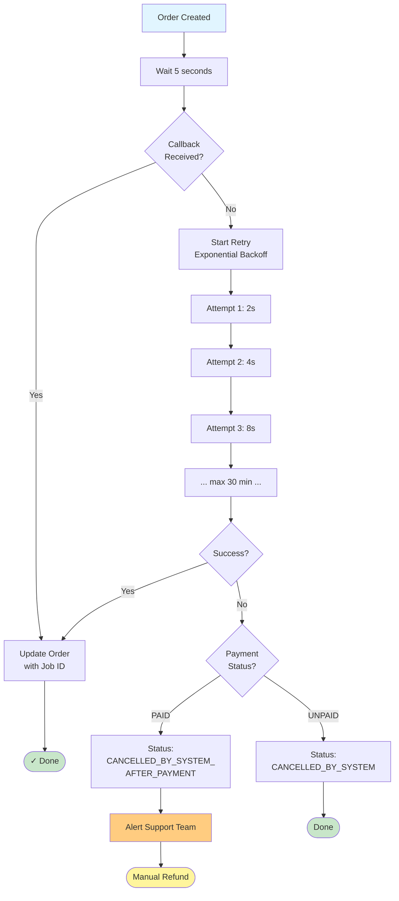

---
tags:
  - developer-guide
  - implementation
  - mrg
  - taxipartnergateway
  - exponential-backoff
type: implementation-guide
priority: high
sprint: Q1-2026
---
# BBD Job ID Retry - Developer Implementation Guide

**For**: Backend Developers  
**Service**: Taxipartnergateway  
**Sprint**: Q1-2026  
**Estimated Effort**: 3-5 days

---

## 📋 Overview

Implement proactive Job ID retrieval dengan exponential backoff ketika BBD callback gagal. Setelah 30 menit retry, jika masih gagal, cancel order dan alert support team untuk manual refund.

---

## 🎯 Flow Diagram



---

## 📦 Library: cenkalti/backoff

### Installation

```bash
go get github.com/cenkalti/backoff/v4
```

### go.mod

```go
require github.com/cenkalti/backoff/v4 v4.2.1
```

---

## 💻 Implementation

### 1. Create JobIDRetriever Struct

```go
// File: taxipartnergateway/job_id_retriever.go

package taxipartnergateway

import (
    "context"
    "fmt"
    "time"

    "github.com/cenkalti/backoff/v4"
    log "github.com/sirupsen/logrus"
)

type JobIDRetriever struct {
    bbd          *BBDClient
    orderRepo    OrderRepository
    eventBus     EventBus
}

func NewJobIDRetriever(
    bbd *BBDClient,
    orderRepo OrderRepository,
    eventBus EventBus,
) *JobIDRetriever {
    return &JobIDRetriever{
        bbd:       bbd,
        orderRepo: orderRepo,
        eventBus:  eventBus,
    }
}
```

### 2. Implement StartProactiveRetrieval

```go
// StartProactiveRetrieval mulai proactive retrieval setelah 5 detik
func (r *JobIDRetriever) StartProactiveRetrieval(orderID string) error {
    // Wait 5 seconds untuk callback
    time.Sleep(5 * time.Second)
    
    ctx := context.Background()
    
    // Check apakah callback sudah diterima
    order, err := r.orderRepo.GetByID(ctx, orderID)
    if err != nil {
        return fmt.Errorf("failed to get order: %w", err)
    }
    
    // Jika sudah ada Job ID, no need retry
    if order.BBDJobID != "" {
        log.WithField("order_id", orderID).Info("Job ID already received via callback")
        return nil
    }
    
    // Start proactive retrieval with exponential backoff
    log.WithField("order_id", orderID).Info("Starting proactive Job ID retrieval")
    return r.retrieveJobIDWithBackoff(orderID, order.BBDBookingID)
}
```

### 3. Implement Exponential Backoff Logic

```go
func (r *JobIDRetriever) retrieveJobIDWithBackoff(orderID, bookingID string) error {
    // Configure exponential backoff
    b := backoff.NewExponentialBackOff()
    b.InitialInterval = 2 * time.Second      // Start with 2s
    b.MaxInterval = 60 * time.Second          // Max 60s between retries
    b.MaxElapsedTime = 30 * time.Minute       // Total 30 minutes
    b.Multiplier = 2.0                        // Double each time
    b.RandomizationFactor = 0.3               // 30% jitter
    
    // Create context with timeout
    ctx, cancel := context.WithTimeout(context.Background(), 31*time.Minute)
    defer cancel()
    
    // Wrap with context
    backoffWithContext := backoff.WithContext(b, ctx)
    
    attemptCount := 0
    startTime := time.Now()
    
    // Retry operation
    operation := func() error {
        attemptCount++
        
        log.WithFields(log.Fields{
            "order_id": orderID,
            "attempt":  attemptCount,
            "elapsed":  time.Since(startTime).String(),
        }).Info("Attempting to retrieve Job ID from BBD")
        
        // Call BBD API to get job status
        jobStatus, err := r.bbd.GetJobStatus(ctx, bookingID)
        if err != nil {
            // Transient error - continue retry
            log.WithError(err).Warn("Failed to get job status, will retry")
            return err
        }
        
        // Check if Job ID available
        if jobStatus.JobID == "" {
            // Job not assigned yet - continue retry
            return fmt.Errorf("job ID not yet assigned")
        }
        
        // Success! Update order with Job ID
        if err := r.orderRepo.UpdateJobID(ctx, orderID, jobStatus.JobID); err != nil {
            // Database error - use permanent error to stop retry
            return backoff.Permanent(fmt.Errorf("failed to update order: %w", err))
        }
        
        // Publish success event
        r.eventBus.Publish("order.job_id_retrieved", map[string]interface{}{
            "order_id": orderID,
            "job_id":   jobStatus.JobID,
            "attempts": attemptCount,
            "duration": time.Since(startTime).String(),
            "method":   "proactive",
        })
        
        log.WithFields(log.Fields{
            "order_id": orderID,
            "job_id":   jobStatus.JobID,
            "attempts": attemptCount,
            "duration": time.Since(startTime).String(),
        }).Info("Job ID retrieved successfully")
        
        return nil // Success
    }
    
    // Execute with retry
    err := backoff.Retry(operation, backoffWithContext)
    
    if err != nil {
        // Max time exceeded or permanent error
        log.WithFields(log.Fields{
            "order_id":       orderID,
            "total_attempts": attemptCount,
            "total_duration": time.Since(startTime).String(),
            "error":          err.Error(),
        }).Error("Failed to retrieve Job ID after max retries")
        
        // Execute compensation
        r.handleRetrievalFailure(orderID, attemptCount, time.Since(startTime), err)
        return err
    }
    
    return nil
}
```

### 4. Implement Compensation (Simple)

```go
func (r *JobIDRetriever) handleRetrievalFailure(
    orderID string,
    attempts int,
    totalDuration time.Duration,
    err error,
) {
    ctx := context.Background()
    
    // Get order details
    order, err := r.orderRepo.GetByID(ctx, orderID)
    if err != nil {
        log.WithError(err).Error("Failed to get order for cancellation")
        r.alertSupportTeam(orderID, "FAILED_TO_GET_ORDER", err)
        return
    }
    
    // Check if payment was made
    if order.PaymentStatus == "PAID" || order.PaymentStatus == "SETTLEMENT" {
        // Update status untuk paid orders
        if err := r.orderRepo.UpdateStatus(ctx, orderID, "CANCELLED_BY_SYSTEM_AFTER_PAYMENT"); err != nil {
            log.WithError(err).Error("Failed to update order status")
            r.alertSupportTeam(orderID, "STATUS_UPDATE_FAILED", err)
            return
        }
        
        // Alert supporting reservation team untuk manual refund
        r.alertSupportTeam(orderID, "MANUAL_REFUND_REQUIRED", nil)
        
        // Publish event for analytics
        r.eventBus.Publish("order.cancelled_after_payment_no_job_id", map[string]interface{}{
            "order_id":       orderID,
            "status":         "CANCELLED_BY_SYSTEM_AFTER_PAYMENT",
            "payment_status": order.PaymentStatus,
            "total_attempts": attempts,
            "action":         "MANUAL_REFUND_REQUIRED",
            "timestamp":      time.Now(),
        })
        
        log.WithFields(log.Fields{
            "order_id":       orderID,
            "payment_status": order.PaymentStatus,
        }).Warn("Order cancelled after payment - manual refund required")
        
    } else {
        // No payment made, simple cancellation
        if err := r.orderRepo.UpdateStatus(ctx, orderID, "CANCELLED_BY_SYSTEM"); err != nil {
            log.WithError(err).Error("Failed to cancel order")
            return
        }
        
        log.WithField("order_id", orderID).Info("Order cancelled (no payment)")
    }
}

func (r *JobIDRetriever) alertSupportTeam(orderID string, alertType string, err error) {
    payload := map[string]interface{}{
        "order_id":   orderID,
        "alert_type": alertType,
        "severity":   "high",
        "team":       "supporting_reservation",
        "timestamp":  time.Now(),
    }
    
    if err != nil {
        payload["error"] = err.Error()
    }
    
    // Publish to alert channels (Slack, Email, etc)
    r.eventBus.Publish("support.manual_action_required", payload)
    
    log.WithFields(log.Fields{
        "order_id":   orderID,
        "alert_type": alertType,
    }).Warn("Manual action required by supporting reservation team")
}
```

### 5. Integration dengan Order Orchestrator

```go
// File: orderorchestrator/create_order.go

func (s *OrderOrchestrator) CreateTaxiOrder(
    ctx context.Context,
    req CreateOrderRequest,
) (*Order, error) {
    // Create order di BBD
    bbdBooking, err := s.taxiPartnerGateway.CreateBooking(ctx, req)
    if err != nil {
        return nil, fmt.Errorf("failed to create BBD booking: %w", err)
    }
    
    // Save order to database
    order := &Order{
        ID:            generateOrderID(),
        BBDBookingID:  bbdBooking.BookingID,
        BBDJobID:      "", // Will be filled later
        Status:        "PENDING_JOB_ID",
        PaymentStatus: "PENDING",
        // ... other fields
    }
    
    if err := s.orderRepo.Create(ctx, order); err != nil {
        return nil, err
    }
    
    // Start proactive Job ID retrieval in background
    go func() {
        if err := s.jobIDRetriever.StartProactiveRetrieval(order.ID); err != nil {
            log.WithError(err).WithField("order_id", order.ID).
                Error("Proactive Job ID retrieval failed")
        }
    }()
    
    return order, nil
}
```

---

## 🧪 Testing

### Unit Test Example

```go
// File: taxipartnergateway/job_id_retriever_test.go

package taxipartnergateway

import (
    "context"
    "errors"
    "testing"
    "time"

    "github.com/cenkalti/backoff/v4"
    "github.com/stretchr/testify/assert"
    "github.com/stretchr/testify/mock"
)

func TestJobIDRetriever_Success_FirstAttempt(t *testing.T) {
    // Setup mocks
    mockBBD := new(MockBBDClient)
    mockRepo := new(MockOrderRepository)
    mockEventBus := new(MockEventBus)
    
    retriever := NewJobIDRetriever(mockBBD, mockRepo, mockEventBus)
    
    // Mock responses
    mockRepo.On("GetByID", mock.Anything, "order-123").
        Return(&Order{ID: "order-123", BBDJobID: ""}, nil)
    
    mockBBD.On("GetJobStatus", mock.Anything, "booking-123").
        Return(&JobStatus{JobID: "job-456"}, nil)
    
    mockRepo.On("UpdateJobID", mock.Anything, "order-123", "job-456").
        Return(nil)
    
    mockEventBus.On("Publish", "order.job_id_retrieved", mock.Anything).
        Return()
    
    // Execute
    err := retriever.retrieveJobIDWithBackoff("order-123", "booking-123")
    
    // Assert
    assert.NoError(t, err)
    mockBBD.AssertCalled(t, "GetJobStatus", mock.Anything, "booking-123")
    mockRepo.AssertCalled(t, "UpdateJobID", mock.Anything, "order-123", "job-456")
}

func TestJobIDRetriever_CompensationAfterTimeout(t *testing.T) {
    // Setup mocks
    mockBBD := new(MockBBDClient)
    mockRepo := new(MockOrderRepository)
    mockEventBus := new(MockEventBus)
    
    retriever := NewJobIDRetriever(mockBBD, mockRepo, mockEventBus)
    
    // Mock order dengan payment PAID
    order := &Order{
        ID:            "order-123",
        BBDJobID:      "",
        PaymentStatus: "PAID",
    }
    
    mockRepo.On("GetByID", mock.Anything, "order-123").Return(order, nil)
    
    // Mock BBD always returns empty Job ID
    mockBBD.On("GetJobStatus", mock.Anything, "booking-123").
        Return(&JobStatus{JobID: ""}, nil)
    
    // Mock status update
    mockRepo.On("UpdateStatus", mock.Anything, "order-123", "CANCELLED_BY_SYSTEM_AFTER_PAYMENT").
        Return(nil)
    
    mockEventBus.On("Publish", mock.Anything, mock.Anything).Return()
    
    // Use short timeout for testing
    b := backoff.NewExponentialBackOff()
    b.MaxElapsedTime = 1 * time.Second
    
    // Execute - should timeout and trigger compensation
    err := retriever.retrieveJobIDWithBackoff("order-123", "booking-123")
    
    // Assert
    assert.Error(t, err) // Should timeout
    mockRepo.AssertCalled(t, "UpdateStatus", mock.Anything, "order-123", "CANCELLED_BY_SYSTEM_AFTER_PAYMENT")
    mockEventBus.AssertCalled(t, "Publish", "support.manual_action_required", mock.Anything)
}
```

---

## 📊 Monitoring & Metrics

### Prometheus Metrics

```go
// File: taxipartnergateway/metrics.go

import "github.com/prometheus/client_golang/prometheus"

var (
    jobIDRetrievalAttempts = prometheus.NewCounterVec(
        prometheus.CounterOpts{
            Name: "job_id_retrieval_attempts_total",
            Help: "Total number of Job ID retrieval attempts",
        },
        []string{"order_id", "result"}, // result: success/timeout
    )
    
    jobIDRetrievalDuration = prometheus.NewHistogramVec(
        prometheus.HistogramOpts{
            Name:    "job_id_retrieval_duration_seconds",
            Help:    "Time taken to retrieve Job ID",
            Buckets: []float64{1, 5, 10, 30, 60, 300, 600, 1800}, // seconds
        },
        []string{"method"}, // method: callback/proactive
    )
    
    ordersCancelledAfterPayment = prometheus.NewCounter(
        prometheus.CounterOpts{
            Name: "orders_cancelled_after_payment_total",
            Help: "Total orders cancelled after payment due to Job ID timeout",
        },
    )
)

func init() {
    prometheus.MustRegister(jobIDRetrievalAttempts)
    prometheus.MustRegister(jobIDRetrievalDuration)
    prometheus.MustRegister(ordersCancelledAfterPayment)
}

// Usage in code
func (r *JobIDRetriever) retrieveJobIDWithBackoff(orderID, bookingID string) error {
    startTime := time.Now()
    defer func() {
        duration := time.Since(startTime).Seconds()
        jobIDRetrievalDuration.WithLabelValues("proactive").Observe(duration)
    }()
    
    // ... retry logic ...
    
    if err != nil {
        jobIDRetrievalAttempts.WithLabelValues(orderID, "timeout").Inc()
        return err
    }
    
    jobIDRetrievalAttempts.WithLabelValues(orderID, "success").Inc()
    return nil
}
```

---

## 🚀 Deployment Checklist

### Prerequisites
- [ ] BBD API endpoint untuk `GetJobStatus` sudah available
- [ ] Database schema: Add `CANCELLED_BY_SYSTEM_AFTER_PAYMENT` ke order status enum
- [ ] Slack webhook setup untuk supporting reservation team
- [ ] Event bus configured untuk publish events

### Code Changes
- [ ] Add `cenkalti/backoff` dependency ke `go.mod`
- [ ] Implement `JobIDRetriever` struct dan methods
- [ ] Update `OrderOrchestrator.CreateTaxiOrder()` untuk start retrieval
- [ ] Add Prometheus metrics
- [ ] Add unit tests
- [ ] Add integration tests

### Configuration
```yaml
# config.yaml
job_id_retrieval:
  initial_wait: 5s           # Wait for callback
  initial_interval: 2s       # First retry
  max_interval: 60s          # Max between retries
  max_elapsed_time: 30m      # Total timeout
  multiplier: 2.0            # Exponential factor
  randomization_factor: 0.3  # Jitter (30%)
```

### Monitoring Setup
- [ ] Grafana dashboard for Job ID retrieval metrics
- [ ] Alert: Manual refund required (Slack to #supporting-reservation)
- [ ] Alert: High cancellation rate (P1 to #mrg-alerts)

### Rollout Strategy
1. **Staging**: Deploy & test dengan BBD staging
2. **Production Canary (10%)**: Monitor closely for 2 days
3. **Production (50%)**: Expand if no issues
4. **Production (100%)**: Full rollout

---

## 📝 Notes for Developers

### Important Points

1. **Always use goroutine** untuk `StartProactiveRetrieval()` - jangan block order creation
2. **Context timeout** harus slightly lebih besar dari `MaxElapsedTime` (31 min vs 30 min)
3. **Database errors** = permanent error (stop retry immediately)
4. **Network errors** = transient error (continue retry)
5. **Jitter (RandomizationFactor)** prevents thundering herd when many orders retry together

### Common Pitfalls

❌ **DON'T**: Call retry synchronously in order creation
```go
// BAD - blocks order creation
err := retriever.StartProactiveRetrieval(order.ID)
if err != nil {
    return nil, err
}
```

✅ **DO**: Run in background goroutine
```go
// GOOD - non-blocking
go func() {
    retriever.StartProactiveRetrieval(order.ID)
}()
```

❌ **DON'T**: Use permanent error for transient failures
```go
// BAD
if err := callAPI(); err != nil {
    return backoff.Permanent(err) // Will stop retry!
}
```

✅ **DO**: Only use permanent error for unrecoverable errors
```go
// GOOD
if err := callAPI(); err != nil {
    if isNetworkError(err) {
        return err // Transient - will retry
    }
    return backoff.Permanent(err) // Permanent - stop
}
```

---

## 🔗 References

- Library Documentation: https://pkg.go.dev/github.com/cenkalti/backoff/v4
- Sample Code: `D:\code\go\mybb-ms\beljar\exponential-backoff\`
- Full Design Doc: [[BBD Job ID Retrieval - Retry Mechanism]]

---

**Questions?** Contact: MRG Platform Team

**Last Updated**: 2026-01-09
