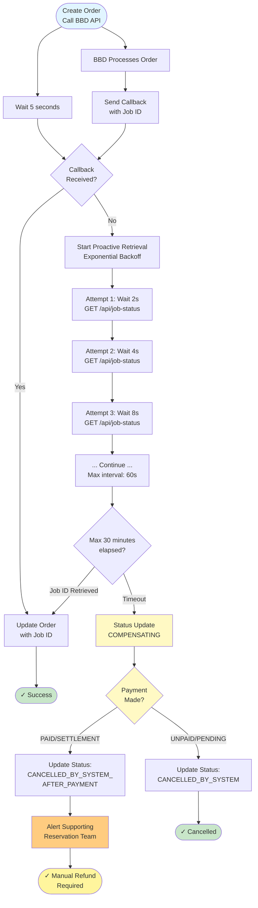
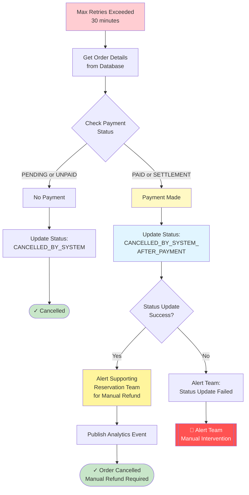
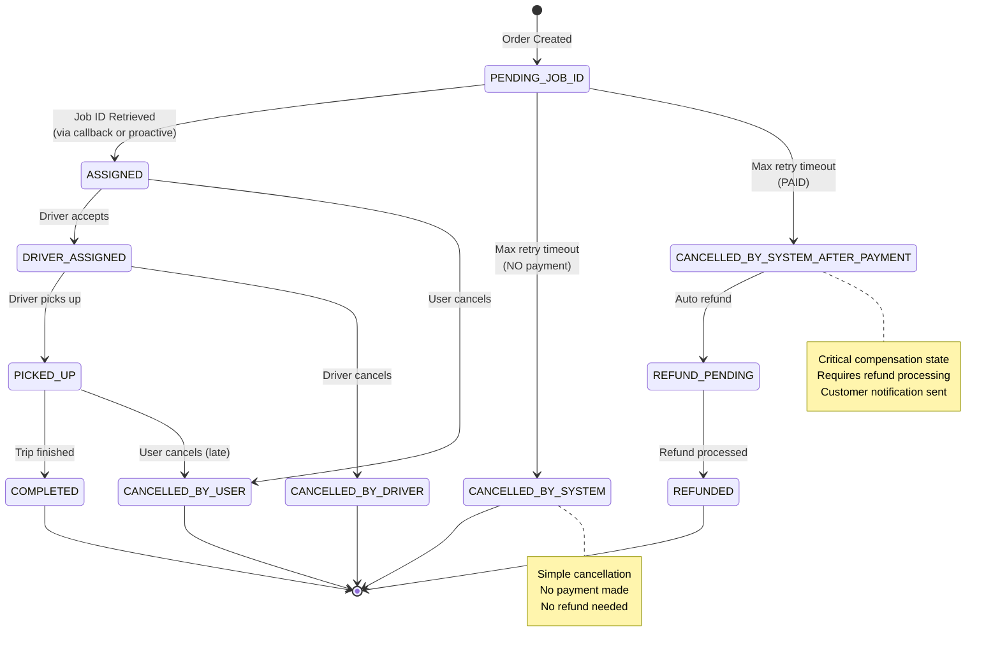

---
tags:
  - mrg
  - taxipartnergateway
  - bbd
  - retry-pattern
  - design-doc
  - exponential-backoff
type: design-document
status: proposal
priority: high
created: '2026-01-09'
sprint: Q1-2026
---
# BBD Job ID Retrieval - Retry Mechanism Design

**Status**: Design Proposal  
**Created**: 2026-01-09  
**Owner**: MRG Platform Team  
**Related Services**: Taxipartnergateway, Order Orchestrator

---

## 📋 Problem Statement

### Current Issue

Ketika MyBB membuat order taxi melalui BBD (Bluebird Dispatch), flow normal adalah:
1. MyBB call BBD API untuk create order
2. BBD return response (initial acknowledgment)
3. BBD **seharusnya** send callback event dengan **Job ID** dalam beberapa detik
4. MyBB menerima callback dan update order dengan Job ID

**Problem**: BBD callback **tidak reliable** - sometimes callback tidak sampai karena:
- Network issues
- BBD system busy/overloaded
- Webhook endpoint temporary unavailable
- Message queue failures

**Impact**: Order stuck tanpa Job ID → Cannot track driver, cannot cancel order, poor customer experience

---

## 🎯 Proposed Solution

### Proactive Job ID Retrieval with Exponential Backoff

**Strategy**: Jika callback tidak diterima dalam **5 detik**, MyBB akan **proactively** query BBD untuk get Job ID menggunakan exponential backoff retry pattern.

**Key Parameters**:
- **Initial Wait**: 5 seconds (wait for callback first)
- **Max Elapsed Time**: 30 minutes (total retry duration)
- **Initial Interval**: 2 seconds (first retry)
- **Max Interval**: 60 seconds (max wait between retries)
- **Multiplier**: 2.0 (double wait time each retry)
- **Jitter**: 0.3 (30% randomization)

### Flow Diagram



---

## 💻 Implementation

### Code Structure

```go
// File: taxipartnergateway/job_id_retriever.go

package taxipartnergateway

import (
    "context"
    "fmt"
    "time"

    "github.com/cenkalti/backoff/v4"
)

type JobIDRetriever struct {
    bbd          *BBDClient
    orderRepo    OrderRepository
    eventBus     EventBus
}

// StartProactiveRetrieval mulai proactive retrieval setelah initial wait
func (r *JobIDRetriever) StartProactiveRetrieval(orderID string) error {
    // Wait 5 seconds untuk callback
    time.Sleep(5 * time.Second)
    
    // Check apakah callback sudah diterima
    order, err := r.orderRepo.GetByID(context.Background(), orderID)
    if err != nil {
        return fmt.Errorf("failed to get order: %w", err)
    }
    
    // Jika sudah ada Job ID, no need retry
    if order.BBDJobID != "" {
        return nil
    }
    
    // Start proactive retrieval with exponential backoff
    return r.retrieveJobIDWithBackoff(orderID, order.BBDBookingID)
}

// retrieveJobIDWithBackoff implements exponential backoff retry
func (r *JobIDRetriever) retrieveJobIDWithBackoff(orderID, bookingID string) error {
    // Configure exponential backoff
    b := backoff.NewExponentialBackOff()
    b.InitialInterval = 2 * time.Second    // Start with 2s
    b.MaxInterval = 60 * time.Second        // Max 60s between retries
    b.MaxElapsedTime = 30 * time.Minute     // Total 30 minutes
    b.Multiplier = 2.0                      // Double each time
    b.RandomizationFactor = 0.3             // 30% jitter
    
    // Create context with timeout
    ctx, cancel := context.WithTimeout(context.Background(), 31*time.Minute)
    defer cancel()
    
    // Wrap with context
    backoffWithContext := backoff.WithContext(b, ctx)
    
    attemptCount := 0
    startTime := time.Now()
    
    // Retry operation
    operation := func() error {
        attemptCount++
        
        // Call BBD API to get job status
        jobStatus, err := r.bbd.GetJobStatus(ctx, bookingID)
        if err != nil {
            // Log transient error
            r.logRetryAttempt(orderID, attemptCount, time.Since(startTime), err)
            return err // Continue retry
        }
        
        // Check if Job ID available
        if jobStatus.JobID == "" {
            // Job not assigned yet - continue retry
            return fmt.Errorf("job ID not yet assigned")
        }
        
        // Success! Update order with Job ID
        if err := r.updateOrderWithJobID(ctx, orderID, jobStatus.JobID); err != nil {
            // This is critical - use permanent error to stop retry
            return backoff.Permanent(fmt.Errorf("failed to update order: %w", err))
        }
        
        // Publish event
        r.eventBus.Publish("order.job_id_retrieved", map[string]interface{}{
            "order_id": orderID,
            "job_id":   jobStatus.JobID,
            "attempts": attemptCount,
            "duration": time.Since(startTime).String(),
            "method":   "proactive",
        })
        
        return nil // Success
    }
    
    // Execute with retry and notification
    err := backoff.RetryNotify(operation, backoffWithContext, func(err error, duration time.Duration) {
        r.logRetryAttempt(orderID, attemptCount, duration, err)
    })
    
    if err != nil {
        // Max time exceeded or permanent error
        r.handleRetrievalFailure(orderID, attemptCount, time.Since(startTime), err)
        return err
    }
    
    return nil
}

// updateOrderWithJobID updates order in database
func (r *JobIDRetriever) updateOrderWithJobID(ctx context.Context, orderID, jobID string) error {
    return r.orderRepo.UpdateJobID(ctx, orderID, jobID)
}

// logRetryAttempt logs each retry attempt
func (r *JobIDRetriever) logRetryAttempt(orderID string, attempt int, elapsed time.Duration, err error) {
    log.WithFields(log.Fields{
        "order_id": orderID,
        "attempt":  attempt,
        "elapsed":  elapsed.String(),
        "error":    err.Error(),
    }).Warn("Retrying BBD Job ID retrieval")
}

// handleRetrievalFailure handles final failure after all retries
func (r *JobIDRetriever) handleRetrievalFailure(orderID string, attempts int, totalDuration time.Duration, err error) {
    log.WithFields(log.Fields{
        "order_id":       orderID,
        "total_attempts": attempts,
        "total_duration": totalDuration.String(),
        "error":          err.Error(),
    }).Error("Failed to retrieve Job ID after max retries")
    
    ctx := context.Background()
    
    // Get order details
    order, err := r.orderRepo.GetByID(ctx, orderID)
    if err != nil {
        log.WithError(err).Error("Failed to get order for cancellation")
        r.alertSupportTeam(orderID, "FAILED_TO_GET_ORDER", err)
        return
    }
    
    // Check if payment was made
    if order.PaymentStatus == "PAID" || order.PaymentStatus == "SETTLEMENT" {
        // Update status - refund will be processed manually by support team
        if err := r.orderRepo.UpdateStatus(ctx, orderID, "CANCELLED_BY_SYSTEM_AFTER_PAYMENT"); err != nil {
            log.WithError(err).Error("Failed to update order status")
            r.alertSupportTeam(orderID, "STATUS_UPDATE_FAILED", err)
            return
        }
        
        // Alert supporting reservation team for manual refund processing
        r.alertSupportTeam(orderID, "MANUAL_REFUND_REQUIRED", nil)
        
        // Publish event for analytics
        r.eventBus.Publish("order.cancelled_after_payment_no_job_id", map[string]interface{}{
            "order_id":       orderID,
            "status":         "CANCELLED_BY_SYSTEM_AFTER_PAYMENT",
            "payment_status": order.PaymentStatus,
            "total_attempts": attempts,
            "action":         "MANUAL_REFUND_REQUIRED",
            "timestamp":      time.Now(),
        })
        
        log.WithField("order_id", orderID).Warn("Order cancelled after payment - manual refund required")
        
    } else {
        // No payment made, just cancel order
        if err := r.orderRepo.UpdateStatus(ctx, orderID, "CANCELLED_BY_SYSTEM"); err != nil {
            log.WithError(err).Error("Failed to cancel order")
            return
        }
        log.WithField("order_id", orderID).Info("Order cancelled (no payment)")
    }
}

// alertSupportTeam sends alert to supporting reservation team
func (r *JobIDRetriever) alertSupportTeam(orderID string, alertType string, err error) {
    payload := map[string]interface{}{
        "order_id":   orderID,
        "alert_type": alertType,
        "severity":   "high",
        "team":       "supporting_reservation",
        "timestamp":  time.Now(),
    }
    
    if err != nil {
        payload["error"] = err.Error()
    }
    
    // Send to alert channels
    r.eventBus.Publish("support.manual_action_required", payload)
    
    // Log for tracking
    log.WithFields(log.Fields{
        "order_id":   orderID,
        "alert_type": alertType,
    }).Warn("Manual action required by supporting reservation team")
}
```

### Integration dengan Order Orchestrator

```go
// File: orderorchestrator/create_order.go

func (s *OrderOrchestrator) CreateTaxiOrder(ctx context.Context, req CreateOrderRequest) (*Order, error) {
    // Create order di BBD
    bbdBooking, err := s.taxiPartnerGateway.CreateBooking(ctx, req)
    if err != nil {
        return nil, fmt.Errorf("failed to create BBD booking: %w", err)
    }
    
    // Save order to database
    order := &Order{
        ID:            generateOrderID(),
        BBDBookingID:  bbdBooking.BookingID,
        BBDJobID:      "", // Will be filled later
        Status:        "PENDING_JOB_ID",
        // ... other fields
    }
    
    if err := s.orderRepo.Create(ctx, order); err != nil {
        return nil, err
    }
    
    // Start proactive Job ID retrieval in background
    go func() {
        if err := s.jobIDRetriever.StartProactiveRetrieval(order.ID); err != nil {
            log.WithError(err).Error("Proactive Job ID retrieval failed")
        }
    }()
    
    return order, nil
}
```

---

## 🔄 Compensating Transaction Pattern

### When Retrieval Limit Exceeded (30 Minutes)

Jika setelah 30 menit retry, Job ID masih belum didapat, system akan execute **compensating action** untuk maintain data consistency.

**Simple Compensation Strategy**:
- Update order status ke `CANCELLED_BY_SYSTEM_AFTER_PAYMENT` (jika sudah bayar)
- Update order status ke `CANCELLED_BY_SYSTEM` (jika belum bayar)
- Alert tim supporting reservation untuk proses refund manual

### Compensation Flow



### Why Simple Compensation?

**Rationale**:
1. **Refund Complexity**: Refund process requires validation, approval flow, dan financial reconciliation
2. **Support Team Expertise**: Tim supporting reservation sudah trained untuk handle refund cases
3. **Edge Cases**: Manual review allows handling special cases (partial trips, promotions, vouchers)
4. **Audit Trail**: Manual process ensures proper documentation dan approval
5. **Simplicity**: Avoid over-engineering, keep system simple dan maintainable

### What Happens After Status Update?

**Workflow**:
```
1. System updates status → CANCELLED_BY_SYSTEM_AFTER_PAYMENT
2. Alert sent to supporting reservation team (Slack + Email)
3. Support team reviews order details
4. Support team processes refund via admin panel
5. Customer receives refund confirmation from support
```

**Timeline**:
- Status update: Immediate (< 1 second)
- Alert to support: Immediate (< 5 seconds)
- Manual refund processing: Within business hours (1-24 hours)
- Customer refund: 3-5 business days (payment gateway dependent)

### Supporting Reservation Team Alert

**Alert Content**:
```
🚨 Manual Refund Required

Order ID: CCT-20260109XXXXX
Status: CANCELLED_BY_SYSTEM_AFTER_PAYMENT
Reason: Job ID retrieval timeout after 30 minutes
Payment Status: PAID
Payment Amount: Rp 150,000

Action Required:
1. Verify order details in admin panel
2. Process full refund via refund module
3. Contact customer if needed
4. Mark as resolved in support system

Priority: High
SLA: Within 24 hours
```

**Alert Channels**:
- Slack: `#supporting-reservation-alerts`
- Email: supporting-reservation@bluebird.id
- Dashboard: Support admin panel (new ticket auto-created)

### Order Status Explanation

**`CANCELLED_BY_SYSTEM_AFTER_PAYMENT`** indicates:
- ✅ Order was created successfully
- ✅ Customer paid for the order
- ❌ Technical issue: BBD Job ID not received
- 🔄 Action required: Manual refund by support team

**`CANCELLED_BY_SYSTEM`** indicates:
- ✅ Order was created successfully
- ❌ Customer has not paid yet
- ❌ Technical issue: BBD Job ID not received
- ✓ No action required: No refund needed

### Why This Status Name?

**`CANCELLED_BY_SYSTEM_AFTER_PAYMENT`** chosen because:

1. **Clear Accountability**: "BY_SYSTEM" indicates automatic cancellation, not customer/driver action
2. **Payment Context**: "AFTER_PAYMENT" signals refund is needed
3. **Auditing**: Distinct status for tracking this specific failure scenario
4. **Reporting**: Easy to filter and analyze these cases
5. **Customer Service**: CS team knows customer needs refund explanation

### Order Status State Machine



### Alternative Statuses (Not Used)

| Status | Why Not Used |
|--------|--------------|
| `CANCELLED` | Too generic, doesn't indicate compensation needed |
| `FAILED` | Doesn't indicate payment state |
| `PENDING_JOB_ID` | Order is actually cancelled, not pending |
| `SYSTEM_ERROR` | Too vague for analytics |

### Compensation Decision Logic

```go
// Simplified decision tree for compensation
if maxRetriesExceeded {
    order := getOrder(orderID)
    
    switch order.PaymentStatus {
    case "PAID", "SETTLEMENT":
        // Customer already paid → Update status + Alert support team
        updateStatus(orderID, "CANCELLED_BY_SYSTEM_AFTER_PAYMENT")
        alertSupportTeam(orderID, "MANUAL_REFUND_REQUIRED")
        
    case "PENDING", "UNPAID":
        // No payment made → Simple cancellation
        updateStatus(orderID, "CANCELLED_BY_SYSTEM")
        // No alert needed - no action required
        
    default:
        // Unexpected state → Alert team for review
        logError("Unexpected payment status", order.PaymentStatus)
        alertSupportTeam(orderID, "UNEXPECTED_STATE")
    }
}
```

### Analytics & Tracking

**Event Published**:

```json
{
  "event": "order.cancelled_after_payment_no_job_id",
  "order_id": "CCT-20260109XXXXX",
  "status": "CANCELLED_BY_SYSTEM_AFTER_PAYMENT",
  "payment_status": "PAID",
  "total_attempts": 30,
  "action": "MANUAL_REFUND_REQUIRED",
  "timestamp": "2026-01-09T10:30:00Z"
}
```

### Manual Refund Process (Support Team)

**Step-by-Step**:
1. **Receive Alert**: Slack notification + email + dashboard ticket
2. **Verify Order**: Check order details, payment status, customer info
3. **Process Refund**: Use admin panel refund module
4. **Confirm with Customer**: Send email/call if needed
5. **Update System**: Mark ticket as resolved
6. **Close**: Update notes untuk audit trail

**Expected Timeline**: Within 24 hours (business hours)

---

## 📐 Decision Rationale

### Why 5 Seconds Initial Wait?

**Analysis**:
- BBD callback typically arrives in **1-3 seconds** (P95)
- 5 seconds covers P99 of normal callback latency
- Avoids unnecessary API calls in happy path

**Trade-offs**:
- Too short (< 3s): Premature proactive calls, wasted resources
- Too long (> 10s): Poor user experience waiting for Job ID
- **Sweet spot: 5s** balances resource usage and UX

### Why 30 Minutes Max Elapsed Time?

**Business Context**:
- After 30 minutes, order likely cancelled or fulfilled manually
- Customer typically cancels after 15-20 minutes of no update
- Operations team can intervene within 30 minutes

**Technical Context**:
- BBD system recovery time: Usually < 10 minutes
- Network issues: Typically resolved < 15 minutes
- Database maintenance windows: Max 20 minutes

**Trade-offs**:
- Too short (< 10 min): Miss legitimate delayed assignments
- Too long (> 60 min): Waste resources on likely-failed orders
- **Sweet spot: 30 min** covers most recovery scenarios

### Why Exponential Backoff Parameters?

| Parameter | Value | Rationale |
|-----------|-------|-----------|
| **InitialInterval** | 2s | Quick first retry, covers transient network blips |
| **MaxInterval** | 60s | Balance server load vs freshness. BBD can handle 1 req/min |
| **Multiplier** | 2.0 | Standard exponential growth, well-tested pattern |
| **RandomizationFactor** | 0.3 | 30% jitter prevents thundering herd when many orders retry |

**Retry Timeline Example**:
```
Attempt 1:  2s  (cumulative: 2s)
Attempt 2:  4s  (cumulative: 6s)
Attempt 3:  8s  (cumulative: 14s)
Attempt 4:  16s (cumulative: 30s)
Attempt 5:  32s (cumulative: 62s)
Attempt 6:  60s (cumulative: 122s) - hit max interval
Attempt 7:  60s (cumulative: 182s)
...
Attempt 30: 60s (cumulative: ~30 min)
```

---

## 🔍 Monitoring & Alerting

### Metrics to Track

```promql
# Success rate proactive retrieval
rate(job_id_retrieval_success_total[5m]) / rate(job_id_retrieval_attempts_total[5m])

# Average attempts before success
avg(job_id_retrieval_attempts_count)

# Time to retrieve Job ID
histogram_quantile(0.95, job_id_retrieval_duration_seconds_bucket)

# Callback vs Proactive ratio
rate(job_id_via_callback_total[5m]) / rate(job_id_via_proactive_total[5m])

# Failure rate after max retries
rate(job_id_retrieval_max_retries_exceeded_total[5m])
```

### Alerts

```yaml
groups:
  - name: bbd_job_id_retrieval
    rules:
      - alert: JobIDRetrievalHighFailureRate
        expr: |
          rate(job_id_retrieval_failed_total[10m]) / 
          rate(job_id_retrieval_attempts_total[10m]) > 0.1
        for: 5m
        labels:
          severity: P1
          team: mrg
        annotations:
          summary: "Job ID retrieval failing at high rate"
          description: ">10% of Job ID retrieval attempts failing"
          
      - alert: JobIDRetrievalSlowResponse
        expr: |
          histogram_quantile(0.95, 
            job_id_retrieval_duration_seconds_bucket) > 600
        for: 10m
        labels:
          severity: P2
          team: mrg
        annotations:
          summary: "Job ID retrieval taking too long"
          description: "P95 retrieval time > 10 minutes"
          
      - alert: CallbackRateLow
        expr: |
          rate(job_id_via_callback_total[30m]) / 
          rate(job_id_total[30m]) < 0.7
        for: 15m
        labels:
          severity: P2
          team: mrg
        annotations:
          summary: "BBD callback success rate low"
          description: "<70% Job IDs received via callback (should be >90%)"
          
      - alert: ManualRefundRequired
        expr: |
          increase(order_status_count{status="CANCELLED_BY_SYSTEM_AFTER_PAYMENT"}[1h]) > 0
        for: 1m
        labels:
          severity: P2
          team: supporting-reservation
        annotations:
          summary: "Orders cancelled after payment - manual refund required"
          description: "Orders with CANCELLED_BY_SYSTEM_AFTER_PAYMENT status need manual refund processing"
          action: "Process refund via admin panel within 24 hours"
          
      - alert: HighCancellationRate
        expr: |
          increase(order_status_count{status="CANCELLED_BY_SYSTEM_AFTER_PAYMENT"}[1h]) > 10
        for: 5m
        labels:
          severity: P1
          team: mrg
        annotations:
          summary: "High rate of orders cancelled after payment"
          description: ">10 paid orders cancelled in last hour due to Job ID retrieval failure"
          action: "Investigate BBD system health and connectivity"
```

### Grafana Dashboard

**Panels to Include**:
1. Job ID Retrieval Method Distribution (Callback vs Proactive)
2. Proactive Retrieval Success Rate over Time
3. Average Attempts Before Success
4. P50/P95/P99 Retrieval Duration
5. Failure Reasons Breakdown
6. Active Retry Operations (Current)
7. **Orders Cancelled After Payment** (Requires manual refund)
8. **Manual Refund Queue** (Pending support team action)

---

## 🚨 Error Handling

### Error Categories

**Transient Errors (Retry)**:
- Network timeout
- BBD API 500/503 errors
- Job not yet assigned (BBD still processing)
- Rate limit errors (with backoff)

**Permanent Errors (Don't Retry)**:
- Booking not found (404) - Invalid booking ID
- Authentication failed (401) - System issue
- Database update failed - Critical system issue
- Order already cancelled

### Code Example

```go
func (r *JobIDRetriever) retrieveJobIDWithBackoff(orderID, bookingID string) error {
    operation := func() error {
        jobStatus, err := r.bbd.GetJobStatus(ctx, bookingID)
        
        // Permanent errors - stop retry
        if err != nil {
            if isNotFoundError(err) {
                return backoff.Permanent(fmt.Errorf("booking not found: %w", err))
            }
            if isAuthError(err) {
                return backoff.Permanent(fmt.Errorf("authentication failed: %w", err))
            }
            // Transient error - continue retry
            return err
        }
        
        // Job not assigned yet - transient
        if jobStatus.JobID == "" {
            return fmt.Errorf("job ID not yet assigned")
        }
        
        // Success
        return r.updateOrderWithJobID(ctx, orderID, jobStatus.JobID)
    }
    
    return backoff.Retry(operation, backoffConfig)
}
```

---

## 🧪 Testing Strategy

### Unit Tests

```go
func TestJobIDRetriever_Success_FirstAttempt(t *testing.T) {
    // Test callback received before 5s wait
}

func TestJobIDRetriever_Success_AfterRetries(t *testing.T) {
    // Test successful retrieval after 3 retry attempts
}

func TestJobIDRetriever_MaxRetriesExceeded(t *testing.T) {
    // Test failure after 30 minutes of retries
}

func TestJobIDRetriever_PermanentError(t *testing.T) {
    // Test immediate stop on booking not found
}
```

### Integration Tests

```go
func TestJobIDRetrieval_EndToEnd(t *testing.T) {
    // Create order → Wait 5s → Verify proactive retrieval starts
}

func TestJobIDRetrieval_BBDDelayedCallback(t *testing.T) {
    // Simulate callback arriving at 7s (after proactive started)
}

func TestJobIDRetrieval_StatusUpdateAfterTimeout(t *testing.T) {
    // Max retries exceeded → Order PAID → Verify status update
    order := createPaidOrder()
    
    // Simulate max retries failure
    retriever.handleRetrievalFailure(order.ID, 30, 30*time.Minute, errors.New("timeout"))
    
    // Assertions
    assert.Equal(t, "CANCELLED_BY_SYSTEM_AFTER_PAYMENT", order.Status)
    assert.True(t, supportTeamAlerted)
}

func TestJobIDRetrieval_SimpleCancel(t *testing.T) {
    // Max retries exceeded → Order UNPAID → Verify simple cancellation
    order := createUnpaidOrder()
    
    retriever.handleRetrievalFailure(order.ID, 30, 30*time.Minute, errors.New("timeout"))
    
    // Assertions
    assert.Equal(t, "CANCELLED_BY_SYSTEM", order.Status)
    assert.False(t, supportTeamAlerted) // No alert for unpaid orders
}

func TestJobIDRetrieval_StatusUpdateFailure(t *testing.T) {
    // Status update fails → Verify alert sent
    order := createPaidOrder()
    
    // Mock database error
    mockOrderRepo.UpdateStatusError = errors.New("db connection failed")
    
    retriever.handleRetrievalFailure(order.ID, 30, 30*time.Minute, errors.New("timeout"))
    
    // Assertions
    assert.True(t, supportTeamAlerted)
    assert.Contains(t, alertMessage, "STATUS_UPDATE_FAILED")
}
```

### Load Testing

**Scenarios**:
1. Normal load: 100 orders/sec, 95% callback success
2. BBD callback failure: 100 orders/sec, 0% callback (all proactive)
3. BBD slow response: Simulate 50% responses taking 10-15 minutes
4. Recovery scenario: BBD down 10 min, then recovers

**Success Criteria**:
- All orders eventually get Job ID (within 30 min)
- BBD API rate limits not exceeded
- No resource exhaustion (goroutine leaks)
- Proper alert triggering on high failure rate

---

## 📊 Success Metrics

### KPIs

| Metric | Target | Current (Before) |
|--------|--------|------------------|
| **Orders with Job ID** | 99.9% | ~95% (5% stuck) |
| **Time to Job ID (P95)** | < 10 seconds | ~3 seconds |
| **Callback Success Rate** | > 90% | ~95% |
| **Manual Intervention Rate** | < 0.1% | ~5% |
| **BBD API Call Reduction** | 30%+ | Baseline |
| **Status Update Success Rate** | 100% | N/A |
| **Support Team Response Time** | < 24 hours | N/A |

### Expected Improvements

**Before Implementation**:
- 5% orders stuck without Job ID
- Manual intervention needed for stuck orders
- Customer complaints about missing driver info
- Support team overhead

**After Implementation**:
- 0.1% orders require manual intervention
- Automatic recovery from BBD callback failures
- Better customer experience (always have Job ID)
- Reduced support workload

---

## 🔗 Related Documentation

- [[D:\code\go\mybb-ms\beljar\exponential-backoff\README.md|Exponential Backoff Sample Project]]
- [[02-Work/Teams/MRG/02-services/taxipartnergateway/README|Taxi Partner Gateway Service]]
- [[02-Work/Teams/MRG/01-architecture/MRG SPOF Assessment & Mitigation Strategy|SPOF Assessment]]
- [[02-Work/Teams/MRG/01-architecture/design-docs/circuit-breaker-pattern|Circuit Breaker Pattern]]

---

## 📅 Implementation Plan

### Phase 1: Foundation (Sprint 1)
- [ ] Implement `JobIDRetriever` with exponential backoff
- [ ] **Implement simple status update logic**
  - [ ] `handleRetrievalFailure()` with status update only
  - [ ] `alertSupportTeam()` function for manual refund alerts
  - [ ] Payment status validation
- [ ] Unit tests for retry logic
- [ ] **Unit tests for status update scenarios**
- [ ] Integration with Order Orchestrator
- [ ] Metrics and logging setup
- [ ] **Status enum: Add `CANCELLED_BY_SYSTEM_AFTER_PAYMENT`**
- [ ] **Setup Slack webhook for supporting reservation team**

### Phase 2: Monitoring (Sprint 1-2)
- [ ] Prometheus metrics implementation
  - [ ] Job ID retrieval metrics
  - [ ] **Status update success rate metrics**
  - [ ] **Manual refund queue metrics**
- [ ] Grafana dashboard creation
  - [ ] Retrieval success rate panels
  - [ ] **Orders requiring manual refund panel**
  - [ ] **Order status distribution**
- [ ] Alert rules configuration
  - [ ] Retrieval failure alerts
  - [ ] **Manual refund required alerts (P2)**
  - [ ] **High cancellation rate alerts (P1)**
- [ ] Test alert triggering

### Phase 3: Rollout (Sprint 2)
- [ ] Deploy to staging environment
- [ ] Load testing with BBD mock
  - [ ] Test normal callback flow
  - [ ] Test proactive retrieval
  - [ ] **Test status update for paid orders**
  - [ ] **Test status update for unpaid orders**
  - [ ] **Test support team alert flow**
- [ ] Feature flag for gradual rollout
- [ ] Production deployment (10% → 50% → 100%)
- [ ] **Coordinate with supporting reservation team for manual refund readiness**

### Phase 4: Validation (Sprint 3)
- [ ] Monitor metrics for 2 weeks
- [ ] Compare before/after KPIs
- [ ] **Validate support team can process refunds within SLA (< 24h)**
- [ ] **Review cancelled orders with support team**
- [ ] Tune parameters if needed
- [ ] Document lessons learned
- [ ] **Create admin panel dashboard for support team**

---

## 💡 Future Enhancements

### Short-term
- [ ] Add webhook retry mechanism (push callback to queue)
- [ ] Implement circuit breaker for BBD API calls
- [ ] Cache Job ID mapping for faster lookup

### Long-term
- [ ] Real-time WebSocket connection to BBD (eliminate callback need)
- [ ] Predictive Job ID assignment (ML model)
- [ ] Multi-provider dispatch system (reduce BBD dependency)

---

**Last Updated**: 2026-01-09 (Added compensating transaction for retrieval failures)  
**Version**: 2.0 (Includes automatic order cancellation + refund)  
**Next Review**: After Phase 4 completion  
**Approved By**: MRG Tech Lead

---

## 📝 Change Log

### Version 2.0 (2026-01-09)
- ✅ Added compensating transaction pattern
- ✅ Automatic order cancellation after 30 min retrieval failure
- ✅ Status: `CANCELLED_BY_SYSTEM_AFTER_PAYMENT` for paid orders
- ✅ Full refund initiation via Payment Processor/UPG
- ✅ Customer notification flow
- ✅ Compensation failure alerts (P0 severity)
- ✅ Updated metrics, alerts, and monitoring
- ✅ Enhanced testing strategy for compensation scenarios

### Version 1.0 (2026-01-09)
- Initial design: Exponential backoff retry mechanism
- 5 second initial wait + 30 minute max elapsed time
- Proactive Job ID retrieval from BBD
