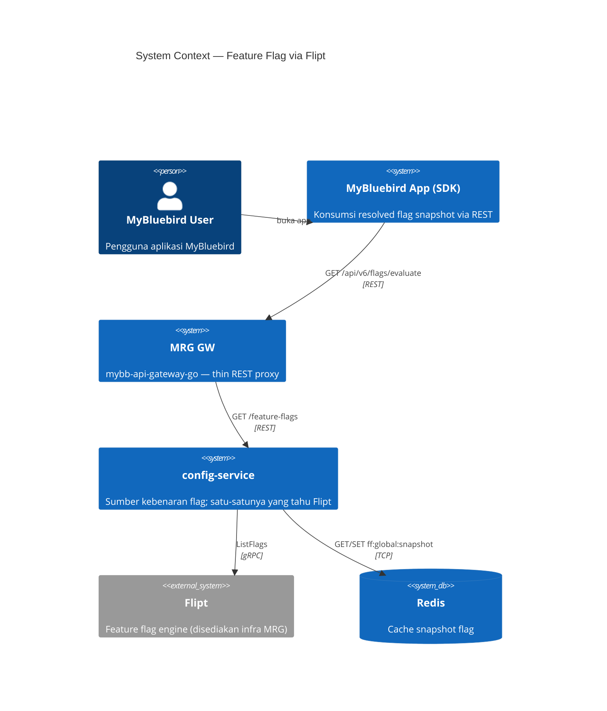
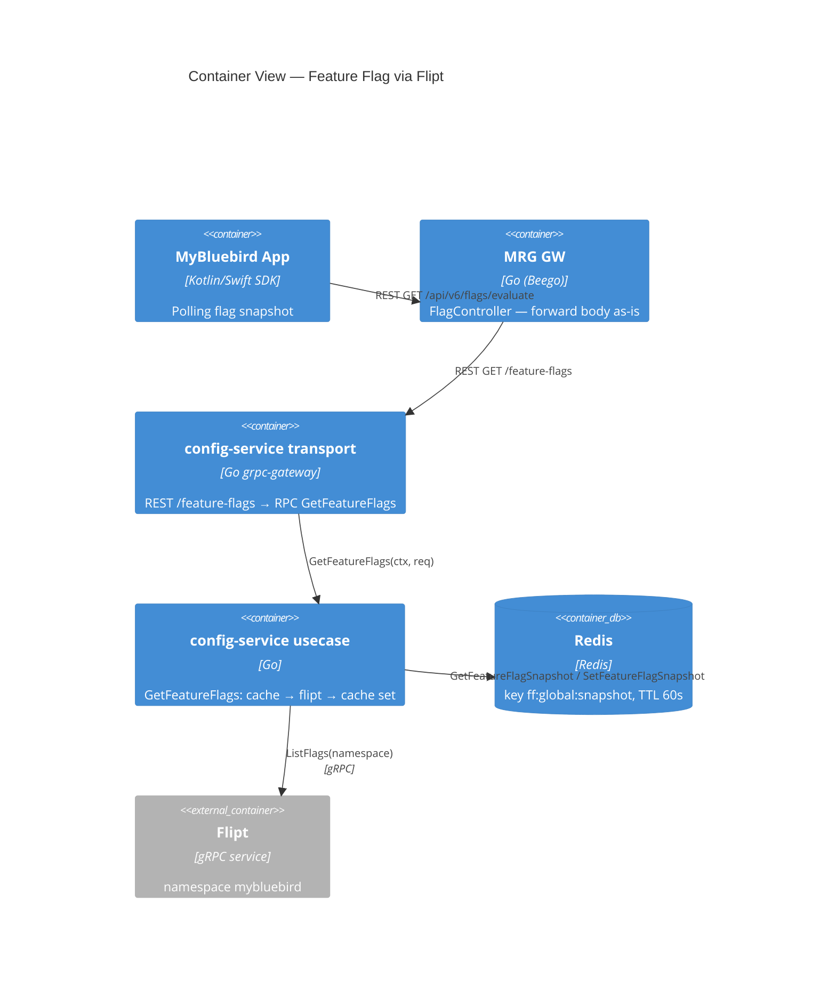
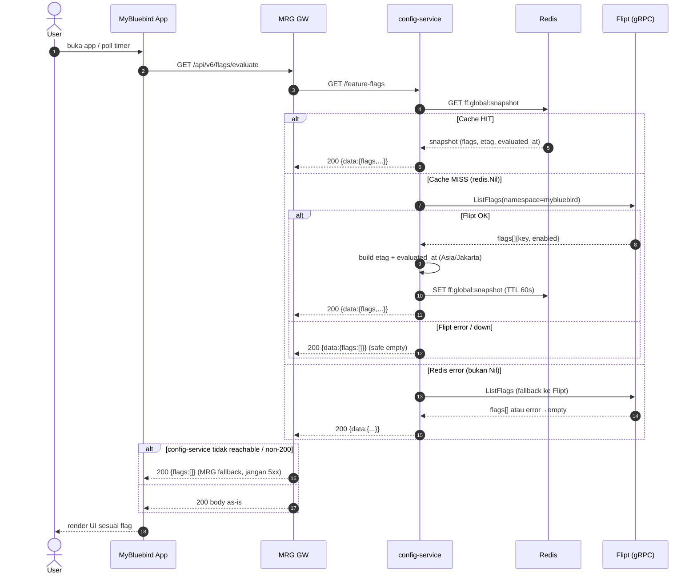
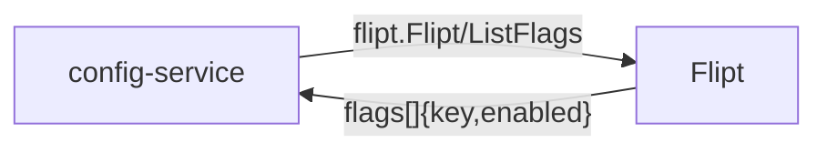

# Integration Doc - Feature Flag via Flipt (config-service)

> **Versi**: 1.0 · **Tanggal**: 2026-07-03 · **Status**: draft
>
> **Referensi desain**: `.docs/features/FEAT-2026-018-feature-flag.md` (implementation brief)
>
> **Catatan konsistensi**: Brief bagian 1 menggambarkan MRG GW → config-service via gRPC, namun bagian 8 menegaskan aksesnya via **REST** (grpc-gateway `/feature-flags`). Dokumen ini mengikuti **REST** sebagai kontrak otoritatif untuk jalur MRG GW ↔ config-service. gRPC hanya dipakai internal config-service → Flipt.

---

## 1. Overview

Integrasi ini menyajikan **resolved feature-flag snapshot** ke MyBluebird App tanpa menaruh logic flag di legacy gateway. `config-service` menjadi satu-satunya komponen yang tahu tentang **Flipt**; MRG GW hanya melakukan forward (thin proxy), dan Mobile SDK cukup memanggil satu endpoint REST.

Trigger: app melakukan **polling** (interval dari `poll_interval_seconds`) atau fetch saat startup untuk mendapatkan daftar flag global (`key` → `enabled`). config-service melayani dari **Redis cache**; saat miss, ia menarik dari **Flipt** via gRPC, menyimpan snapshot ke Redis (TTL 60s default), lalu membalas.

### Metadata

| Field | Value |
|---|---|
| Feature ID | FEAT-2026-018-feature-flag |
| Tanggal | 2026-07-03 |
| Status | draft |
| Architect | Adi Kurniawan |
| Systems | MyBluebird App ↔ MRG GW ↔ config-service ↔ (Redis / Flipt) |
| Protocol Utama | REST (app↔MRG↔config), gRPC (config↔Flipt) |
| Scope | Global flags only (per-user targeting → Phase 2) |

---

## 2. Scope

### 2.1 In Scope
- RPC `GetFeatureFlags` di config-service untuk global flags (`key`, `enabled`).
- Redis snapshot cache dengan key `ff:global:snapshot`, invalidation **TTL-only** (default 60s).
- Integrasi Flipt via gRPC `flipt.Flipt/ListFlags` (namespace `mybluebird`).
- MRG GW thin REST proxy: expose `GET /api/v6/flags/evaluate`, forward ke config-service `GET /feature-flags`.
- Graceful fallback: Flipt/Redis down → stale cache → empty flags (tidak pernah crash client).

### 2.2 Out of Scope
- Per-user / per-device targeting (Phase 2 — akan tambah `user_id`/`device_id` ke request).
- Flag `variant` & `payload` (Phase 2).
- Setup, provisioning, dan tokenisasi Flipt — **disediakan tim infra MRG**.
- Governance siapa yang boleh toggle flag di Flipt UI (Open Item PM/Ops).
- Migrasi DB Flipt (SQLite → PostgreSQL) — ranah Infra.

---

## 3. Use Cases

| UC-ID | Nama | Aktor | Deskripsi Singkat |
|---|---|---|---|
| UC-01 | Fetch flag snapshot | MyBluebird App | App poll/startup → `GET /api/v6/flags/evaluate` → terima daftar `{key, enabled}` + `poll_interval_seconds`. |
| UC-02 | Serve dari cache (hit) | config-service | Redis `ff:global:snapshot` ada → balas snapshot langsung tanpa hit Flipt. |
| UC-03 | Refresh dari Flipt (miss) | config-service | Cache miss → `flipt.Flipt/ListFlags` → build snapshot + `etag` → set cache TTL → balas. |
| UC-04 | Graceful fallback | config-service / MRG GW | Flipt down → return empty flags; config-service down → MRG GW return empty flags. Client tetap jalan. |
| UC-05 | Ops toggle flag | Ops / PM | Toggle flag di Flipt UI → tersebar ke client setelah cache TTL kadaluarsa (≤60s). |

---

## 4. Integration Diagram

### 4.1 C4 Context



### 4.2 C4 Container



### 4.3 Sequence Diagram



---

## 5. Data Exchange & Field Mapping

### 5.1 Data Flow Summary

| Flow ID | Producer | Consumer | Protocol | Trigger | Synchronicity |
|---|---|---|---|---|---|
| FLOW-01 | MyBluebird App | MRG GW | REST | App poll / startup | Sync |
| FLOW-02 | MRG GW | config-service | REST | Forward dari FLOW-01 | Sync |
| FLOW-03 | config-service | Redis | TCP | Cache lookup / set | Sync |
| FLOW-04 | config-service | Flipt | gRPC | Cache miss | Sync |

### 5.2 Detail per Flow

#### FLOW-01: App → MRG GW

**Flow Diagram**:


**Specification**:

| Aspek | Value |
|---|---|
| Endpoint | `GET /api/v6/flags/evaluate` |
| Auth | JWT (existing app auth) |
| Timeout | mengikuti default HTTP client app |
| Retry | client-side polling (interval = `poll_interval_seconds`) |
| SLA | selalu 200 (fallback empty flags) |

**Response Field Mapping** (body diteruskan as-is dari config-service):

| Field | Type | Notes |
|---|---|---|
| `flags[].key` | string | Nama flag |
| `flags[].enabled` | bool | Status on/off global |
| `etag` | string | sha256(flags)[:16] — untuk deteksi perubahan client-side |
| `poll_interval_seconds` | int32 | Interval polling disarankan (default 300) |
| `stale_threshold_seconds` | int32 | Ambang data dianggap basi (default 300) |
| `evaluated_at` | string | RFC3339, Asia/Jakarta |

#### FLOW-02: MRG GW → config-service

**Flow Diagram**:


**Specification**:

| Aspek | Value |
|---|---|
| Endpoint | `GET {CONFIG_SERVICE_URL}/feature-flags` |
| Auth | internal cluster (network policy) |
| Timeout | disarankan ≤3s |
| Retry | tidak ada; non-200 → MRG fallback empty |
| Response wrap | `CustomMarshaler` → `{ "data": { ... } }` |

**Response Body** (config-service `CustomMarshaler`):

```json
{
  "data": {
    "flags": [ { "key": "new_payment_ui", "enabled": false } ],
    "etag": "abc123def4567890",
    "poll_interval_seconds": 300,
    "stale_threshold_seconds": 300,
    "evaluated_at": "2026-07-03T10:00:00+07:00"
  }
}
```

#### FLOW-03: config-service ↔ Redis

**Specification**:

| Aspek | Value |
|---|---|
| Key | `ff:global:snapshot` |
| Operasi | `GetFeatureFlagSnapshot` (GET), `SetFeatureFlagSnapshot` (SET) |
| TTL | `FLIPT_CACHE_TTL` (default 60s) — **invalidation TTL-only** |
| Marshaler | `ProtoMarshaler` (konsisten HomeService/NavigationState) |
| Miss | `redis.Nil` → lanjut ke Flipt |
| Error non-Nil | log WARN → fallback ke Flipt |

#### FLOW-04: config-service → Flipt (gRPC)

**Flow Diagram**:



**Specification**:

| Aspek | Value |
|---|---|
| Method | `flipt.Flipt/ListFlags` |
| Request | `{ namespace_key: "mybluebird" }` |
| Auth | `authorization: Bearer <FLIPT_TOKEN>` (metadata) |
| Target | `FLIPT_TARGET` (host:port gRPC, plaintext via Envoy) |
| Timeout | `FLIPT_TIMEOUT` (default 2s) |
| Retry | tidak ada; error → safe empty response |

**Response Field Mapping** (Flipt → config-service):

| Flipt Field | config-service Field | Notes |
|---|---|---|
| `flags[].key` | `FeatureFlag.key` | Diteruskan apa adanya |
| `flags[].enabled` | `FeatureFlag.enabled` | Diteruskan apa adanya |
| `flags[].namespaceKey` | — | Diabaikan (Phase 1 single namespace) |

---

## 6. System Constraints & Expectations

### 6.1 Limits
- **Scope**: hanya global flags; tidak ada evaluasi kontekstual per user/device (Phase 1).
- **Payload**: daftar flag global, ukuran kecil (puluhan flag) — aman untuk single response.
- **Cache staleness**: perubahan flag baru terlihat client setelah TTL kadaluarsa (≤60s) + `poll_interval_seconds` app.

### 6.2 Assumptions
- Timezone: **Asia/Jakarta (UTC+7)** untuk `evaluated_at`.
- Encoding: UTF-8; Date format: RFC3339.
- Namespace Flipt: `mybluebird` (dari `FLIPT_NAMESPACE`).
- `FLIPT_TARGET` format `host:port` (tanpa `http://`), gRPC dial langsung (plaintext via Envoy).

### 6.3 Dependencies
- **Flipt** harus tersedia & namespace `mybluebird` + flag awal sudah dibuat — **disediakan tim infra MRG**.
- `FLIPT_TOKEN` valid dari DevOps/Infra.
- Redis tersedia untuk config-service.
- Network policy pod config-service dapat menjangkau host Flipt/Envoy dari dalam cluster.

---

## 7. Operability & Error Handling

### 7.1 Error Codes

| Skenario | Layer | Perilaku | Alert |
|---|---|---|---|
| Redis miss (`redis.Nil`) | config-service | Lanjut ke Flipt | None |
| Redis error (non-Nil) | config-service | Log WARN, fallback ke Flipt | Info |
| Flipt error / down | config-service | Log ERROR, return `{flags:[]}` (poll/stale terisi) | MRG on-call (TBD) |
| Redis SET gagal | config-service | Log WARN, tetap balas response | Info |
| config-service non-200 / unreachable | MRG GW | Return `{flags:[]}`, **jangan 5xx** | MRG on-call (TBD) |

### 7.2 Retry & Circuit Breaker Policy
- **Retry**: tidak ada retry di config-service (single-shot per request); resiliency dicapai lewat cache + fallback empty.
- **Circuit breaker**: belum ada (Phase 1). Flipt timeout 2s membatasi blast radius.
- **DLQ**: tidak berlaku (sync read-only, tidak ada event).

### 7.3 Alerting & Monitoring
- **Log**: `ERROR` saat Flipt error (`feature flags: flipt error, return empty`), `WARN` saat Redis error / SET gagal.
- **Slack channel**: `#mrg-oncall` (konfirmasi nama channel — TBD).
- **Dashboards**: Grafana / APM config-service (board URL — TBD).

### 7.4 Deployment Ordering

1. **Infra MRG** — pastikan Flipt live, namespace `mybluebird` + flag awal dibuat, `FLIPT_TOKEN` tersedia. *(sudah disediakan tim infra)*
2. **Deploy config-service** — dengan RPC `GetFeatureFlags` + env `FLIPT_*`. Endpoint baru bersifat aditif (tidak mengubah RPC lain).
3. **Verifikasi** — `curl GET /feature-flags` mengembalikan snapshot; cek Redis `ff:global:snapshot` terisi; cek fallback saat Flipt sengaja di-nonaktifkan → `{flags:[]}`.
4. **Deploy MRG GW** — tambah env `CONFIG_SERVICE_URL` + FlagController thin proxy `GET /api/v6/flags/evaluate`.
5. **Rilis client SDK** — konsumsi `GET /api/v6/flags/evaluate` (polling per `poll_interval_seconds`).
6. **Monitor** — log config-service + dashboard selama 24 jam.
7. **Rollback plan**: MRG proxy sudah aman-balik (empty flags) → revert deploy config-service (≤5 menit); client tidak crash karena selalu terima array.

### 7.5 Runbook

**Skenario: Flipt down**
1. Cek log config-service `feature flags: flipt error, return empty`.
2. config-service otomatis balas stale cache (jika ada) atau `{flags:[]}` — client tetap jalan (semua flag dianggap off).
3. Koordinasi dengan infra MRG untuk recovery Flipt.
4. Setelah Flipt up, cache akan refresh otomatis pada request berikutnya setelah TTL.

**Skenario: config-service down**
1. MRG GW FlagController mengembalikan `{flags:[]}` — client tidak menerima 5xx.
2. Cek health config-service; restart / rollback sesuai deployment.

**Skenario: flag berubah tapi client belum lihat**
1. Ingat invalidation **TTL-only** — tunggu ≤ `FLIPT_CACHE_TTL` (60s) + interval poll client.
2. Untuk propagasi darurat, koordinasi flush key `ff:global:snapshot` di Redis (manual).

---

## 8. Appendix

### 8.1 Glossary

| Istilah | Definisi |
|---|---|
| FEAT | Feature ID Bluebird (FEAT-YYYY-NNN) |
| Flipt | Feature flag engine open-source (gRPC), disediakan infra MRG |
| MRG GW | mybb-api-gateway-go — gateway MyBluebird Ride, di sini jadi thin proxy |
| Snapshot | Kumpulan resolved flag global pada satu titik waktu (cache di Redis) |
| etag | Hash ringkas (sha256[:16]) dari daftar flag untuk deteksi perubahan |
| TTL-only invalidation | Cache hanya kadaluarsa via TTL, tanpa event-based invalidation |

### 8.2 API References

- **Proto**: `contract/config-service.proto` — RPC `GetFeatureFlags`, message `FeatureFlag{key,enabled}`, `GetFeatureFlagsResponse`.
- **REST route**: `contract/config-service.yaml` — `GET /feature-flags` (selector `configservice.ConfigurationService.GetFeatureFlags`).
- **Flipt gRPC**: `go.flipt.io/flipt/rpc/flipt` — `Flipt/ListFlags`.

### 8.3 Related Documents

| Tipe | Title | Link |
|---|---|---|
| Design Brief | FEAT-2026-018 Feature Flag via Flipt | `.docs/features/FEAT-2026-018-feature-flag.md` |
| Client Integration | MyBB Feature Flag Client | `features/FEAT-2026-018-mybb-feature-flag-client/integration-doc.md` (Bluelink) |
| Flipt Setup (Dev) | Flipt Setup Dev Env | `02-Work/Teams/MRG/flipt-setup-dev-env.md` (vault) |
| Meta-spec | config-service | `.docs/meta-spec/` |

---

## 9. Referensi & Dasar Pembuatan

| Field | Value |
|---|---|
| Requestor / Penginisasi | Adi Kurniawan (Architect) |
| Tanggal Pembuatan | 2026-07-03 |
| Versi Dokumen | 1.0 |
| Author | Generated by `/sa:integration-doc` (dari brief FEAT-2026-018) |

### Dasar Permintaan

| Tipe | Referensi | Link / ID |
|---|---|---|
| Design Brief | FEAT-2026-018 — Feature Flag via Flipt | `.docs/features/FEAT-2026-018-feature-flag.md` |

---

*Template version: 2 — aligned with `/sa:integration-doc` plugin command v2.8.0+*
