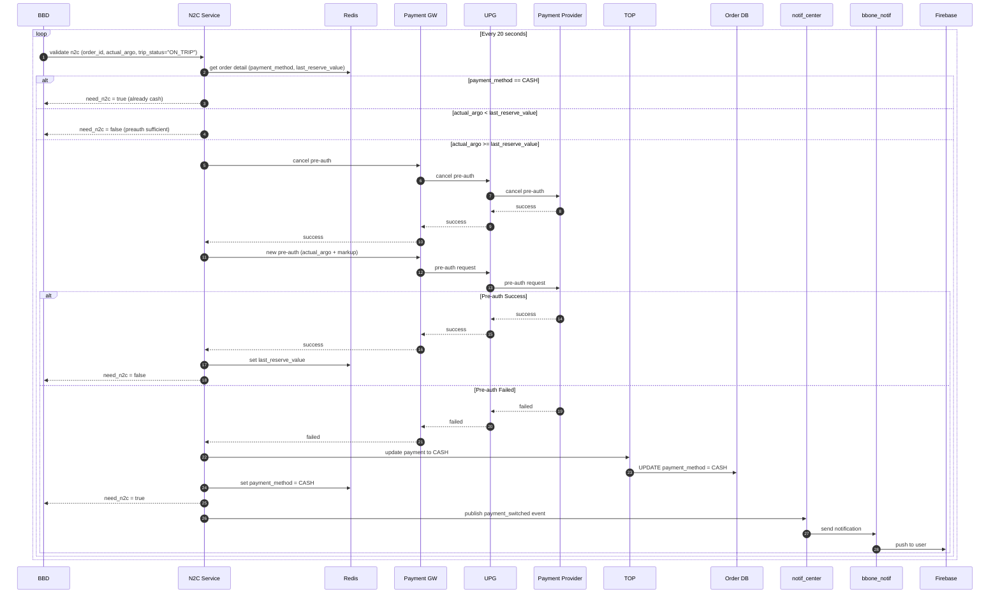
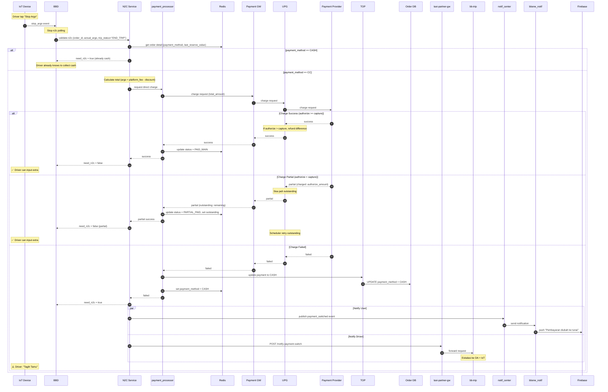
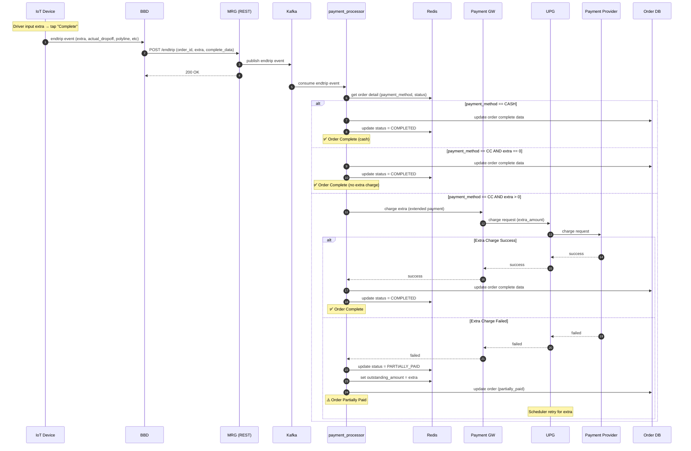

# CC Charging Flow - Sequence Diagrams

**Created:** 2026-02-12  
**Updated:** 2026-02-12  
**Status:** Draft  
**Related:** [[02-spike-new-charging-flow]], [[01-n2c-flow-documentation]]

---

## Overview

Sequence diagram untuk flow charging CC yang baru. Flow terbagi menjadi 3 fase:
1. **Selama Trip** - Preauth polling (penjagaan)
2. **Stop Argo** - Direct charge main payment
3. **Endtrip** - Extended payment untuk extra

---

## Participants

| Service | Layer | Role |
|---------|-------|------|
| IoT | Device | Driver device (stop argo, input extra, endtrip) |
| BBD | External | Forward event dari IoT ke MRG |
| N2C | MRG | Validate n2c, orchestrate preauth/charge |
| payment_processor | MRG | Handle charging logic |
| Redis | Storage | Order state management |
| PGW | MRG | Payment gateway internal |
| UPG | Payment | Payment middleware |
| PayProv | External | Payment provider (bank/CC) |
| TOP | MRG | Taxi order processor |
| DBOrder | Storage | Order database |
| taxi-partner-gw | MRG | Gateway ke BBD services |
| bb-trip | BBD | Handle driver notification |
| notif_center | Notification | Notification orchestrator |
| bbone_notif | Notification | Bluebird One notification |
| Firebase | External | Push notification delivery |

---

## N2C Request Flag

| Field | Value | Behavior |
|-------|-------|----------|
| `trip_status` | `ON_TRIP` | Preauth polling (existing flow) |
| `trip_status` | `END_TRIP` | Direct charge (new flow) |

---

## Sequence Diagram 1: Selama Trip (Preauth Polling)



---

## Sequence Diagram 2: Stop Argo (Direct Charge)



---

## Sequence Diagram 3: Endtrip (Extended Payment for Extra)



---

## Flow Summary

```
┌─────────────────────────────────────────────────────────────────┐
│                        SELAMA TRIP                               │
│  BBD polling N2C setiap 20s (trip_status = "ON_TRIP")           │
│  → Preauth validation & refresh                                  │
│  → Jika preauth gagal → switch to CASH                          │
└─────────────────────────────────────────────────────────────────┘
                              │
                              ▼
┌─────────────────────────────────────────────────────────────────┐
│                        STOP ARGO                                 │
│  IoT → BBD → N2C (trip_status = "END_TRIP")                     │
│  → Direct charge (argo + platform_fee - discount)               │
│  → UPG handle selisih preauth vs charge otomatis                │
│  → Jika gagal → switch to CASH → notify user + driver           │
└─────────────────────────────────────────────────────────────────┘
                              │
                              ▼
┌─────────────────────────────────────────────────────────────────┐
│                     INPUT EXTRA (IoT)                            │
│  Driver input extra amount (bisa 0)                             │
└─────────────────────────────────────────────────────────────────┘
                              │
                              ▼
┌─────────────────────────────────────────────────────────────────┐
│                        ENDTRIP                                   │
│  IoT → BBD → MRG (complete data + extra)                        │
│  → Jika extra > 0 → charge extra (extended payment)             │
│  → Jika gagal → partially paid (outstanding)                    │
│  → Order complete                                                │
└─────────────────────────────────────────────────────────────────┘
```

---

## Charge Scenarios Summary

| Phase | Scenario | Result | Action |
|-------|----------|--------|--------|
| Stop Argo | authorize >= capture | Success | Main payment complete, refund sisa |
| Stop Argo | authorize < capture | Partial | Main captured, sisa outstanding |
| Stop Argo | Failed | Switch CASH | Notify user + driver |
| Endtrip | extra = 0 | Success | Order complete |
| Endtrip | extra > 0, success | Success | Order complete |
| Endtrip | extra > 0, failed | Partial | Extra jadi outstanding |

---

## Contract: N2C Payment Eligibility

### Endpoint
```
POST /n2c-service/v1/payment/eligibility
Host: dev-mybb-api.internal.bluebird.id
```

### Request
```json
{
  "order_id": "string",
  "actual_argo": 250000,
  "trip_status": "ON_TRIP | END_TRIP",
  "payment_method": "E_WALLET | CREDIT_CARD"
}
```

| Field | Type | Description |
|-------|------|-------------|
| `order_id` | string | Order ID |
| `actual_argo` | number | Actual argo amount |
| `trip_status` | string | `ON_TRIP` (polling) atau `END_TRIP` (direct charge) |
| `payment_method` | string | `E_WALLET` atau `CREDIT_CARD` |

### Response

**Case 1: Balance sufficient / CC preauth valid**
```json
HTTP 200 OK
{
  "success": true,
  "data": {
    "order_id": "string",
    "is_sufficient": true,
    "force_to_cash": false
  }
}
```

**Case 2: Balance insufficient, user notified for top up**
```json
HTTP 200 OK
{
  "success": true,
  "data": {
    "order_id": "string",
    "is_sufficient": false,
    "force_to_cash": false
  }
}
```

**Case 3: Balance insufficient / CC preauth invalid, forced to cash**
```json
HTTP 200 OK
{
  "success": true,
  "data": {
    "order_id": "string",
    "is_sufficient": false,
    "force_to_cash": true
  }
}
```

**Case 4: Error**
```json
HTTP 500 Internal Server Error
{
  "error_code": "N2CS-50000",
  "error_message": "Internal server error"
}
```

### Response Logic

| `is_sufficient` | `force_to_cash` | Meaning |
|-----------------|-----------------|---------|
| `true` | `false` | OK, lanjut (balance cukup / preauth valid) |
| `false` | `false` | E-wallet: user notified top up, CC: preauth refreshed |
| `false` | `true` | Switch to CASH, notify driver "tagih tamu" |
```

---

## Contract: MRG → bb-trip (Payment Switch)

### Endpoint
```
POST /notify-payment-switch
Host: taxi-partner-gw
```

### Request
```json
{
  "order_id": "ORD-123456",
  "payment_method": "CASH",
  "reason": "CHARGE_FAILED | PREAUTH_FAILED",
  "timestamp": "2026-02-12T10:30:00Z"
}
```

---

## Notes

1. **Preauth tetap ada** selama trip sebagai penjagaan
2. **UPG Enhancement**: authorize vs capture selisih di-handle otomatis
3. **Outstanding**: UPG scheduler retry, user blocked sampai selesai
4. **Tips**: Excluded, akan di-handle di extended tipping flow terpisah
