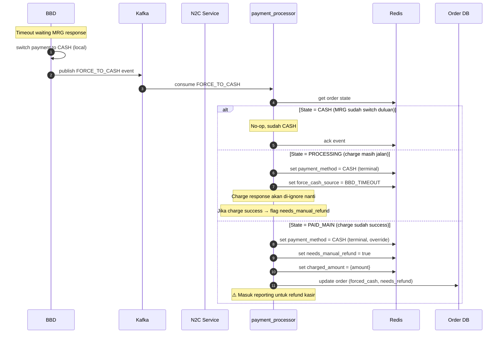
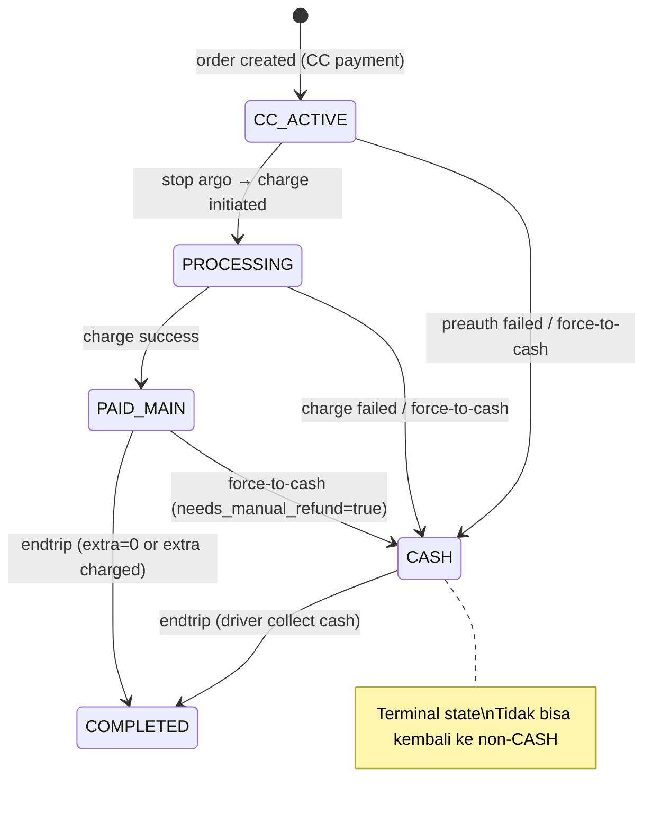

# BBD Source of Truth - Force to Cash Mechanism

**Created:** 2026-02-18  
**Status:** Draft  
**Author:** Lukmanul Hakim  
**Suggested by:** Happy Kushendraji (Senior Architect)  
**Related:** [[03-cc-charging-sequence-diagrams]], [[02-spike-new-charging-flow]]

---

## Background

Ditemukan isu timeout pada flow charging CC saat Stop Argo. Ketika BBD memanggil MRG untuk validate N2C (`trip_status = END_TRIP`), proses charging ke UPG memakan waktu lama sehingga BBD timeout. BBD memutuskan switch ke CASH, namun MRG tidak mengetahui keputusan ini — bahkan charge bisa saja berhasil di sisi UPG.

Akibatnya terjadi **split brain**: BBD sudah CASH, MRG masih anggap CC.

---

## Solution Overview

### Prinsip Utama

1. **BBD adalah Source of Truth** untuk payment method — jika BBD memutuskan CASH, MRG harus ikut
2. **Force-to-cash adalah terminal state** — sekali CASH, tidak bisa kembali ke non-CASH
3. **Refund dilakukan manual oleh kasir** — engineer menyediakan reporting, bukan auto-refund
4. **Cascading SLA timeout** sebagai prevention layer agar timeout BBD jarang terjadi

---

## Cascading SLA Timeout

Timeout harus cascading agar MRG selalu respond sebelum BBD timeout:

```
┌──────────────────┬─────────┐
│ Hop              │ Timeout │
├──────────────────┼─────────┤
│ PayProv response │ 15s     │
│ UPG → PayProv    │ 20s     │
│ MRG → UPG       │ 25s     │
│ BBD → MRG       │ 30s     │
└──────────────────┴─────────┘
```

> Dengan cascading ini, BBD timeout seharusnya **jarang terjadi**. Mekanisme force-to-cash event adalah **safety net** untuk kasus edge (network issue, GC pause, dll).

---

## Force-to-Cash Event Flow

### Event Contract

**Publisher:** BBD  
**Consumer:** MRG  
**Channel:** Kafka

```json
{
  "event_type": "FORCE_TO_CASH",
  "order_id": "ORD-123456",
  "reason": "BBD_TIMEOUT",
  "triggered_at": "2026-02-18T10:30:28Z"
}
```

### Sequence Diagram



---

## Race Condition Handling

### Case A: Force-to-cash tiba SEBELUM charge response

```
t=0s   BBD → MRG: validate n2c (END_TRIP)
t=0s   MRG → UPG: charge request
t=28s  BBD timeout → publish FORCE_TO_CASH
t=29s  MRG consume event → set CASH (terminal)
t=30s  UPG response: charge SUCCESS
t=30s  MRG cek state = CASH → ignore, flag needs_manual_refund
```

### Case B: Force-to-cash tiba SETELAH charge response

```
t=0s   BBD → MRG: validate n2c (END_TRIP)
t=0s   MRG → UPG: charge request
t=27s  UPG response: charge SUCCESS → MRG set PAID_MAIN
t=28s  BBD timeout → publish FORCE_TO_CASH
t=29s  MRG consume event → override CASH (terminal, selalu menang)
       → flag needs_manual_refund = true
```

### Case C: Charge gagal, lalu force-to-cash

```
t=0s   BBD → MRG: validate n2c (END_TRIP)
t=0s   MRG → UPG: charge request
t=25s  UPG response: charge FAILED → MRG set CASH
t=28s  BBD timeout → publish FORCE_TO_CASH
t=29s  MRG consume event → already CASH → no-op
       → needs_manual_refund = false (tidak ada uang yang perlu di-refund)
```

---

## State Machine



---

## Reporting Requirement

### Tujuan

Kasir perlu mengetahui order mana yang sudah ter-charge di CC tapi payment method di-switch ke CASH, agar bisa melakukan refund manual.

### Query Criteria

```sql
SELECT order_id, charged_amount, charge_timestamp, 
       force_cash_timestamp, force_cash_reason
FROM orders
WHERE payment_method = 'CASH'
  AND needs_manual_refund = true
  AND refund_status = 'PENDING'
ORDER BY force_cash_timestamp DESC;
```

### Report Fields

| Field | Description |
|-------|-------------|
| `order_id` | ID order |
| `charged_amount` | Jumlah yang sudah ter-charge di CC |
| `charge_timestamp` | Waktu charge berhasil |
| `force_cash_timestamp` | Waktu BBD trigger force-to-cash |
| `force_cash_reason` | `BBD_TIMEOUT` / lainnya |
| `refund_status` | `PENDING` / `REFUNDED` |

### Refund Flow (Manual)

```
Kasir buka report → lihat order PENDING
→ verifikasi data → proses refund via sistem kasir
→ update refund_status = REFUNDED
```

---

## Implementation Checklist

- [ ] BBD: Publish `FORCE_TO_CASH` event ke Kafka saat timeout
- [ ] MRG: Consumer untuk `FORCE_TO_CASH` event
- [ ] MRG: State rule — CASH terminal, reject transition ke non-CASH
- [ ] MRG: Flag `needs_manual_refund` jika charge sudah success
- [ ] MRG: Handle race condition pada charge response setelah force-to-cash
- [ ] DB: Tambah kolom `force_cash_source`, `force_cash_timestamp`, `needs_manual_refund`, `refund_status`
- [ ] Reporting: Query & UI untuk kasir melihat order yang perlu di-refund
- [ ] SLA: Align cascading timeout antar semua service
- [ ] Testing: Simulasi race condition Case A, B, C

---

## Notes

- Cascading SLA timeout adalah **prevention layer** — force-to-cash event adalah **safety net**
- Auto-refund sengaja tidak dilakukan untuk keamanan finansial — kasir verifikasi manual
- Event harus idempotent — consume ulang tidak boleh mengubah state yang sudah CASH
