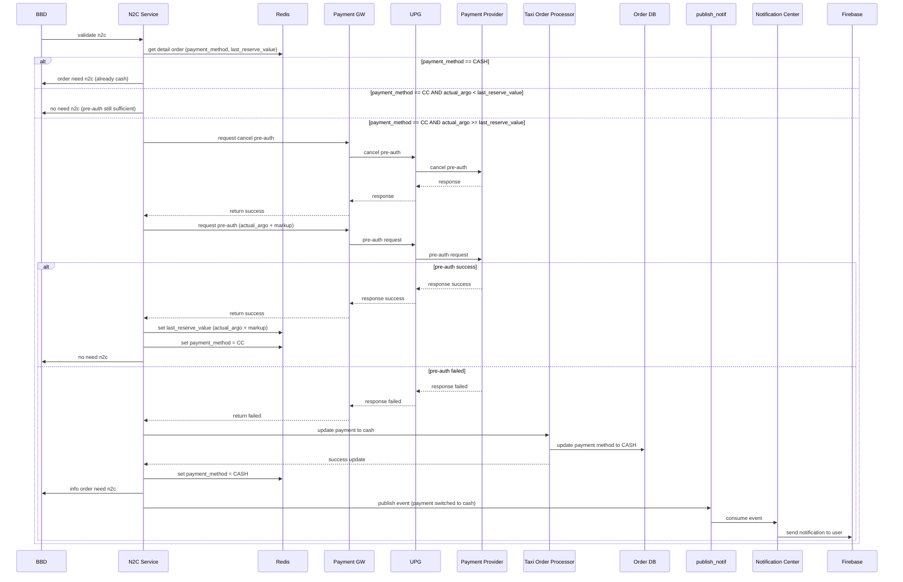

	# N2C (Ngecharge to Cloud) - Complete Flow Documentation

## 1. Overview

### Scope

N2C (Ngecharge to Cloud) adalah service yang bertanggung jawab untuk:
1. **Pre-authorization** — Validasi kemampuan bayar menggunakan kartu kredit
2. **Cancel pre-authorization** — Release hold amount saat booking dibatalkan atau pre-auth perlu di-refresh
3. **Payment method switching** — Automatic switch ke CASH jika pre-auth gagal

### Key Principles

- N2C hanya handle **pre-auth dan cancel pre-auth**
- Charging flow menggunakan **existing flow** (di luar scope N2C)
- Jika pre-auth **failed** → payment method **switch to CASH**
- N2C **tidak calculate amount** → amount dari MRG (fare estimation) atau BBD (actual argo)

---

## 2. Flow Diagram



---

## 3. Decision Logic

### Decision Tree

```
validate_n2c(order_id, actual_argo):
│
├─ Get order detail from Redis
│  ├─ payment_method
│  └─ last_reserve_value
│
├─ IF payment_method == CASH
│  └─ RETURN "order need n2c" (already switched)
│
├─ ELSE IF payment_method == CC
│  │
│  ├─ IF actual_argo < last_reserve_value
│  │  └─ RETURN "no need n2c" (sufficient)
│  │
│  └─ ELSE (actual_argo >= last_reserve_value)
│     │
│     ├─ Cancel old pre-auth
│     ├─ Request new pre-auth (actual_argo + markup)
│     │
│     ├─ IF pre-auth SUCCESS
│     │  ├─ Update Redis (last_reserve_value, payment_method)
│     │  └─ RETURN "no need n2c"
│     │
│     └─ ELSE (pre-auth FAILED)
│        ├─ Update payment to CASH (via TOP → DB Order)
│        ├─ Update Redis: payment_method = CASH
│        ├─ Publish notification event
│        └─ RETURN "order need n2c"
```

### Case Breakdown

**Case 1: Payment Already CASH** — Return immediately, sudah switched sebelumnya.

**Case 2: Pre-auth Still Sufficient** (`actual_argo < last_reserve_value`) — No action needed, pre-auth masih cukup.

**Case 3: Need Re-authorization** (`actual_argo >= last_reserve_value`) — Cancel old pre-auth, lalu create new pre-auth dengan `actual_argo + markup`.

### Markup Configuration

- Default: **100k** (configurable)
- Ditentukan oleh: **STO** (jarang berubah)
- Purpose: Buffer untuk handle variance antara actual argo dengan final charge

---

## 4. State Management (Redis)

### Order Detail Structure

```json
{
  "order_id": "xxx",
  "payment_method": "CC",
  "last_reserve_value": 150000,
  "actual_argo": 120000,
  "est_amount": 100000
}
```

### State Transitions

| Trigger | `payment_method` | `last_reserve_value` |
|---------|-------------------|----------------------|
| Initial pre-auth (booking created) | `null → CC` | `null → est_amount` |
| Successful re-auth | `CC` (unchanged) | `old_value → actual_argo + markup` |
| Switch to CASH | `CC → CASH` | Remains (for audit) |

### State Consistency

- Redis updated **synchronously** dalam N2C flow
- DB Order updated via TOP (asynchronous but guaranteed)
- Next validation check `payment_method` dulu → prevent unnecessary re-auth attempt

---

## 5. Integration Points

### Upstream (Input)

| Service | Role |
|---------|------|
| **BBD** | Trigger `validate n2c` dengan actual_argo saat charging |
| **Redis** | Source of truth untuk order state |

### Downstream (Output)

| Service | Role |
|---------|------|
| **PGW** | Pre-auth and cancel pre-auth operations |
| **TOP** | Update payment method in DB Order |
| **BBD** | Receive validation result |
| **Queue (publish_notif)** | Publish event untuk user notification |

### External Dependencies

| Service | Role |
|---------|------|
| **UPG** | Middleware ke payment provider |
| **Payment Provider** | Actual pre-auth execution |
| **Notification Center** | Consume event, kirim ke Firebase |
| **Firebase** | Push notification ke user |

---

## 6. Grey Zone Assessment

| # | Grey Zone | Resolution | Status |
|---|-----------|------------|--------|
| 1 | Race condition trip completed vs N2C | Not applicable — N2C triggered by BBD charging, not trip completion | ✅ Resolved |
| 2 | Markup arbitrary value | Configurable by STO | ✅ Resolved |
| 3 | Redis SPOF | Out of scope — infrastructure concern | ✅ N/A |
| 4 | Multi-system notification | Async & guaranteed by respective teams | ✅ Resolved |
| 5 | User notification | Handled by MyBB on get detail | ✅ Resolved |
| 6 | Concurrent requests | BBD ensures no duplicate | ✅ Resolved |
| 7 | Idempotency | Not needed — BBD handles retry mechanism | ✅ Resolved |

### Remaining: State Consistency

**Problem:** DB Order updated to CASH, tapi Redis `last_reserve_value` masih holds old value → next validation bisa execute unnecessary logic.

**Solution:** Add `payment_method` field di Redis. Update `payment_method = CASH` saat switch. Validation check `payment_method` first before comparing argo.

**Result:** ✅ No grey zone remaining in pure N2C flow.

---

## 7. Scope Boundary

### N2C Handles

- Pre-authorization validation
- Cancel + re-auth when actual > reserved
- Automatic payment method switching (CC → CASH)
- State management in Redis
- Event publishing for user notification

### N2C Does NOT Handle

- Fare calculation (dari MRG/BBD)
- Actual charging (existing flow)
- Retry mechanism (BBD handles)
- User notification delivery (Notification Center)
- Trip completion logic (BBD)

---

## 8. Design Decisions

| Decision | Rationale |
|----------|-----------|
| Configurable markup | Flexibility untuk adjust buffer tanpa deploy |
| No retry in N2C | BBD hit secara rutin, simpler design |
| Fail to CASH | User experience first, prevent payment blocking |
| Redis state management | Fast validation, prevent duplicate operations |
| Async notification | Decouple N2C dari notification delivery |

---

## Changelog

| Version | Date | Changes |
|---------|------|---------|
| 1.0 | 2026-02-06 | Initial documentation: complete flow diagram, grey zone assessment, Redis state management, decision logic tree, integration points |
