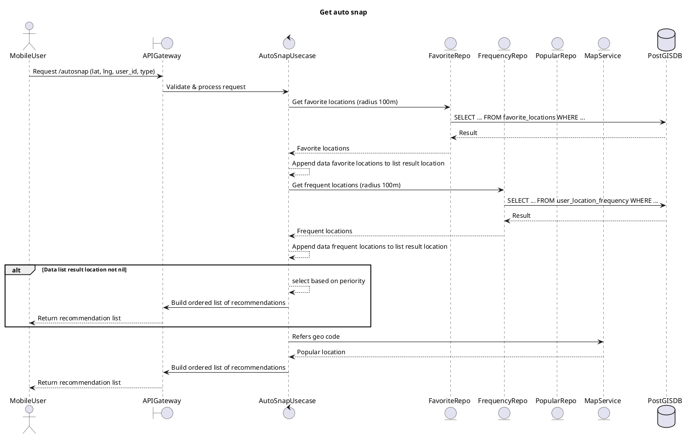

# Get Auto Snap - Sequence Diagram

**Parent**: [[README|Optimalisasi Placement untuk Tim MRG]]  
**Type**: PlantUML Diagram

---

## Diagram

---

## Flow Description

### Request
- **Endpoint**: `/autosnap`
- **Parameters**: `lat`, `lng`, `user_id`, `type`

### Processing Steps

1. **API Gateway** validates dan forwards request ke AutoSnap Usecase
2. **FavoriteRepo** fetch favorite locations dalam radius 100m
3. **FrequencyRepo** fetch frequent locations dalam radius 100m
4. **Append** kedua hasil ke result list
5. **Jika ada data**: Select berdasarkan prioritas dan return
6. **Jika tidak ada**: Fallback ke MapService untuk geocode

### Priority Order
1. Favorite locations
2. Frequent locations
3. Popular locations (from geocode)

---

## 🏷️ Tags

#diagram #plantuml #sequence #autosnap #getter

---

*Last Updated*: 2025-01-05
