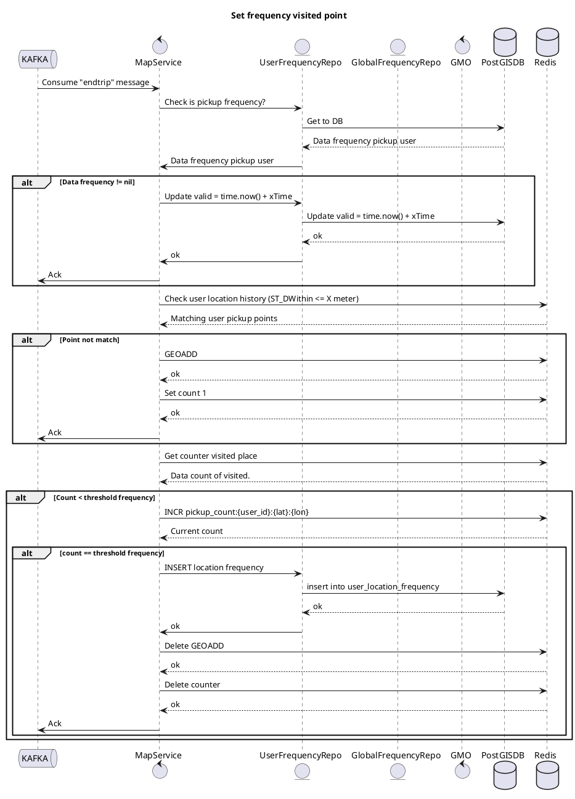

# Set Frequency Visited Point - Sequence Diagram

**Parent**: [[README|Optimalisasi Placement untuk Tim MRG]]  
**Type**: PlantUML Diagram

---

## Diagram



---

## Flow Description

### Trigger
- **Event**: `endtrip` message dari Kafka

### Processing Steps

1. **Consume** endtrip message dari Kafka
2. **Check** apakah sudah ada frequency data untuk user ini
3. **Jika ada**: Update `valid_until` timestamp
4. **Jika tidak ada**:
   - Check Redis untuk location history (ST_DWithin <= X meter)
   - Jika point tidak match: GEOADD ke Redis, set count = 1
   - Jika point match: INCR counter
5. **Jika count == threshold**: 
   - INSERT ke `user_location_frequency` table
   - Cleanup Redis (delete GEOADD dan counter)
6. **ACK** message ke Kafka

### Redis Keys Pattern

```
pickup_count:{user_id}:{lat}:{lon}
```

### Threshold

Default threshold: **>= 2 visits** untuk dianggap frequent location

---

## 🏷️ Tags

#diagram #plantuml #sequence #setter #frequency #kafka

---

*Last Updated*: 2025-01-05
