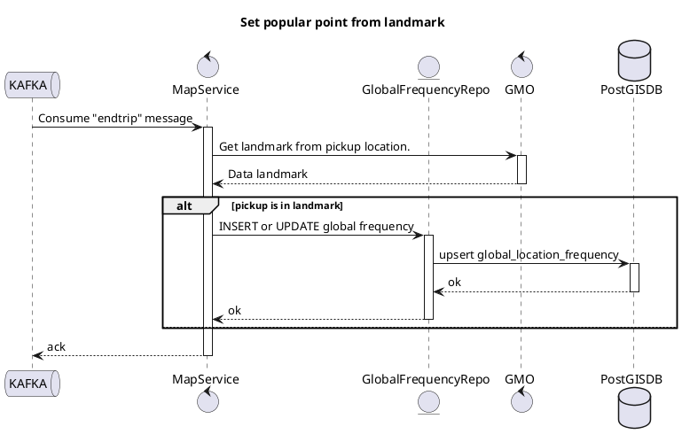

# Set Popular Point from Landmark - Sequence Diagram

**Parent**: [[README|Optimalisasi Placement untuk Tim MRG]]  
**Type**: PlantUML Diagram

---

## Diagram



---

## Flow Description

### Trigger
- **Event**: `endtrip` message dari Kafka

### Processing Steps

1. **Consume** endtrip message dari Kafka
2. **Call GMO** untuk get landmark dari pickup location
3. **Jika pickup ada di dalam landmark**:
   - UPSERT ke `global_location_frequency` table
   - Increment counter jika sudah ada
4. **ACK** message ke Kafka

### GMO Integration

GMO (Geographic Management Operations) menyediakan:
- Landmark boundaries
- Subplace information
- POI data

### Database Operation

```sql
-- Upsert operation
INSERT INTO global_location_frequency (type, geom, landmark_id, subplace_id, count)
VALUES ('pickup', ST_MakePoint(lng, lat)::geography, 'landmark_123', 'subplace_456', 1)
ON CONFLICT (landmark_id, subplace_id, type) 
DO UPDATE SET count = global_location_frequency.count + 1, updated_at = now();
```

---

## 🏷️ Tags

#diagram #plantuml #sequence #setter #popular #landmark #gmo

---

*Last Updated*: 2025-01-05
