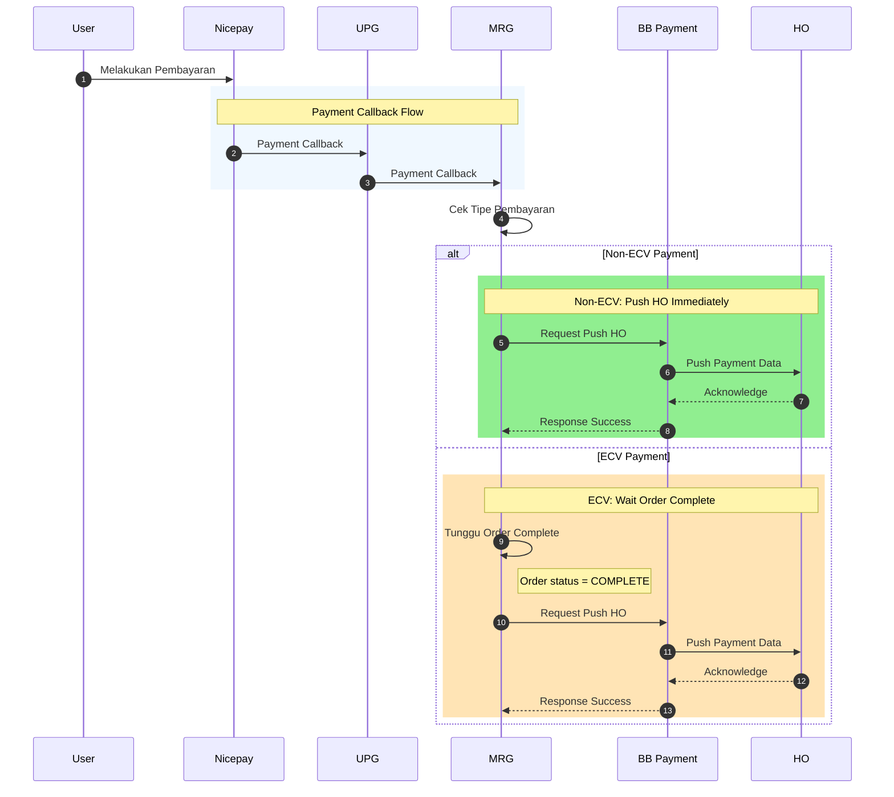

# Push HO Rent Revamp - Payment Flow Design

**Owner**: Lukmanul Hakim  
**Team**: MRG  
**Status**: Draft  
**Created**: 2026-03-18  

---

## 📋 Overview

Dokumen ini menjelaskan mekanisme Push HO untuk fitur Rent Revamp, dengan diferensiasi handling berdasarkan tipe pembayaran (ECV vs Non-ECV).

---

## 🎯 Key Decision

| Payment Type | Push HO Timing |
|--------------|----------------|
| Non-ECV | Immediately after payment callback |
| ECV | After order complete |

---

## 🔄 Sequence Diagram

---

## 📝 Flow Description

### Common Flow (Semua Payment Type)

1. **User** melakukan pembayaran via Nicepay
2. **Nicepay** mengirim payment callback ke UPG
3. **UPG** meneruskan callback ke MRG
4. **MRG** mengecek tipe pembayaran

### Non-ECV Payment Flow

5. MRG langsung melakukan request Push HO ke BB Payment
6. BB Payment melakukan call ke HO
7. HO acknowledge dan return response
8. Selesai

### ECV Payment Flow

5. MRG menunggu hingga order status = **COMPLETE**
6. Setelah complete, MRG melakukan request Push HO ke BB Payment
7. BB Payment melakukan call ke HO
8. HO acknowledge dan return response
9. Selesai

---

## 🔧 Technical Considerations

### Why ECV Wait for Complete?

- **Budget Calculation**: ECV budget perlu dihitung berdasarkan actual order (termasuk overtime, extra, tipping)
- **Cross-Month Orders**: Order yang dibuat akhir bulan untuk bulan berikutnya perlu reporting yang akurat
- **Consistency**: Align dengan pattern Cititrans yang sudah proven

### MRG Responsibility

- Cek payment type dari callback
- Trigger push HO ke BB Payment
- Handle response dan error dari BB Payment

### BB Payment Responsibility

- Receive request dari MRG
- Format data sesuai HO requirement
- Push ke HO system
- Return acknowledgment ke MRG

---

## 🔗 Related Documents

- [[2025-01-27 - ECV for GB Rent Revamp Discussion|ECV Meeting Notes]]
- [[reserved-budget-ecv/README|Reserved Budget ECV Design]]

---

## 📊 Status Tracking

- [x] Flow design defined
- [x] Sequence diagram created
- [ ] API contract dengan BB Payment
- [ ] Error handling flow
- [ ] Retry mechanism
- [ ] Monitoring & alerting

---

**Last Updated**: 2026-03-18  
**Owner**: Lukmanul Hakim, MRG Team
