# MRG Service Dependencies Map

> **Source**: Dihasilkan dari Bluelink Knowledge Base — `services/MRG/*/meta-spec/dependencies.md`
> **Generated**: 2026-04-17
> **Total Services**: 15 services

---

## Service Inventory

| #   | Service               | Peran                                        |
| --- | --------------------- | -------------------------------------------- |
| 1   | `mybb-api-gateway-go` | Entry point mobile (REST :3000 / gRPC :3443) |
| 2   | `authservice`         | Autentikasi, token, OTP (gRPC :6017)         |
| 3   | `fds`                 | Fraud Detection System                       |
| 4   | `serviceinfo`         | Info layanan & tarif                         |
| 5   | `taxipartnergateway`  | Gateway ke BBD Dispatch                      |
| 6   | `orderorchestrator`   | Orkestrasi booking & order (hub utama)       |
| 7   | `paymentprocessor`    | Pemrosesan pembayaran                        |
| 8   | `orderquery`          | Query & agregasi data order                  |
| 9   | `n2cservice`          | Near-To-Cash / preauth management            |
| 10  | `dpf`                 | Dynamic Platform Fee                         |
| 11  | `webhookforwarder`    | Receiver semua external callback             |
| 12  | `order-processing-go` | Legacy order processor (Kafka-based)         |
| 13  | `notificationcenter`  | Push / SMS / Email / WhatsApp                |
| 14  | `trackerservice`      | Real-time car tracking                       |
| 15  | `ho-gateway`          | HO e-wallet transaction sync                 |

---

## Diagram Dependensi Lengkap

```mermaid
graph TB
    %% ============================================================
    %% MRG INTERNAL SERVICES
    %% ============================================================
    subgraph MRG["🏢 MRG Internal Services"]
        AGW["mybb-api-gateway-go\nREST :3000 / gRPC :3443"]
        AS["authservice\ngRPC :6017"]
        FDS["fds\nFraud Detection"]
        SI["serviceinfo"]
        TPG["taxipartnergateway"]
        PP["paymentprocessor"]
        OO["orderorchestrator"]
        OQ["orderquery"]
        N2C["n2cservice\npreauth/near-to-cash"]
        DPF["dpf\nDynamic Platform Fee"]
        WHF["webhookforwarder"]
        OPS["order-processing-go\nLegacy Kafka-based"]
        NC["notificationcenter"]
        TS["trackerservice"]
        HOG["ho-gateway"]
    end

    %% ============================================================
    %% SHARED PLATFORM SERVICES
    %% ============================================================
    subgraph PLAT["🔧 Shared Platform Services"]
        TOP["TaxiOrderProcessor (TOP)"]
        US["UserService"]
        CS["ConfigService"]
        SM["SessionManager"]
        PG["PromoGateway"]
        GS["GeoService"]
        CPS["ContentProvider"]
        FS["FareService"]
        LR["LocationRegistry"]
        CORP["CorporatePortal"]
        GB["GoldenBird Gateway"]
        MKT["Marketing"]
        RM["RoutineManager"]
        HOL["HO Legacy System"]
        GOROO["Gorooster"]
    end

    %% ============================================================
    %% EXTERNAL SYSTEMS
    %% ============================================================
    subgraph EXT["🌐 External Systems"]
        BBD["BBD\nBluebird Dispatch"]
        UPG["UPG Gateway"]
        NICEPAY["NicePay"]
        BBONE["BB-One Notification"]
        DOCSVC["Document Generator"]
        FCM["Firebase FCM"]
    end

    %% ============================================================
    %% INFRASTRUCTURE
    %% ============================================================
    subgraph INFRA["🗄️ Infrastructure"]
        DB[("PostgreSQL")]
        RDS[("Redis")]
        MQ(["RabbitMQ"])
        KF(["Kafka"])
        PS(["Google PubSub"])
        FBR[("Firebase RTDB")]
    end

    %% ============================================================
    %% API GATEWAY → MRG & PLATFORM
    %% ============================================================
    AGW -->|"gRPC – ValidateToken"| AS
    AGW -->|"HTTP"| OO
    AGW -->|"HTTP"| PP
    AGW -->|"HTTP"| SI
    AGW -->|"gRPC"| US
    AGW -->|"HTTP"| LR
    AGW -->|"HTTP"| FS
    AGW -->|"HTTP"| CORP
    AGW -->|"HTTP – loyalty/referral"| MKT
    AGW -->|"HTTP"| GB

    %% ============================================================
    %% AUTH SERVICE
    %% ============================================================
    AS -->|"gRPC – fdsclient v0.0.5\nphone fraud scan"| FDS
    AS -->|"gRPC – userclient v0.0.11"| US
    AS -->|"PubSub – OTP/Email/WA"| NC

    %% ============================================================
    %% SERVICE INFO
    %% ============================================================
    SI -->|"gRPC – taxipartnergatewayclient"| TPG
    SI -->|"gRPC – paymentprocessorclient"| PP

    %% ============================================================
    %% ORDER ORCHESTRATOR (hub utama)
    %% ============================================================
    OO -->|"gRPC – 50+ methods\ncharge/refund/wallet/CC/ECV"| PP
    OO -->|"gRPC – 24 methods\nOrderTaxi/Cancel/Quote"| TPG
    OO -->|"gRPC – GetSession"| SM
    OO -->|"gRPC – config/maintenance"| CS
    OO -->|"gRPC – ReverseGeocode"| GS
    OO -->|"gRPC – ValidatePromo/Redeem"| PG
    OO -->|"gRPC – GetUser"| US
    OO -->|"gRPC/HTTP – Push/Email"| NC

    %% ============================================================
    %% PAYMENT PROCESSOR
    %% ============================================================
    PP -->|"gRPC – orderquery client"| OQ
    PP -->|"gRPC – TaxiOrderProcessor"| TOP
    PP -->|"gRPC – UPG payment"| UPG
    PP -->|"gRPC – ECV/voucher"| CORP
    PP -->|"gRPC – promo redemption"| PG
    PP -->|"gRPC – GetUser"| US
    PP -->|"MQ: ho_e_wallet_transaction"| HOG

    %% ============================================================
    %% ORDER QUERY
    %% ============================================================
    OQ -->|"gRPC – GetFavoriteAddr"| US
    OQ -->|"gRPC – ValidateFeature"| CS
    OQ -->|"gRPC – ValidateSession"| SM
    OQ -->|"gRPC – GetFileResource/icons"| CPS
    OQ -->|"gRPC – GetPromoByCode"| PG
    OQ -->|"gRPC – fare calc"| FS
    OQ -->|"gRPC – GetLocationByID"| LR

    %% ============================================================
    %% N2C SERVICE
    %% ============================================================
    N2C -->|"gRPC – GetOrderByJobId\nUpdateLockedFare"| TOP
    N2C -->|"gRPC – RePreAuth/CancelPreAuth\nGetEwalletBalance"| PP
    N2C -->|"gRPC – GetPreauthConfig"| CS
    N2C -->|"gRPC – GetOrderInfo\nisPreauthEligible"| OQ
    N2C -->|"publish notif"| MQ

    %% ============================================================
    %% DPF
    %% ============================================================
    DPF -->|"gRPC/HTTP – GetOrderCounter"| OO
    DPF -->|"gRPC – loyalty/tier"| MKT

    %% ============================================================
    %% TRACKER SERVICE
    %% ============================================================
    TS -->|"gRPC – GetVacantCars/DriverLoc"| TPG
    TS -->|"gRPC – GetPaymentStatus"| PP
    TS -->|"gRPC – GetOrderDetails"| OQ
    TS -->|"gRPC – ScheduleTask"| RM
    TS -->|"HTTP – ForwardCarTracking"| GOROO

    %% ============================================================
    %% HO GATEWAY
    %% ============================================================
    HOG -->|"gRPC – GetOperationalCity"| CS
    HOG -->|"HTTP POST"| HOL
    MQ -->|"consume: ho_e_wallet_transaction"| HOG

    %% ============================================================
    %% ORDER PROCESSING (legacy)
    %% ============================================================
    OPS -->|"HTTP – ChargeWallet/Refund"| PP
    OPS -->|"HTTP – GetAreaByLoc"| LR
    OPS -->|"HTTP – ECV validate"| CORP
    OPS -->|"HTTP – CreateOrder"| GB
    KF -->|"consume 91 topics"| OPS

    %% ============================================================
    %% WEBHOOK FORWARDER
    %% ============================================================
    WHF -->|"publish events"| MQ
    MQ -->|"consume: order_callback"| TOP
    MQ -->|"consume: notification events"| NC
    MQ -->|"consume: refund_status"| UPG
    MQ -->|"consume: doc_callback"| DOCSVC

    %% ============================================================
    %% TAXI PARTNER GATEWAY → EXTERNAL
    %% ============================================================
    TPG -->|"OAuth2 + gRPC mTLS"| BBD

    %% ============================================================
    %% NOTIFICATION CENTER → EXTERNAL
    %% ============================================================
    NC -->|"HTTPS – push notifications"| FCM
    NC -->|"HTTPS – notification status"| BBONE

    %% ============================================================
    %% EXTERNAL → WEBHOOK FORWARDER (inbound callbacks)
    %% ============================================================
    NICEPAY -->|"POST payment callback"| WHF
    UPG -->|"POST preauth/refund status"| WHF
    BBD -->|"POST order events"| WHF
    BBONE -->|"POST notif delivery"| WHF
    DOCSVC -->|"POST doc generated"| WHF

    %% ============================================================
    %% INFRASTRUCTURE (dotted)
    %% ============================================================
    AGW -. "PostgreSQL · Redis · Kafka · Firebase" .-> INFRA
    AS -. "Redis – Session/Token/OTP" .-> RDS
    FDS -. "PostgreSQL + Redis" .-> INFRA
    PP -. "PostgreSQL · Redis · PubSub" .-> INFRA
    OO -. "PostgreSQL · Redis · RabbitMQ · PubSub" .-> INFRA
    OQ -. "PostgreSQL (main + legacy)" .-> DB
    N2C -. "Redis + RabbitMQ" .-> INFRA
    DPF -. "PostgreSQL + Redis" .-> INFRA
    WHF -. "RabbitMQ" .-> MQ
    OPS -. "PostgreSQL · Redis · Kafka · MongoDB" .-> INFRA
    NC -. "PostgreSQL · Redis · PubSub/Kafka" .-> INFRA
    TS -. "Redis · Firebase RTDB · PubSub" .-> INFRA
    HOG -. "PostgreSQL + RabbitMQ" .-> INFRA
```



---

## Ringkasan Koneksi Antar-Service

### Hub Sentral (paling banyak dikoneksi)

| Service | Di-call oleh | Memanggil |
|---------|-------------|-----------|
| **paymentprocessor** | AGW, SI, OO, N2C, TS, OPS | OQ, TOP, UPG, CORP, PG, US, HOG |
| **orderorchestrator** | AGW, DPF | PP, TPG, SM, CS, GS, PG, US, NC |
| **orderquery** | PP, N2C, TS | US, CS, SM, CPS, PG, FS, LR |
| **taxipartnergateway** | SI, OO, TS | BBD (external dispatch) |
| **notificationcenter** | AS, OO, MQ | FCM, BB-One (external) |

### Alur Callback Inbound (External → MRG)

```
NicePay ──────────────────────┐
UPG Gateway ──────────────────┤
BBD Dispatch ─────────────────┼──▶ webhookforwarder ──▶ RabbitMQ ──▶ TOP / NC / UPG / DocSvc
BB-One Notification ──────────┤
Document Generator ───────────┘
```

### Alur Autentikasi

```
Mobile App ──▶ mybb-api-gateway-go ──▶ authservice ──▶ fds (fraud scan)
                                                   └──▶ UserService (lookup)
```

### Alur Order Utama

```
Mobile App ──▶ API Gateway ──▶ orderorchestrator ──▶ paymentprocessor ──▶ orderquery
                                                 └──▶ taxipartnergateway ──▶ BBD Dispatch
```

---

## Protokol Komunikasi

| Protokol | Digunakan oleh |
|----------|----------------|
| **gRPC** | Mayoritas komunikasi antar microservice |
| **HTTP REST** | API Gateway → downstream, order-processing-go, trackerservice → Gorooster |
| **RabbitMQ (AMQP)** | webhookforwarder, n2cservice, ho-gateway, orderorchestrator, order-processing-go |
| **Kafka** | order-processing-go (91 topics), mybb-api-gateway-go |
| **Google PubSub** | authservice → notificationcenter, paymentprocessor, trackerservice |
| **OAuth2 + gRPC mTLS** | taxipartnergateway → BBD |

---

*Sumber: Bluelink KB — `services/MRG/*/meta-spec/dependencies.md`*
*Last Synced: 2026-04-17*
