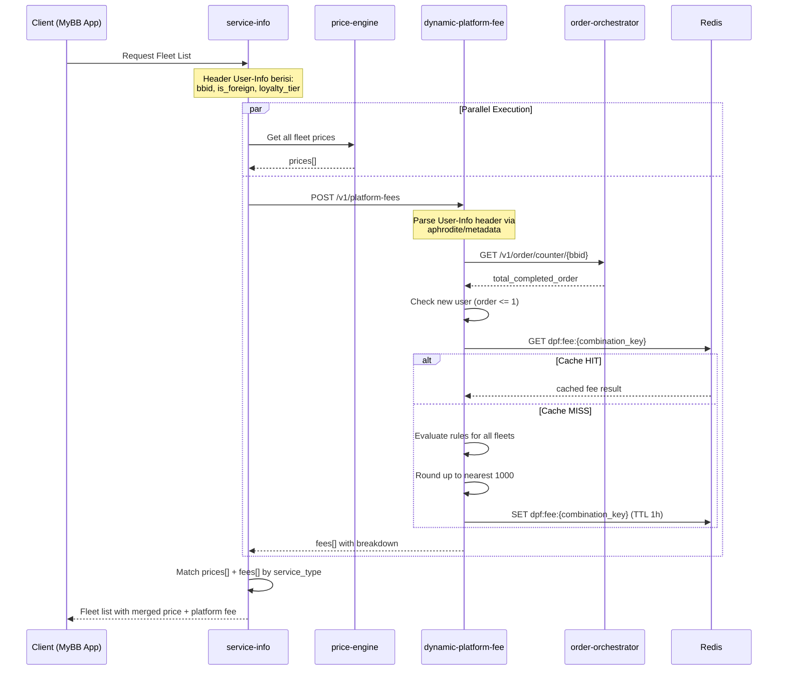

# RFC-001: Dynamic Platform Fee Service

**Status:** Final (Implemented)  
**Author:** Lukmanul Hakim  
**Created:** 2026-02-19  
**Updated:** 2026-03-05  
**Related:** [[RFC-002-order-orchestrator-counter]], [[RFC-003-user-service-foreign-flag]]

---

## 1. Overview

### 1.1. Problem Statement

Platform fee saat ini bersifat **statis** — nilai sama untuk semua user tanpa mempertimbangkan konteks user, metode pembayaran, atau jenis layanan. Tidak ada mekanisme untuk:
- Menerapkan surcharge pada user asing (foreign user)
- Memberikan diskon berbasis loyalty tier
- Membedakan fee berdasarkan service type, fleet type, dan pricing model
- Menerapkan surcharge untuk corporate vs retail user
- Mengubah fee tanpa deploy ulang (non-configurable)

### 1.2. Proposed Solution

Membuat service baru `dynamic-platform-fee` (DPF) sebagai **dedicated fee calculation engine** yang:
- Menerima konteks request (user metadata dari header + request params)
- Fetch data tambahan (order counter dari Order Orchestrator)
- Mengevaluasi rule set yang tersimpan di DB
- Mengembalikan final platform fee + breakdown per komponen

### 1.3. Goals

- Separasi concern: fee calculation domain berdiri sendiri
- Single source of truth untuk semua fee adjustment
- Configurable tanpa deploy (rules & config di DB)
- Zero impact ke fleet list jika DPF mengalami gangguan (full fallback)

### 1.4. Non-Goals

- DPF **tidak** menyimpan user data (stateless calculator)
- DPF **tidak** mendeteksi foreign flag (dari header `User-Info`)
- DPF **tidak** mengelola order counter (delegasi ke Order Orchestrator)
- DPF **tidak** query loyalty tier (dari header `User-Info`)
- Pickup zone & Surge condition → **Phase 2**

---

## 2. Architecture

### 2.1. Service Overview

```
Service Name : dynamic-platform-fee
Language     : Go
Database     : PostgreSQL
Cache        : Redis
Protocol     : gRPC + HTTP/REST via gRPC-Gateway
```

### 2.2. Integration Flow



### 2.3. Fallback Strategy

| Scenario | Behavior |
|---|---|
| DPF timeout / down | Fallback ke default PF dari global config service-info |
| order-orchestrator timeout | `total_completed_order = 0` → new user exemption applied |
| Service type not found | Return error 503 → caller fallback ke static PF |
| Cache miss + DB error | Return error 503 |
| Feature disabled | Return error 503 → caller fallback ke static PF |

> Fleet list **tidak boleh** terdampak jika DPF mengalami gangguan.

### 2.4. Fee Calculation Logic

#### Formula

```
1. Check new user:
   if total_completed_order <= 1 → return final_fee = 0, STOP

2. Calculate raw:
   raw = base_platform_fee
       + foreign_add           (if is_foreign && order >= threshold)
       + corporate_add         (if payment = ECV/trip_voucher/cc_cp)
       + bin_country_add       (if card country != ID)
       + card_principal_add    (if AMEX)
       + urgency_add           (immediate=+250 / advance=+300)
       - loyalty_discount      (based on tier from header)

3. Round up to nearest 1000:
   rounded = ceil(raw / 1000) * 1000

4. Apply cap:
   final = min(rounded, cap_platform_fee)

5. Apply floor:
   final = max(final, base_platform_fee)
```

**Rules:**
- New user (`total_completed_order <= 1`) → free platform fee, override semua modifier
- Rounding dilakukan **sebelum** cap check
- Floor = `base_platform_fee` → final tidak boleh lebih kecil dari base
- Ceiling = `cap_platform_fee` → tidak bisa ditembus dalam kondisi apapun
- Semua modifier bisa aktif bersamaan (stackable)

#### New User Exemption

```
if total_completed_order <= 1:
    return final_fee = 0  // free, skip semua kalkulasi
```

Data source: Order Orchestrator `GET /v1/order/counter/{bbid}`

#### Foreign Fee Rule

```
if is_foreign == true && total_completed_order >= foreign_order_threshold:
    apply foreign_add
else:
    foreign_add = 0
```

Config: `foreign_order_threshold` default `6`, configurable di DB.

#### Corporate Detection

Berdasarkan `payment_method.type` di request body (bukan flag di user):

| Payment Type | User Category |
|---|---|
| `ECV` | Corporate |
| `trip_voucher` | Corporate |
| `cc_cp` | Corporate |
| Others | Retail |

#### Loyalty Tier Discount

Data source: Header `User-Info.loyalty_tier` (sudah di-normalize ke uppercase oleh caller).

| Tier | Discount |
|---|---|
| EXPLORER | Rp 500 |
| TRAVELER | Rp 1.000 |
| VOYAGER | Rp 1.500 |
| ELITE | Rp 2.000 |

#### Card Principal Surcharge

| Principal | Surcharge |
|---|---|
| AMEX | Rp 500 |
| VISA | No surcharge |
| MASTERCARD | No surcharge |

#### Double Surcharge Scenario

Foreign user dengan AMEX card → kena **dua** surcharge:
- `foreign_add` (karena is_foreign)
- `card_principal_add` (karena AMEX)

#### Rule Stacking — Contoh

```
Base (BLUE/RIDE/ARGO)   :  4,000
Foreign surcharge        : +1,000  (is_foreign, order=10 >= threshold=6)
Corporate surcharge      : +  500  (payment=ECV)
BIN country (non-ID)     : +1,000  (card.country=US)
AMEX surcharge           : +  500  (principal=AMEX)
Urgency immediate        : +  250
Loyalty ELITE            : -2,000
─────────────────────────────────
Raw                      :  5,250
Round up (×1000)         :  6,000
Cap (50,000)             :  ✅ tidak melewati cap
Floor (4,000)            :  ✅ tidak di bawah base
─────────────────────────────────
Final Platform Fee       :  6,000
```

#### Rounding Example

```
Raw = 4.000 → Round up → 4.000 (no change)
Raw = 4.001 → Round up → 5.000
Raw = 4.750 → Round up → 5.000
Raw = 9.001 → Round up → 10.000
```

### 2.5. Caching Strategy

Cache key berbasis **kombinasi parameter**, bukan per BBID:

```
dpf:fee:{product|ALL}:{service|ALL}:{pricing|ALL}:{user_category}:{loyalty_tier}:{payment_type}:{urgency_type}
```

- Field kosong pada service_type filter → `ALL`
- `user_category`: `foreign` / `retail` / `corporate`

Contoh:
```
dpf:fee:BLUE:RIDE:ARGO:foreign:ELITE:cc:immediate
dpf:fee:ALL:RIDE:ALL:retail:EXPLORER:debit:advance
```

Invalidasi: flush `dpf:fee:*` saat rules atau config berubah via goroutine (non-blocking).

---

## 3. Data Sources per Modifier

| Modifier | Source | Method |
|---|---|---|
| `is_foreign` | Header `User-Info.is_foreign` | Parsed via `aphrodite/metadata` |
| `loyalty_tier` | Header `User-Info.loyalty_tier` | Parsed via `aphrodite/metadata` |
| `total_completed_order` | Order Orchestrator | `GET /v1/order/counter/{bbid}` |
| New user check | `total_completed_order <= 1` | Calculated di DPF |
| Corporate check | Request body `payment_method.type` | `ECV/trip_voucher/cc_cp` |
| `urgency_type` | Request body | `immediate` / `advance` |
| `bin_country` / `principal` | Request body (payment_method) | Dari caller |
| Semua threshold & config | DB `dpf_global_config` | Loaded + cached |

---

## 4. Data Model

### 4.1. `dpf_rules`

```sql
CREATE TABLE dpf_rules (
    id               BIGSERIAL PRIMARY KEY,
    group_name       VARCHAR(50)    NOT NULL CHECK (group_name IN (
                         'user_based','product_type','payment',
                         'trip','external_factor','urgency'
                     )),
    parameter        VARCHAR(100)   NOT NULL,
    condition_key    VARCHAR(100)   NOT NULL,
    condition_value  JSONB          NOT NULL,
    adjustment_amount INT           NOT NULL,
    priority         INT            DEFAULT 0,
    is_active        BOOLEAN        DEFAULT true,
    service_types    VARCHAR(100)[] DEFAULT ARRAY[]::VARCHAR[],
    description      TEXT,
    created_by       VARCHAR(100),
    created_at       TIMESTAMP      DEFAULT NOW(),
    updated_by       VARCHAR(100),
    updated_at       TIMESTAMP      DEFAULT NOW(),
    CONSTRAINT unique_rule UNIQUE (group_name, parameter, condition_key)
);

CREATE INDEX idx_rules_active ON dpf_rules(group_name, is_active) WHERE is_active = true;
CREATE INDEX idx_rules_service_types ON dpf_rules USING GIN(service_types);
```

**Condition Value Format:**

```json
{ "operator": "==|!=|>=|<=|>|<|in", "value": <any> }
```

**Seed Data:**

| group_name | parameter | condition_key | condition_value | adjustment_amount |
|---|---|---|---|---|
| user_based | is_foreign | is_foreign_true | `{"operator":"==","value":true}` | 1000 |
| payment | payment_type | payment_type_corporate | `{"operator":"in","value":["ECV","trip_voucher","cc_cp"]}` | 500 |
| payment | card_country | card_country_foreign | `{"operator":"!=","value":"ID"}` | 1000 |
| payment | card_principal | card_principal_amex | `{"operator":"==","value":"AMEX"}` | 500 |
| urgency | urgency_type | urgency_immediate | `{"operator":"==","value":"immediate"}` | 250 |
| urgency | urgency_type | urgency_advance | `{"operator":"==","value":"advance"}` | 300 |

### 4.2. `dpf_global_config`

```sql
CREATE TABLE dpf_global_config (
    config_key   VARCHAR(100) PRIMARY KEY,
    int_value    INT,
    bool_value   BOOLEAN,
    string_value VARCHAR(500),
    value_type   VARCHAR(20)  NOT NULL CHECK (value_type IN ('int','bool','string')),
    description  TEXT         NOT NULL,
    updated_by   VARCHAR(100),
    updated_at   TIMESTAMP    DEFAULT NOW()
);
```

**Default config entries:**

| config_key | value | type | description |
|---|---|---|---|
| `feature_enabled` | true | bool | Feature flag DPF |
| `new_user_order_threshold` | 1 | int | Max order untuk new user exemption |
| `foreign_order_threshold` | 6 | int | Min order untuk apply foreign fee |
| `foreign_fee_increment` | 1000 | int | Surcharge foreign user (IDR) |
| `corporate_surcharge` | 500 | int | Surcharge corporate user (IDR) |
| `amex_surcharge` | 500 | int | AMEX card surcharge (IDR) |
| `loyalty_discount_explorer` | 500 | int | Discount Explorer tier |
| `loyalty_discount_traveler` | 1000 | int | Discount Traveler tier |
| `loyalty_discount_voyager` | 1500 | int | Discount Voyager tier |
| `loyalty_discount_elite` | 2000 | int | Discount Elite tier |
| `cache_ttl_seconds` | 3600 | int | TTL cache Redis |
| `default_platform_fee` | 4000 | int | Default fee untuk fallback |

### 4.3. `dpf_service_config`

```sql
CREATE TABLE dpf_service_config (
    id                   BIGSERIAL PRIMARY KEY,
    product_category_code  VARCHAR(50)  NOT NULL,
    service_category_code  VARCHAR(50)  NOT NULL,
    pricing_model          VARCHAR(50)  NOT NULL,
    base_platform_fee    INT          NOT NULL CHECK (base_platform_fee >= 0),
    cap_platform_fee     INT          NOT NULL CHECK (cap_platform_fee >= base_platform_fee),
    is_active            BOOLEAN      DEFAULT true,
    description          TEXT,
    updated_by           VARCHAR(100),
    updated_at           TIMESTAMP    DEFAULT NOW(),
    CONSTRAINT unique_service_combo UNIQUE (product_category_code, service_category_code, pricing_model)
);

CREATE INDEX idx_service_config_lookup ON dpf_service_config(product_category_code, service_category_code, pricing_model) WHERE is_active = true;
```

**Seed data (Phase 1):**

| product | service | pricing | base_fee | cap_fee | description |
|---|---|---|---|---|---|
| BLUE | RIDE | ARGO | 4,000 | 50,000 | Bluebird Ride Argo |
| BLUE | RIDE | FIXED_RATE | 4,000 | 50,000 | Bluebird Ride Fixed |
| SILVER | RIDE | ARGO | 7,000 | 70,000 | Silverbird Ride Argo |
| SILVER | RIDE | FIXED_RATE | 7,000 | 70,000 | Silverbird Ride Fixed |
| GOLDEN_BIRD | RENT | TIME_BASED | 10,000 | 100,000 | Goldenbird Rent |
| CITITRANS | SHUTTLE | FIXED_RATE | 5,000 | 60,000 | Cititrans Shuttle |

### 4.4. `dpf_config_history` (audit trail)

```sql
CREATE TABLE dpf_config_history (
    id         BIGSERIAL PRIMARY KEY,
    table_name VARCHAR(100) NOT NULL,
    record_key VARCHAR(200) NOT NULL,
    old_value  TEXT,
    new_value  TEXT,
    changed_by VARCHAR(100),
    changed_at TIMESTAMP DEFAULT NOW()
);
```

---

## 5. API Contract

### 5.1. POST /v1/platform-fee/calculate

**Request Header:**

```
User-Info: {"internal_id":"BB123456","is_foreign":true,"loyalty_tier":"ELITE"}
```

**Request Body:**

```json
{
    "service_type": {
        "product_category_code": "BLUE",
        "service_category_code": "RIDE",
        "pricing_model": "ARGO"
    },
    "urgency_type": "immediate",
    "payment_method": {
        "type": "cc",
        "principal": "VISA",
        "country_code": "US"
    }
}
```

**Response (200 OK):**

```json
{
    "bbid": "BB123456",
    "service_type": {
        "product_category_code": "BLUE",
        "service_category_code": "RIDE",
        "pricing_model": "ARGO"
    },
    "base_platform_fee": 4000,
    "cap_platform_fee": 50000,
    "total_adjustment": 2000,
    "total_platform_fee": 6000,
    "final_platform_fee": 6000,
    "cap_applied": false,
    "breakdown": [
        { "modifier": "foreign_surcharge", "label": "Foreign User Fee", "amount": 1000 },
        { "modifier": "bin_country", "label": "Foreign Card Fee", "amount": 1000 },
        { "modifier": "urgency_immediate", "label": "Immediate Booking", "amount": 250 },
        { "modifier": "loyalty_discount", "label": "Elite Discount", "amount": -2000 },
        { "modifier": "rounding", "label": "Rounding Adjustment", "amount": 750 }
    ],
    "metadata": {
        "is_foreign": true,
        "is_new_user": false,
        "is_corporate": false,
        "total_completed_order": 10,
        "foreign_threshold": 6,
        "loyalty_tier": "ELITE",
        "payment_type": "cc",
        "card_principal": "VISA",
        "card_country": "US"
    }
}
```

**Response (200 OK — New User):**

```json
{
    "bbid": "BB123456",
    "service_type": { ... },
    "base_platform_fee": 0,
    "cap_platform_fee": 0,
    "total_adjustment": 0,
    "total_platform_fee": 0,
    "final_platform_fee": 0,
    "cap_applied": false,
    "breakdown": [],
    "metadata": {
        "is_new_user": true,
        "total_completed_order": 1
    }
}
```

**Error Responses:**

| HTTP | gRPC | Condition |
|---|---|---|
| 400 | InvalidArgument | Missing required fields |
| 503 | Unavailable | Service down / feature disabled |

### 5.2. POST /v1/platform-fees (Bulk)

**Request Header:**

```
User-Info: {"internal_id":"BB123456","is_foreign":true,"loyalty_tier":"ELITE"}
```

**Request Body:**

```json
{
    "service_type": {
        "product_category_code": "",
        "service_category_code": "RIDE",
        "pricing_model": ""
    },
    "urgency_type": "immediate",
    "payment_method": {
        "type": "cc",
        "principal": "VISA",
        "country_code": "US"
    }
}
```

**`service_type` Filter:**

| Filter | Result |
|---|---|
| Semua field kosong | Return semua active fleet |
| `service_category_code: "RIDE"` | Return semua RIDE |
| `product_category_code: "BLUE"` | Return semua BLUE |
| Semua field diisi | Return 1 fleet spesifik |

**Response (200 OK):**

```json
{
    "bbid": "BB123456",
    "calculated_at": "2026-03-05T10:00:00Z",
    "user_context": {
        "is_foreign": true,
        "is_new_user": false,
        "is_corporate": false,
        "total_completed_order": 10,
        "loyalty_tier": "ELITE",
        "foreign_threshold": 6,
        "payment_type": "cc",
        "card_principal": "VISA",
        "card_country": "US"
    },
    "fees": [
        {
            "service_type": { "product_category_code": "BLUE", "service_category_code": "RIDE", "pricing_model": "ARGO" },
            "base_platform_fee": 4000,
            "cap_platform_fee": 50000,
            "total_adjustment": 2000,
            "total_platform_fee": 6000,
            "final_platform_fee": 6000,
            "cap_applied": false,
            "breakdown": [ ... ]
        },
        {
            "service_type": { "product_category_code": "SILVER", "service_category_code": "RIDE", "pricing_model": "ARGO" },
            "base_platform_fee": 7000,
            "cap_platform_fee": 70000,
            "total_adjustment": 2000,
            "total_platform_fee": 9000,
            "final_platform_fee": 9000,
            "cap_applied": false,
            "breakdown": [ ... ]
        }
    ]
}
```

---

## 6. Design Decisions

| # | Keputusan | Alasan |
|---|---|---|
| 1 | Loyalty tier dari header `User-Info`, bukan query Loyalty Service | Mengurangi latency & dependency; caller sudah punya data |
| 2 | Loyalty discount dari `dpf_global_config`, bukan `dpf_rules` | Tidak ada kondisi untuk loyalty — hanya tier lookup |
| 3 | OO timeout → treat as `order=0` (new user) | Fail-safe: lebih baik gratis daripada error fleet list |
| 4 | JSONB operator pakai simbol (`==`, `!=`, `>=`) kecuali `in` | Lebih ringkas, natural dibaca |
| 5 | Empty service_type field → sentinel `ALL` di cache key | Menghindari ambiguitas empty string |
| 6 | Cache invalidation via goroutine (non-blocking) | Update config langsung return 200 |
| 7 | New user exemption skip floor & cap | RFC explicit: "return 0, STOP" |
| 8 | gRPC + HTTP/REST via gRPC-Gateway | Mengikuti Enera Plus pattern internal |

---

## 7. Migration Plan

### 7.1. Pre-deployment

- [x] DB migration: create tables
- [x] Seed data: `dpf_service_config`, `dpf_global_config`, `dpf_rules`
- [x] Setup Redis namespace `dpf:*`

### 7.2. Deployment Sequence

```
1. Deploy DPF service (feature_enabled = false)
2. Deploy Order Orchestrator counter enhancement (RFC-002)
3. Deploy User Service is_foreign flag update (RFC-003)
4. Pastikan caller (service-info) sudah kirim loyalty_tier di header
5. Set feature_enabled = true → gradual rollout
6. Monitor error rate & latency
7. Full rollout
```

### 7.3. Rollback Plan

- Set `feature_enabled = false` → DPF return 503, caller fallback ke static PF
- Tidak ada data migration yang destructive

---

## 8. Open Items

| # | Item | Status |
|---|---|---|
| 1 | Koordinasi DBA archive exclusion (order counter) | ⏳ Pending |
| 2 | Timeline User Service development (RFC-003) | ⏳ Pending — EM |
| 3 | Polygon Service contract (pickup zone) | ⏳ Phase 2 |
| 4 | Demand Service contract (surge) | ⏳ Phase 2 |

---

## 9. References

- [[RFC-002-order-orchestrator-counter]]
- [[RFC-003-user-service-foreign-flag]]
- [[rule-engine-implementation]]
- [[test-scenarios]]
- [[c4-diagrams]]
