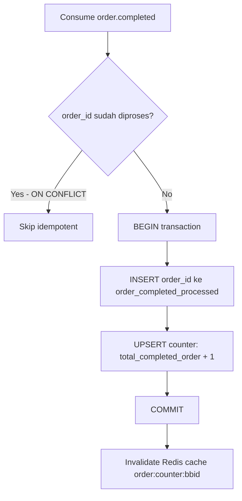
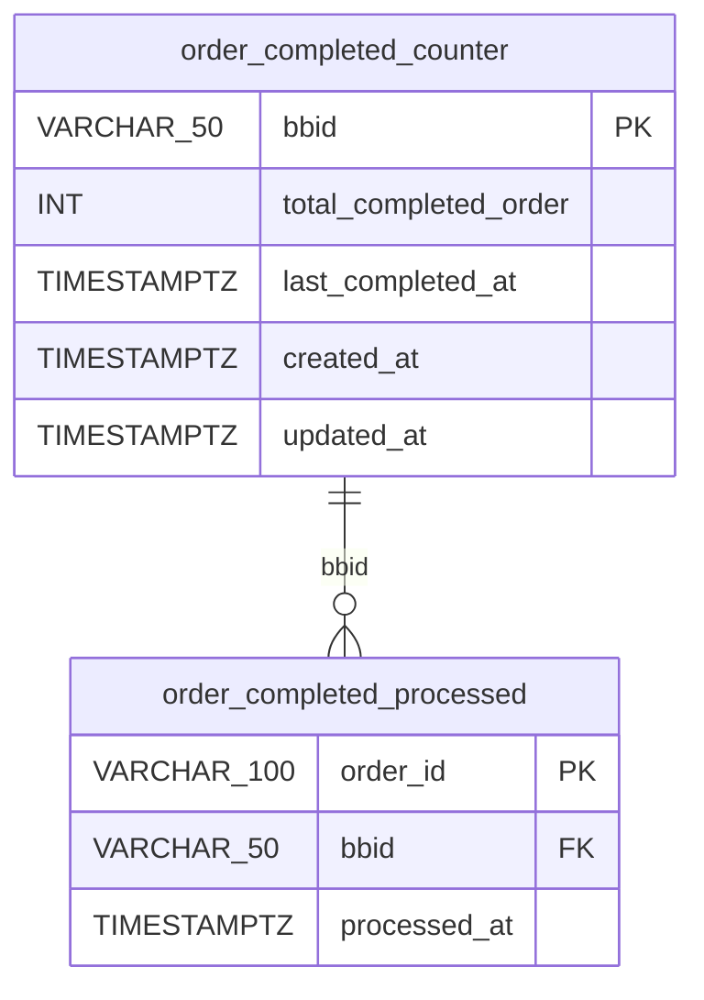

# RFC-002: Order Orchestrator — Transaction Counter

**Status:** Final  
**Author:** Lukmanul Hakim  
**Created:** 2026-02-19  
**Updated:** 2026-03-02  
**Related:** [[RFC-001-dynamic-platform-fee-service]]

---

## 1. Overview

### 1.1. Problem Statement

DPF membutuhkan `total_completed_order` per BBID untuk:
1. Menentukan **new user** (`total_completed_order <= 1`) → free platform fee
2. Menentukan apakah **foreign user** eligible dikenakan foreign fee (threshold configurable, default: 6)

Data ini saat ini tidak tersedia sebagai counter terpusat yang persistent.

Tantangan:
- Order data di-archive tiap 3 bulan → counter tidak bisa dihitung dari tabel order langsung
- Counter harus mencakup semua platform (mybb, webreservasi) dan semua service type
- Harus idempotent terhadap duplicate event

### 1.2. Proposed Solution

Tambahkan consumer baru di **Order Orchestrator** (existing service) yang:
- Listen event `order.completed` dari Kafka
- Increment counter per BBID secara atomic
- Expose counter via internal REST API
- Counter bersifat permanent — **tidak ikut archive cycle**

### 1.3. Goals

- Counter akurat untuk semua order completed lintas platform & service
- Idempotent (duplicate event tidak menggandakan counter)
- API response cepat dengan Redis caching
- Tidak mengganggu existing Order Orchestrator functionality

---

## 2. Architecture

### 2.1. Event Sources

| Publisher | Platform | Kafka Topic |
|---|---|---|
| BBDispatch | Ride (BB, SB, BB X) | `order.completed` |
| Rental Service | Rent (BB, SB) | `order.completed` |
| Delivery Service | Delivery | `order.completed` |
| Shuttle Service | Shuttle | `order.completed` |

### 2.2. Consumer Flow



### 2.3. Idempotency Mechanism

Kedua operasi (insert processed + increment counter) dijalankan dalam **satu DB transaction**:

```sql
BEGIN;

INSERT INTO order_completed_processed (order_id, bbid, processed_at)
VALUES ($1, $2, NOW())
ON CONFLICT (order_id) DO NOTHING;

-- Hanya increment jika insert di atas berhasil (bukan duplicate)
INSERT INTO order_completed_counter (bbid, total_completed_order, last_completed_at, created_at, updated_at)
VALUES ($2, 1, $3, NOW(), NOW())
ON CONFLICT (bbid) DO UPDATE SET
    total_completed_order = order_completed_counter.total_completed_order + 1,
    last_completed_at     = EXCLUDED.last_completed_at,
    updated_at            = NOW();

COMMIT;
```

---

## 3. Data Model

### 3.1. `order_completed_counter`

```sql
CREATE TABLE order_completed_counter (
    bbid                  VARCHAR(50)  PRIMARY KEY,
    total_completed_order INT          NOT NULL DEFAULT 0,
    last_completed_at     TIMESTAMPTZ,
    created_at            TIMESTAMPTZ  NOT NULL DEFAULT NOW(),
    updated_at            TIMESTAMPTZ  NOT NULL DEFAULT NOW()
);

COMMENT ON TABLE order_completed_counter IS
    'Lifetime completed order counter per BBID. EXCLUDED from 3-monthly archive.';
```

### 3.2. `order_completed_processed`

```sql
CREATE TABLE order_completed_processed (
    order_id     VARCHAR(100) PRIMARY KEY,
    bbid         VARCHAR(50)  NOT NULL,
    processed_at TIMESTAMPTZ  NOT NULL DEFAULT NOW()
);

CREATE INDEX idx_ocp_bbid         ON order_completed_processed (bbid);
CREATE INDEX idx_ocp_processed_at ON order_completed_processed (processed_at);

COMMENT ON TABLE order_completed_processed IS
    'Idempotency table for order.completed events. Retain 1 day, cleanup via cron.';
```

### 3.3. Entity Relationship Diagram



---

## 4. API Contract

### 4.1. GET /v1/order/counter/{bbid}

Internal API, dipanggil oleh DPF saat calculate.

**Response (200 OK — counter ada):**

```json
{
    "bbid": "BB123456",
    "total_completed_order": 7,
    "last_completed_at": "2026-02-09T10:30:00Z"
}
```

**Response (200 OK — BBID belum pernah order):**

```json
{
    "bbid": "BB123456",
    "total_completed_order": 0,
    "last_completed_at": null
}
```

> Caller (DPF) menggunakan `total_completed_order = 0` sebagai fallback jika endpoint timeout/error.

### 4.2. Caching

| Data | Cache Key | TTL | Invalidation |
|---|---|---|---|
| Counter per BBID | `order:counter:{bbid}` | 1 jam | On increment (setelah event consume) |

Flow:
1. **GET request** → check cache → hit: return; miss: query DB → cache TTL 1h → return
2. **Event consumed** → increment DB → **destroy cache** `order:counter:{bbid}` immediately

---

## 5. Kafka Event Contract

### 5.1. Expected Event Payload

```json
{
    "order_id":      "string",
    "bbid":          "string",
    "service_type":  "ride|rent|delivery|shuttle",
    "fleet_type":    "bb|bb_prime|sb|bb_x",
    "channel_source": "mybb|webreservasi",
    "completed_at":  "timestamp"
}
```

> Field `order_id` dan `bbid` bersifat required. Jika salah satu tidak ada, event di-skip dan di-log sebagai error.

---

## 6. Resilience

| Scenario | Behavior |
|---|---|
| Kafka consumer down | Event queued di Kafka, diproses setelah consumer up |
| Duplicate event | Skip via `ON CONFLICT DO NOTHING` di tabel processed |
| DB down saat consume | Event tidak di-ack → Kafka retry (at-least-once) |
| API timeout ke DPF | DPF fallback: `total_completed_order = 0` |
| Archive cycle berjalan | Tabel `order_completed_counter` & `order_completed_processed` excluded |

---

## 7. Migration Plan

### 7.1. Pre-deployment

- [ ] DB migration: create `order_completed_counter` + `order_completed_processed`
- [ ] Koordinasi DBA: exclude kedua tabel dari archive cycle
- [ ] DBA backfill execution (see [[backfill-order-counter-dba-runbook|DBA Runbook]])

### 7.2. Backfill Consideration

**Backfill Strategy:** Two-phase approach (Replica → CSV → Master)

**Execution:** Handled by DBA team using manual SQL scripts.

**Detailed Instructions:** See [[backfill-order-counter-dba-runbook|DBA Runbook - Backfill Order Counter]]

**Decision Rationale:**

**Tanpa backfill:**
- Foreign user yang sudah lama akan mulai dari counter = 0
- Selama ≤6 order pertama setelah feature launch → kena surcharge
- Setelah threshold → normal fee
- Trade-off: unfair untuk existing loyal user

**Dengan backfill (RECOMMENDED):**
- ✅ Fair treatment untuk existing loyal customer
- ✅ Minimize complain risk
- ✅ Accurate counter dari awal
- Method: DBA run backfill script dari read replica (safe, no impact ke master)

**Implementation:**
1. DBA query aggregated data dari **READ REPLICA** (heavy aggregation, zero impact ke master)
2. Export ke CSV file
3. Import CSV ke **MASTER DB** (lightweight INSERT)
4. Validate hasil

**Timeline:** 15-30 menit execution time, scheduled di off-peak hours.

> **Decision:** Backfill RECOMMENDED untuk better user experience. Execution delegated ke DBA team.

### 7.3. Cleanup Job

```sql
-- Jalankan via cron daily
DELETE FROM order_completed_processed
WHERE processed_at < NOW() - INTERVAL '1 day';
```

### 7.4. Effort Estimation

| Task | Estimate |
|---|---|
| DB migration + archive exclusion | 1 hari |
| Kafka consumer + idempotency logic | 2 hari |
| GET counter API + Redis caching | 1 hari |
| Backfill script (jika diperlukan) | 1 hari |
| Monitoring + alerting | 1 hari |
| **Total** | **~5–6 hari** |

---

## 8. Open Items

| # | Item | Status |
|---|---|---|
| 1 | Koordinasi DBA untuk exclude table dari archive | ⏳ Pending |

---

## 9. References

- [[RFC-001-dynamic-platform-fee-service]]
- [[order-orchestrator-counter\|Order Orchestrator Counter Design]]
