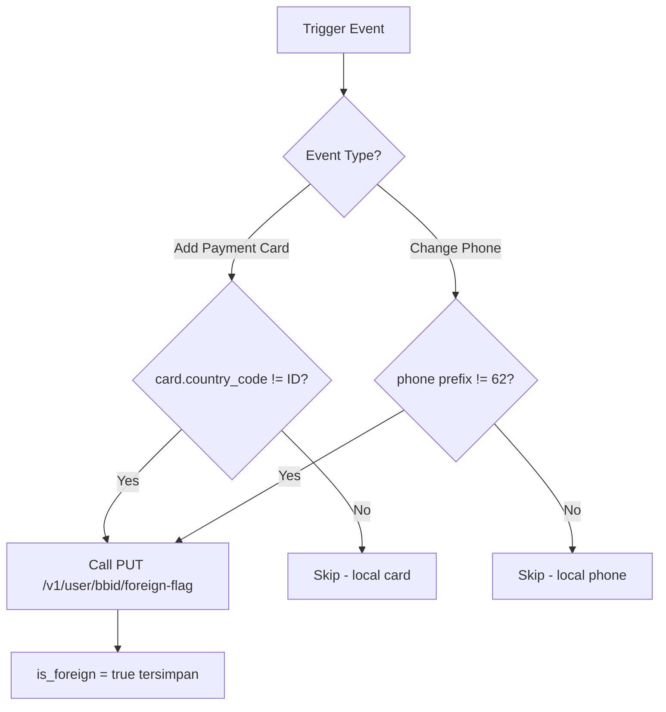
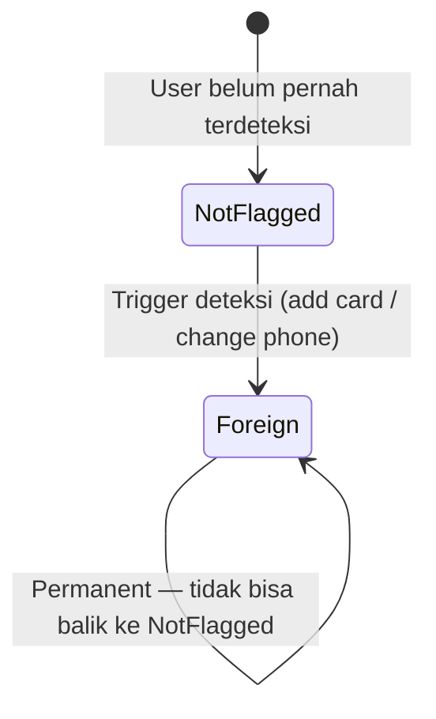
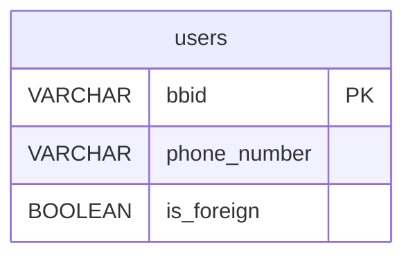

# RFC-003: User Service — Foreign Flag

**Status:** Final  
**Author:** Lukmanul Hakim  
**Created:** 2026-02-19  
**Updated:** 2026-03-02  
**Related:** [[RFC-001-dynamic-platform-fee-service]]

---

## 1. Overview

### 1.1. Problem Statement

DPF membutuhkan flag `is_foreign` per BBID untuk menentukan apakah user termasuk foreign user yang kena surcharge. Saat ini flag ini **belum ada** di User Profile Service production.

Tantangan:
- Deteksi harus mencakup user baru maupun existing user
- Flag bersifat permanent (irreversible) — sekali foreign, tidak bisa balik ke non-foreign
- Trigger point: **add payment card** atau **change phone number**

### 1.2. Proposed Solution

Enhancement pada **User Service** (existing service) untuk:
1. Tambah kolom `is_foreign` di tabel user profile
2. Deteksi foreign status di 2 trigger point
3. Expose internal API untuk set flag

> **Data Flow:**
> - `is_foreign` → di-**set** via `PUT /v1/user/{bbid}/foreign-flag`
> - `is_foreign` → di-**read** oleh DPF dari header `User-Info.is_foreign`

### 1.3. Goals

- Flag `is_foreign` tersedia dan akurat untuk semua user
- Deteksi otomatis tanpa action manual dari user
- Flag bisa digunakan oleh service lain di masa depan

### 1.4. Non-Goals

- ~~Lazy detection di end trip~~ (removed)
- ~~API `GET /v1/user/{bbid}/status` untuk is_new_user~~ (removed — DPF pakai order counter)

---

## 2. Architecture

### 2.1. Detection Trigger Points

| Event               | Service                 | Kondisi                        | Action                     |
| ------------------- | ----------------------- | ------------------------------ | -------------------------- |
| Add payment card    | Webhook Forwarder (MRG) | `card.country_code != "ID"`    | Call internal API set flag |
| Change phone number | User Service            | New phone country code `!= 62` | Set `is_foreign = true`    |

> **Add Payment Card Flow:**
> 1. User add CC via MyBB
> 2. Payment Provider (Midtrans/etc) callback ke UPG
> 3. UPG forward callback ke Webhook Forwarder
> 4. Webhook Forwarder parse card metadata (country_code)
> 5. IF `card.country_code != "ID"` → Call User Service internal API

> **Phone format di DB:** `62...` (tanpa prefix `+`)

### 2.2. Detection Flow



### 2.3. Flag Lifecycle



**Rules:**
- `is_foreign` hanya bisa di-set ke `true` — request set `false` di-reject (400)
- Ganti nomor foreign → lokal: flag tetap `true`
- Tambah kartu foreign B setelah kartu A: flag tetap, tidak ada reset
- Flag di level BBID, bukan per payment method

---

## 3. Data Model

### 3.1. Schema Change (User Profile)

Tambah 1 kolom ke tabel user profile yang existing:

```sql
ALTER TABLE users
    ADD COLUMN is_foreign BOOLEAN DEFAULT false;

CREATE INDEX idx_users_is_foreign ON users(is_foreign) WHERE is_foreign = true;
```

### 3.2. Entity Relationship Diagram



---

## 4. API Contract

### 4.1. GET /v1/user/{bbid}/profile (existing — tambah field)

Tambahkan field berikut pada response yang sudah ada:

```json
{
    "bbid": "BB123456",
    "...existing_fields...",
    "is_foreign": true
}
```

Jika belum pernah terdeteksi:

```json
{
    "is_foreign": false
}
```

### 4.2. PUT /v1/user/{bbid}/foreign-flag (new — internal only)

Dipanggil oleh Webhook Forwarder atau trigger internal lainnya.

**Request:**

```json
{
    "is_foreign": true,
    "source": "add_payment|change_phone"
}
```

> Field `source` **tidak disimpan ke DB** — hanya di-log di application level untuk traceability deteksi.

**Response (200 OK — flag baru di-set):**

```json
{
    "bbid": "BB123456",
    "is_foreign": true,
    "already_flagged": false
}
```

**Response (200 OK — sudah pernah di-flag sebelumnya):**

```json
{
    "bbid": "BB123456",
    "is_foreign": true,
    "already_flagged": true
}
```

**Response (400 Bad Request — attempt set false):**

```json
{
    "error": "is_foreign flag is irreversible. Cannot set to false."
}
```

> Endpoint ini **internal only** — tidak boleh diekspos ke public API gateway.

---

## 5. Edge Cases

| Scenario | Behavior |
|---|---|
| User ganti nomor foreign → lokal | `is_foreign` tetap `true` — irreversible |
| User foreign bayar cash | Tetap kena foreign PF — flag di level BBID, bukan payment |
| User foreign completed order ke-7 | Foreign fee category berubah di DPF, bukan di User Service |
| Set `is_foreign = false` via API | Ditolak — 400 |

---

## 6. Migration Plan

### 6.1. Pre-deployment

- [ ] DB migration: `ALTER TABLE users ADD COLUMN is_foreign...`
- [ ] Index creation: `idx_users_is_foreign`
- [ ] Validate existing user profile response tidak breaking (field baru, bukan ubah existing)

### 6.2. Deployment Sequence

```
1. Deploy DB migration (ALTER TABLE)
2. Deploy User Service dengan API baru
3. UPG deploy callback enhancement (tambah country_code di payload ke webhook forwarder)
4. Deploy Webhook Forwarder dengan trigger add_payment detection
5. Verifikasi end-to-end: add card → is_foreign = true → header populated
```

### 6.3. Effort Estimation

| Task | Estimate | Owner |
|---|---|---|
| DB migration (ALTER TABLE + index) | 0.5 hari | User Service |
| PUT foreign-flag API + validation | 1 hari | User Service |
| Trigger di change phone (User Service) | 0.5 hari | User Service |
| UPG callback enhancement (country_code di payload) | 1 hari | UPG |
| Trigger di add payment (Webhook Forwarder) | 1.5 hari | MRG |
| Integration test end-to-end | 1 hari | MRG |
| **Total** | **~5.5 hari** | |

---

## 7. Open Items

| # | Item | Status |
|---|---|---|
| 1 | Timeline development dari User Service team | ⏳ Pending — EM |
| 2 | UPG callback contract enhancement | ✅ Confirmed |

---

## 8. References

- [[RFC-001-dynamic-platform-fee-service]]
- [[upg-contract-alignment-summary]]
