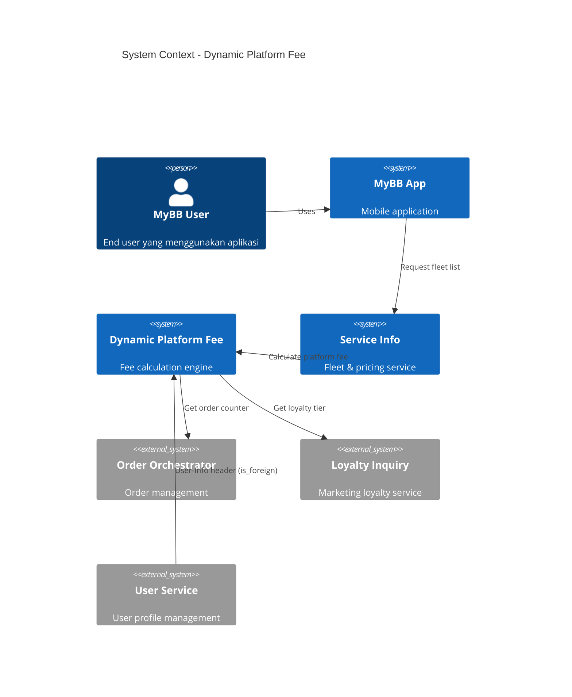
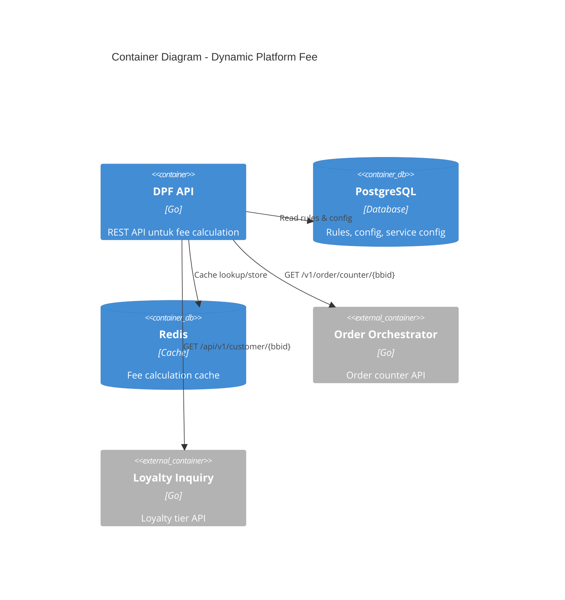
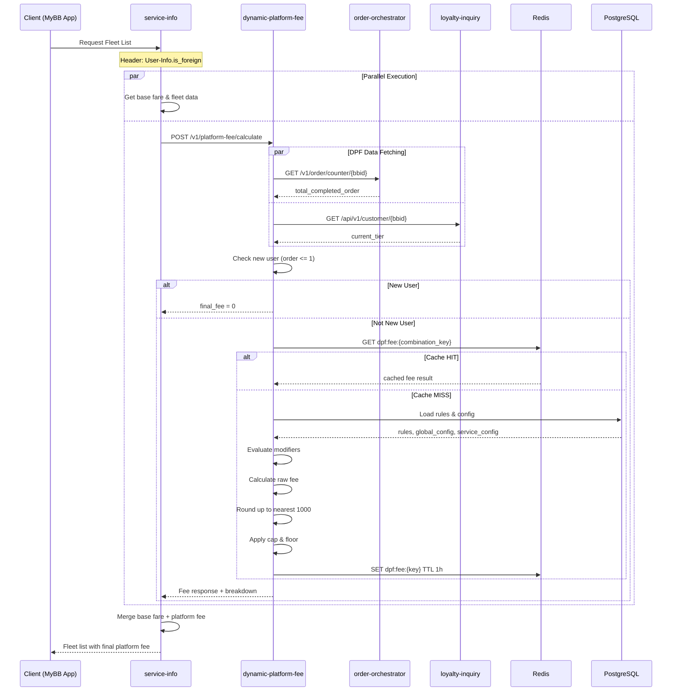
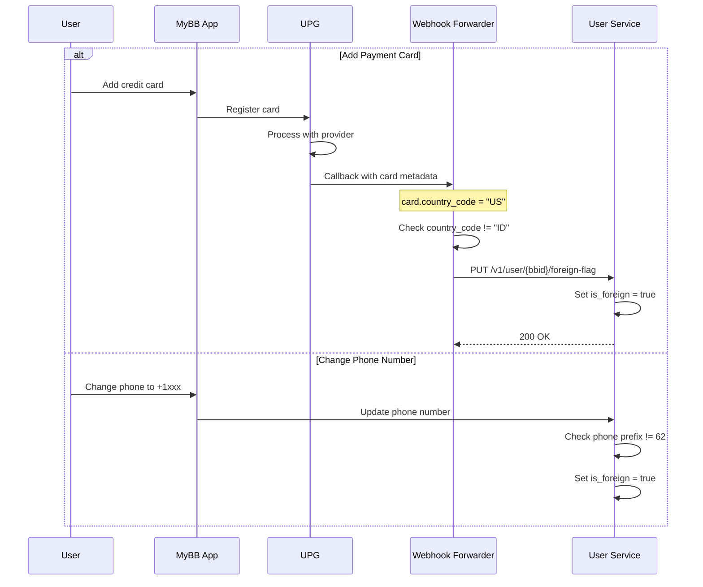
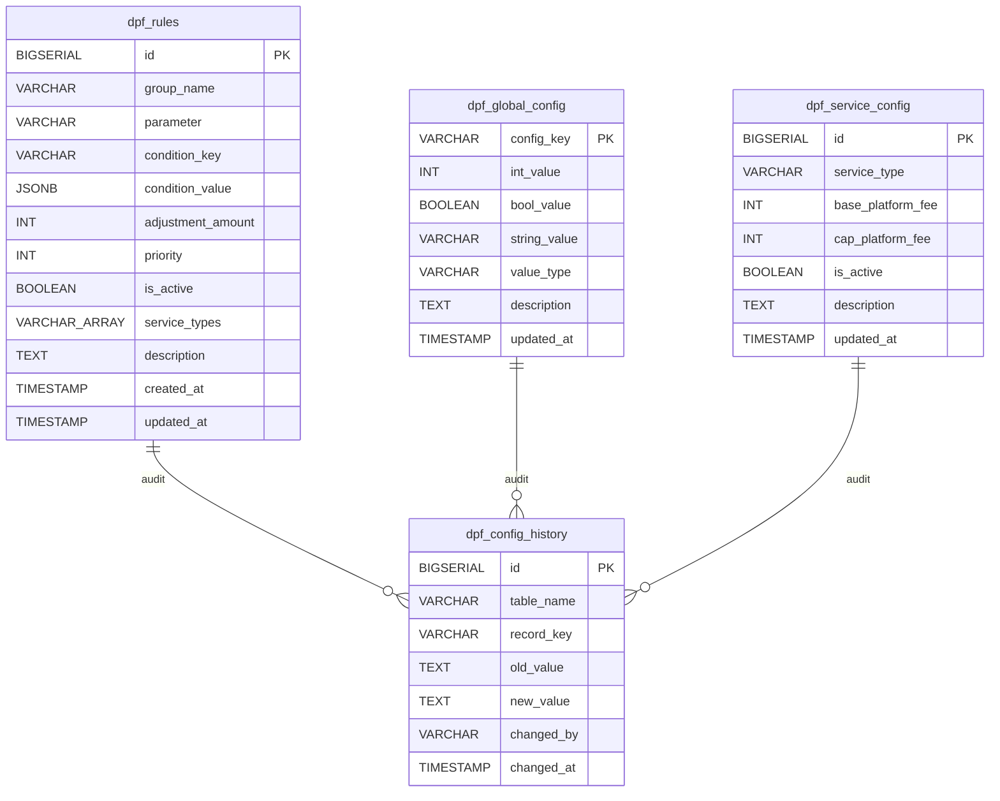
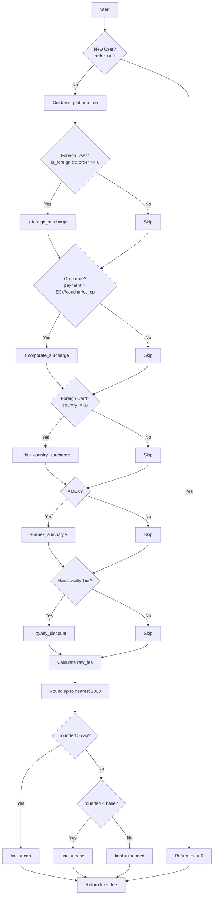
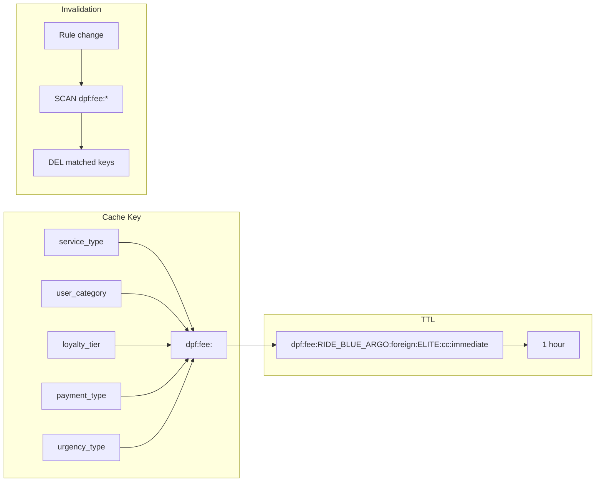
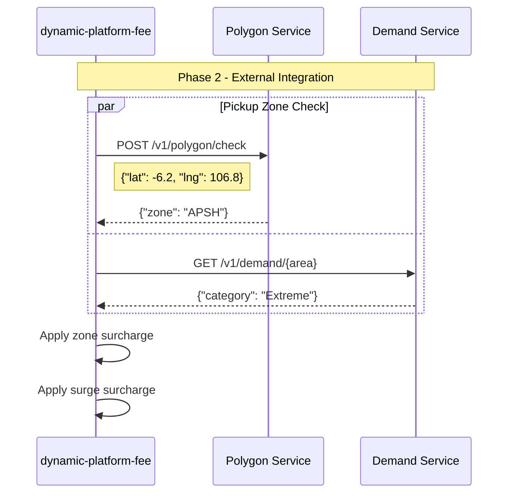

# Dynamic Platform Fee — C4 Diagrams

**Updated:** 2026-03-02  
**Status:** Final

---

## 1. System Context Diagram

---

## 2. Container Diagram

---

## 3. Sequence Diagram — Fee Calculation Flow

---

## 4. Sequence Diagram — Foreign Flag Detection

---

## 5. Entity Relationship Diagram

---

## 6. Fee Calculation Flow

---

## 7. Caching Strategy

---

## 8. Phase 2 Integration (Future)

---

## 9. Related Documents

- [[RFC-001-dynamic-platform-fee-service]]
- [[RFC-002-order-orchestrator-counter]]
- [[RFC-003-user-service-foreign-flag]]
