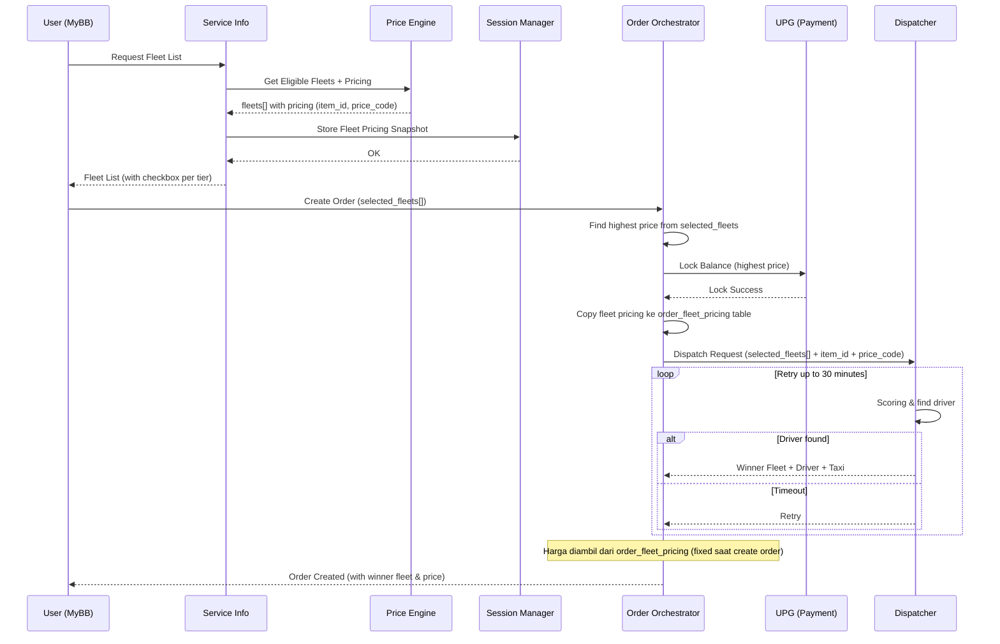
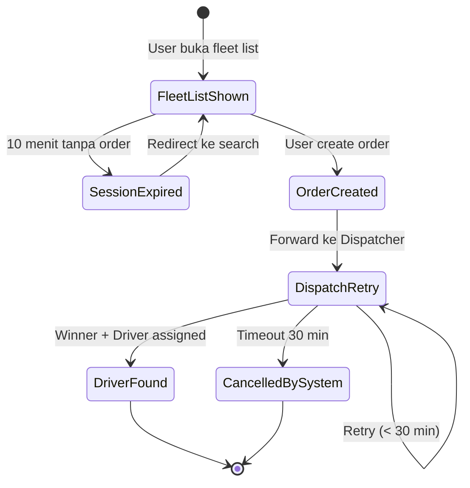

# RFC-001: Multi-select Fleets Overview

**Status:** Draft  
**Author:** Lukmanul Hakim  
**Created:** 2026-03-16  
**Updated:** 2026-03-18  
**Related:** [[RFC-002-session-manager-fleet-pricing]], [[RFC-003-order-orchestrator-multi-fleet]], [[RFC-004-payment-flow-multi-fleet]]

---

## 1. Overview

### 1.1. Problem Statement

Saat ini user hanya dapat memilih **satu fleet** per order. Hal ini menyebabkan:
- Completion rate rendah jika fleet yang dipilih tidak tersedia
- User harus cancel dan re-order dengan fleet berbeda
- Tidak ada mekanisme untuk memaksimalkan supply utilization
- BB Prime sebagai fleet baru belum terintegrasi ke fleet list

### 1.2. Proposed Solution

Mengimplementasikan **Multi-select Fleets** yang memungkinkan user:
- Memilih lebih dari satu fleet dalam satu tier (Bluebird, Bluebird Prime, Silverbird)
- Sistem dispatch menentukan **winner fleet** berdasarkan scoring algorithm
- Harga final diterapkan sesuai fleet yang di-assign

### 1.3. Goals

- Meningkatkan completion rate dengan memperluas pool supply
- Memperkenalkan BB Prime sebagai opsi fleet baru
- Session Manager menyimpan snapshot pricing untuk semua fleet yang ditampilkan
- Order Orchestrator menyimpan fleet pricing ke database saat create order
- Harga fixed saat create order — tidak berubah selama fase retry

### 1.4. Non-Goals

- Fleet eligibility → Di-handle Price Engine (tim lain)
- Selection priority algorithm → Di-handle Dispatcher
- Peak/off-peak detection → Di-handle DPF
- UI multi-select → Di-handle MyBB Apps
- Translate `item_id` + `price_code` ke detail service/harga → Di-handle BBD + Price Engine

---

## 2. Architecture

### 2.1. High-Level Flow



### 2.2. Component Responsibilities

| Component | Owner | Responsibility |
|-----------|-------|----------------|
| Service Info | MRG | Call Price Engine, store ke Session Manager, construct fleet list untuk MyBB |
| Price Engine | Tim Lain | Determine fleet eligibility, calculate pricing per fleet, return `item_id` + `price_code` |
| Session Manager | MRG | Store fleet pricing snapshot (TTL 10 menit) |
| Order Orchestrator | MRG | Copy pricing ke DB, handle lock amount, forward `selected_fleets[]` + `item_id` + `price_code` ke Dispatcher |
| UPG | MRG | Lock balance (preauth CC / reserve wallet) |
| Dispatcher | Tim Lain | Selection priority algorithm, determine winner fleet, retry up to 30 minutes |
| BBD | Tim Lain | Translate `item_id` + `price_code` via Price Engine |
| MyBB Apps | Tim Lain | UI multi-select checkbox per tier |
| DPF | MRG | Provide peak/off-peak signal untuk Dispatcher |

### 2.3. Payload to Dispatcher

Order Orchestrator mengirim:

```json
{
    "order_id": "ORD-123",
    "selected_fleets": [
        {
            "fleet_code": "BB",
            "item_id": "ITEM-BB-001",
            "price_code": "PRICE-BB-ARGO-001"
        },
        {
            "fleet_code": "BB_PRIME",
            "item_id": "ITEM-BBP-001",
            "price_code": "PRICE-BBP-ARGO-001"
        }
    ],
    "pickup": { ... },
    "dropoff": { ... }
}
```

Dispatcher return winner:

```json
{
    "order_id": "ORD-123",
    "winner_fleet": "BB_PRIME",
    "driver_id": "DRV-456",
    "vehicle_id": "VEH-789",
    "taxi_number": "B 1234 XYZ"
}
```

---

## 3. Two-Phase Timeout

### 3.1. Fase 1: Session Manager (10 menit)

- Dimulai saat user lihat fleet list
- Jika timeout sebelum create order → redirect ke halaman pencarian
- Alasan: Dynamic fare bisa berubah

### 3.2. Fase 2: Dispatcher Retry (30 menit)

- Dimulai saat order created dan dikirim ke Dispatcher
- Dispatcher retry terus menerus mencari driver
- Jika timeout 30 menit → cancel by system
- Harga **tidak berubah** selama fase ini (fixed saat create order)



---

## 4. Multi-select Rules

### 4.1. Tier Grouping

Multi-select hanya berlaku untuk fleet **dalam satu tier**:

| Tier | Fleets | Multi-select |
|------|--------|--------------|
| Bluebird Tier | BB, BB_PRIME, SB | ✅ Yes |
| Goldenbird Tier | GB_NOW | ❌ No (single select) |
| Airport TF Tier | TBD | ⏳ Pending confirmation |

> **Note:** Pending konfirmasi dari Product untuk definisi tier lengkap.

### 4.2. Selection Constraints

| Rule | Description |
|------|-------------|
| Minimum selection | User harus pilih minimal 1 fleet |
| Destination required | Multi-select hanya untuk trip dengan destination |
| Carpooling exclusion | Jika user pilih carpooling, multi-select disabled |
| Goldenbird exclusion | Goldenbird tidak masuk multi-select checkbox |
| Default selection | Fleet yang terakhir digunakan (as-is logic) |

### 4.3. Selection Priority Algorithm (Dispatcher)

Formula scoring:
```
FinalScore = (ETAWeight × ETAScore) + (RevenueWeight × RevenueScore) + (SupplyWeight × SupplyScore)
```

Weight berdasarkan kondisi:

| Factor | Off Peak | Peak |
|--------|----------|------|
| ETA | 30% | 50% |
| Revenue | 40% | 20% |
| Supply | 30% | 30% |

**Prinsip:**
- Off-peak → Prioritas revenue tinggi (fleet mahal menang)
- Peak → Prioritas ETA cepat (fleet tersedia menang)

Peak signal: Dari DPF (extreme demand flag).

---

## 5. Data Flow Summary

### 5.1. Fleet Pricing Storage

| Phase | Storage | TTL | Purpose |
|-------|---------|-----|---------|
| Fleet list shown | Session Manager (Redis) | 10 menit | Temporary untuk UI |
| Order created | `order_fleet_pricing` table (PostgreSQL) | Permanent | Historical + winner lookup |

### 5.2. Price Lookup Flow

```
Dispatcher return winner fleet_code
       ↓
Order Orchestrator query order_fleet_pricing 
WHERE order_id = X AND fleet_code = winner
       ↓
Dapat item_id + price_code
       ↓
(Di luar scope MRG) BBD → Price Engine untuk translate
```

---

## 6. Scope Summary

### 6.1. MRG Scope

| Service | Changes |
|---------|---------|
| Service Info | Call Price Engine, store ke Session Manager |
| Session Manager | Store fleet pricing (TTL 10 menit) |
| Order Orchestrator | Copy ke `order_fleet_pricing`, lock highest amount, forward ke Dispatcher |
| UPG | Lock balance, partial charge, release sisa |

### 6.2. Non-MRG Scope

| Service | Owner | Changes |
|---------|-------|---------|
| Price Engine | Tim Lain | Fleet eligibility, pricing, return `item_id` + `price_code` |
| Dispatcher | Tim Lain | Scoring, winner selection, retry 30 menit |
| BBD | Tim Lain | Translate `item_id` + `price_code` via Price Engine |
| MyBB Apps | Tim Lain | UI multi-select checkbox |

---

## 7. Open Items

| # | Item | Owner | Status |
|---|------|-------|--------|
| 1 | Tier grouping confirmation | Product | Pending |
| 2 | Dispatcher API contract | Tim Dispatcher | Pending |
| 3 | BB Prime polygon definition | Product | Pending |
| 4 | Price Engine integration | Tim Price Engine | Pending |

---

## 8. Related RFCs

- [[RFC-002-session-manager-fleet-pricing]] — Session Manager storage detail
- [[RFC-003-order-orchestrator-multi-fleet]] — Order Orchestrator changes
- [[RFC-004-payment-flow-multi-fleet]] — Payment flow dan lock mechanism

---

## 9. References

- Source Document: Multi-select Fleets PRD (Mar 2025)
- Related: [[dynamic-platform-fee]] (DPF untuk platform fee calculation)
