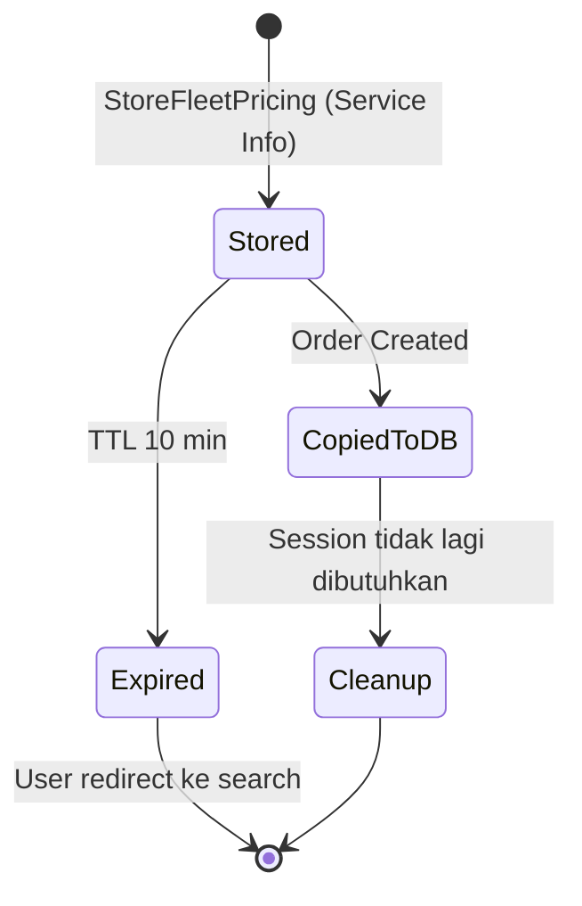

# RFC-002: Session Manager Fleet Pricing Storage

**Status:** Draft  
**Author:** Lukmanul Hakim  
**Created:** 2026-03-16  
**Updated:** 2026-03-18  
**Related:** [[RFC-001-multi-select-fleets-overview]], [[RFC-003-order-orchestrator-multi-fleet]], [[RFC-004-payment-flow-multi-fleet]]

---

## 1. Overview

### 1.1. Problem Statement

Untuk mendukung Multi-select Fleets, sistem perlu menyimpan pricing snapshot dari semua fleet yang ditampilkan ke user. Data ini digunakan sementara selama user memilih fleet sebelum create order.

### 1.2. Proposed Solution

Session Manager menyimpan fleet pricing snapshot saat Service Info fetch dari Price Engine. Data ini bersifat **ephemeral** dengan TTL 10 menit.

### 1.3. Goals

- Single source of truth untuk pricing yang ditampilkan ke user
- TTL 10 menit — sesuai dengan pricing validity
- Support refresh jika pickup/dropoff/payment berubah

### 1.4. Non-Goals

- Session Manager tidak menyimpan data untuk fase dispatch (pindah ke database)
- Session Manager tidak menghitung pricing (delegasi ke Price Engine)
- Session Manager tidak menentukan fleet eligibility

### 1.5. Key Change dari RFC Sebelumnya

> **PENTING:** Session Manager hanya untuk fase pencarian (TTL 10 menit). Saat order dibuat, data di-copy ke `order_fleet_pricing` table di database. Lihat [[RFC-003-order-orchestrator-multi-fleet]].

---

## 2. Data Model

### 2.1. Fleet Pricing Snapshot

```go
// Redis key: fleet_pricing:{session_id}
type FleetPricingSnapshot struct {
    SessionID     string                  `json:"session_id"`
    BBID          string                  `json:"bbid"`
    PickupHash    string                  `json:"pickup_hash"`    // SHA256(pickup_lat,pickup_lng,dropoff_lat,dropoff_lng)
    PaymentMethod string                  `json:"payment_method"` // cc, debit, cash, linkaja, etc
    PromoCode     string                  `json:"promo_code"`
    Fleets        map[string]FleetPrice   `json:"fleets"`         // key: fleet_code
    CreatedAt     time.Time               `json:"created_at"`
    ExpiredAt     time.Time               `json:"expired_at"`
}

type FleetPrice struct {
    FleetCode     string `json:"fleet_code"`     // BB, BB_PRIME, SB, GB_NOW
    FleetName     string `json:"fleet_name"`     // Bluebird, Bluebird Prime, Silverbird
    PriceType     string `json:"price_type"`     // ARGO, FIXED
    ItemID        string `json:"item_id"`        // untuk dikirim ke Dispatcher/BBD
    PriceCode     string `json:"price_code"`     // untuk dikirim ke Dispatcher/BBD
    EstimatedFare int64  `json:"estimated_fare"` // estimasi harga
    PlatformFee   int64  `json:"platform_fee"`
    TotalPrice    int64  `json:"total_price"`    // estimated_fare + platform_fee
    EstimatedETA  int    `json:"estimated_eta"`  // minutes
    IsAvailable   bool   `json:"is_available"`   // supply tersedia
}
```

### 2.2. Redis Key Structure

```
fleet_pricing:{session_id}
```

Value: JSON serialized `FleetPricingSnapshot`
TTL: 10 menit (600 detik)

### 2.3. Example Data

```json
{
    "session_id": "sess-abc123",
    "bbid": "BB123456",
    "pickup_hash": "a1b2c3d4e5f6...",
    "payment_method": "cc",
    "promo_code": "",
    "fleets": {
        "BB": {
            "fleet_code": "BB",
            "fleet_name": "Bluebird",
            "price_type": "ARGO",
            "item_id": "ITEM-BB-001",
            "price_code": "PRICE-BB-ARGO-001",
            "estimated_fare": 47000,
            "platform_fee": 4000,
            "total_price": 51000,
            "estimated_eta": 5,
            "is_available": true
        },
        "BB_PRIME": {
            "fleet_code": "BB_PRIME",
            "fleet_name": "Bluebird Prime",
            "price_type": "ARGO",
            "item_id": "ITEM-BBP-001",
            "price_code": "PRICE-BBP-ARGO-001",
            "estimated_fare": 54000,
            "platform_fee": 5000,
            "total_price": 59000,
            "estimated_eta": 8,
            "is_available": true
        },
        "SB": {
            "fleet_code": "SB",
            "fleet_name": "Silverbird",
            "price_type": "ARGO",
            "item_id": "ITEM-SB-001",
            "price_code": "PRICE-SB-ARGO-001",
            "estimated_fare": 85000,
            "platform_fee": 7000,
            "total_price": 92000,
            "estimated_eta": 10,
            "is_available": true
        }
    },
    "created_at": "2026-03-18T10:00:00Z",
    "expired_at": "2026-03-18T10:10:00Z"
}
```

---

## 3. API Design

### 3.1. Store Fleet Pricing

Dipanggil oleh **Service Info** saat fleet list di-fetch dari Price Engine.

```go
// Request
type StoreFleetPricingRequest struct {
    SessionID     string                `json:"session_id"`
    BBID          string                `json:"bbid"`
    PickupHash    string                `json:"pickup_hash"`
    PaymentMethod string                `json:"payment_method"`
    PromoCode     string                `json:"promo_code"`
    Fleets        map[string]FleetPrice `json:"fleets"`
}

// Response
type StoreFleetPricingResponse struct {
    Success   bool      `json:"success"`
    ExpiredAt time.Time `json:"expired_at"`
}
```

**gRPC:**
```protobuf
rpc StoreFleetPricing(StoreFleetPricingRequest) returns (StoreFleetPricingResponse);
```

### 3.2. Get Fleet Pricing Snapshot

Dipanggil oleh **Order Orchestrator** saat create order untuk copy ke database.

```go
// Request
type GetFleetPricingSnapshotRequest struct {
    SessionID string `json:"session_id"`
}

// Response
type GetFleetPricingSnapshotResponse struct {
    Found    bool                   `json:"found"`
    Snapshot *FleetPricingSnapshot  `json:"snapshot"`
}
```

**gRPC:**
```protobuf
rpc GetFleetPricingSnapshot(GetFleetPricingSnapshotRequest) returns (GetFleetPricingSnapshotResponse);
```

### 3.3. Check Should Refresh

Untuk menentukan apakah perlu re-fetch dari Price Engine.

```go
// Request
type CheckShouldRefreshRequest struct {
    SessionID     string `json:"session_id"`
    PickupHash    string `json:"pickup_hash"`
    PaymentMethod string `json:"payment_method"`
    PromoCode     string `json:"promo_code"`
}

// Response
type CheckShouldRefreshResponse struct {
    ShouldRefresh bool   `json:"should_refresh"`
    Reason        string `json:"reason"` // "not_found", "pickup_changed", "payment_changed", "promo_changed", "expired"
}
```

---

## 4. TTL Management

### 4.1. TTL States



### 4.2. TTL Configuration

| Config Key | Default | Description |
|------------|---------|-------------|
| `fleet_pricing_ttl_seconds` | 600 (10 min) | TTL untuk fleet pricing snapshot |

### 4.3. Tidak Ada TTL Extension

> **PENTING:** Berbeda dengan RFC sebelumnya, Session Manager **tidak** extend TTL saat order created. Data di-copy ke database sebagai persistent storage.

---

## 5. Refresh Behavior

### 5.1. Refresh Triggers

Pricing snapshot **diganti** jika salah satu berubah:

| Field | Change Detection |
|-------|------------------|
| Pickup/Dropoff | `pickup_hash` berbeda |
| Payment Method | `payment_method` berbeda |
| Promo Code | `promo_code` berbeda |

### 5.2. Refresh Logic (di Service Info)

```go
func (s *ServiceInfo) GetFleetList(ctx context.Context, req *GetFleetListRequest) (*GetFleetListResponse, error) {
    // 1. Check apakah perlu refresh
    checkResp, _ := s.sessionManager.CheckShouldRefresh(ctx, &CheckShouldRefreshRequest{
        SessionID:     req.SessionID,
        PickupHash:    hashLocation(req.Pickup, req.Dropoff),
        PaymentMethod: req.PaymentMethod,
        PromoCode:     req.PromoCode,
    })
    
    if !checkResp.ShouldRefresh {
        // Return cached data
        snapshot, _ := s.sessionManager.GetFleetPricingSnapshot(ctx, req.SessionID)
        return buildResponse(snapshot), nil
    }
    
    // 2. Fetch fresh data dari Price Engine
    priceResp, err := s.priceEngine.GetEligibleFleets(ctx, &priceengine.GetEligibleFleetsRequest{
        Pickup:        req.Pickup,
        Dropoff:       req.Dropoff,
        PaymentMethod: req.PaymentMethod,
        PromoCode:     req.PromoCode,
    })
    
    // 3. Store ke Session Manager
    s.sessionManager.StoreFleetPricing(ctx, &StoreFleetPricingRequest{
        SessionID:     req.SessionID,
        BBID:          req.BBID,
        PickupHash:    hashLocation(req.Pickup, req.Dropoff),
        PaymentMethod: req.PaymentMethod,
        PromoCode:     req.PromoCode,
        Fleets:        mapPriceEngineResponse(priceResp),
    })
    
    return buildResponse(priceResp), nil
}
```

---

## 6. Error Handling

| Scenario | Response | Caller Action |
|----------|----------|---------------|
| Session not found | `found: false` | Service Info re-fetch dari Price Engine |
| Session expired | `found: false` | User redirect ke halaman pencarian |
| Redis error | gRPC Unavailable | Retry dengan backoff |

---

## 7. Observability

### 7.1. Metrics

| Metric | Type | Description |
|--------|------|-------------|
| `session_manager_fleet_pricing_store_total` | Counter | Total store operations |
| `session_manager_fleet_pricing_get_total` | Counter | Total get operations |
| `session_manager_fleet_pricing_hit_rate` | Gauge | Cache hit rate |
| `session_manager_fleet_pricing_expired_before_order` | Counter | Sessions expired sebelum order |
| `session_manager_fleet_pricing_refresh_trigger` | Counter | Refresh triggers by reason |

### 7.2. Logging

```go
// Store
log.Info("fleet pricing stored",
    "session_id", sessionID,
    "fleet_count", len(fleets),
    "expired_at", expiredAt,
)

// Get
log.Info("fleet pricing retrieved",
    "session_id", sessionID,
    "found", found,
)

// Refresh
log.Info("fleet pricing refresh triggered",
    "session_id", sessionID,
    "reason", reason,
)
```

---

## 8. Migration Plan

### 8.1. Database/Redis Changes

- Tidak ada schema change di PostgreSQL
- Redis key baru: `fleet_pricing:{session_id}`

### 8.2. Deployment Sequence

1. Deploy Session Manager dengan new APIs (behind feature flag)
2. Deploy Service Info yang memanggil Session Manager
3. Enable feature flag
4. Monitor metrics

### 8.3. Rollback

- Disable feature flag
- Service Info fallback ke existing flow

---

## 9. Open Items

| # | Item | Status |
|---|------|--------|
| 1 | Confirm existing Session Manager data structure | ⏳ Pending dev check |
| 2 | Redis memory estimation untuk pricing snapshot | ⏳ Pending |

---

## 10. References

- [[RFC-001-multi-select-fleets-overview]]
- [[RFC-003-order-orchestrator-multi-fleet]]
- [[RFC-004-payment-flow-multi-fleet]]
